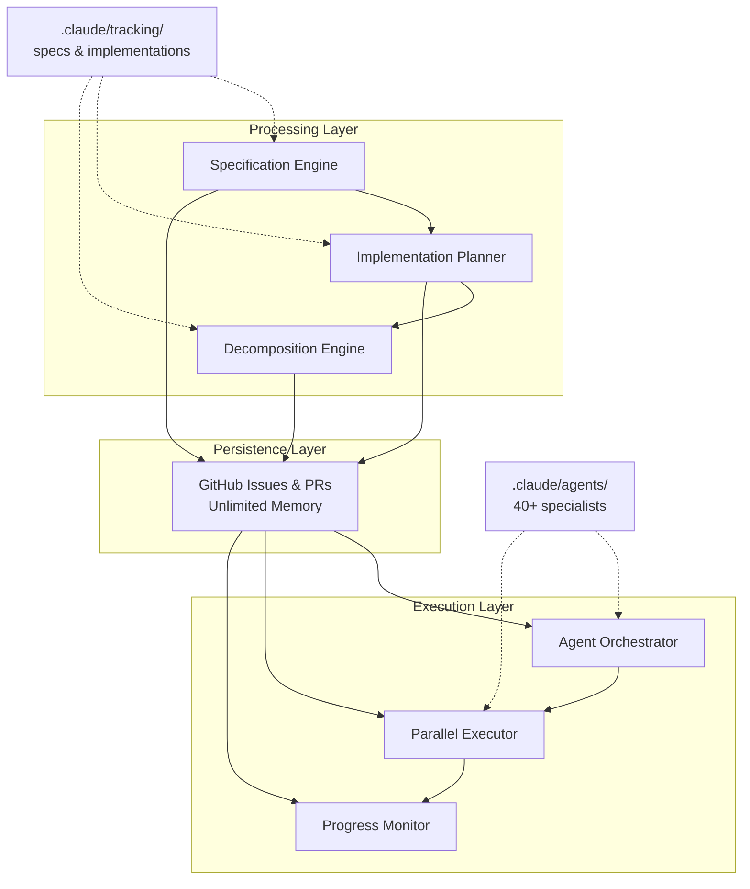

---
# Identity
id: "ccpm-system-overview"
title: "CCPM System Overview - Claude Code Project Management"
version: "3.0.0"
category: "system"

# Discovery
description: "Complete CCPM parallel execution framework for 3x faster feature delivery through AI agent orchestration, adapted from automazeio/ccpm with enhanced command set and advanced patterns"
tags: ["ccpm", "parallel-execution", "agent-orchestration", "github-integration", "feature-workflow", "project-management", "automation", "task-management"]

# Relationships
dependencies: ["agent-coordination", "github-integration", "feature-workflow"]
cross_references:
  - id: "feature-implementation-workflow"
    type: "related"
    description: "Detailed feature implementation workflow patterns"
  - id: "agent-coordination"
    type: "prerequisite"
    description: "Rules for coordinating multiple parallel agents"
  - id: "github-integration"
    type: "related"
    description: "GitHub API integration patterns"

# Maintenance
created: "2025-09-08"
last_updated: "2025-09-15"
author: "create-context"
---

# CCPM System Overview - Claude Code Project Management

## Executive Summary

CCPM (Claude Code Project Management) is a parallel execution framework adapted from [automazeio/ccpm](https://github.com/automazeio/ccpm) achieving **3x faster feature delivery** with **60% reduction in context usage**. It transforms feature ideas into executable tasks, persists context in GitHub, and orchestrates specialized AI agents working in parallel.

## Core Architecture

### System Components Overview



### Three-Stage Pipeline

```
📋 SPECIFICATION → 🔨 IMPLEMENTATION → ✅ EXECUTION
      (What)            (How)            (Do)
```

### File Structure

```
.claude/
├── specs/[feature].md           # Feature specifications
├── implementations/[feature]/   # Implementation plans
│   ├── plan.md                  # Technical approach
│   ├── 001.md, 002.md...       # Individual tasks
│   └── github-mapping.md        # Issue tracking
└── tracking/                    # Progress tracking
```

## Complete Command Reference

### Core Workflow Commands

- `/feature:spec <name>` - Create feature specification with requirements
- `/feature:plan <name>` - Generate technical implementation plan
- `/feature:decompose <name>` - Break into parallelizable tasks
- `/feature:sync <name>` - Create GitHub issues for persistence
- `/feature:start <name>` - Launch parallel agent execution

### Status & Monitoring

- `/feature:status <name>` - Check progress with visual display
- `/feature:update <name>` - Post progress to GitHub
- `/feature:analyze <name>` - Analyze parallelization opportunities

### Task Management

- `/do-task <number>` - Execute specific task
- `/task:in-progress <number>` - Mark task as in progress
- `/task:complete <number>` - Mark task as complete
- `/task:blocked <number>` - Mark task as blocked

### Advanced Operations

- `/feature:stop <name>` - Stop current execution
- `/feature:import --issue N` - Import from GitHub issue
- `/feature:archive <name>` - Archive completed feature
- `/feature:list` - List all features

### Command Modifiers

- `--redesign` - Redesign task decomposition
- `--append` - Add tasks to existing feature
- `--detailed` - Detailed analysis output

## Task Structure & Frontmatter

```yaml
---
ID: 003
Title: "Create Theme Provider Component"
Dependencies: [001, 002]    # Task dependencies
Agent: react-expert         # Override default agent
Parallel:                   # Conditional parallelization
  with: [004, 005]         # Can run with these
  not_with: [006]          # Cannot run with this
Files:                     # File ownership
  - components/ThemeProvider.tsx
  - contexts/ThemeContext.tsx
EstimatedTime: 2           # Hours
---
```

## Performance Metrics

| Metric | Sequential | CCPM | Improvement |
|--------|------------|------|-------------|
| Feature Delivery | 15 hrs | 5 hrs | **3x faster** |
| Context Usage | 50K tokens | 20K tokens | **60% less** |
| Context Switches | 15 | 3 | **80% less** |
| Bug Rate | 25% | 5% | **80% less** |

## Parallelization Patterns

### Can Parallelize ✅

- Different files/components
- Independent features
- Separate test suites
- Documentation
- CSS/styling

### Cannot Parallelize ❌

- Same file modifications
- Shared state changes
- Database migrations
- Core library changes
- Integration points

### Dependency Levels

```python
# Linear scaling (traditional)
time_sequential = num_tasks * avg_task_time

# Parallel scaling (CCPM)
time_parallel = max_dependency_chain * avg_task_time

# Example: 10 tasks, 3 levels
Sequential: 10 * 2hrs = 20 hours
Parallel: 3 * 2hrs = 6 hours (3.3x faster)
```

## Agent Selection & Coordination

### Specialized Agents (40+ available)

**Frontend**: react-expert, css-styling-expert, accessibility-expert
**Backend**: nodejs-expert, nestjs-expert, database-expert
**Infrastructure**: docker-expert, devops-expert, github-actions-expert
**Testing**: jest-testing-expert, playwright-expert, testing-expert
**Quality**: refactoring-expert, typescript-expert, documentation-expert

### Custom Agent Mapping

```yaml
# Override default in task frontmatter
Agent: typescript-expert  # Instead of auto-selected
```

## Visual Progress Monitoring

```bash
/feature:status my-feature

┌─────────────────────────────────────┐
│ Feature: my-feature                 │
│ Status: IN PROGRESS                 │
├─────────────────────────────────────┤
│ Stream 1 (UI):       ████████░░ 80% │
│ Stream 2 (Backend):  ██████░░░░ 60% │
│ Stream 3 (Database): ████████ 100%  │
└─────────────────────────────────────┘
```

## GitHub Integration

### Issue Structure

```
Parent Issue: Feature specification
├── Task Issue #101: UI Components
├── Task Issue #102: API Routes
├── Task Issue #103: Database Schema
└── Task Issue #104: Integration Tests
```

### Metadata Fields

- Agent assignment
- Dependencies
- Estimated time
- File ownership
- Acceptance criteria

## Best Practices

### When to Use CCPM

✅ **Ideal for:**

- New features (4+ hours)
- Multi-layer implementations
- Clear component boundaries
- Greenfield development

❌ **Not for:**

- Quick fixes (<2 hours)
- Core library refactoring
- Database migrations
- Exploratory work

### Task Decomposition

```yaml
Optimal Properties:
  Duration: 1-4 hours
  Files: <5 per task
  Dependencies: <3 tasks
  Agent Match: >90%
  Testability: Self-contained
```

## Troubleshooting

### Agent Conflicts

```bash
/feature:stop my-feature
/feature:decompose my-feature --redesign
/feature:start my-feature
```

### GitHub Rate Limiting

- Use GitHub App authentication
- Implement exponential backoff
- Batch issue operations

### Failed Tasks

```bash
/feature:status my-feature  # Identify failed task
/do-task 003                # Restart specific task
```

## Quick Start Example

```bash
# Complete feature workflow
/feature:spec user-profile      # 1. Define what to build
/feature:plan user-profile      # 2. Design technical approach
/feature:decompose user-profile # 3. Create task breakdown
/feature:sync user-profile      # 4. Push to GitHub
/feature:start user-profile     # 5. Execute in parallel
```

## Advanced Patterns

### Conditional Parallelization

```yaml
Parallel:
  with: [001, 002]      # Can run with these
  not_with: [003]       # But not with this
  requires_complete: [004]  # Must wait for this
```

### Performance Tuning

```bash
/feature:analyze my-feature --detailed
# Shows: Optimal strategy, time savings, conflicts, resources
```

### Import Existing Work

```bash
/feature:import --issue 123  # Import GitHub issue as feature
```

## Integration with Existing Systems

### Non-Breaking Additions

- All original commands preserved
- 40+ specialized agents unchanged
- Hook system compatible
- Script library intact

### Migration Path

1. Continue using existing commands
2. Adopt CCPM for new features
3. Gradually migrate workflows
4. Full adoption when comfortable

## Related Resources

### Documentation

- `.claude/docs/CCPM_USER_GUIDE.md` - User guide
- `.claude/commands/feature/*` - Command implementations
- `.claude/rules/agent-coordination.md` - Coordination rules

### Reports

- `/reports/2025-09-08/ccpm-final-implementation-report.md`
- `/reports/features/ccpm/ccpm-integration-recommendations.md`

---

*CCPM v3.0 - Adapted from [automazeio/ccpm](https://github.com/automazeio/ccpm)*
