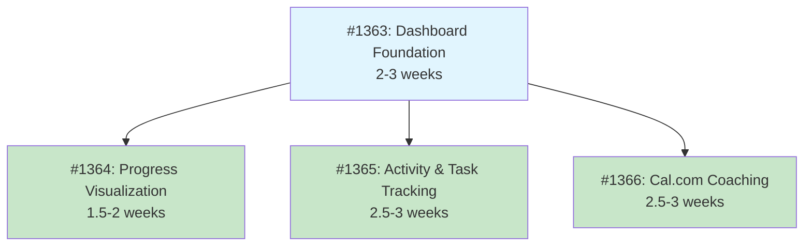

# Initiative Overview: User Dashboard Home

**Parent Spec**: #1362
**Created**: 2025-12-31
**Total Initiatives**: 4
**Estimated Duration**: 6 weeks (critical path)

---

## Directory Structure

```
.ai/alpha/specs/1362-Spec-user-dashboard-home/
├── spec.md                                    # Project specification
├── README.md                                  # This file - initiatives overview
├── research-library/                          # Research from spec phase
│   ├── calcom-embed-integration.md
│   └── perplexity-dashboard-design-patterns.md
├── 1363-Initiative-dashboard-foundation/      # I1: Foundation
│   └── initiative.md
├── 1364-Initiative-progress-visualization/    # I2: Progress Charts
│   └── initiative.md
├── 1365-Initiative-activity-task-tracking/    # I3: Activity & Kanban
│   └── initiative.md
└── 1366-Initiative-calcom-coaching/           # I4: Cal.com Integration
    └── initiative.md
```

---

## Initiative Summary

| ID | Directory | Issue | Priority | Weeks | Dependencies | Status |
|----|-----------|-------|----------|-------|--------------|--------|
| I1 | `1363-Initiative-dashboard-foundation/` | [#1363](https://github.com/MLorneSmith/2025slideheroes/issues/1363) | 1 | 2-3 | None | Draft |
| I2 | `1364-Initiative-progress-visualization/` | [#1364](https://github.com/MLorneSmith/2025slideheroes/issues/1364) | 2 | 1.5-2 | #1363 | Draft |
| I3 | `1365-Initiative-activity-task-tracking/` | [#1365](https://github.com/MLorneSmith/2025slideheroes/issues/1365) | 3 | 2.5-3 | #1363 | Draft |
| I4 | `1366-Initiative-calcom-coaching/` | [#1366](https://github.com/MLorneSmith/2025slideheroes/issues/1366) | 4 | 2.5-3 | #1363 | Draft |

---

## Dependency Graph



---

## Execution Strategy

### Phase 0: Foundation (Weeks 1-3)
| Initiative | Description | Key Deliverables |
|------------|-------------|------------------|
| **#1363: Dashboard Foundation** | Build the 3-3-1 grid layout, data loaders, empty states, Quick Actions panel, and Presentation Table | Dashboard page, loader infrastructure, 2 components |

### Phase 1: Features (Weeks 4-6) - PARALLEL EXECUTION
| Initiative | Description | Key Deliverables |
|------------|-------------|------------------|
| **#1364: Progress Visualization** | Integrate RadialProgress and RadarChart into dashboard cards | 2 chart cards |
| **#1365: Activity & Task Tracking** | New activity table, activity feed, kanban summary | Database schema, 2 components |
| **#1366: Cal.com Coaching** | External API integration for booking and display | API integration, embed, 1 component |

### Duration Analysis

| Metric | Value |
|--------|-------|
| Sequential Duration | 11 weeks (sum of all initiatives) |
| **Parallel Duration** | **6 weeks** (critical path: #1363 → #1365 or #1366) |
| Time Saved | 5 weeks (45% reduction) |

---

## Critical Path Analysis

### Critical Paths (tied)
1. #1363 → #1365: Dashboard Foundation → Activity & Task Tracking = 6 weeks
2. #1363 → #1366: Dashboard Foundation → Cal.com Coaching = 6 weeks

### Slack Analysis
| Initiative | Earliest Start | Latest Start | Slack |
|------------|---------------|--------------|-------|
| #1363 | Week 0 | Week 0 | 0 (critical) |
| #1364 | Week 3 | Week 4 | 1 week |
| #1365 | Week 3 | Week 3 | 0 (critical) |
| #1366 | Week 3 | Week 3 | 0 (critical) |

### Parallel Groups
| Group | Initiatives | Notes |
|-------|-------------|-------|
| **Group 0** | #1363 | Must complete before any others |
| **Group 1** | #1364, #1365, #1366 | Can run in parallel after #1363 |

---

## Risk Summary

| Initiative | Primary Risk | Probability | Impact | Mitigation |
|------------|--------------|-------------|--------|------------|
| #1363 | Performance with 7 parallel data fetches | Low | Medium | Optimize queries, add suspense boundaries |
| #1364 | Chart sizing issues in cards | Low | Low | Test at various viewport sizes |
| #1365 | Activity table grows too large | Medium | Low | Implement retention policy (90 days) |
| #1366 | Cal.com API rate limits | Low | Medium | Cache bookings with 15-min stale time |

---

## Open Questions

| # | Question | Initiative | Status |
|---|----------|------------|--------|
| 1 | What is the Cal.com event type slug? | #1366 | Open |
| 2 | What is the Cal.com username/organization? | #1366 | Open |
| 3 | Should quiz scores show in activity feed? | #1365 | Open |
| 4 | Activity retention period (90 days suggested) | #1365 | Open |

---

## Next Steps

1. Run `/alpha:feature-decompose 1363` for Dashboard Foundation (Priority 1)
2. Continue decomposition for remaining initiatives in priority order
3. Features can be decomposed in parallel once #1363 is underway
