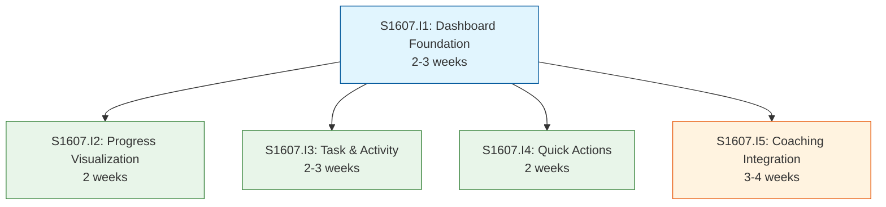

# Initiative Overview: User Dashboard

**Parent Spec**: S1607
**Created**: 2026-01-20
**Total Initiatives**: 5
**Estimated Duration**: 7 weeks (critical path)

---

## Directory Structure

```
.ai/alpha/specs/S1607-Spec-user-dashboard/
├── spec.md                                           # Project specification
├── README.md                                         # This file - initiatives overview
├── research-library/                                 # Research artifacts from spec phase
│   ├── context7-recharts-radial.md
│   └── perplexity-dashboard-patterns.md
├── S1607.I1-Initiative-dashboard-foundation/         # Priority 1: Foundation
│   ├── initiative.md
│   └── README.md                                     # (Created later) Features overview
├── S1607.I2-Initiative-progress-visualization/       # Priority 2: Progress Charts
│   ├── initiative.md
│   └── ...
├── S1607.I3-Initiative-task-activity/                # Priority 3: Tasks & Activity
│   ├── initiative.md
│   └── ...
├── S1607.I4-Initiative-quick-actions/                # Priority 4: Actions & Outlines
│   ├── initiative.md
│   └── ...
└── S1607.I5-Initiative-coaching-integration/         # Priority 5: Cal.com Integration
    ├── initiative.md
    └── ...
```

---

## Initiative Summary

| ID | Directory | Priority | Weeks | Dependencies | Status |
|----|-----------|----------|-------|--------------|--------|
| S1607.I1 | `S1607.I1-Initiative-dashboard-foundation/` | 1 | 2-3 | None | Draft |
| S1607.I2 | `S1607.I2-Initiative-progress-visualization/` | 2 | 2 | S1607.I1 | Draft |
| S1607.I3 | `S1607.I3-Initiative-task-activity/` | 3 | 2-3 | S1607.I1 | Draft |
| S1607.I4 | `S1607.I4-Initiative-quick-actions/` | 4 | 2 | S1607.I1 | Draft |
| S1607.I5 | `S1607.I5-Initiative-coaching-integration/` | 5 | 3-4 | S1607.I1 | Draft |

---

## Dependency Graph



**Legend:**
- Blue: Foundation (must complete first)
- Green: Feature initiatives (can parallelize)
- Orange: Integration initiative (higher risk)

---

## Execution Strategy

### Phase 0: Foundation (Weeks 1-3)
- **S1607.I1**: Dashboard Foundation & Data Layer
  - Page structure, responsive grid, data loaders
  - Must complete before any widget development

### Phase 1: Feature Development (Weeks 3-7)
> All initiatives in this phase can run in parallel

| Initiative | Focus | Duration | Key Deliverables |
|------------|-------|----------|------------------|
| S1607.I2 | Progress Charts | 2 weeks | RadialBarChart, RadarChart widgets |
| S1607.I3 | Tasks & Activity | 2-3 weeks | Kanban Summary, Activity Feed |
| S1607.I4 | Actions & Outlines | 2 weeks | Quick Actions Panel, Outlines Table |
| S1607.I5 | Coaching | 3-4 weeks | Cal.com integration (high risk) |

### Recommended Parallel Tracks

**Track A** (UI-focused):
- S1607.I2 → S1607.I4 (Progress → Quick Actions)

**Track B** (Data-focused):
- S1607.I3 (Activity Feed - complex queries)

**Track C** (Integration-focused):
- S1607.I5 (Cal.com - external dependency)

---

## Duration Analysis

| Metric | Value |
|--------|-------|
| Sequential Duration | 11-15 weeks (if done one at a time) |
| Parallel Duration | 7 weeks (critical path: I1 → I5) |
| Time Saved | 4-8 weeks (36-53%) |
| Parallelization Factor | 4 initiatives in Group 1 |

### Critical Path

```
S1607.I1 (3 weeks) → S1607.I5 (4 weeks) = 7 weeks total
```

All other initiatives complete within this 7-week window:
- I2: Complete by week 5
- I3: Complete by week 6
- I4: Complete by week 5

---

## Risk Summary

| Initiative | Primary Risk | Probability | Impact | Mitigation |
|------------|--------------|-------------|--------|------------|
| S1607.I1 | Foundation blocks all | Low | High | Prioritize; use existing patterns |
| S1607.I2 | RadialBarChart unfamiliar | Low | Low | Recharts docs well-researched |
| S1607.I3 | Activity feed query complexity | Medium | Medium | Start early; consider simplified v1 |
| S1607.I4 | None significant | Low | Low | Straightforward implementation |
| S1607.I5 | Cal.com API limitations | High | Medium | Spike first; fallback to simple link |

### High-Risk Mitigation for S1607.I5

1. **Start with spike**: Research Cal.com API before implementation
2. **Design fallback**: Always have "Book on Cal.com" link as backup
3. **Isolate dependency**: Keep Cal.com code separate so failures don't affect other widgets

---

## Key Technical Decisions

| Decision | Rationale |
|----------|-----------|
| Server Components for data loading | Follows codebase patterns; better performance |
| RadialBarChart from Recharts | Already in codebase; research completed |
| Reuse existing RadarChart | Component exists at assessment/survey/_components/ |
| 30-day activity limit | Balance context vs query performance |
| Cal.com embed + API | External service; fallback to link if needed |

---

## Next Steps

1. Run `/alpha:feature-decompose S1607.I1` for Dashboard Foundation
2. Once I1 features are defined, decompose I2-I4 in parallel
3. Start I5 with a spike on Cal.com API capabilities
4. Update this overview as features are decomposed

---

## Related Documentation

- Spec: `./spec.md`
- Research: `./research-library/`
- Hierarchical ID System: `.ai/alpha/docs/hierarchical-ids.md`
- Initiative Template: `.ai/alpha/templates/initiative.md`
