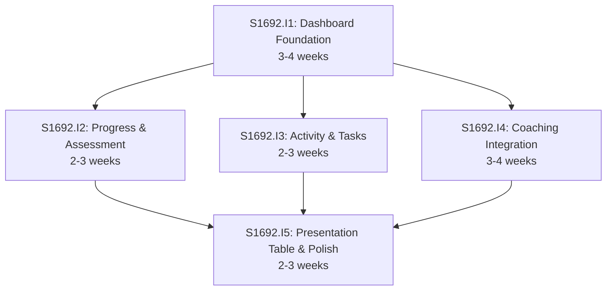

# Initiative Overview: User Dashboard

**Parent Spec**: S1692
**Created**: 2026-01-21
**Total Initiatives**: 5
**Estimated Duration**: 7-9 weeks (critical path)

---

## Directory Structure

```
.ai/alpha/specs/S1692-Spec-user-dashboard/
├── spec.md                                          # Project specification
├── README.md                                        # This file - initiatives overview
├── research-library/                                # Research artifacts
│   ├── context7-recharts-radar.md                   # Recharts radar chart research
│   ├── context7-calcom.md                           # Cal.com integration research
│   └── perplexity-dashboard-ux.md                   # Dashboard UX best practices
├── S1692.I1-Initiative-dashboard-foundation/        # Initiative 1
│   ├── initiative.md
│   └── README.md                                    # (Created later) Features overview
├── S1692.I2-Initiative-progress-assessment-widgets/ # Initiative 2
│   ├── initiative.md
│   └── ...
├── S1692.I3-Initiative-activity-task-widgets/       # Initiative 3
│   ├── initiative.md
│   └── ...
├── S1692.I4-Initiative-coaching-integration/        # Initiative 4
│   ├── initiative.md
│   └── ...
└── S1692.I5-Initiative-presentation-table-polish/   # Initiative 5
    ├── initiative.md
    └── ...
```

---

## Initiative Summary

| ID | Directory | Priority | Weeks | Dependencies | Status |
|----|-----------|----------|-------|--------------|--------|
| S1692.I1 | `S1692.I1-Initiative-dashboard-foundation/` | 1 | 3-4 | None | Draft |
| S1692.I2 | `S1692.I2-Initiative-progress-assessment-widgets/` | 2 | 2-3 | S1692.I1 | Draft |
| S1692.I3 | `S1692.I3-Initiative-activity-task-widgets/` | 3 | 2-3 | S1692.I1 | Draft |
| S1692.I4 | `S1692.I4-Initiative-coaching-integration/` | 4 | 3-4 | S1692.I1 | Draft |
| S1692.I5 | `S1692.I5-Initiative-presentation-table-polish/` | 5 | 2-3 | I1, I2, I3, I4 | Draft |

---

## Dependency Graph



---

## Execution Strategy

### Phase 1: Foundation (Weeks 1-4)
- **S1692.I1**: Dashboard Foundation & Data Layer
  - Page layout, responsive grid, data loader
  - Creates infrastructure for all widgets

### Phase 2: Widget Development (Weeks 4-8)
Run in parallel once Foundation is complete:

- **S1692.I2**: Progress & Assessment Widgets
  - Course Progress Radial, Spider Chart

- **S1692.I3**: Activity & Task Widgets
  - Activity Feed, Kanban Summary, Quick Actions

- **S1692.I4**: Coaching Integration
  - Cal.com setup, Coaching Sessions widget
  - *Higher risk - may need spike for OAuth*

### Phase 3: Finalization (Weeks 8-10)
- **S1692.I5**: Presentation Table & Polish
  - Data table, empty states, E2E tests, accessibility

---

## Risk Summary

| Initiative | Primary Risk | Probability | Impact | Mitigation |
|------------|--------------|-------------|--------|------------|
| S1692.I1 | None significant | Low | Low | Follows established patterns |
| S1692.I2 | Spider chart complexity | Low | Medium | Recharts well-documented in research |
| S1692.I3 | Activity aggregation query | Medium | Medium | May need query optimization |
| S1692.I4 | Cal.com OAuth setup | Medium | High | Early spike, fallback to booking link |
| S1692.I5 | E2E test flakiness | Low | Low | Use established patterns |

---

## Dependency Validation

### Cycle Detection
✅ **PASS** - No circular dependencies detected

### Critical Path
```
S1692.I1 (4 weeks) → S1692.I4 (4 weeks) → S1692.I5 (3 weeks) = 11 weeks max
```

### Parallel Groups

**Group 0: Foundation (Weeks 1-4)**
| Initiative | Weeks | Dependencies |
|------------|-------|--------------|
| S1692.I1: Dashboard Foundation | 3-4 | None |

**Group 1: Widget Development (Weeks 4-8)**
| Initiative | Weeks | Dependencies |
|------------|-------|--------------|
| S1692.I2: Progress & Assessment | 2-3 | S1692.I1 |
| S1692.I3: Activity & Tasks | 2-3 | S1692.I1 |
| S1692.I4: Coaching Integration | 3-4 | S1692.I1 |

**Group 2: Finalization (Weeks 8-10)**
| Initiative | Weeks | Dependencies |
|------------|-------|--------------|
| S1692.I5: Presentation Table & Polish | 2-3 | I1, I2, I3, I4 |

### Duration Analysis

| Metric | Value |
|--------|-------|
| Sequential Duration | 13-17 weeks (sum) |
| Parallel Duration | 7-9 weeks (critical path) |
| Time Saved | 6-8 weeks (46%) |

---

## Key Capabilities Mapping

| Capability (from Spec Section 5) | Initiative |
|----------------------------------|------------|
| 1. Course Progress Radial Graph | S1692.I2 |
| 2. Self-Assessment Spider Chart | S1692.I2 |
| 3. Kanban Summary Card | S1692.I3 |
| 4. Recent Activity Feed | S1692.I3 |
| 5. Quick Actions Panel | S1692.I3 |
| 6. Coaching Sessions Widget | S1692.I4 |
| 7. Presentation Outline Table | S1692.I5 |

---

## Next Steps

1. Run `/alpha:feature-decompose S1692.I1` for Priority 1 initiative
2. Continue with remaining initiatives in priority order
3. Update this overview as features are decomposed

---

## Related Files

- **Spec**: `./spec.md`
- **GitHub Issue**: #1692
- **Research**: `./research-library/`
