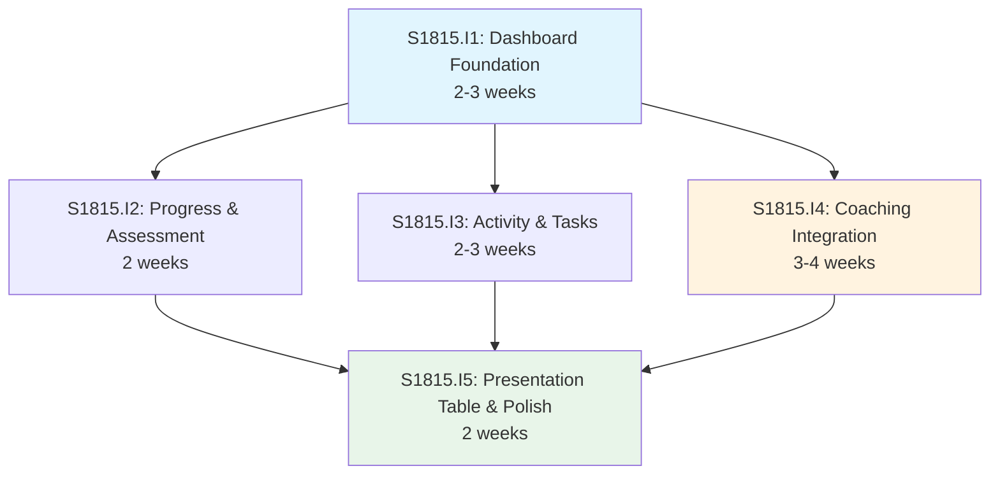

# Initiative Overview: User Dashboard

**Parent Spec**: S1815
**Created**: 2026-01-26
**Total Initiatives**: 5
**Estimated Duration**: 7-8 weeks (critical path)

---

## Directory Structure

```
.ai/alpha/specs/S1815-Spec-user-dashboard/
├── spec.md                                         # Project specification
├── README.md                                       # This file - initiatives overview
├── research-library/                               # Research artifacts from spec phase
│   ├── context7-calcom.md                         # Cal.com integration research
│   ├── context7-recharts-radar.md                 # Recharts radar chart research
│   └── perplexity-dashboard-ux.md                 # Dashboard UX best practices
├── S1815.I1-Initiative-dashboard-foundation/       # Priority 1
│   ├── initiative.md
│   └── README.md                                  # (Created later) Features overview
├── S1815.I2-Initiative-progress-assessment-widgets/# Priority 2
│   ├── initiative.md
│   └── ...
├── S1815.I3-Initiative-activity-task-widgets/      # Priority 3
│   ├── initiative.md
│   └── ...
├── S1815.I4-Initiative-coaching-integration/       # Priority 4
│   ├── initiative.md
│   └── ...
└── S1815.I5-Initiative-presentation-table-polish/  # Priority 5
    ├── initiative.md
    └── ...
```

---

## Initiative Summary

| ID | Directory | Priority | Weeks | Dependencies | Status |
|----|-----------|----------|-------|--------------|--------|
| S1815.I1 | `S1815.I1-Initiative-dashboard-foundation/` | 1 | 2-3 | None | Draft |
| S1815.I2 | `S1815.I2-Initiative-progress-assessment-widgets/` | 2 | 2 | S1815.I1 | Draft |
| S1815.I3 | `S1815.I3-Initiative-activity-task-widgets/` | 3 | 2-3 | S1815.I1 | Draft |
| S1815.I4 | `S1815.I4-Initiative-coaching-integration/` | 4 | 3-4 | S1815.I1 | Draft |
| S1815.I5 | `S1815.I5-Initiative-presentation-table-polish/` | 5 | 2 | S1815.I1-I4 | Draft |

**Total Estimated**: 11-14 weeks (sequential) → **7-8 weeks (parallel)**

---

## Dependency Graph



### Parallel Groups

| Group | Initiatives | Can Start After | Duration |
|-------|-------------|-----------------|----------|
| **Group 0** | I1 | Immediately | 2-3 weeks |
| **Group 1** | I2, I3, I4 | I1 completes | 3-4 weeks (parallel) |
| **Group 2** | I5 | I2, I3, I4 complete | 2 weeks |

---

## Execution Strategy

### Phase 1: Foundation (Weeks 1-3)
- **S1815.I1: Dashboard Foundation**
  - Page shell and responsive grid layout
  - TypeScript types and data loader
  - Skeleton loading states
  - _Blocks all other initiatives_

### Phase 2: Core Widgets (Weeks 4-7)
Three initiatives can run **in parallel** after I1 completes:

- **S1815.I2: Progress & Assessment Widgets**
  - Course progress radial chart
  - Spider chart from survey data
  - Empty states for both

- **S1815.I3: Activity & Task Widgets**
  - Kanban summary widget
  - Activity feed with aggregated events
  - Quick actions panel

- **S1815.I4: Coaching Integration** ⚠️ _Highest Risk_
  - Cal.com `@calcom/atoms` integration
  - Booking display and actions
  - Graceful error handling

### Phase 3: Polish & Testing (Weeks 8-9)
- **S1815.I5: Presentation Table & Polish**
  - Full-width presentations table
  - Empty states for all widgets
  - Accessibility compliance (WCAG 2.1 AA)
  - E2E test coverage

---

## Critical Path Analysis

### Critical Path
```
I1 (3 weeks) → I4 (4 weeks) → I5 (2 weeks) = 9 weeks maximum
```

### Path Duration
| Initiative | Weeks | Cumulative |
|------------|-------|------------|
| I1: Dashboard Foundation | 3 | 3 |
| I4: Coaching Integration | 4 | 7 |
| I5: Presentation Table & Polish | 2 | 9 |

### Slack Analysis
| Initiative | Earliest Start | Latest Start | Slack |
|------------|---------------|--------------|-------|
| I1 | Week 0 | Week 0 | 0 (critical) |
| I2 | Week 3 | Week 5 | 2 weeks |
| I3 | Week 3 | Week 4 | 1 week |
| I4 | Week 3 | Week 3 | 0 (critical) |
| I5 | Week 7 | Week 7 | 0 (critical) |

---

## Risk Summary

| Initiative | Primary Risk | Probability | Impact | Mitigation |
|------------|--------------|-------------|--------|------------|
| I1 | None significant | Low | Low | Follows established patterns |
| I2 | Radial progress component may need custom impl | Low | Low | Use existing progress component or shadcn addition |
| I3 | Activity feed data aggregation complexity | Medium | Medium | Start with simple aggregation, iterate |
| I4 | **Cal.com API availability/rate limits** | Medium | High | Graceful degradation, caching, error states |
| I5 | A11y issues discovered late | Low | Medium | Test accessibility throughout, not just at end |

### High-Risk Initiative: S1815.I4 Coaching Integration
- **External dependency**: Cal.com API and `@calcom/atoms` package
- **Unknowns**: Coach username configuration, event type slug
- **Mitigation**: Early spike to validate integration, graceful error handling

---

## Duration Analysis

| Metric | Value |
|--------|-------|
| Sequential Duration | 11-14 weeks (sum) |
| Parallel Duration | 7-9 weeks (critical path) |
| Time Saved | 4-5 weeks (36%) |

---

## Key Capabilities Mapping

| Capability (from Spec) | Initiative |
|------------------------|------------|
| 1. Course Progress Radial Widget | I2 |
| 2. Spider Chart Assessment Widget | I2 |
| 3. Kanban Summary Widget | I3 |
| 4. Activity Feed Widget | I3 |
| 5. Quick Actions Panel | I3 |
| 6. Coaching Sessions Widget | I4 |
| 7. Presentations Table Widget | I5 |
| Responsive Layout | I1 |
| Loading States | I1, I5 |
| Empty States | I5 |
| Accessibility | I5 |
| E2E Tests | I5 |

---

## Next Steps

1. Run `/alpha:feature-decompose S1815.I1` for Priority 1 foundation initiative
2. Continue with I2, I3, I4 in priority order (can run I2/I3/I4 in parallel after I1)
3. Complete I5 after all widgets are implemented
4. Update this overview as features are decomposed

---

## Related Documentation

- **Spec**: `spec.md` - Full project specification
- **Research**: `research-library/` - Cal.com, Recharts, and UX research
- **Hierarchical IDs**: `.ai/alpha/docs/hierarchical-ids.md` - ID system documentation
