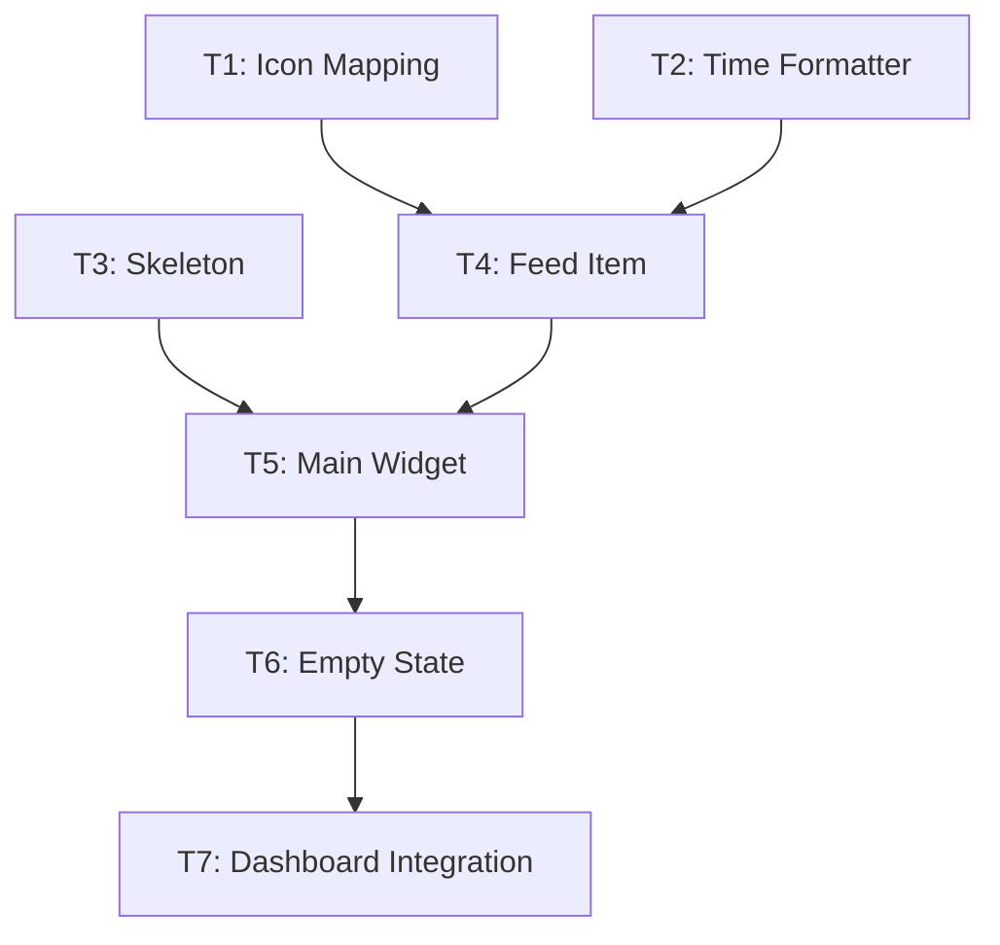

# Feature Decomposition: Activity Feed Widget

**Feature ID**: S1815.I3.F3
**Feature Name**: Activity Feed Widget
**Decomposed**: 2026-01-26
**Verdict**: APPROVED

---

## Complexity Assessment

### Signals Evaluated
| Signal | Value | Weight | Contribution |
|--------|-------|--------|--------------|
| Files Affected | 5 files | 0.5 | 12.5 |
| Dependencies | Few (date-fns, UI, F2) | 0.5 | 12.5 |
| Estimated LOC | ~400 lines | 1.0 | 25.0 |
| Feature Type | Feature (new capability) | 0.5 | 12.5 |

**Total Score**: 62.5/100
**Granularity Level**: HIGH
**Target Steps**: 12-20 tasks
**Actual Tasks**: 7 tasks (within target range)

---

## Decomposition Pattern

**Pattern Used**: Layer Decomposition (UI Components)

```
1. Utilities first (icon mapping, time formatter)
2. Skeleton loading state
3. Feed item component
4. Main widget component
5. Empty state handling
6. Dashboard integration
```

This pattern ensures:
- Dependencies are built before consumers
- UI components can be tested in isolation
- Loading and empty states are not afterthoughts

---

## Task Breakdown

### Group 1: Utility Functions (2 hours parallel)
**Tasks**: T1 (icon mapping), T2 (time formatter)
**Rationale**: Independent utilities, can run in parallel
**Pattern**: Simple mapping functions, no database access

### Group 2: Loading State (2 hours)
**Tasks**: T3 (skeleton component)
**Rationale**: Independent from utilities, can run in parallel with Group 1
**Pattern**: Standard skeleton pattern from @kit/ui

### Group 3: Feed Item Component (3 hours)
**Tasks**: T4 (ActivityFeedItem)
**Rationale**: Depends on utilities (T1, T2) but not on skeleton
**Pattern**: Composable component rendering single item

### Group 4: Main Widget Component (3 hours)
**Tasks**: T5 (ActivityFeedWidget)
**Rationale**: Depends on both feed item (T4) and skeleton (T3)
**Pattern**: Container component with data fetching

### Group 5: Empty State (2 hours)
**Tasks**: T6 (empty state handling)
**Rationale**: Modifies existing widget (T5) with conditional rendering
**Pattern**: EmptyState component from @kit/ui

### Group 6: Dashboard Integration (2 hours)
**Tasks**: T7 (page integration)
**Rationale**: Final step wiring widget into dashboard
**Pattern**: Server Component with Suspense boundary

---

## Validation Scores

| Check | Score | Threshold | Status |
|-------|-------|-----------|--------|
| Completeness | 100% | ≥90% | ✅ Pass |
| Atomicity | 100% | ≥95% | ✅ Pass |
| Dependencies | 100% | 100% | ✅ Pass |
| State Flow | 100% | ≥90% | ✅ Pass |
| Testability | 95% | ≥80% | ✅ Pass |
| **m=1 Compliance** | **100%** | **≥95%** | **✅ Pass** |

### m=1 Compliance Details

All 7 tasks pass the atomic action test:
- ✅ Single verb (Create, Add)
- ✅ No conjunctions ("and", "then")
- ✅ Under 8 hours (range: 2-3 hours)
- ✅ Under 750 tokens context
- ✅ Binary done state
- ✅ Max 3 files per task

---

## Execution Analysis

### Sequential vs Parallel

**Sequential Execution**: 16 hours
**Parallel Execution**: 12 hours
**Time Saved**: 25%

### Critical Path (12 hours)

```
T1 (2h) → T4 (3h) → T5 (3h) → T6 (2h) → T7 (2h)
```

**Bottleneck**: T4 (feed item component)
**Optimization**: T2 and T3 can run in parallel with T1

### Parallelization Opportunities

**Group 1 Parallelization**:
- T1 (icon mapping) + T2 (time formatter) + T3 (skeleton)
- 3 tasks in parallel = 2 hours (longest task)
- Sequential would be 6 hours
- **Saves 4 hours**

---

## Dependency Graph



**Key Insights**:
- No circular dependencies
- Clear sequential stages
- Parallelization in foundation layer (Group 1)
- Linear progression after T4

---

## Unknowns & Spikes

**Spike Count**: 0

No unknowns requiring research. All patterns identified in codebase:
- ✅ date-fns already installed (v4.1.0)
- ✅ Card/EmptyState components exist in @kit/ui
- ✅ Activity data contract defined in F2 (dependency)
- ✅ Lucide icons available
- ✅ Server Component patterns established

---

## UI Tasks & Visual Verification

### Visual Verification Enabled

3 tasks have `requires_ui: true` with visual verification configs:

| Task | Route | Checks |
|------|-------|--------|
| T4 | /home | Check for activity item rendering |
| T5 | /home | Check for "Recent Activity" heading, list role |
| T6 | /home | Check for "No recent activity" empty state |

**agent-browser Integration**: Each UI task includes visual verification config for automated validation during implementation.

---

## External Dependencies

### Feature Dependencies
- **S1815.I3.F2** (Activity Data Aggregation) - CRITICAL
  - Provides: `ActivityItem` type, `loadRecentActivity()` function
  - Status: Must be implemented before F3.T7 (dashboard integration)
  - Impact: T1-T6 can proceed (work on UI), T7 blocked until F2 complete

### Package Dependencies
- **date-fns**: v4.1.0 (already installed)
- **lucide-react**: Installed (icon library)
- **@kit/ui**: Internal package (Card, EmptyState, Skeleton)

### No Environment Variables Required
This feature has no external service dependencies or credential requirements.

---

## Codebase Patterns Followed

### UI Component Patterns
```tsx
// Pattern 1: Card wrapper for dashboard widgets
<Card>
  <CardHeader>
    <CardTitle>Recent Activity</CardTitle>
  </CardHeader>
  <CardContent>
    {/* Widget content */}
  </CardContent>
</Card>

// Pattern 2: EmptyState for no data
<EmptyState>
  <EmptyStateHeading>No recent activity</EmptyStateHeading>
  <EmptyStateText>Start a course to see activity</EmptyStateText>
</EmptyState>

// Pattern 3: Skeleton loading
<Suspense fallback={<ActivityFeedSkeleton />}>
  <ActivityFeedWidget activities={data} />
</Suspense>
```

### Data Fetching Patterns
```tsx
// Pattern: Server Component with parallel fetching
async function UserHomePage() {
  const activities = await loadRecentActivity();
  return <ActivityFeedWidget activities={activities} />;
}
```

### File Organization Patterns
```
apps/web/app/home/(user)/
├── _components/
│   └── widgets/
│       ├── activity-feed-widget.tsx       (T4, T5, T6)
│       └── activity-feed-skeleton.tsx      (T3)
├── _lib/
│   └── utils/
│       ├── activity-icons.ts               (T1)
│       └── format-activity-time.ts         (T2)
└── page.tsx                                (T7)
```

---

## Risk Assessment

### Low Risk Items
- ✅ All UI components exist in @kit/ui
- ✅ date-fns usage is straightforward
- ✅ Activity data structure defined in F2
- ✅ No database changes required

### Medium Risk Items
- ⚠️ F2 dependency: If F2 is delayed, T7 cannot proceed
  - **Mitigation**: T1-T6 are independent, can proceed without F2
  - **Workaround**: Use mock data for T7 testing

### No High Risk Items

---

## Post-Decomposition Checklist

- [x] tasks.json created with all required fields
- [x] Dependency validation passed (no cycles)
- [x] All tasks pass m=1 atomic action test
- [x] Critical path identified (12 hours)
- [x] Parallelization opportunities documented
- [x] Visual verification configs added for UI tasks
- [x] Spec issue commented with decomposition summary
- [x] No spikes required

---

## Next Steps

### For Orchestrator
1. Verify F2 (Activity Data Aggregation) is complete or in progress
2. Run `/alpha:implement S1815.I3.F3` to begin execution
3. Monitor critical path tasks (T1 → T4 → T5 → T6 → T7)
4. Use visual verification for UI tasks (T4, T5, T6)

### For Implementation
1. Start with Group 1 (T1, T2, T3) in parallel
2. Proceed to T4 (feed item) after T1, T2 complete
3. T5 (main widget) requires both T3 and T4
4. T6 (empty state) modifies T5
5. T7 (integration) requires F2 completion

---

## Metrics Summary

| Metric | Value |
|--------|-------|
| Total Tasks | 7 |
| Spike Tasks | 0 |
| UI Tasks | 3 |
| Database Tasks | 0 |
| Sequential Hours | 16 |
| Parallel Hours | 12 |
| Time Saved | 25% |
| Critical Path | 12 hours |
| Avg Hours/Task | 2.3 hours |
| Max Task Hours | 3 hours |
| m=1 Compliance | 100% |
| Validation Score | 99% |

---

_Generated by /alpha:task-decompose on 2026-01-26_
