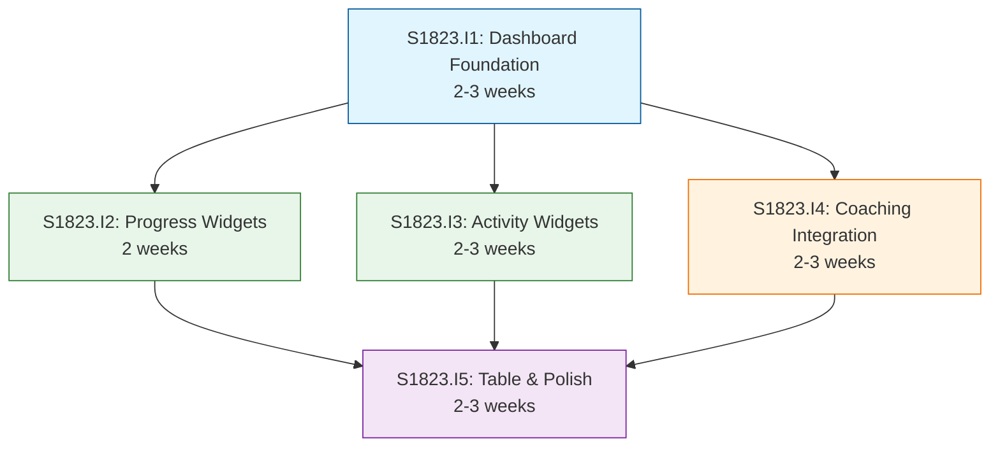

# Initiative Overview: User Dashboard

**Parent Spec**: S1823
**Created**: 2026-01-26
**Total Initiatives**: 5
**Estimated Duration**: 7-8 weeks (critical path)

---

## Directory Structure

```
.ai/alpha/specs/S1823-Spec-user-dashboard/
├── spec.md                                           # Project specification
├── README.md                                         # This file - initiatives overview
├── research-library/                                 # Research artifacts
│   ├── context7-calcom.md                           # Cal.com integration research
│   ├── context7-recharts-radar.md                   # Recharts RadarChart documentation
│   └── perplexity-dashboard-ux.md                   # Dashboard UX best practices
├── S1823.I1-Initiative-dashboard-foundation/        # Priority 1: Foundation
│   └── initiative.md
├── S1823.I2-Initiative-progress-assessment-widgets/ # Priority 2: Progress widgets
│   └── initiative.md
├── S1823.I3-Initiative-activity-task-widgets/       # Priority 3: Activity widgets
│   └── initiative.md
├── S1823.I4-Initiative-coaching-integration/        # Priority 4: Cal.com coaching
│   └── initiative.md
└── S1823.I5-Initiative-presentation-table-polish/   # Priority 5: Table & polish
    └── initiative.md
```

---

## Initiative Summary

| ID | Directory | Priority | Weeks | Dependencies | Status |
|----|-----------|----------|-------|--------------|--------|
| S1823.I1 | `S1823.I1-Initiative-dashboard-foundation/` | 1 | 2-3 | None | Draft |
| S1823.I2 | `S1823.I2-Initiative-progress-assessment-widgets/` | 2 | 2 | S1823.I1 | Draft |
| S1823.I3 | `S1823.I3-Initiative-activity-task-widgets/` | 3 | 2-3 | S1823.I1 | Draft |
| S1823.I4 | `S1823.I4-Initiative-coaching-integration/` | 4 | 2-3 | S1823.I1 | Draft |
| S1823.I5 | `S1823.I5-Initiative-presentation-table-polish/` | 5 | 2-3 | S1823.I1-I4 | Draft |

---

## Dependency Graph



---

## Execution Strategy

### Phase 1: Foundation (Weeks 1-3)
- **S1823.I1**: Dashboard Foundation
  - Page shell, responsive grid layout, TypeScript types, unified data loader
  - Must complete before any widgets can be implemented
  - Low complexity, establishes patterns for subsequent work

### Phase 2: Core Widgets (Weeks 3-6)
Three initiatives can run **in parallel**:
- **S1823.I2**: Progress & Assessment Widgets
  - Course Progress Radial, Self-Assessment Spider Chart
  - Reuses existing components, lowest risk
- **S1823.I3**: Activity & Task Widgets
  - Kanban Summary, Activity Feed, Quick Actions
  - Medium complexity (activity aggregation)
- **S1823.I4**: Coaching Integration
  - Cal.com embed + V2 API integration
  - External dependency, medium risk

### Phase 3: Polish & Testing (Weeks 6-8)
- **S1823.I5**: Presentation Table & Polish
  - Presentation Outline Table widget
  - Empty states for all widgets
  - Accessibility compliance (WCAG 2.1 AA)
  - E2E test coverage
  - Depends on all prior initiatives for empty state patterns

---

## Critical Path Analysis

### Critical Path
S1823.I1 → S1823.I4 → S1823.I5

### Path Duration
| Initiative | Weeks | Cumulative |
|------------|-------|------------|
| S1823.I1: Dashboard Foundation | 3 | 3 |
| S1823.I4: Coaching Integration | 3 | 6 |
| S1823.I5: Table & Polish | 2 | 8 |

### Slack Analysis
| Initiative | Earliest Start | Latest Start | Slack |
|------------|---------------|--------------|-------|
| S1823.I1 | Week 0 | Week 0 | 0 (critical) |
| S1823.I2 | Week 3 | Week 4 | 1 week |
| S1823.I3 | Week 3 | Week 3 | 0 (near-critical) |
| S1823.I4 | Week 3 | Week 3 | 0 (critical) |
| S1823.I5 | Week 6 | Week 6 | 0 (critical) |

### Duration Summary
| Metric | Value |
|--------|-------|
| Sequential Duration | 11-14 weeks (sum) |
| Parallel Duration | 7-8 weeks (critical path) |
| Time Saved | 4-6 weeks (36-43%) |

---

## Parallel Execution Groups

### Group 0: Foundation (Weeks 1-3)
| Initiative | Weeks | Dependencies |
|------------|-------|--------------|
| S1823.I1: Dashboard Foundation | 2-3 | None |

### Group 1: Features (Weeks 3-6)
| Initiative | Weeks | Dependencies |
|------------|-------|--------------|
| S1823.I2: Progress Widgets | 2 | S1823.I1 |
| S1823.I3: Activity Widgets | 2-3 | S1823.I1 |
| S1823.I4: Coaching Integration | 2-3 | S1823.I1 |

### Group 2: Polish (Weeks 6-8)
| Initiative | Weeks | Dependencies |
|------------|-------|--------------|
| S1823.I5: Table & Polish | 2-3 | S1823.I1-I4 |

---

## Risk Summary

| Initiative | Primary Risk | Probability | Impact | Mitigation |
|------------|--------------|-------------|--------|------------|
| S1823.I1 | None significant | Low | Low | Standard patterns |
| S1823.I2 | Chart rendering issues | Low | Medium | Cross-browser testing, existing components |
| S1823.I3 | Activity aggregation performance | Medium | Medium | Query optimization, limit results, add indexes |
| S1823.I4 | Cal.com API rate limits | Medium | Medium | 5-min caching, graceful degradation |
| S1823.I5 | Accessibility gaps discovered late | Medium | Medium | Early axe-core integration, automated a11y tests |

---

## Key Decisions

| Decision | Rationale |
|----------|-----------|
| 5 initiatives (not 3 or 7) | Optimal granularity: each is 2-3 weeks, clear boundaries |
| I4 as separate initiative | External integration risk isolation, can be delayed if needed |
| I5 last (polish) | Needs all widgets for empty states, natural completion phase |
| Parallel I2/I3/I4 | Independent work streams, maximizes development velocity |

---

## Next Steps

1. Run `/alpha:feature-decompose S1823.I1` for Priority 1 initiative (Dashboard Foundation)
2. Once I1 features are decomposed, can decompose I2-I4 in parallel
3. Update this overview as features are decomposed and implemented
