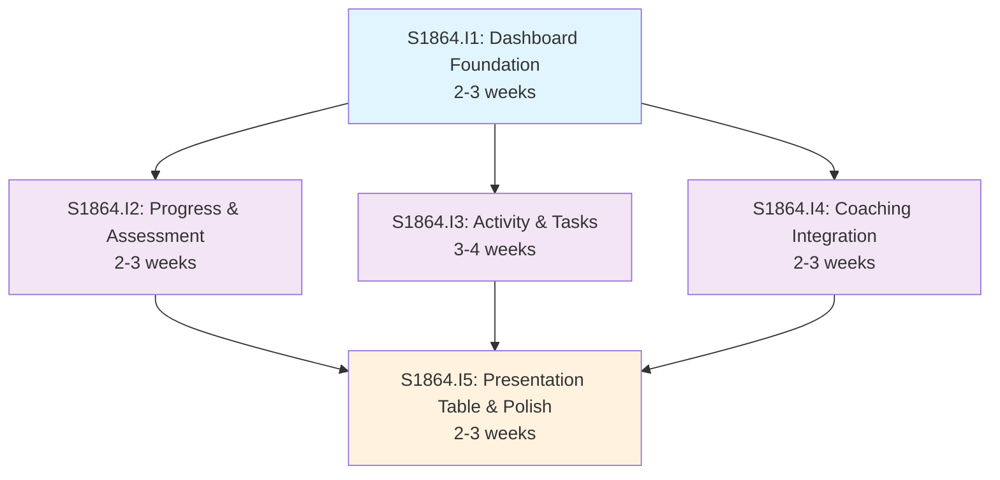

# Initiative Overview: User Dashboard

**Parent Spec**: S1864
**Created**: 2026-01-27
**Total Initiatives**: 5
**Estimated Duration**: 7-9 weeks (critical path)

---

## Directory Structure

```
.ai/alpha/specs/S1864-Spec-user-dashboard/
├── spec.md                                           # Project specification
├── README.md                                         # This file - initiatives overview
├── research-library/                                 # Research artifacts from spec phase
│   ├── context7-calcom.md                           # Cal.com embed SDK research
│   ├── context7-recharts-radar.md                   # Recharts RadarChart research
│   └── perplexity-dashboard-ux.md                   # Dashboard UX best practices
├── S1864.I1-Initiative-dashboard-foundation/         # Priority 1 - Foundation
│   ├── initiative.md
│   └── README.md                                    # (Created later) Features overview
├── S1864.I2-Initiative-progress-assessment-widgets/  # Priority 2 - Visualization
│   ├── initiative.md
│   └── ...
├── S1864.I3-Initiative-activity-task-widgets/        # Priority 3 - Activity/Tasks
│   ├── initiative.md
│   └── ...
├── S1864.I4-Initiative-coaching-integration/         # Priority 4 - Cal.com
│   ├── initiative.md
│   └── ...
└── S1864.I5-Initiative-presentation-table-polish/    # Priority 5 - Polish/E2E
    ├── initiative.md
    └── ...
```

---

## Initiative Summary

| ID | Directory | Priority | Weeks | Dependencies | Status |
|----|-----------|----------|-------|--------------|--------|
| S1864.I1 | `S1864.I1-Initiative-dashboard-foundation/` | 1 | 2-3 | None | Draft |
| S1864.I2 | `S1864.I2-Initiative-progress-assessment-widgets/` | 2 | 2-3 | S1864.I1 | Draft |
| S1864.I3 | `S1864.I3-Initiative-activity-task-widgets/` | 3 | 3-4 | S1864.I1 | Draft |
| S1864.I4 | `S1864.I4-Initiative-coaching-integration/` | 4 | 2-3 | S1864.I1 | Draft |
| S1864.I5 | `S1864.I5-Initiative-presentation-table-polish/` | 5 | 2-3 | S1864.I1-I4 | Draft |

---

## Dependency Graph



---

## Execution Strategy

### Phase 1: Foundation (Weeks 1-3)
- **S1864.I1**: Dashboard Foundation
  - Page shell, responsive grid layout, TypeScript types
  - Parallel-fetching data loader
  - Skeleton containers for all widget positions
  - **Critical**: Blocks all other initiatives

### Phase 2: Core Widgets (Weeks 3-6) - Parallel Tracks
- **S1864.I2**: Progress & Assessment Widgets
  - Course progress radial chart
  - Assessment spider chart
  - *Can run in parallel with I3, I4*

- **S1864.I3**: Activity & Task Widgets
  - Kanban summary widget
  - Activity feed with new activity_logs table
  - Quick actions panel
  - *Can run in parallel with I2, I4*

- **S1864.I4**: Coaching Integration
  - Cal.com V2 API integration
  - Upcoming sessions display
  - Booking embed widget
  - *Can run in parallel with I2, I3*

### Phase 3: Polish & Integration (Weeks 6-9)
- **S1864.I5**: Presentation Table & Polish
  - Presentation outline table widget
  - Empty state refinement across all widgets
  - Accessibility compliance (WCAG 2.1 AA)
  - E2E test coverage
  - Performance validation

---

## Critical Path Analysis

### Critical Path
```
S1864.I1 (3 weeks) → S1864.I3 (4 weeks) → S1864.I5 (3 weeks)
```

### Duration Breakdown
| Metric | Value |
|--------|-------|
| Sequential Duration | 14 weeks (if all done serially) |
| Parallel Duration | 9 weeks (critical path) |
| Time Saved | 5 weeks (36%) |

### Parallel Groups
| Group | Initiatives | Start Week | Duration |
|-------|-------------|------------|----------|
| 0 | I1 | Week 1 | 3 weeks |
| 1 | I2, I3, I4 | Week 4 | 4 weeks (I3 is longest) |
| 2 | I5 | Week 8 | 2-3 weeks |

---

## Risk Summary

| Initiative | Primary Risk | Probability | Impact | Mitigation |
|------------|--------------|-------------|--------|------------|
| S1864.I1 | Grid layout complexity | Low | Medium | Use existing dashboard-demo-charts.tsx pattern |
| S1864.I2 | Radar chart SSR issues | Medium | Low | Use ResponsiveContainer with initialDimension |
| S1864.I3 | Activity feed performance | Medium | High | Add indexes, pagination, 30-day limit |
| S1864.I4 | Cal.com API rate limits | Medium | Medium | Cache bookings, exponential backoff |
| S1864.I5 | Accessibility gaps | Low | Medium | Early WCAG audit during development |

---

## Key Deliverables by Initiative

### I1: Foundation
- `/home/(user)/page.tsx` - Dashboard page
- `/_lib/server/dashboard-page.loader.ts` - Data loader
- TypeScript types for all dashboard data

### I2: Progress Visualization
- `<CourseProgressWidget />` - Radial progress
- `<AssessmentSpiderWidget />` - Radar chart

### I3: Activity & Tasks
- `activity_logs` table migration + RLS
- `<KanbanSummaryWidget />` - Current tasks
- `<ActivityFeedWidget />` - Timeline
- `<QuickActionsPanel />` - Contextual CTAs

### I4: Coaching
- `<CoachingSessionsWidget />` - Cal.com integration
- `/api/coaching/sessions/route.ts` - API route
- `/api/webhooks/cal/route.ts` - Webhook handler

### I5: Polish
- `<PresentationTableWidget />` - DataTable
- E2E tests in `apps/e2e/`
- Accessibility compliance documentation

---

## Research Artifacts

The following research from the spec phase informs implementation:

| File | Key Insights |
|------|--------------|
| `context7-calcom.md` | Use embed script (not @calcom/atoms), V2 API with Bearer auth, webhook HMAC verification |
| `context7-recharts-radar.md` | ResponsiveContainer required, domain={[0,100]} for percentages, fillOpacity 0.3-0.6 |
| `perplexity-dashboard-ux.md` | "5-second rule" for KPIs, 3-6 widgets max, <3s load time target, lazy load off-screen |

---

## Next Steps

1. Run `/alpha:feature-decompose S1864.I1` for Priority 1 initiative (Dashboard Foundation)
2. Continue with S1864.I2-I4 in priority order (can run in parallel after I1 features are defined)
3. Run S1864.I5 feature decomposition after I1-I4 are complete
4. Update this overview as features are decomposed

---

## Commands Reference

```bash
# View spec
cat .ai/alpha/specs/S1864-Spec-user-dashboard/spec.md

# List initiatives
ls -la .ai/alpha/specs/S1864-Spec-user-dashboard/S1864.I*-Initiative-*/

# View specific initiative
cat .ai/alpha/specs/S1864-Spec-user-dashboard/S1864.I1-Initiative-dashboard-foundation/initiative.md

# Decompose next initiative
/alpha:feature-decompose S1864.I1
```
