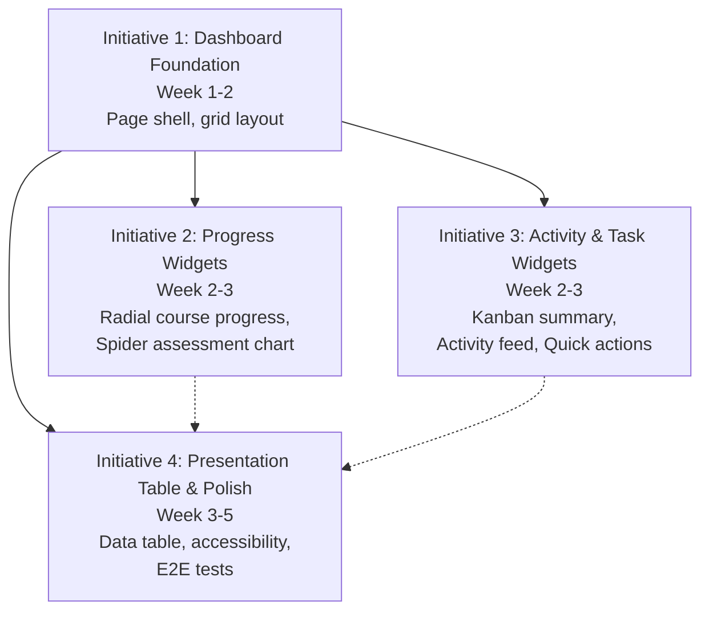

# Initiative Overview: User Dashboard

**Parent Spec**: S1877
**Created**: 2026-01-28
**Total Initiatives**: 4
**Estimated Duration**: 7 weeks (critical path, 5 weeks with parallel execution)

---

## Directory Structure

```
.ai/alpha/specs/S1877-Spec-user-dashboard/
├── spec.md                                    # Project specification
├── README.md                                  # This file - initiatives overview
├── S1877.I1-Initiative-dashboard-foundation/   # Initiative 1
│   └── initiative.md
├── S1877.I2-Initiative-progress-widgets/      # Initiative 2
│   └── initiative.md
├── S1877.I3-Initiative-activity-task-widgets/  # Initiative 3
│   └── initiative.md
└── S1877.I4-Initiative-presentation-table-polish/ # Initiative 4
    └── initiative.md
```

---

## Initiative Summary

| ID | Directory | Priority | Weeks | Dependencies | Status |
|----|-----------|----------|-------|--------------|--------|
| S1877.I1 | `S1877.I1-Initiative-dashboard-foundation/` | 1 | 2 | None | Draft |
| S1877.I2 | `S1877.I2-Initiative-progress-widgets/` | 2 | 2 | S1877.I1 | Draft |
| S1877.I3 | `S1877.I3-Initiative-activity-task-widgets/` | 3 | 2 | S1877.I1 | Draft |
| S1877.I4 | `S1877.I4-Initiative-presentation-table-polish/` | 4 | 3 | S1877.I1, I2, I3 | Draft |

---

## Dependency Graph



**Dependencies Explained:**
- **I1** has no dependencies - starts immediately
- **I2** requires I1 - needs dashboard grid container
- **I3** requires I1 - needs dashboard grid container
- **I4** requires I1, I2, I3 - completes dashboard visualization set

---

## Execution Strategy

### Phase 1: Foundation (Week 1-2)
- **I1**: Dashboard Foundation
  - Create page shell with PageBody and HomeLayoutPageHeader
  - Implement responsive 3-3-1 grid layout (mobile: stack, tablet: 2-col, desktop: 3-col)
  - Build data loader with Promise.all() parallel fetching pattern
  - Add skeleton loading and empty state containers for 6 widget positions
  - Establish TypeScript types for dashboard data structures

### Phase 2: Core Widgets (Week 3-4)
- **I2**: Progress Widgets (parallel with I3)
  - Implement Course Progress Radial Widget using existing `RadialProgress.tsx` pattern
  - Implement Assessment Spider Chart Widget adapting existing `radar-chart.tsx`
  - Add empty states with contextual CTAs
  - Connect to dashboard grid (positions 1-2 in first row)
- **I3**: Activity & Task Widgets (parallel with I2)
  - Implement Kanban Summary Card filtering tasks by status='doing'
  - Implement Activity Feed Widget querying `ai_request_logs` with pagination
  - Implement Quick Actions Panel with conditional CTAs based on user state
  - Add empty states and loading skeletons
  - Connect to dashboard grid (positions 2-3 in first row, and position 1-2 in second row)

### Phase 3: Integration & Polish (Week 5-7)
- **I4**: Presentation Table & Polish (completes dashboard)
  - Implement Presentation Table using DataTable component
  - Add sorting, filtering, and pagination
  - Add quick "Edit Outline" buttons linking to storyboard
  - Comprehensive accessibility audit (WCAG 2.1 AA)
  - Create E2E tests for dashboard load, interactions, and table operations
  - Connect to dashboard grid (full-width at bottom, row 3)

---

## Risk Summary

| Initiative | Primary Risk | Probability | Impact | Mitigation |
|------------|--------------|------------|------------|
| I1 | Grid layout responsive complexity on mobile | Medium | Medium | Follow existing `dashboard-demo-charts.tsx` patterns, test on real devices |
| I2 | Spider chart data quality (empty assessments) | High | Low | Show "Complete Assessment" CTA instead of empty chart |
| I3 | Activity feed query performance with 1000+ entries | Medium | High | Use existing `ai_request_logs` table indexes on (user_id, request_timestamp), pagination |
| I4 | Large presentation table rendering performance | Medium | Low | Add pagination limit (10-20 rows), DataTable virtualization if needed |

---

## Critical Path Analysis

| Initiative | Weeks | Cumulative |
|------------|-------|------------|
| I1: Dashboard Foundation | 2 | 2 |
| I2: Progress Widgets | 2 | 4 (parallel with I3) |
| I3: Activity & Task Widgets | 2 | 4 (parallel with I2) |
| I4: Presentation Table & Polish | 3 | **7** |

**Critical Path**: I1 → I4 = **5 weeks**

**Sequential Duration**: 9 weeks (sum of all initiatives)
**Parallel Duration**: 7 weeks (critical path with I2, I3 running in parallel)
**Time Saved**: 2 weeks (22%)

---

## Dependency Validation

### Cycle Detection
**Status**: ✅ PASS - No circular dependencies detected

### Slack Analysis
| Initiative | Earliest Start | Latest Start | Slack |
|------------|---------------|--------------|-------|
| I1 | Week 0 | Week 0 | 0 (critical) |
| I2 | Week 2 | Week 2 | 0 (critical) |
| I3 | Week 2 | Week 4 | 2 weeks |
| I4 | Week 4 | Week 4 | 0 (critical) |

---

## Next Steps

1. Run `/alpha:feature-decompose S1877.I1` for Priority 1 / Group 0 initiative
2. Continue with remaining initiatives in priority order:
   - `/alpha:feature-decompose S1877.I2` (starts after I1)
   - `/alpha:feature-decompose S1877.I3` (starts after I1)
   - `/alpha:feature-decompose S1877.I4` (starts after I1, I2, I3)
3. Update this overview as features are decomposed
4. Run `/alpha:implement S1877.I1` when ready to begin development
