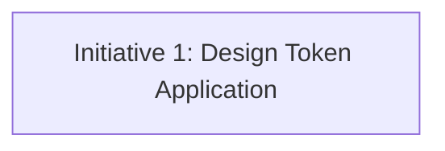

# Initiative Overview: Design System V1 - Modern Vibrant

**Parent Spec**: S1879
**Created**: 2026-01-28
**Total Initiatives**: 1
**Estimated Duration**: 1-2 weeks (critical path)

---

## Directory Structure

```
.ai/alpha/specs/S1879-Spec-design-system-v1-modern-vibrant/
├── spec.md                                    # Project specification
├── README.md                                  # This file - initiatives overview
└── S1879.I1-Initiative-design-token-application/  # Initiative 1
    └── initiative.md
```

---

## Initiative Summary

| ID | Directory | Priority | Weeks | Dependencies | Status |
|----|-----------|----------|-------|--------------|--------|
| S1879.I1 | `S1879.I1-Initiative-design-token-application/` | 1 | 1 | None | Draft |

---

## Dependency Graph



**No dependencies** - this is a standalone token-only change.

---

## Execution Strategy

### Phase 1: Design Token Implementation (Week 1-2)
- **I1**: Design Token Application - Configure CSS variables (colors, shadows, radius) and fonts (Outfit/Nunito Sans)

---

## Risk Summary

| Initiative | Primary Risk | Probability | Impact | Mitigation |
|------------|--------------|-------------|--------|------------|
| I1 | Orange accent too bold for B2B | Medium | Medium | This is an A/B test variation; if users reject V1, V2-V4 alternatives exist |

---

## Next Steps

1. Run `/alpha:feature-decompose S1879.I1` for Priority 1 initiative
2. Update this overview as features are decomposed
3. Implement features and verify visually
4. Capture screenshots for A/B comparison with other variations (V2-V4)
