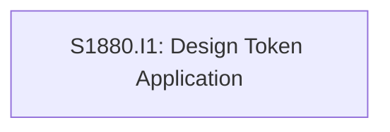

# Initiative Overview: Design System V2 - Clean Professional

**Parent Spec**: S1880
**Created**: 2026-01-28
**Total Initiatives**: 1
**Estimated Duration**: 1-2 days (critical path)

---

## Directory Structure

```
.ai/alpha/specs/S1880-Spec-design-system-v2-clean-professional/
├── spec.md                                    # Project specification
├── README.md                                  # This file - initiatives overview
└── S1880.I1-Initiative-design-token-application/  # Initiative 1
    └── initiative.md
```

---

## Initiative Summary

| ID | Directory | Priority | Weeks | Dependencies | Status |
|----|-----------|----------|-------|--------------|--------|
| S1880.I1 | `S1880.I1-Initiative-design-token-application/` | 1 | 0.3-0.5 | None | Draft |

---

## Dependency Graph



---

## Execution Strategy

### Phase 1: Token Updates (Hours 1-2)
- **I1**: CSS Token Configuration - Update `shadcn-ui.css` with all design tokens

### Phase 2: Verification (Hours 3-6)
- **I1**: Font verification + visual testing + screenshot capture

---

## Risk Summary

| Initiative | Primary Risk | Probability | Impact | Mitigation |
|------------|--------------|-------------|--------|------------|
| I1 | Color contrast fails WCAG AA | Low | Medium | Test on existing color testing pages (`/test-colors`, `/debug-colors`) |
| I1 | Purple clashes with cyan | Very Low | Low | Visual verification before committing |

---

## Next Steps

1. Run `/alpha:feature-decompose S1880.I1` for Priority 1 initiative
2. Update this overview as features are decomposed
