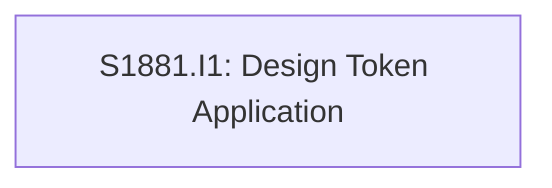

# Initiative Overview: Design System V3 - Soft Approachable

**Parent Spec**: S1881
**Created**: 2026-01-28
**Total Initiatives**: 1
**Estimated Duration**: 1 week (critical path)

---

## Directory Structure

```
.ai/alpha/specs/S1881-Spec-design-system-v3-soft-approachable/
├── spec.md                                             # Project specification
├── README.md                                           # This file - initiatives overview
├── S1881.I1-Initiative-design-token-application/           # Initiative 1
│   ├── initiative.md
│   └── README.md                                      # (Created later) Features overview
└── research-library/
```

---

## Initiative Summary

| ID | Directory | Priority | Weeks | Dependencies | Status |
|----|-----------|----------|-------|--------------|--------|
| S1881.I1 | `S1881.I1-Initiative-design-token-application/` | 1 | 1 | None | Draft |

---

## Dependency Graph



---

## Execution Strategy

### Phase 1: Token Configuration (Days 1-2)
- **I1**: CSS token updates in shadcn-ui.css
  - Brand cyan + coral accent
  - Subtle shadow scale
  - 16px border radius
  - Light/dark mode variants

### Phase 2: Font Configuration (Day 3)
- **I1**: Configure Manrope and Source Sans Pro
  - Update apps/web/lib/fonts.ts
  - Verify font loading via next/font

### Phase 3: Verification (Days 4-5)
- **I1**: Visual testing and accessibility checks
  - Test on home page, ui-showcase, dashboard
  - WCAG AA contrast verification
  - Capture screenshots for evaluation

---

## Risk Summary

| Initiative | Primary Risk | Probability | Impact | Mitigation |
|------------|--------------|-------------|--------|------------|
| I1 | Too soft for enterprise | Medium | Medium | Test with B2B users during evaluation |
| I1 | Large radius causes layout issues | Low | Medium | Test all UI components after token updates |

---

## Next Steps

1. Run `/alpha:feature-decompose S1881.I1` for Priority 1 initiative
2. Verify CSS token changes don't break existing components
3. Capture before/after screenshots for design team review
