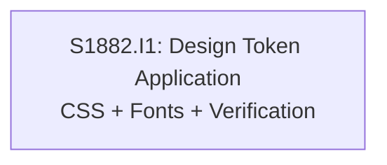

# Initiative Overview: Design System V4 - Bold Geometric

**Parent Spec**: S1882
**Created**: 2026-01-28
**Total Initiatives**: 1
**Estimated Duration**: 1 week (critical path)

---

## Directory Structure

```
.ai/alpha/specs/S1882-Spec-design-system-v4-bold-geometric/
├── spec.md                                    # Project specification
├── README.md                                  # This file - initiatives overview
└── S1882.I1-Initiative-design-token-application/  # Initiative 1
    └── initiative.md
```

---

## Initiative Summary

| ID | Directory | Priority | Weeks | Dependencies | Status |
|----|-----------|----------|-------|--------------|--------|
| S1882.I1 | `S1882.I1-Initiative-design-token-application/` | 1 | None | Draft |

---

## Dependency Graph



---

## Execution Strategy

### Phase 1: Foundation (Week 1)
- **S1882.I1**: Design Token Application - Update all CSS tokens and fonts, verify accessibility, capture screenshots

This is a focused, single-initiative spec with no dependencies. All work can be completed in one week with parallel execution of CSS and font configuration.

---

## Risk Summary

| Initiative | Primary Risk | Probability | Impact | Mitigation |
|------------|--------------|-------------|--------|------------|
| I1 | Amber accent contrast fails WCAG AA | Low | Medium | Verify with contrast checker before commit |
| I1 | Google Fonts loading impacts performance | Low | Low | Use next/font preload (already enabled) |

---

## Next Steps

1. Run `/alpha:feature-decompose S1882.I1` to decompose initiative into features
2. Execute `/alpha:implement` to implement all features
3. Update this overview as implementation progresses
