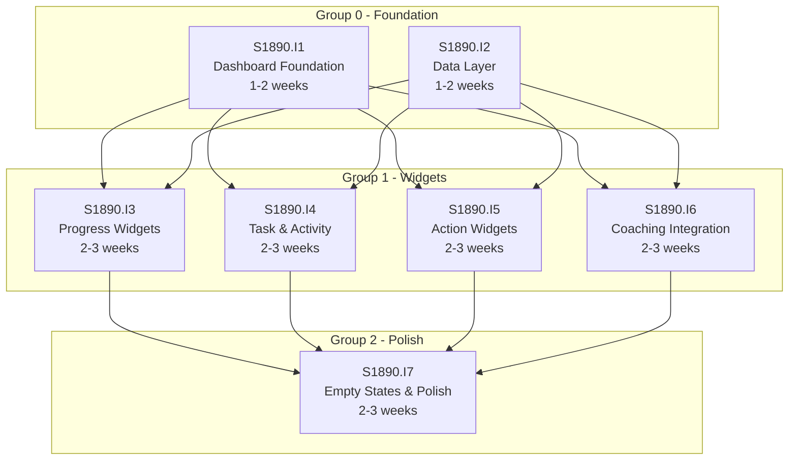

# Initiative Overview: User Dashboard

**Parent Spec**: S1890
**Created**: 2026-02-02
**Total Initiatives**: 7
**Estimated Duration**: 6-8 weeks (critical path)

---

## Directory Structure

```
.ai/alpha/specs/S1890-Spec-user-dashboard/
├── spec.md                                           # Project specification
├── README.md                                         # This file - initiatives overview
├── research-library/                                 # Research artifacts from spec phase
│   ├── context7-recharts-radial-radar.md
│   ├── perplexity-calcom-nextjs-integration-post-platform.md
│   └── perplexity-dashboard-empty-states.md
├── S1890.I1-Initiative-dashboard-foundation/         # Initiative 1
│   └── initiative.md
├── S1890.I2-Initiative-data-layer/                   # Initiative 2
│   └── initiative.md
├── S1890.I3-Initiative-progress-widgets/             # Initiative 3
│   └── initiative.md
├── S1890.I4-Initiative-task-activity-widgets/        # Initiative 4
│   └── initiative.md
├── S1890.I5-Initiative-action-widgets/               # Initiative 5
│   └── initiative.md
├── S1890.I6-Initiative-coaching-integration/         # Initiative 6
│   └── initiative.md
└── S1890.I7-Initiative-empty-states-polish/          # Initiative 7
    └── initiative.md
```

---

## Initiative Summary

| ID | Directory | Priority | Weeks | Dependencies | Status |
|----|-----------|----------|-------|--------------|--------|
| S1890.I1 | `S1890.I1-Initiative-dashboard-foundation/` | 1 | 1-2 | None | Draft |
| S1890.I2 | `S1890.I2-Initiative-data-layer/` | 2 | 1-2 | None | Draft |
| S1890.I3 | `S1890.I3-Initiative-progress-widgets/` | 3 | 2-3 | I1, I2 | Draft |
| S1890.I4 | `S1890.I4-Initiative-task-activity-widgets/` | 4 | 2-3 | I1, I2 | Draft |
| S1890.I5 | `S1890.I5-Initiative-action-widgets/` | 5 | 2-3 | I1, I2 | Draft |
| S1890.I6 | `S1890.I6-Initiative-coaching-integration/` | 6 | 2-3 | I1, I2 | Draft |
| S1890.I7 | `S1890.I7-Initiative-empty-states-polish/` | 7 | 2-3 | I1, I3, I4, I5, I6 | Draft |

---

## Dependency Graph



---

## Execution Strategy

### Phase 0: Foundation (Weeks 1-2)
- **S1890.I1**: Dashboard Foundation - Page structure, grid layout, responsive design
- **S1890.I2**: Data Layer - Consolidated loader, parallel fetching, TypeScript types

> I1 and I2 can be developed in parallel as they have no dependencies on each other.

### Phase 1: Widget Development (Weeks 3-5)
- **S1890.I3**: Progress Widgets - Radial chart, spider diagram
- **S1890.I4**: Task & Activity Widgets - Kanban summary, activity feed
- **S1890.I5**: Action Widgets - Quick actions, presentation table
- **S1890.I6**: Coaching Integration - Cal.com API, sessions widget

> I3, I4, I5, and I6 can all be developed in parallel once Phase 0 completes.

### Phase 2: Polish (Weeks 6-8)
- **S1890.I7**: Empty States & Polish - All empty states, loading skeletons, accessibility

> I7 must wait for all widgets to be structurally complete.

---

## Critical Path Analysis

### Critical Path
```
I1 (1.5 weeks) → I3/I4/I5/I6 (2.5 weeks) → I7 (2.5 weeks) = 6.5 weeks
```

### Path Duration
| Initiative | Weeks | Cumulative |
|------------|-------|------------|
| S1890.I1: Dashboard Foundation | 1.5 | 1.5 |
| S1890.I3-I6: Widgets (parallel) | 2.5 | 4.0 |
| S1890.I7: Empty States & Polish | 2.5 | 6.5 |

### Parallel Execution Groups
| Group | Initiatives | Can Start |
|-------|-------------|-----------|
| Group 0 | I1, I2 | Week 1 |
| Group 1 | I3, I4, I5, I6 | After Group 0 (Week 2-3) |
| Group 2 | I7 | After Group 1 (Week 5-6) |

### Duration Analysis
| Metric | Value |
|--------|-------|
| Sequential Duration | 14-19 weeks (sum of all) |
| Parallel Duration | 6-8 weeks (critical path) |
| Time Saved | 8-11 weeks (57-58%) |

---

## Risk Summary

| Initiative | Primary Risk | Probability | Impact | Mitigation |
|------------|--------------|-------------|--------|------------|
| I1 | Low risk - well-established patterns | L | L | Follow existing page patterns |
| I2 | Query performance with 6 tables | M | M | Use Promise.all(), add indexes if needed |
| I3 | Recharts SSR compatibility | M | M | Use initialDimension, dynamic imports |
| I4 | Activity feed performance | M | M | Pagination, limit 30 days |
| I5 | Contextual logic complexity | L | L | Clear state conditions documented |
| I6 | Cal.com API rate limiting/downtime | M | H | Cache responses, graceful degradation |
| I7 | Design quality for empty states | L | M | Follow research best practices |

---

## Dependency Validation

### Validation Checklist
- [x] All dependencies explicitly documented using S#.I# format
- [x] **No circular dependencies** (cycle detection passed)
- [x] Critical path calculated and documented
- [x] Parallel groups identified (3 groups)
- [x] Execution order is logical and achievable

### Cycle Detection Result
```
No cycles detected. Dependency graph is a valid DAG.

Verification:
- I1, I2: No dependencies (roots)
- I3, I4, I5, I6: Depend only on I1, I2 (no cross-dependencies)
- I7: Depends on I1, I3, I4, I5, I6 (terminal node)
```

---

## Next Steps

1. Run `/alpha:feature-decompose S1890.I1` for Priority 1 initiative (Dashboard Foundation)
2. Run `/alpha:feature-decompose S1890.I2` in parallel for Data Layer
3. Continue with I3-I6 once Group 0 completes
4. Run I7 after all widgets are structurally complete
5. Update this overview as features are decomposed

---

## Related Documentation

- **Spec**: `spec.md`
- **Hierarchical ID System**: `.ai/alpha/docs/hierarchical-ids.md`
- **Research Library**: `research-library/`
