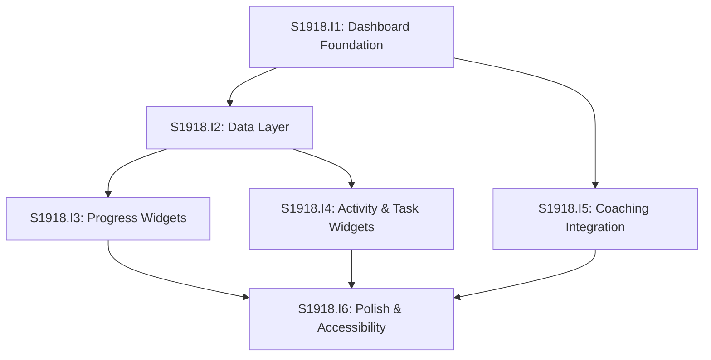

# Initiative Overview: User Dashboard

**Parent Spec**: S1918
**Created**: 2026-02-03
**Total Initiatives**: 6
**Estimated Duration**: 7-8 weeks (critical path)

---

## Directory Structure

```
.ai/alpha/specs/S1918-Spec-user-dashboard/
├── spec.md                                         # Project specification
├── README.md                                       # This file - initiatives overview
├── research-library/                               # Research artifacts from spec phase
│   ├── context7-recharts-radar.md
│   ├── perplexity-calcom-nextjs-integration-post-platform.md
│   └── perplexity-dashboard-ux.md
├── S1918.I1-Initiative-dashboard-foundation/       # Priority 1 - Page structure
│   └── initiative.md
├── S1918.I2-Initiative-data-layer/                 # Priority 2 - Types & loaders
│   └── initiative.md
├── S1918.I3-Initiative-progress-widgets/           # Priority 3 - Charts
│   └── initiative.md
├── S1918.I4-Initiative-activity-task-widgets/      # Priority 4 - Lists & tables
│   └── initiative.md
├── S1918.I5-Initiative-coaching-integration/       # Priority 5 - Cal.com API
│   └── initiative.md
└── S1918.I6-Initiative-polish-accessibility/       # Priority 6 - Final polish
    └── initiative.md
```

---

## Initiative Summary

| ID | Directory | Priority | Weeks | Dependencies | Status |
|----|-----------|----------|-------|--------------|--------|
| S1918.I1 | `S1918.I1-Initiative-dashboard-foundation/` | 1 | 2 | None | Draft |
| S1918.I2 | `S1918.I2-Initiative-data-layer/` | 2 | 2 | I1 | Draft |
| S1918.I3 | `S1918.I3-Initiative-progress-widgets/` | 3 | 2 | I1, I2 | Draft |
| S1918.I4 | `S1918.I4-Initiative-activity-task-widgets/` | 4 | 2-3 | I1, I2 | Draft |
| S1918.I5 | `S1918.I5-Initiative-coaching-integration/` | 5 | 2-3 | I1 | Draft |
| S1918.I6 | `S1918.I6-Initiative-polish-accessibility/` | 6 | 2 | I1-I5 | Draft |

---

## Dependency Graph



**ASCII Representation:**
```
          I1 (Foundation)
           /    |    \
          v     v     v
        I2    I5    (blocked)
       /  \    |
      v    v   v
    I3    I4  (waits)
      \    |   /
       v   v  v
         I6 (Polish)
```

---

## Execution Strategy

### Phase 0: Foundation (Weeks 1-2)
- **S1918.I1**: Dashboard Foundation - Page structure, grid layout, navigation

### Phase 1: Core Infrastructure (Weeks 3-4)
- **S1918.I2**: Data Layer - Types, loaders, queries (sequential after I1)
- **S1918.I5**: Coaching Integration - Cal.com API client (parallel with I2)

### Phase 2: Widget Implementation (Weeks 5-7)
- **S1918.I3**: Progress Widgets - Course radial, skills spider (parallel)
- **S1918.I4**: Activity & Task Widgets - Kanban, activity, actions, table (parallel)

### Phase 3: Polish (Week 8)
- **S1918.I6**: Polish & Accessibility - Skeletons, errors, a11y, tests

---

## Dependency Validation

### Cycle Detection
**Status**: PASS - No circular dependencies detected

### Critical Path
```
I1 (2 weeks) → I2 (2 weeks) → I3/I4 (3 weeks parallel) → I6 (2 weeks)
Total: 9 weeks sequential
```

With parallel execution:
```
I1 (2 weeks) → [I2 + I5 parallel] (2-3 weeks) → [I3 + I4 parallel] (3 weeks) → I6 (2 weeks)
Total: 7-8 weeks (critical path)
```

### Parallel Groups

| Group | Initiatives | Start After | Duration |
|-------|-------------|-------------|----------|
| 0 | I1 | Immediately | 2 weeks |
| 1 | I2, I5 | I1 complete | 2-3 weeks |
| 2 | I3, I4 | I2 complete | 2-3 weeks |
| 3 | I6 | I3, I4, I5 complete | 2 weeks |

---

## Risk Summary

| Initiative | Primary Risk | Probability | Impact | Mitigation |
|------------|--------------|-------------|--------|------------|
| I1 | None - straightforward CSS | Low | Low | Follow existing patterns |
| I2 | Activity aggregation query complexity | Medium | Medium | Limit to 10 items; test performance |
| I3 | Recharts SSR hydration | Low | Medium | Use initialDimension prop; client component |
| I4 | Activity feed data model undefined | Medium | Medium | Define format early; iterate |
| I5 | Cal.com API rate limits/changes | Medium | Medium | Cache with 5-min TTL; graceful fallback |
| I6 | Accessibility audit scope creep | Low | Low | Define acceptance criteria upfront |

---

## Duration Analysis

| Metric | Value |
|--------|-------|
| Sum of all initiatives | 12-15 weeks |
| Sequential duration | 9 weeks |
| Parallel duration (critical path) | 7-8 weeks |
| Time saved by parallelization | ~4-6 weeks (35-40%) |

---

## Key Decisions

1. **6 initiatives** (not 7) - Merged "Presentations Table" into I4 with other widgets
2. **I5 parallel with I2** - Cal.com API is independent of internal data layer
3. **I6 is final** - Polish/accessibility depends on all widget implementations
4. **No database migrations needed** - All tables already exist with proper RLS

---

## Research Artifacts

| File | Key Findings |
|------|--------------|
| `context7-recharts-radar.md` | RadarChart/RadialBarChart patterns, SSR with initialDimension |
| `perplexity-calcom-nextjs-integration-post-platform.md` | Use iframe + V2 API, skip @calcom/atoms |
| `perplexity-dashboard-ux.md` | Empty states need clear CTA; widget state handling |

---

## Next Steps

1. Run `/alpha:feature-decompose S1918.I1` for Priority 1 initiative (Dashboard Foundation)
2. Continue with I2 after I1 features are decomposed
3. I5 can be decomposed in parallel with I2
4. Update this overview as features are decomposed
