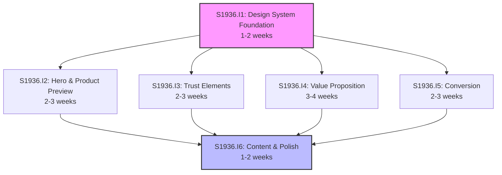

# Initiative Overview: Homepage Redesign with Design System

**Parent Spec**: S1936
**Created**: 2026-02-04
**Total Initiatives**: 6
**Estimated Duration**: 4-6 weeks (critical path)

---

## Directory Structure

```
.ai/alpha/specs/S1936-Spec-homepage-redesign/
├── spec.md                                         # Project specification
├── README.md                                       # This file - initiatives overview
├── research-library/                               # Research from spec phase
│   ├── context7-framer-motion-scroll.md           # Animation patterns
│   └── perplexity-saas-homepage-patterns.md       # SaaS design best practices
├── S1936.I1-Initiative-design-system-foundation/   # Initiative 1
│   └── initiative.md
├── S1936.I2-Initiative-hero-product-preview/       # Initiative 2
│   └── initiative.md
├── S1936.I3-Initiative-trust-elements/             # Initiative 3
│   └── initiative.md
├── S1936.I4-Initiative-value-proposition/          # Initiative 4
│   └── initiative.md
├── S1936.I5-Initiative-conversion/                 # Initiative 5
│   └── initiative.md
└── S1936.I6-Initiative-content-polish/             # Initiative 6
    └── initiative.md
```

---

## Initiative Summary

| ID | Directory | Priority | Weeks | Dependencies | Status |
|----|-----------|----------|-------|--------------|--------|
| S1936.I1 | `S1936.I1-Initiative-design-system-foundation/` | 1 | 1-2 | None | Draft |
| S1936.I2 | `S1936.I2-Initiative-hero-product-preview/` | 2 | 2-3 | S1936.I1 | Draft |
| S1936.I3 | `S1936.I3-Initiative-trust-elements/` | 3 | 2-3 | S1936.I1 | Draft |
| S1936.I4 | `S1936.I4-Initiative-value-proposition/` | 4 | 3-4 | S1936.I1 | Draft |
| S1936.I5 | `S1936.I5-Initiative-conversion/` | 5 | 2-3 | S1936.I1 | Draft |
| S1936.I6 | `S1936.I6-Initiative-content-polish/` | 6 | 1-2 | I1-I5 | Draft |

---

## Dependency Graph



**Critical Path**: I1 → I4 → I6 = 5-8 weeks (longest sequential dependency)

**Actual Duration**: 4-6 weeks (with parallel execution)

---

## Execution Strategy

### Phase 1: Foundation (Weeks 1-2)
| Initiative | Description | Weeks |
|------------|-------------|-------|
| **S1936.I1** | Design System Foundation - CSS variables, tokens, utilities | 1-2 |

- Establishes the visual foundation for all subsequent work
- Must complete before any other initiative can begin
- Outputs: Color tokens, typography scale, spacing, animation utilities, glass effects

### Phase 2: Core Sections (Weeks 2-5)
| Initiative | Description | Weeks | Can Parallel With |
|------------|-------------|-------|-------------------|
| **S1936.I2** | Hero & Product Preview - Above-the-fold experience | 2-3 | I3, I4, I5 |
| **S1936.I3** | Trust Elements - Logo cloud, stats, testimonials | 2-3 | I2, I4, I5 |
| **S1936.I4** | Value Proposition - Sticky scroll, stepper, bento grid | 3-4 | I2, I3, I5 |
| **S1936.I5** | Conversion - Comparison, pricing, final CTA | 2-3 | I2, I3, I4 |

- All four initiatives can run in parallel after I1 completes
- Team can assign 2-4 developers to maximize parallelization
- Each initiative produces independent sections that integrate at the end

### Phase 3: Integration & Polish (Weeks 5-6)
| Initiative | Description | Weeks |
|------------|-------------|-------|
| **S1936.I6** | Content & Polish - Blog section, loading states, accessibility, performance | 1-2 |

- Final integration of all sections
- Quality assurance and optimization
- Cannot begin until all Phase 2 initiatives complete

---

## Duration Analysis

| Metric | Value |
|--------|-------|
| Sequential Duration | 11-17 weeks (sum of all) |
| Parallel Duration | 4-6 weeks (critical path + parallelization) |
| Time Saved | 7-11 weeks (64% reduction) |

---

## Section Mapping

| Section | Initiative | Status |
|---------|------------|--------|
| Hero Section | S1936.I2 | Redesigned |
| Product Preview | S1936.I2 | Redesigned |
| Logo Cloud | S1936.I3 | Redesigned |
| Statistics | S1936.I3 | **NEW** |
| Sticky Scroll Features | S1936.I4 | Redesigned |
| How It Works | S1936.I4 | **NEW** |
| Features Grid | S1936.I4 | Redesigned |
| Comparison | S1936.I5 | **NEW** |
| Testimonials | S1936.I3 | Redesigned |
| Pricing | S1936.I5 | Redesigned |
| Blog/Reads | S1936.I6 | Redesigned |
| Final CTA | S1936.I5 | **NEW** |

---

## Risk Summary

| Initiative | Primary Risk | Probability | Impact | Mitigation |
|------------|--------------|-------------|--------|------------|
| I1 | Design tokens don't cover all use cases | Low | Medium | Start with comprehensive token set from design spec |
| I2 | Hero LCP exceeds 2.5s | Medium | High | Use Next.js Image with priority, optimize hero image |
| I3 | Counter animations cause layout shift | Medium | Medium | Reserve space with skeleton, use absolute positioning |
| I4 | Bento grid layout breaks on edge cases | Medium | Medium | Prototype in Storybook first, test all breakpoints |
| I5 | Pricing component integration issues | Low | Low | Use existing @kit/billing-gateway component |
| I6 | Lighthouse score < 90 | Medium | Medium | Profile continuously, lazy load below-fold components |

---

## Research Integration

| Research File | Key Insights Applied |
|---------------|---------------------|
| `context7-framer-motion-scroll.md` | useInView + useSpring for counters (I3), whileInView + stagger for lists (I3, I4), viewport options for scroll triggers |
| `perplexity-saas-homepage-patterns.md` | Hero < 3s load (I2), 3-5 stats (I3), 6-12 logos (I3), 4-6 col masonry (I3), dark gray backgrounds (I1) |

---

## Key Codebase Patterns

Discovered during exploration:

1. **Width System**: `max-w-7xl` (nav), `max-w-6xl` (content), `max-w-5xl` (hero)
2. **Spacing**: `mt-8 sm:mt-12 md:mt-16 lg:mt-24` for sections
3. **Grid**: `grid-cols-1 sm:grid-cols-2 lg:grid-cols-3` with `gap-4 sm:gap-6 lg:gap-8`
4. **Glass Effect**: `bg-background/50 backdrop-blur-md`
5. **Animation**: Import from `motion/react-client` for tree-shaking

---

## Next Steps

1. Run `/alpha:feature-decompose S1936.I1` for Design System Foundation
2. Continue with remaining initiatives in priority order
3. Update this overview as features are decomposed

---

## Quick Links

- **Spec**: [`./spec.md`](./spec.md)
- **GitHub Issue**: [#1936](https://github.com/slideheroes/2025slideheroes/issues/1936)
- **Design Reference**: [`.ai/reports/brainstorming/2026-02-04-homepage-redesign-design-system.md`](../../../reports/brainstorming/2026-02-04-homepage-redesign-design-system.md)
