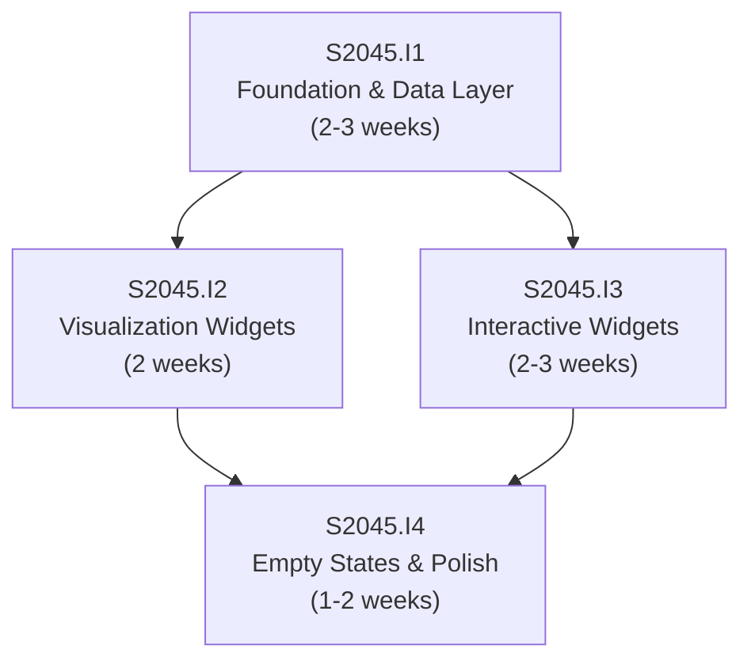

# Initiative Overview: User Dashboard

**Parent Spec**: S2045
**Created**: 2026-02-09
**Total Initiatives**: 4
**Estimated Duration**: 7-8 weeks (critical path)

---

## Directory Structure

```
.ai/alpha/specs/S2045-Spec-user-dashboard/
├── spec.md                                           # Project specification
├── README.md                                         # This file - initiatives overview
├── research-library/                                 # Phase 0 research artifacts
│   ├── context7-recharts-radial-radar-charts.md
│   ├── perplexity-calcom-nextjs-integration-post-platform.md
│   └── perplexity-dashboard-empty-states-ux.md
├── S2045.I1-Initiative-foundation-data-layer/        # Priority 1 (P0)
│   └── initiative.md
├── S2045.I2-Initiative-visualization-widgets/        # Priority 2 (P1)
│   └── initiative.md
├── S2045.I3-Initiative-interactive-widgets/          # Priority 3 (P1)
│   └── initiative.md
└── S2045.I4-Initiative-empty-states-polish/          # Priority 4 (P2)
    └── initiative.md
```

---

## Initiative Summary

| ID | Directory | Priority | Weeks | Dependencies | Status |
|----|-----------|----------|-------|--------------|--------|
| S2045.I1 | `S2045.I1-Initiative-foundation-data-layer/` | 1 | 2-3 | None | Draft |
| S2045.I2 | `S2045.I2-Initiative-visualization-widgets/` | 2 | 2 | S2045.I1 | Draft |
| S2045.I3 | `S2045.I3-Initiative-interactive-widgets/` | 3 | 2-3 | S2045.I1 | Draft |
| S2045.I4 | `S2045.I4-Initiative-empty-states-polish/` | 4 | 1-2 | S2045.I2, S2045.I3 | Draft |

---

## Dependency Graph



---

## Execution Strategy

### Phase 1: Foundation (Weeks 1-3)
- **S2045.I1**: Dashboard Foundation & Data Layer
  - Page shell with 3-3-1 responsive grid
  - `activity_events` table, triggers, RLS policies
  - Dashboard data loader with parallel fetching
  - TypeScript type generation

### Phase 2: Widget Implementation (Weeks 3-6)
- **S2045.I2**: Visualization Widgets (parallel track A)
  - Course Progress Radial Chart
  - Self-Assessment Spider Diagram
  - Kanban Summary Card
- **S2045.I3**: Interactive Widgets (parallel track B)
  - Recent Activity Feed
  - Quick Actions Panel
  - Coaching Sessions Card
  - Presentation Outlines Table

### Phase 3: Polish (Weeks 6-8)
- **S2045.I4**: Empty States & Polish
  - 7 unique empty state designs
  - Loading skeletons
  - Responsive fine-tuning
  - Dark mode + accessibility audit

---

## Risk Summary

| Initiative | Primary Risk | Probability | Impact | Mitigation |
|------------|--------------|-------------|--------|------------|
| S2045.I1 | Activity events triggers cause performance overhead on writes | Medium | Medium | Use AFTER INSERT triggers (async); monitor query latency |
| S2045.I2 | Recharts PieChart donut doesn't render well at small sizes | Low | Medium | Test at card dimensions early; fall back to simpler progress bar |
| S2045.I3 | Cal.com embed renders poorly in compact card | Low | Medium | Fallback to "Book Session" link to /home/coaching |
| S2045.I3 | Quick Actions conditional logic becomes complex with 4+ table checks | Medium | Low | Extract logic into dedicated loader function; keep UI simple |
| S2045.I4 | Spider diagram 0-value empty state is tricky with Recharts | Medium | Low | Conditional rendering: show dashed SVG overlay instead of Recharts component |

---

## Critical Path Analysis

### Critical Path
S2045.I1 → S2045.I3 → S2045.I4

### Path Duration
| Initiative | Weeks | Cumulative |
|------------|-------|------------|
| S2045.I1: Foundation & Data Layer | 3 | 3 |
| S2045.I3: Interactive Widgets | 3 | 6 |
| S2045.I4: Empty States & Polish | 2 | 8 |

### Total Duration (Critical Path)
**8 weeks** (not 10 weeks sequential sum)

### Slack Analysis
| Initiative | Earliest Start | Latest Start | Slack |
|------------|---------------|--------------|-------|
| S2045.I1 | Week 0 | Week 0 | 0 (critical) |
| S2045.I2 | Week 3 | Week 4 | 1 week |
| S2045.I3 | Week 3 | Week 3 | 0 (critical) |
| S2045.I4 | Week 6 | Week 6 | 0 (critical) |

---

## Parallel Execution Groups

### Group 0: Foundation (Weeks 1-3)
| Initiative | Weeks | Dependencies |
|------------|-------|--------------|
| S2045.I1: Foundation & Data Layer | 2-3 | None |

### Group 1: Widgets (Weeks 3-6)
| Initiative | Weeks | Dependencies |
|------------|-------|--------------|
| S2045.I2: Visualization Widgets | 2 | S2045.I1 |
| S2045.I3: Interactive Widgets | 2-3 | S2045.I1 |

### Group 2: Polish (Weeks 6-8)
| Initiative | Weeks | Dependencies |
|------------|-------|--------------|
| S2045.I4: Empty States & Polish | 1-2 | S2045.I2, S2045.I3 |

### Execution Summary
| Metric | Value |
|--------|-------|
| Sequential Duration | 10 weeks |
| Parallel Duration | 8 weeks |
| Time Saved | 2 weeks (20%) |

---

## Next Steps

1. Run `/alpha:feature-decompose S2045.I1` for Priority 1 initiative
2. Continue with S2045.I2 and S2045.I3 (can be decomposed in parallel)
3. Decompose S2045.I4 after I2 and I3 features are defined
4. Update this overview as features are decomposed
