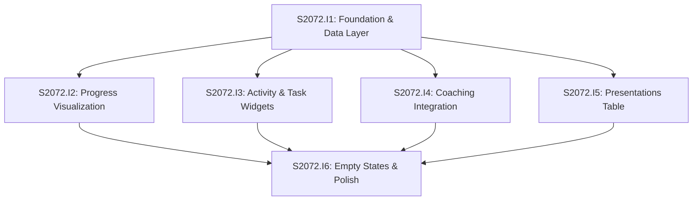

# Initiative Overview: User Dashboard

**Parent Spec**: S2072
**Created**: 2026-02-12
**Total Initiatives**: 6
**Estimated Duration**: 8-11 weeks (critical path)

---

## Directory Structure

```
.ai/alpha/specs/S2072-Spec-user-dashboard/
├── spec.md                                           # Project specification
├── README.md                                         # This file - initiatives overview
├── research-library/                                 # Research from spec phase
│   ├── context7-recharts-radial-radar.md
│   ├── perplexity-calcom-nextjs-integration-post-platform.md
│   └── perplexity-dashboard-empty-states-ux.md
├── S2072.I1-Initiative-foundation-data-layer/        # Initiative 1 (P0)
│   └── initiative.md
├── S2072.I2-Initiative-progress-visualization/       # Initiative 2 (P1)
│   └── initiative.md
├── S2072.I3-Initiative-activity-task-widgets/        # Initiative 3 (P1)
│   └── initiative.md
├── S2072.I4-Initiative-coaching-integration/         # Initiative 4 (P1)
│   └── initiative.md
├── S2072.I5-Initiative-presentations-table/          # Initiative 5 (P2)
│   └── initiative.md
└── S2072.I6-Initiative-empty-states-polish/          # Initiative 6 (P2)
    └── initiative.md
```

---

## Initiative Summary

| ID | Directory | Priority | Weeks | Dependencies | Status |
|----|-----------|----------|-------|--------------|--------|
| S2072.I1 | `S2072.I1-Initiative-foundation-data-layer/` | 1 | 2-3 | None | Draft |
| S2072.I2 | `S2072.I2-Initiative-progress-visualization/` | 2 | 2-3 | S2072.I1 | Draft |
| S2072.I3 | `S2072.I3-Initiative-activity-task-widgets/` | 2 | 2-3 | S2072.I1 | Draft |
| S2072.I4 | `S2072.I4-Initiative-coaching-integration/` | 2 | 2-3 | S2072.I1 | Draft |
| S2072.I5 | `S2072.I5-Initiative-presentations-table/` | 3 | 1-2 | S2072.I1 | Draft |
| S2072.I6 | `S2072.I6-Initiative-empty-states-polish/` | 4 | 2 | S2072.I2, S2072.I3, S2072.I4, S2072.I5 | Draft |

---

## Dependency Graph



---

## Execution Strategy

### Phase 1: Foundation (Weeks 1-3)
- **I1**: Foundation & Data Layer - Page shell, grid layout, parallel data loader
  - Establishes route at `/home`
  - Creates responsive 3-3-1 grid layout
  - Implements parallel data fetching from 6+ tables

### Phase 2: Core Widgets (Weeks 4-6) - Parallel Tracks
- **I2**: Progress Visualization - Course radial chart, Skills spider diagram
- **I3**: Activity & Task Widgets - Activity feed, Quick actions, Kanban summary
- **I4**: Coaching Integration - Cal.com V2 API, Sessions card
- **I5**: Presentations Table - Full-width table widget

All four initiatives in Phase 2 can run **in parallel** since they only depend on I1.

### Phase 3: Polish (Weeks 7-8)
- **I6**: Empty States & Polish - Loading skeletons, engaging empty states, accessibility

---

## Critical Path Analysis

### Critical Path
I1 → I2/I3/I4/I5 (parallel) → I6

### Path Duration

| Initiative | Weeks | Cumulative |
|------------|-------|------------|
| I1: Foundation | 2-3 | 2-3 |
| I2/I3/I4/I5: Widgets (max) | 2-3 | 4-6 |
| I6: Polish | 2 | 6-8 |

### Total Duration (Critical Path)
**8-11 weeks** (not 13-16 weeks sum)

### Slack Analysis

| Initiative | Earliest Start | Latest Start | Slack |
|------------|---------------|--------------|-------|
| I1 | Week 0 | Week 0 | 0 (critical) |
| I2 | Week 3 | Week 3 | 0 (critical - longest in group) |
| I3 | Week 3 | Week 3 | 0 (critical) |
| I4 | Week 3 | Week 3 | 0 (critical) |
| I5 | Week 3 | Week 4 | 1 week |
| I6 | Week 6 | Week 6 | 0 (critical) |

---

## Parallel Execution Groups

### Group 0: Foundation (Weeks 1-3)
| Initiative | Weeks | Dependencies |
|------------|-------|--------------|
| S2072.I1: Foundation & Data Layer | 2-3 | None |

### Group 1: Widgets (Weeks 4-6) - PARALLEL
| Initiative | Weeks | Dependencies |
|------------|-------|--------------|
| S2072.I2: Progress Visualization | 2-3 | S2072.I1 |
| S2072.I3: Activity & Task Widgets | 2-3 | S2072.I1 |
| S2072.I4: Coaching Integration | 2-3 | S2072.I1 |
| S2072.I5: Presentations Table | 1-2 | S2072.I1 |

### Group 2: Polish (Weeks 7-8)
| Initiative | Weeks | Dependencies |
|------------|-------|--------------|
| S2072.I6: Empty States & Polish | 2 | S2072.I2, I3, I4, I5 |

### Execution Summary

| Metric | Value |
|--------|-------|
| Sequential Duration | 13-16 weeks (sum) |
| Parallel Duration | 8-11 weeks (critical path) |
| Time Saved | 5 weeks (38%) |

---

## Risk Summary

| Initiative | Primary Risk | Probability | Impact | Mitigation |
|------------|--------------|-------------|--------|------------|
| I1 | Loader complexity with 6+ tables | Low | Medium | Reuse existing loader patterns |
| I2 | Chart rendering issues | Low | Low | Existing components work well |
| I3 | Activity aggregation query performance | Medium | Medium | Limit to 10 items, add caching |
| I4 | Cal.com API availability | Low | High | Graceful fallback to booking CTA |
| I5 | Table performance with many presentations | Low | Low | DataTable handles large datasets |
| I6 | Empty states feeling sparse | Medium | Medium | Follow UX research patterns |

---

## Key Technical Decisions

### From Spec
1. **No activity_events table** - Aggregate from existing tables (performance consideration)
2. **Cal.com iframe + V2 API** - Research confirmed atoms deprecated, embed reliable
3. **Limit activity to 10 items** - Performance, avoid pagination complexity
4. **3-3-1 grid layout** - Responsive with Tailwind breakpoints

### From Research
1. **Recharts via ChartContainer** - Existing pattern with theming support
2. **Ghost visualizations for empty charts** - Show axes/grid even with no data
3. **Single CTA per empty state** - Outperforms multiple options
4. **Positive framing** - "Start by adding" vs "You don't have"

---

## Next Steps

1. Run `/alpha:feature-decompose S2072.I1` for Priority 1 / Group 0 initiative
2. After I1 completes, decompose I2-I5 in parallel or sequentially
3. Decompose I6 after all widget initiatives complete
4. Update this overview as features are decomposed and implemented

---

## Related Files

- **Spec**: `./spec.md`
- **Research Library**: `./research-library/`
- **GitHub Issue**: #2072
- **Hierarchical ID Docs**: `.ai/alpha/docs/hierarchical-ids.md`
