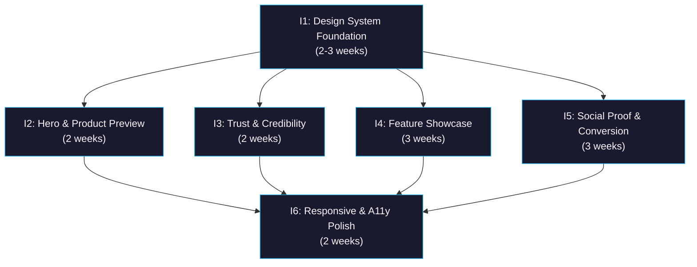

# Initiative Overview: Homepage Redesign

**Parent Spec**: S2086
**Created**: 2026-02-13
**Total Initiatives**: 6
**Estimated Duration**: 8 weeks (critical path)

---

## Directory Structure

```text
.ai/alpha/specs/S2086-Spec-homepage-redesign/
├── spec.md                                                 # Project specification
├── README.md                                               # This file - initiatives overview
├── research-library/                                       # Research artifacts
│   ├── context7-framer-motion.md                          # Framer Motion API patterns
│   └── perplexity-saas-homepage-best-practices.md         # SaaS homepage best practices
├── S2086.I1-Initiative-design-system-foundation/           # Priority 1
│   └── initiative.md
├── S2086.I2-Initiative-hero-product-preview/               # Priority 2
│   └── initiative.md
├── S2086.I3-Initiative-trust-credibility-sections/         # Priority 3
│   └── initiative.md
├── S2086.I4-Initiative-feature-showcase-sections/          # Priority 4
│   └── initiative.md
├── S2086.I5-Initiative-social-proof-conversion/            # Priority 5
│   └── initiative.md
└── S2086.I6-Initiative-responsive-accessibility-polish/    # Priority 6
    └── initiative.md
```

---

## Initiative Summary

| ID | Directory | Priority | Weeks | Dependencies | Status |
|----|-----------|----------|-------|--------------|--------|
| S2086.I1 | `S2086.I1-Initiative-design-system-foundation/` | 1 | 2-3 | None | Draft |
| S2086.I2 | `S2086.I2-Initiative-hero-product-preview/` | 2 | 2 | S2086.I1 | Draft |
| S2086.I3 | `S2086.I3-Initiative-trust-credibility-sections/` | 3 | 2 | S2086.I1 | Draft |
| S2086.I4 | `S2086.I4-Initiative-feature-showcase-sections/` | 4 | 3 | S2086.I1 | Draft |
| S2086.I5 | `S2086.I5-Initiative-social-proof-conversion/` | 5 | 3 | S2086.I1 | Draft |
| S2086.I6 | `S2086.I6-Initiative-responsive-accessibility-polish/` | 6 | 2 | I1-I5 | Draft |

---

## Dependency Graph



---

## Execution Strategy

### Phase 1: Foundation (Weeks 1-3)
- **I1: Design System Foundation** — Dark-mode CSS tokens, glass/spotlight/stat card components, MotionProvider, AnimateOnScroll wrapper, useCountUp hook, animation keyframes

### Phase 2: Section Implementation (Weeks 4-6, parallel)
- **I2: Hero & Product Preview** — Letter-by-letter text reveal, gradient orb, dual CTAs, browser-frame product preview
- **I3: Trust & Credibility** — Logo cloud marquee redesign, new animated statistics section
- **I4: Feature Showcase** — Sticky scroll redesign, new How It Works stepper, bento features grid
- **I5: Social Proof & Conversion** — Comparison section, testimonials redesign, pricing redesign, blog redesign, final CTA

### Phase 3: Polish (Weeks 7-8)
- **I6: Responsive & Accessibility** — Mobile/tablet responsive layouts, prefers-reduced-motion, WCAG AA contrast, Lighthouse performance/accessibility audits

---

## Critical Path Analysis

### Critical Path
I1 → I5 → I6

### Path Duration
| Initiative | Weeks | Cumulative |
|------------|-------|------------|
| I1: Design System Foundation | 3 | 3 |
| I5: Social Proof & Conversion | 3 | 6 |
| I6: Responsive & A11y Polish | 2 | 8 |

### Duration Analysis
| Metric | Value |
|--------|-------|
| Sequential Duration | 15 weeks (sum) |
| Parallel Duration | 8 weeks (critical path) |
| Time Saved | 7 weeks (47%) |

### Slack Analysis
| Initiative | Earliest Start | Latest Start | Slack |
|------------|---------------|--------------|-------|
| I1 | Week 0 | Week 0 | 0 (critical) |
| I2 | Week 3 | Week 4 | 1 week |
| I3 | Week 3 | Week 4 | 1 week |
| I4 | Week 3 | Week 3 | 0 |
| I5 | Week 3 | Week 3 | 0 (critical) |
| I6 | Week 6 | Week 6 | 0 (critical) |

---

## Parallel Execution Groups

### Group 0: Foundation (Weeks 1-3)
| Initiative | Weeks | Dependencies |
|------------|-------|--------------|
| I1: Design System Foundation | 2-3 | None |

### Group 1: Section Implementation (Weeks 4-6)
| Initiative | Weeks | Dependencies |
|------------|-------|--------------|
| I2: Hero & Product Preview | 2 | I1 |
| I3: Trust & Credibility | 2 | I1 |
| I4: Feature Showcase | 3 | I1 |
| I5: Social Proof & Conversion | 3 | I1 |

### Group 2: Polish (Weeks 7-8)
| Initiative | Weeks | Dependencies |
|------------|-------|--------------|
| I6: Responsive & A11y Polish | 2 | I1, I2, I3, I4, I5 |

---

## Risk Summary

| Initiative | Primary Risk | Probability | Impact | Mitigation |
|------------|--------------|-------------|--------|------------|
| I1 | Design tokens don't cover all section needs | Low | Medium | Comprehensive token set based on spec; extend during I2-I5 if needed |
| I2 | Letter-by-letter animation performance | Medium | Medium | Use variants with staggerChildren, test on low-end devices, fallback to word-by-word |
| I4 | Bento grid cursor-following glow performance with 6 cards | Medium | Medium | Throttle mouse events, use GPU-accelerated transforms, limit to hover-only |
| I5 | Pricing visual override conflicts with PricingTable component | Low | Medium | Glass card styling via CSS custom properties, avoid modifying PricingTable internals |
| I6 | Glass morphism (backdrop-filter: blur) performs poorly on mobile | Medium | High | Feature detection with fallback to solid bg, test iOS Safari and Android Chrome early |

---

## Next Steps

1. Run `/alpha:feature-decompose S2086.I1` for Priority 1 initiative (Design System Foundation)
2. Continue with remaining initiatives in priority order
3. Update this overview as features are decomposed
