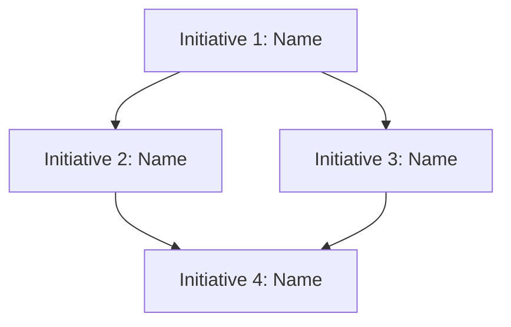

```markdown
# Initiative Overview: [Spec Name]

**Parent Spec**: S[spec-#]
**Created**: [Date]
**Total Initiatives**: [N]
**Estimated Duration**: [X-Y] weeks (critical path)

---

## Directory Structure

```
.ai/alpha/specs/S[spec-#]-Spec-[slug]/
├── spec.md                                    # Project specification
├── README.md                                  # This file - initiatives overview
├── S[spec-#].I1-Initiative-[slug]/            # Initiative 1
│   ├── initiative.md
│   └── README.md                              # (Created later) Features overview
├── S[spec-#].I2-Initiative-[slug]/            # Initiative 2
│   ├── initiative.md
│   └── ...
└── ...
```

---

## Initiative Summary

| ID | Directory | Priority | Weeks | Dependencies | Status |
|----|-----------|----------|-------|--------------|--------|
| S[spec-#].I1 | `S[spec-#].I1-Initiative-[slug]/` | 1 | [X] | None | Draft |
| S[spec-#].I2 | `S[spec-#].I2-Initiative-[slug]/` | 2 | [Y] | S[spec-#].I1 | Draft |
| S[spec-#].I3 | `S[spec-#].I3-Initiative-[slug]/` | 3 | [Z] | S[spec-#].I1 | Draft |

---

## Dependency Graph



---

## Execution Strategy

### Phase 1: Foundation (Week 1-2)
- **I1**: [Description] - Infrastructure/data layer work

### Phase 2: Core Features (Week 3-5)
- **I2, I3**: [Description] (parallel tracks)

### Phase 3: Integration (Week 6-7)
- **I4**: [Description] - Bringing it all together

---

## Risk Summary

| Initiative | Primary Risk | Probability | Impact | Mitigation |
|------------|--------------|-------------|--------|------------|
| I1 | [Risk description] | H/M/L | H/M/L | [Strategy] |
| I2 | [Risk description] | H/M/L | H/M/L | [Strategy] |

---

## Next Steps

1. Run `/alpha:feature-decompose S[spec-#].I1` for Priority 1 initiative
2. Continue with remaining initiatives in priority order
3. Update this overview as features are decomposed
```
