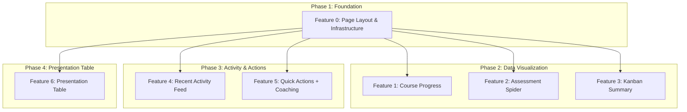

# Feature Set: User Dashboard Home

## Overview
Create a comprehensive user dashboard at `/home` with 7 key widgets organized in a 3-row layout. The dashboard provides at-a-glance visibility into course progress, self-assessment results, task status, recent activity, quick actions, coaching sessions, and presentation outlines.

## Research Manifest
[Link to manifest](../../../reports/feature-reports/2025-12-17/user-dashboard-home/manifest.md)

## Layout Structure

```
+---------------------------+---------------------------+---------------------------+
|  Course Progress Radial   |  Assessment Spider Chart  |  Kanban Summary Card      |
|  (RadialBarChart)         |  (REUSE radar-chart.tsx)  |  (task counts)            |
+---------------------------+---------------------------+---------------------------+
|  Recent Activity Feed     |  Quick Actions Panel      |  Coaching Sessions        |
|  (aggregated events)      |  (navigation buttons)     |  (REUSE calendar.tsx)     |
+---------------------------+---------------------------+---------------------------+
|  Presentation Outline Table (full width)                                          |
|  (building_blocks_submissions with outline display)                               |
+-----------------------------------------------------------------------------------+
```

## Features

### Phase 1: Foundation

#### Feature 0: Dashboard Page Layout and Data Infrastructure
- **Effort**: M
- **Dependencies**: None
- **Description**: Create the dashboard page structure with responsive grid layout, Suspense boundaries for each widget slot, skeleton loading states, and the shared data loading infrastructure. This includes the page.tsx with parallel data fetching setup and widget skeleton components.
- **Research Reference**: Page Structure Pattern, Performance Considerations (Parallel Data Fetching)
- **Key Files to Create**:
  - `apps/web/app/home/(user)/page.tsx` - Enhance existing page
  - `apps/web/app/home/(user)/_components/widgets/widget-skeleton.tsx`
  - `apps/web/app/home/(user)/_lib/server/dashboard.loader.ts`

### Phase 2: Data Visualization Widgets (Parallelizable)

#### Feature 1: Course Progress Widget
- **Effort**: M
- **Dependencies**: Feature 0
- **Description**: Create a widget displaying overall course completion using Recharts RadialBarChart. Enhance the existing RadialProgress.tsx pattern with the Recharts version for a more polished look. Fetches from `course_progress` table.
- **Research Reference**: Radial Progress Chart code example, Chart Integration Pattern
- **Key Files to Create**:
  - `apps/web/app/home/(user)/_components/widgets/course-progress-widget.tsx`
  - `apps/web/app/home/(user)/_components/widgets/course-progress-chart.tsx`

#### Feature 2: Assessment Spider Widget
- **Effort**: S
- **Dependencies**: Feature 0
- **Description**: Create a widget wrapper around the existing `radar-chart.tsx` component. Minimal new code - just a server component that fetches the user's latest `survey_responses.category_scores` and renders the existing RadarChart. Direct component reuse.
- **Research Reference**: Spider Diagram (Reuse existing), existing radar-chart.tsx pattern
- **Key Files to Create**:
  - `apps/web/app/home/(user)/_components/widgets/assessment-spider-widget.tsx`

#### Feature 3: Kanban Summary Widget
- **Effort**: M
- **Dependencies**: Feature 0
- **Description**: Create a widget showing task counts by status (To Do, In Progress, Done) with visual indicators. Aggregates from `tasks` table grouped by status. Includes click-through navigation to the full Kanban board.
- **Research Reference**: Kanban Board pattern, existing kanban-board.tsx COLUMNS constant
- **Key Files to Create**:
  - `apps/web/app/home/(user)/_components/widgets/kanban-summary-widget.tsx`

### Phase 3: Activity and Action Widgets (Parallelizable)

#### Feature 4: Recent Activity Feed Widget
- **Effort**: L
- **Dependencies**: Feature 0
- **Description**: Create a widget displaying recent user activity aggregated from multiple tables (lesson_progress, quiz_attempts, tasks, building_blocks_submissions, survey_responses). Requires a new database view or RPC function for efficient aggregation. Most complex widget due to multi-table aggregation.
- **Research Reference**: Activity Feed Data Source Options, Performance Considerations
- **Key Files to Create**:
  - `apps/web/supabase/schemas/XX-activity-feed.sql` - View or RPC
  - `apps/web/app/home/(user)/_components/widgets/recent-activity-widget.tsx`
  - `apps/web/app/home/(user)/_components/widgets/activity-item.tsx`

#### Feature 5: Quick Actions and Coaching Widget
- **Effort**: S
- **Dependencies**: Feature 0
- **Description**: Create two simple widgets - Quick Actions panel with navigation buttons to key features (Start Course, Take Assessment, View Presentations), and Coaching Sessions widget that embeds a mini version of the existing Cal.com calendar iframe.
- **Research Reference**: Existing calendar.tsx (Cal.com iframe), Gotchas (Cal.com iframe is not data-driven)
- **Key Files to Create**:
  - `apps/web/app/home/(user)/_components/widgets/quick-actions-widget.tsx`
  - `apps/web/app/home/(user)/_components/widgets/coaching-widget.tsx`

### Phase 4: Presentation Table

#### Feature 6: Presentation Outline Table Widget
- **Effort**: M
- **Dependencies**: Feature 0
- **Description**: Create a full-width table widget displaying the user's presentation outlines from `building_blocks_submissions`. Shows presentation title, creation date, status, and quick actions (view, edit, delete). Uses existing table patterns from Shadcn UI.
- **Research Reference**: Component Mapping (Presentation Table - MEDIUM complexity)
- **Key Files to Create**:
  - `apps/web/app/home/(user)/_components/widgets/presentation-table-widget.tsx`

## Dependency Graph



## Implementation Notes

### Patterns to Follow (from Research)
1. **Server Components for widgets** - Each widget is an async server component that fetches its own data
2. **Suspense boundaries** - Each widget wrapped in Suspense with skeleton fallback for independent loading
3. **Parallel data fetching** - Use `Promise.all()` in the page loader for initial data, or let Suspense handle streaming
4. **ChartContainer wrapper** - Use `@kit/ui/chart` wrappers for all Recharts integrations
5. **RLS subquery pattern** - Use `(select auth.uid())` instead of direct `auth.uid()` calls

### Component Reuse Strategy
- **Spider Diagram**: Import and use existing `RadarChart` from assessment survey
- **Coaching Sessions**: Embed existing `Calendar` component (Cal.com iframe)
- **Radial Progress**: Can use existing SVG-based `RadialProgress.tsx` OR enhance with Recharts RadialBarChart

### Gotchas to Avoid
1. **Empty states** - All widgets must handle null/empty data gracefully
2. **Chart responsiveness** - Always use ChartContainer or ResponsiveContainer with proper sizing
3. **Type safety** - Use Database types from `~/lib/database.types` for all queries
4. **Cal.com iframe** - It's an embed, not data-driven; don't try to fetch booking data

## Validation Strategy
- [ ] All features pass typecheck (`pnpm typecheck`)
- [ ] All features pass linting (`pnpm lint`)
- [ ] Unit tests for data aggregation logic (especially Activity Feed)
- [ ] Widget skeletons render correctly during loading
- [ ] Empty states display appropriately for new users
- [ ] Responsive layout works on mobile, tablet, desktop
- [ ] All widgets load independently (Suspense streaming)
- [ ] Manual review of all chart visualizations

## Effort Summary

| Feature | Effort | Rationale |
|---------|--------|-----------|
| Feature 0 | M | Page structure, grid layout, skeleton components, loader setup |
| Feature 1 | M | New RadialBarChart component, data fetching, chart config |
| Feature 2 | S | Simple wrapper around existing RadarChart component |
| Feature 3 | M | Aggregate query, summary display, navigation link |
| Feature 4 | L | Multi-table aggregation, new database view/RPC, timeline display |
| Feature 5 | S | Two simple static/iframe components |
| Feature 6 | M | Table component, CRUD display, action buttons |

**Total**: 7 features (1 Foundation, 3 Visualization, 2 Activity/Actions, 1 Table)
