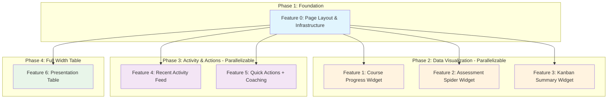

# Dependency Graph: User Dashboard Home

## Visual Representation



## Dependency Matrix

| Feature | ID | Depends On | Blocks | Can Parallelize With |
|---------|-----|-----------|--------|---------------------|
| Page Layout & Infrastructure | feature-0 | - | All others | - |
| Course Progress Widget | feature-1 | feature-0 | - | feature-2, feature-3 |
| Assessment Spider Widget | feature-2 | feature-0 | - | feature-1, feature-3 |
| Kanban Summary Widget | feature-3 | feature-0 | - | feature-1, feature-2 |
| Recent Activity Feed | feature-4 | feature-0 | - | feature-5, feature-6 |
| Quick Actions + Coaching | feature-5 | feature-0 | - | feature-4, feature-6 |
| Presentation Table | feature-6 | feature-0 | - | feature-4, feature-5 |

## Execution Order

### Sequential (Safe Path)
1. Feature 0 (Foundation)
2. Feature 1, Feature 2, Feature 3 (in any order)
3. Feature 4, Feature 5 (in any order)
4. Feature 6

### Parallel Execution (Optimal)

```
Timeline:
---------
| F0 |                           <- Must complete first
     | F1 | F2 | F3 |            <- All can run in parallel
                    | F4 | F5 | F6 |  <- All can run in parallel
```

**Maximum Parallelization**:
- After Feature 0 completes, Features 1-6 can ALL run in parallel
- No interdependencies between widgets

## Phase Breakdown

### Phase 1: Foundation (1 feature)
| Feature | Effort | Description |
|---------|--------|-------------|
| feature-0 | M | Page layout, grid, Suspense boundaries, skeleton components |

### Phase 2: Data Visualization (3 features)
| Feature | Effort | Description |
|---------|--------|-------------|
| feature-1 | M | Course Progress with RadialBarChart |
| feature-2 | S | Assessment Spider (reuse RadarChart) |
| feature-3 | M | Kanban Summary with task counts |

### Phase 3: Activity and Actions (2 features)
| Feature | Effort | Description |
|---------|--------|-------------|
| feature-4 | L | Recent Activity Feed (multi-table aggregation) |
| feature-5 | S | Quick Actions + Coaching (simple widgets) |

### Phase 4: Presentation Table (1 feature)
| Feature | Effort | Description |
|---------|--------|-------------|
| feature-6 | M | Presentation outline table with actions |

## Reuse Analysis

| Component | Reuse Type | Source Location |
|-----------|------------|-----------------|
| RadarChart | Direct Import | `assessment/survey/_components/radar-chart.tsx` |
| Calendar | Direct Import | `coaching/_components/calendar.tsx` |
| RadialProgress | Pattern Reference | `course/_components/RadialProgress.tsx` |
| ChartContainer | Import | `@kit/ui/chart` |
| Kanban COLUMNS | Pattern Reference | `kanban/_components/kanban-board.tsx` |

## Critical Path Analysis

```
Critical Path: F0 -> Any Widget -> Done
Shortest Path: F0 (M) -> F2 (S) or F5 (S) = 2 features
Longest Path: F0 (M) -> F4 (L) = 2 features (highest effort)
```

**Bottleneck**: Feature 0 is the single point dependency. All other features can be parallelized once it's complete.

**Highest Risk**: Feature 4 (Recent Activity Feed) due to multi-table aggregation complexity and potential need for database schema changes.

## Implementation Notes

1. **Feature 0 is Critical**: Must be completed before any widget work begins
2. **Maximum Parallelism**: Features 1-6 have no interdependencies
3. **Risk Mitigation**: Start Feature 4 early due to database work
4. **Quick Wins**: Features 2 and 5 are smallest effort - good for early progress
