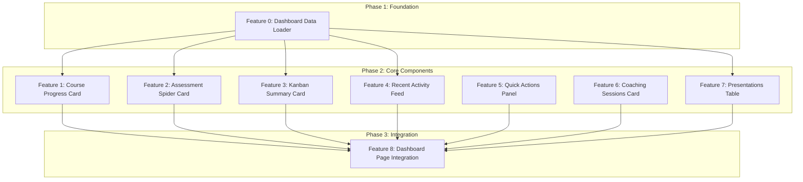

# Feature Set: User Dashboard Home

## Overview

Create a comprehensive user dashboard at `/home` featuring 7 data visualization components arranged in a 3x3 grid layout. The dashboard provides users with at-a-glance insights into their course progress, self-assessment results, kanban task status, recent activity, quick actions, coaching sessions, and presentation outlines.

## Research Manifest

[Link to manifest](../../../reports/feature-reports/2025-12-18/user-dashboard-home/manifest.md)

## Features

### Phase 1: Foundation

#### Feature 0: Dashboard Data Loader
- **Effort**: M
- **Dependencies**: None
- **Description**: Create server-side parallel data fetching infrastructure using `Promise.all()` pattern. Implement `loadDashboardData()` function that fetches course progress, survey scores, task counts, recent activity, and presentations data in parallel.
- **Research Reference**:
  - Data Loader Pattern from manifest (lines 42-55)
  - Existing pattern: `members-page.loader.ts`
- **Files to Create/Modify**:
  - `apps/web/app/home/(user)/_lib/server/dashboard.loader.ts`
- **Key Considerations**:
  - Use `import 'server-only'` directive
  - Follow existing loader pattern with error logging
  - Return typed tuple for destructuring

### Phase 2: Core Components (Parallelizable)

#### Feature 1: Course Progress Card
- **Effort**: M
- **Dependencies**: Feature 0
- **Description**: Implement RadialBarChart component displaying overall course completion percentage. Shows progress as a circular gauge from 0-100%.
- **Research Reference**:
  - RadialBarChart pattern from manifest (lines 98-116)
  - Gotcha: Use `startAngle={90} endAngle={-270}` for clockwise progress
  - Chart components must be "use client"
- **Files to Create/Modify**:
  - `apps/web/app/home/(user)/_components/dashboard/course-progress-card.tsx`
- **Data Source**: `course_progress.completion_percentage`

#### Feature 2: Assessment Spider Card
- **Effort**: S
- **Dependencies**: Feature 0
- **Description**: Adapt existing RadarChart component to display self-assessment survey category scores as a spider/radar diagram.
- **Research Reference**:
  - Existing RadarChart at `assessment/survey/_components/radar-chart.tsx` (HIGH relevance)
  - ChartContainer pattern from manifest
- **Files to Create/Modify**:
  - `apps/web/app/home/(user)/_components/dashboard/assessment-spider-card.tsx`
- **Data Source**: `survey_responses.category_scores` (JSONB)
- **Notes**: Can largely reuse existing RadarChart, just wrap in dashboard card styling

#### Feature 3: Kanban Summary Card
- **Effort**: S
- **Dependencies**: Feature 0
- **Description**: Display task counts grouped by status (todo, in-progress, done) with visual badges. Links to full kanban board.
- **Research Reference**:
  - Tasks hook pattern from `kanban/_lib/hooks/use-tasks.ts`
  - Badge styling from `dashboard-demo-charts.tsx`
- **Files to Create/Modify**:
  - `apps/web/app/home/(user)/_components/dashboard/kanban-summary-card.tsx`
- **Data Source**: `tasks` table aggregated by status

#### Feature 4: Recent Activity Feed
- **Effort**: M
- **Dependencies**: Feature 0
- **Description**: Timeline component showing recent user activities (lesson completions, quiz attempts, submissions). Display last 5-10 activities with timestamps.
- **Research Reference**:
  - Database tables: `lesson_progress`, `quiz_attempts` from manifest
  - Card composition pattern from dashboard demo
- **Files to Create/Modify**:
  - `apps/web/app/home/(user)/_components/dashboard/recent-activity-feed.tsx`
- **Data Source**: Union of `lesson_progress` and `quiz_attempts` ordered by timestamp

#### Feature 5: Quick Actions Panel
- **Effort**: S
- **Dependencies**: None
- **Description**: Contextual action buttons for common user tasks (Continue Course, Start Assessment, View Kanban, Create Presentation).
- **Research Reference**:
  - Button patterns from existing codebase
  - Static links - no data fetching required
- **Files to Create/Modify**:
  - `apps/web/app/home/(user)/_components/dashboard/quick-actions-panel.tsx`
- **Notes**: Can be implemented independently as it requires no data

#### Feature 6: Coaching Sessions Card
- **Effort**: M
- **Dependencies**: None
- **Description**: Display upcoming coaching sessions or booking button. Integrate with Cal.com embed or show booking CTA.
- **Research Reference**:
  - Existing coaching calendar at `coaching/_components/calendar.tsx`
  - External Cal.com integration
- **Files to Create/Modify**:
  - `apps/web/app/home/(user)/_components/dashboard/coaching-sessions-card.tsx`
- **Notes**: May require Cal.com API integration or simple booking link

#### Feature 7: Presentations Table
- **Effort**: M
- **Dependencies**: Feature 0
- **Description**: Full-width table displaying user's presentation outlines with title, creation date, and edit links. Supports row actions.
- **Research Reference**:
  - Table pattern from `dashboard-demo-charts.tsx` (CustomersTable)
  - shadcn/ui Table components
- **Files to Create/Modify**:
  - `apps/web/app/home/(user)/_components/dashboard/presentations-table.tsx`
- **Data Source**: `building_blocks_submissions`

### Phase 3: Integration

#### Feature 8: Dashboard Page Integration
- **Effort**: M
- **Dependencies**: Features 0-7
- **Description**: Integrate all dashboard components into the main `/home` page with responsive grid layout. Implement Suspense boundaries for streaming.
- **Research Reference**:
  - Layout Grid pattern from manifest (lines 204-220)
  - Existing page structure at `app/home/(user)/page.tsx`
- **Files to Modify**:
  - `apps/web/app/home/(user)/page.tsx`
- **Layout**:
  ```
  Row 1: [Course Progress] [Spider Diagram] [Kanban Summary]
  Row 2: [Activity Feed] [Quick Actions] [Coaching Sessions]
  Row 3: [Presentations Table - Full Width]
  ```
- **Key Considerations**:
  - Use `grid-cols-1 md:grid-cols-3` for responsive layout
  - Wrap each component in Suspense with skeleton fallback
  - Maintain existing page header

## Dependency Graph



## Implementation Notes

### Technical Decisions
- **Server Components for Data**: Fetch all data in server component, pass to client chart components
- **Parallel Fetching**: Use `Promise.all()` in loader for 60-80% faster page loads
- **Chart Library**: Use existing shadcn/ui chart components wrapping Recharts
- **No New Migrations**: All required database tables already exist

### Patterns to Follow
1. Loader pattern from `members-page.loader.ts`
2. Chart composition from `dashboard-demo-charts.tsx`
3. Radar chart reuse from `assessment/survey/_components/radar-chart.tsx`
4. Card structure: `Card > CardHeader > CardContent`

### Gotchas to Avoid
- RadialBarChart requires `startAngle={90} endAngle={-270}` for proper display
- All chart components must have `"use client"` directive
- Always wrap Recharts with `ChartContainer` for CSS variable support
- Handle empty data states in each widget

## Validation Strategy
- [ ] All features pass typecheck
- [ ] Responsive layout works on mobile, tablet, desktop
- [ ] Empty states handled gracefully (no data scenarios)
- [ ] Charts render correctly with real data
- [ ] Page load time acceptable (target < 2s)
- [ ] Suspense boundaries prevent layout shift
