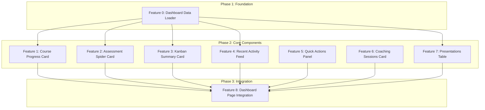

# Dependency Graph: User Dashboard Home

## Visual Representation



## Parallelization Analysis

### Phase 2 Parallel Execution Groups

The following features can be developed in parallel after Feature 0 completes:

**Group A - Data-Dependent Components (require F0)**
- Feature 1: Course Progress Card
- Feature 2: Assessment Spider Card
- Feature 3: Kanban Summary Card
- Feature 4: Recent Activity Feed
- Feature 7: Presentations Table

**Group B - Independent Components (no data dependency)**
- Feature 5: Quick Actions Panel
- Feature 6: Coaching Sessions Card

Group B can start immediately alongside Phase 1, providing maximum parallelization.

## Dependency Matrix

| Feature | ID | Depends On | Blocks | Effort | Parallel Group |
|---------|-----|-----------|--------|--------|----------------|
| Dashboard Data Loader | F0 | - | F1, F2, F3, F4, F7 | M | - |
| Course Progress Card | F1 | F0 | F8 | M | A |
| Assessment Spider Card | F2 | F0 | F8 | S | A |
| Kanban Summary Card | F3 | F0 | F8 | S | A |
| Recent Activity Feed | F4 | F0 | F8 | M | A |
| Quick Actions Panel | F5 | - | F8 | S | B |
| Coaching Sessions Card | F6 | - | F8 | M | B |
| Presentations Table | F7 | F0 | F8 | M | A |
| Dashboard Page Integration | F8 | F1-F7 | - | M | - |

## Execution Order

### Sequential Path (Minimum Time)
1. **Sprint 1**: Feature 0 (Foundation) + Features 5, 6 (Independent)
2. **Sprint 2**: Features 1, 2, 3, 4, 7 (All parallel after F0)
3. **Sprint 3**: Feature 8 (Integration)

### Recommended Developer Assignment

**Developer 1 (Foundation + Charts)**:
1. Feature 0: Dashboard Data Loader
2. Feature 1: Course Progress Card (RadialBarChart)
3. Feature 2: Assessment Spider Card (RadarChart reuse)

**Developer 2 (Cards + Static)**:
1. Feature 5: Quick Actions Panel (can start immediately)
2. Feature 3: Kanban Summary Card
3. Feature 6: Coaching Sessions Card

**Developer 3 (Lists + Tables)**:
1. Feature 4: Recent Activity Feed
2. Feature 7: Presentations Table
3. Feature 8: Dashboard Page Integration (final assembly)

## Critical Path

The critical path for this initiative is:

```
F0 (M) -> F1/F2/F3/F4/F7 (longest: M) -> F8 (M)
```

**Estimated Timeline**:
- Phase 1: 1 day
- Phase 2: 2 days (parallel execution)
- Phase 3: 1 day
- **Total**: 4 days with full parallelization

## Risk Analysis

| Risk | Impact | Mitigation |
|------|--------|------------|
| Data loader delays all Phase 2 | High | Prioritize F0, start F5/F6 immediately |
| RadialBarChart angle issues | Medium | Follow manifest guidance exactly |
| Integration conflicts | Medium | Define clear component interfaces early |
| Empty state edge cases | Low | Add fallback UI in each component |

## File Dependencies

```
dashboard.loader.ts (F0)
    |
    +-- course-progress-card.tsx (F1)
    +-- assessment-spider-card.tsx (F2)
    +-- kanban-summary-card.tsx (F3)
    +-- recent-activity-feed.tsx (F4)
    +-- presentations-table.tsx (F7)

(Independent)
    +-- quick-actions-panel.tsx (F5)
    +-- coaching-sessions-card.tsx (F6)

page.tsx (F8)
    +-- imports all above components
```
