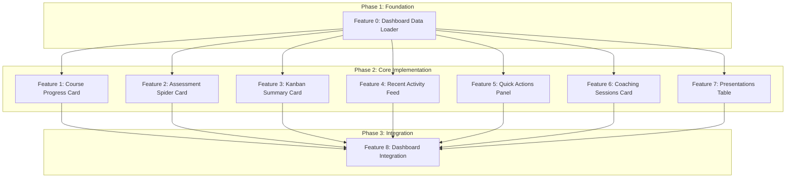

# Feature Set: User Dashboard Home

## Overview

Create a comprehensive user dashboard at `/home` featuring 7 interactive widgets: Course Progress radial chart, Assessment Spider diagram, Kanban Summary card, Recent Activity Feed, Quick Actions panel, Coaching Sessions card, and Presentations table. The dashboard uses parallel data fetching with Suspense boundaries for optimal performance.

## Research Manifest

[Link to manifest](../../../reports/feature-reports/2025-12-18/user-dashboard-home/manifest.md)

## Features

### Phase 1: Foundation

#### Feature 0: Dashboard Data Loader

- **Effort**: M
- **Dependencies**: None
- **Description**: Create a server-side data loader using `Promise.all` for parallel fetching of all dashboard data sources (course progress, survey scores, task counts, recent activity, presentations, coaching sessions). Follows the existing loader pattern from `apps/web/app/home/(user)/_lib/server/`.
- **Research Reference**: Manifest sections on "Dashboard Loader Pattern", "Performance Considerations", existing `loadProjectsPageData` pattern

**Key Implementation Points**:

- Create `dashboard.loader.ts` in `apps/web/app/home/(user)/_lib/server/`
- Parallel fetch: `courseProgress`, `surveyScores`, `taskCounts`, `recentActivity`, `presentations`, `coachingSessions`
- Return typed dashboard data object
- Use aggregates (COUNT) for task summary instead of fetching all records

### Phase 2: Core Implementation

#### Feature 1: Course Progress Card

- **Effort**: S
- **Dependencies**: feature-0 (Dashboard Data Loader)
- **Description**: Client component displaying course completion percentage using the existing `RadialProgress` component from `apps/web/app/home/(user)/course/_components/RadialProgress.tsx`. Shows completed lessons count and total lessons.
- **Research Reference**: Existing `RadialProgress` component, "Radial Chart Card Pattern" from manifest

**Key Implementation Points**:

- Create `course-progress-card.tsx` in `_components/`
- Reuse existing `RadialProgress` component
- Props: `percentage`, `completedLessons`, `totalLessons`
- Wrap in shadcn `Card` with header

#### Feature 2: Assessment Spider Card

- **Effort**: M
- **Dependencies**: feature-0 (Dashboard Data Loader)
- **Description**: Client component displaying skills assessment radar chart using Recharts `RadarChart`. Reuses the existing pattern from `apps/web/app/home/(user)/assessment/survey/_components/radar-chart.tsx` with shadcn `ChartContainer`.
- **Research Reference**: Existing `RadarChart` component, "Spider Diagram Card" from manifest, Context7 Recharts patterns

**Key Implementation Points**:

- Create `assessment-spider-card.tsx` in `_components/`
- Use shadcn `ChartContainer` with `ChartConfig`
- Props: `categoryScores: Record<string, number>`
- Handle empty state when no survey completed

#### Feature 3: Kanban Summary Card

- **Effort**: S
- **Dependencies**: feature-0 (Dashboard Data Loader)
- **Description**: Server component displaying task counts by status (To Do, In Progress, Done) with visual indicators. Links to full Kanban board. Uses existing task schema types.
- **Research Reference**: Existing `useTasks` pattern, task schema from `apps/web/app/home/(user)/kanban/_lib/schema/task.schema.ts`

**Key Implementation Points**:

- Create `kanban-summary-card.tsx` in `_components/`
- Display counts for `do`, `doing`, `done` statuses
- Use colored badges for status indicators
- Link to `/home/kanban` for full view

#### Feature 4: Recent Activity Feed

- **Effort**: M
- **Dependencies**: feature-0 (Dashboard Data Loader)
- **Description**: Server component with optional client-side "Load More" button displaying recent user activities (lesson completions, quiz scores, task updates, presentation saves). May require activity aggregation query or new activity tracking.
- **Research Reference**: Manifest warning about "Activity feed source - May need new database table"

**Key Implementation Points**:

- Create `activity-feed.tsx` in `_components/`
- Aggregate activities from multiple tables initially
- Avatar + description + timestamp format
- "Load More" pagination (not infinite scroll per manifest)
- Handle empty state gracefully

#### Feature 5: Quick Actions Panel

- **Effort**: S
- **Dependencies**: feature-0 (Dashboard Data Loader)
- **Description**: Server component with CTA buttons linking to key user routes: Start/Continue Course, Create Presentation, View Kanban, Book Coaching. Context-aware based on user progress.
- **Research Reference**: Manifest "Quick Actions Panel" section, existing navigation patterns

**Key Implementation Points**:

- Create `quick-actions-panel.tsx` in `_components/`
- Primary actions: Course, AI Workspace, Kanban, Coaching
- Context-aware labels (e.g., "Continue Course" vs "Start Course")
- Use shadcn `Button` components with icons

#### Feature 6: Coaching Sessions Card

- **Effort**: S
- **Dependencies**: feature-0 (Dashboard Data Loader)
- **Description**: Component showing next scheduled coaching session or CTA to book a session. May integrate with Cal.com API for session data or use static link to coaching page.
- **Research Reference**: Existing `calendar.tsx` Cal.com integration, manifest note on coaching integration decision

**Key Implementation Points**:

- Create `coaching-sessions-card.tsx` in `_components/`
- Show next session date/time if available
- "Book Session" CTA linking to `/home/coaching`
- Handle no upcoming sessions state

#### Feature 7: Presentations Table

- **Effort**: M
- **Dependencies**: feature-0 (Dashboard Data Loader)
- **Description**: Server component with shadcn `Table` displaying user's saved presentations from `building_blocks_submissions`. Shows title, type, audience, last modified date with actions to view/edit.
- **Research Reference**: Manifest "Presentations Table" section, `building_blocks_submissions` table structure

**Key Implementation Points**:

- Create `presentations-table.tsx` in `_components/`
- Use shadcn `Table` components
- Columns: Title, Type, Audience, Last Modified, Actions
- Link to storyboard/canvas for editing
- Handle empty state with "Create First Presentation" CTA

### Phase 3: Integration

#### Feature 8: Dashboard Integration

- **Effort**: M
- **Dependencies**: feature-0, feature-1, feature-2, feature-3, feature-4, feature-5, feature-6, feature-7
- **Description**: Update `apps/web/app/home/(user)/page.tsx` to integrate all dashboard components with Suspense boundaries, responsive grid layout, and proper loading states. Create `DashboardGrid` layout component.
- **Research Reference**: Manifest "Implementation Order", "Suspense Boundaries", RSC patterns

**Key Implementation Points**:

- Update `page.tsx` to call `loadDashboardData`
- Create `dashboard-grid.tsx` for responsive layout
- Wrap each card in Suspense with skeleton loaders
- Fixed-height skeletons to prevent layout shift
- Mobile-first responsive grid (1 col -> 2 col -> 3 col)

## Dependency Graph

## Implementation Notes

### Technical Decisions

- **Server-first approach**: Use RSC for all non-chart components
- **Parallel fetching**: Single `Promise.all` call in loader for optimal performance
- **Component reuse**: Leverage existing `RadialProgress` and `RadarChart` components
- **Suspense boundaries**: Independent loading for each widget

### Patterns to Follow from Research

1. **Loader Pattern**: Follow `loadProjectsPageData` from team account
2. **Chart Wrapping**: Client components for Recharts, data from server parent
3. **Card Layout**: shadcn `Card` with `CardHeader`, `CardTitle`, `CardContent`
4. **Table Pattern**: shadcn Table components with responsive design

### Gotchas to Avoid

- **HIGH**: Recharts components must be in 'use client' files
- **HIGH**: Use aggregates (COUNT) not full record fetches for summaries
- **MEDIUM**: Fixed-height skeleton loaders to prevent CLS
- **MEDIUM**: Handle empty states for all widgets
- **LOW**: Use consistent date formatting with date-fns or i18n

## Validation Strategy

- [ ] All features pass typecheck (`pnpm typecheck`)
- [ ] Unit tests for data loader functions
- [ ] Unit tests for chart components with mock data
- [ ] E2E test for dashboard page load and widget rendering
- [ ] Manual review of responsive layout at all breakpoints
- [ ] Empty state testing for each widget
- [ ] Performance check: dashboard loads within 2 seconds

## Estimated Timeline

| Phase | Features | Effort | Notes |
|-------|----------|--------|-------|
| Phase 1 | 1 feature | M | Foundation - must complete first |
| Phase 2 | 7 features | 3S + 4M | Can parallelize all 7 features |
| Phase 3 | 1 feature | M | Requires all Phase 2 complete |

**Total**: 9 features (5 Small, 4 Medium)
