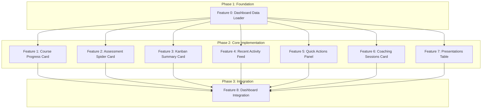

# Dependency Graph: User Dashboard Home

## Visual Representation



## Execution Phases

### Phase 1: Foundation (Sequential)

```
[Feature 0: Dashboard Data Loader]
         |
         v
   Phase 2 unlocked
```

The data loader is the critical path - no component work can begin until it provides the data interface.

### Phase 2: Core Implementation (Parallel)

```
Feature 0 Complete
         |
         +---> [Feature 1: Course Progress Card]    ---|
         +---> [Feature 2: Assessment Spider Card]  ---|
         +---> [Feature 3: Kanban Summary Card]     ---|---> Phase 3
         +---> [Feature 4: Recent Activity Feed]    ---|
         +---> [Feature 5: Quick Actions Panel]     ---|
         +---> [Feature 6: Coaching Sessions Card]  ---|
         +---> [Feature 7: Presentations Table]     ---|
```

All 7 components can be developed in parallel once the data loader is complete.

### Phase 3: Integration (Sequential)

```
All Phase 2 Features Complete
              |
              v
[Feature 8: Dashboard Integration]
              |
              v
        Initiative Complete
```

## Dependency Matrix

| Feature | ID | Depends On | Blocks | Phase |
|---------|-----|-----------|--------|-------|
| Dashboard Data Loader | feature-0 | - | feature-1, feature-2, feature-3, feature-4, feature-5, feature-6, feature-7 | 1 |
| Course Progress Card | feature-1 | feature-0 | feature-8 | 2 |
| Assessment Spider Card | feature-2 | feature-0 | feature-8 | 2 |
| Kanban Summary Card | feature-3 | feature-0 | feature-8 | 2 |
| Recent Activity Feed | feature-4 | feature-0 | feature-8 | 2 |
| Quick Actions Panel | feature-5 | feature-0 | feature-8 | 2 |
| Coaching Sessions Card | feature-6 | feature-0 | feature-8 | 2 |
| Presentations Table | feature-7 | feature-0 | feature-8 | 2 |
| Dashboard Integration | feature-8 | feature-1, feature-2, feature-3, feature-4, feature-5, feature-6, feature-7 | - | 3 |

## Execution Order Options

### Option A: Maximum Parallelism (Recommended)

1. **Wave 1**: Feature 0 (1 developer)
2. **Wave 2**: Features 1-7 (up to 7 developers in parallel)
3. **Wave 3**: Feature 8 (1 developer)

**Timeline**: 3 waves, significant time savings with parallel Wave 2

### Option B: Sequential Execution

1. Feature 0 (Data Loader)
2. Feature 1 (Course Progress)
3. Feature 2 (Assessment Spider)
4. Feature 3 (Kanban Summary)
5. Feature 4 (Recent Activity)
6. Feature 5 (Quick Actions)
7. Feature 6 (Coaching Sessions)
8. Feature 7 (Presentations Table)
9. Feature 8 (Dashboard Integration)

**Timeline**: 9 sequential steps

### Option C: Grouped by Complexity

**Wave 1 - Foundation**:

- Feature 0: Dashboard Data Loader (M)

**Wave 2 - Simple Components** (parallel):

- Feature 1: Course Progress Card (S)
- Feature 3: Kanban Summary Card (S)
- Feature 5: Quick Actions Panel (S)
- Feature 6: Coaching Sessions Card (S)

**Wave 3 - Complex Components** (parallel):

- Feature 2: Assessment Spider Card (M)
- Feature 4: Recent Activity Feed (M)
- Feature 7: Presentations Table (M)

**Wave 4 - Integration**:

- Feature 8: Dashboard Integration (M)

## Critical Path Analysis

The critical path through the dependency graph:

```
Feature 0 -> Feature 2 (or any Phase 2) -> Feature 8
```

**Critical path length**: 3 features

**Bottleneck**: Feature 0 (Data Loader) - all other work is blocked until this completes.

## Risk Assessment

| Feature | Risk Level | Mitigation |
|---------|-----------|------------|
| Feature 0 | HIGH | Define data interfaces early, mock data for parallel dev |
| Feature 4 | MEDIUM | Activity data source unclear - may need schema work |
| Feature 6 | LOW | Cal.com integration scope TBD - start with static link |
| Feature 8 | LOW | Straightforward composition once components exist |

## Parallelization Opportunities

### Maximum Parallel Slots: 7

During Phase 2, up to 7 features can be worked on simultaneously.

### Recommended Team Distribution

| Developer | Features | Rationale |
|-----------|----------|-----------|
| Dev 1 | feature-0, feature-8 | Foundation and integration (critical path) |
| Dev 2 | feature-1, feature-2 | Chart components (related skills) |
| Dev 3 | feature-3, feature-5 | Simple server components |
| Dev 4 | feature-4, feature-7 | Data-heavy components (tables/feeds) |
| Dev 5 | feature-6 | Coaching integration |

## Integration Points

### Data Loader Interface (feature-0)

All Phase 2 components depend on this interface:

```typescript
interface DashboardData {
  courseProgress: {
    percentage: number;
    completedLessons: number;
    totalLessons: number;
  };
  surveyScores: Record<string, number> | null;
  taskCounts: {
    do: number;
    doing: number;
    done: number;
  };
  recentActivity: ActivityItem[];
  presentations: Presentation[];
  upcomingSession: CoachingSession | null;
}
```

### Component Props (Phase 2 -> Phase 3)

Each Phase 2 component exports props interface that Phase 3 integration uses:

- `CourseProgressCardProps`
- `AssessmentSpiderCardProps`
- `KanbanSummaryCardProps`
- `RecentActivityFeedProps`
- `QuickActionsPanelProps`
- `CoachingSessionsCardProps`
- `PresentationsTableProps`
