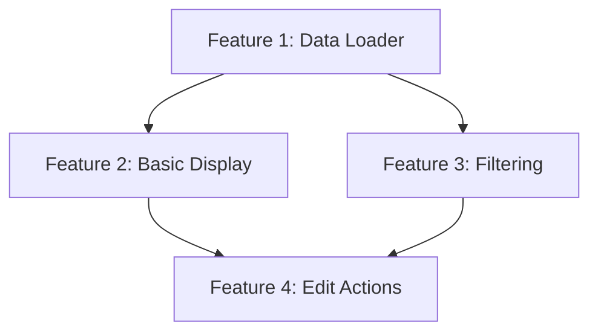

# Alpha: Feature Decomposition

Decompose the provided initiative into a set of features (vertical slices). These features will be decomposed further into atomic tasks in the subsequent Alpha workflow step.

## Context

The Alpha autonomous coding process:
1. **Spec** - Capture project specification
2. **Initiatives** - Break spec into major initiatives (2-8 weeks each)
3. **Features** (this command) - Decompose each initiative into vertical slices (3-10 days each)
4. **Tasks** - Break features into atomic implementable tasks (2-8 hours each)
5. **Implement** - Execute each task in a sandboxed environment

## Decomposition Philosophy

### What is a Feature?

A feature is a **vertical slice** that:
- Delivers user-visible or developer-testable value
- Spans all layers (UI → logic → data) end-to-end
- Can be deployed independently
- Fits within 3-10 days of development work
- Has clear acceptance criteria

### Vertical Slicing Principle

Features are **vertical** (not horizontal):

```
❌ Horizontal (Anti-pattern)        ✅ Vertical (Correct)
┌─────────────────────────┐        ┌─────┐ ┌─────┐ ┌─────┐
│      UI Layer           │        │ UI  │ │ UI  │ │ UI  │
├─────────────────────────┤        ├─────┤ ├─────┤ ├─────┤
│    Business Logic       │        │Logic│ │Logic│ │Logic│
├─────────────────────────┤        ├─────┤ ├─────┤ ├─────┤
│     Data Layer          │        │Data │ │Data │ │Data │
└─────────────────────────┘        └─────┘ └─────┘ └─────┘
  (Can't demo until all done)      (Each slice is demoable)
```

### INVEST-V Criteria

Every feature MUST satisfy all 7 criteria:

| Criterion | Question | Validation |
|-----------|----------|------------|
| **I**ndependent | Can it be deployed without other features? | No hard blockers |
| **N**egotiable | Is implementation approach flexible? | Not prescriptive |
| **V**aluable | Does a user/developer notice when it ships? | Clear benefit |
| **E**stimable | Can we confidently say 3-10 days? | No major unknowns |
| **S**mall | Does it touch fewer than 15 files? | Bounded scope |
| **T**estable | Can we write an E2E test proving it works? | Clear acceptance |
| **V**ertical | Does it span UI → logic → data? | End-to-end slice |

### Feature Extraction Heuristics

1. **One feature per user interaction** - Each distinct user action is a feature
2. **CRUD as separate features** - Create, Read, Update, Delete are typically separate
3. **Happy path before edge cases** - Core flow first, error handling second
4. **Simple before complex** - Basic version, then enhancements
5. **Target 3-7 features per initiative** - Fewer = initiative too small; more = too complex

## Instructions

You are a **Feature Architect** breaking an initiative into well-bounded vertical slices.

### Step 1: Read the Initiative

If the GitHub issue number was provided as [initiative-#], fetch the issue:

```bash
gh issue view <initiative-#> --repo MLorneSmith/2025slideheroes
```

If no issue number provided, ask the user:
```
AskUserQuestion: "What is the GitHub issue number for the initiative you want to decompose?"
```

Also read the local initiative file if it exists:
```bash
# Find the parent spec number from the initiative issue
SPEC_NUM=$(gh issue view <initiative-#> --json labels --jq '.labels[] | select(.name | startswith("parent:")) | .name | split(":")[1]')

# Find the spec directory
SPEC_DIR=$(ls -d .ai/alpha/specs/${SPEC_NUM}-* 2>/dev/null | head -1)

# Find the initiative directory within the spec
INIT_DIR=$(ls -d ${SPEC_DIR}/<initiative-#>-* 2>/dev/null | head -1)

# Read the initiative file
cat ${INIT_DIR}/initiative.md
```

### Step 2: Extract Feature Candidates

From the initiative, identify:

1. **Feature Hints** - Author-suggested features from initiative document
2. **Scope Items** - Each "In Scope" checkbox may be a feature
3. **User Interactions** - Distinct actions users will perform
4. **Data Operations** - CRUD operations on each entity

Create a working list of candidate features.

### Step 3: Explore the Codebase

Use the Task tool with `subagent_type=code-explorer` to understand implementation patterns:

1. **Similar features**: How are comparable features structured?
2. **Component patterns**: Existing UI components to reuse
3. **Data patterns**: Loaders, server actions, database queries
4. **File organization**: Where should new files go?

Launch explorers in parallel:
```
Task tool with subagent_type=code-explorer
prompt: "Explore how <similar-feature> is implemented in this codebase.
        Find: page structure, components, loaders, server actions, and tests."
```

### Step 4: Apply Vertical Slice Validation

For each candidate feature, verify it's a true vertical slice:

```
VERTICAL SLICE CHECKLIST:
┌────────────────────────────────────────────────────────────────┐
│ Layer          │ Component                    │ Present?       │
├────────────────────────────────────────────────────────────────┤
│ UI             │ Page/Component renders       │ [ ] Yes / N/A  │
│ Interaction    │ User can trigger action      │ [ ] Yes / N/A  │
│ Business Logic │ Validation/transformation    │ [ ] Yes / N/A  │
│ Data Access    │ Database read/write          │ [ ] Yes / N/A  │
│ Persistence    │ State is saved/retrieved     │ [ ] Yes / N/A  │
└────────────────────────────────────────────────────────────────┘

IF all applicable layers present → Valid vertical slice
IF missing layers → Either add them OR reconsider as a task (not feature)
```

### Step 5: Apply INVEST-V Decision Tree

For each candidate feature:

```
1. Is it INDEPENDENT (can deploy alone)?
   NO  → Identify dependency, consider merging with blocker
   YES → Continue

2. Is it VALUABLE (user/dev notices)?
   NO  → It's infrastructure/task, not a feature → Demote
   YES → Continue

3. Is it ESTIMABLE (confident 3-10 days)?
   UNSURE → Add spike task first
   < 3 days → Demote to task level
   > 10 days → Apply splitting pattern (Step 6)
   3-10 days → Valid feature size

4. Is it SMALL (< 15 files touched)?
   NO  → Apply splitting pattern (Step 6)
   YES → Continue

5. Is it TESTABLE (clear acceptance criteria)?
   NO  → Define acceptance criteria before proceeding
   YES → Continue

6. Is it VERTICAL (spans layers end-to-end)?
   NO  → Expand scope to include all layers OR merge with related feature
   YES → Ready for task decomposition
```

### Step 6: Apply Splitting Patterns (if needed)

When a feature is too large (>10 days or >15 files), split using:

| Pattern | When to Use | Example |
|---------|-------------|---------|
| **Workflow Steps** | Sequential user actions | "View list" → "View detail" → "Edit item" |
| **CRUD Operations** | Multiple data operations | "Create task" vs "Update task" vs "Delete task" |
| **Data Variations** | Different data types | "Load courses" vs "Load assessments" |
| **Happy/Edge** | Core vs error handling | "Display data" vs "Handle empty state" |
| **Simple/Complex** | Basic vs advanced | "Basic table" vs "Sortable/filterable table" |
| **User Roles** | Permission-based | "Viewer features" vs "Editor features" |

### Step 7: Determine Feature Order

Apply priority rules:

1. **Data loaders before UI** - Can't render without data
2. **Core before enhancement** - Basic functionality first
3. **High-value early** - Most impactful features first
4. **Parallel where possible** - Independent features can run together

Create a dependency map:
```
Feature A (Data Loader)
    ↓ blocks
Feature B (Basic Display) ──┬── parallel ──┬── Feature C (Filtering)
                            │              │
                            └──────────────┘
    ↓ blocks
Feature D (Edit Actions)
```

### Step 8: Define Acceptance Criteria

For each feature, write specific acceptance criteria:

```markdown
## Acceptance Criteria

### Given/When/Then Format
- **Given** [precondition]
- **When** [action]
- **Then** [expected result]

### Checklist Format
- [ ] User can [action 1]
- [ ] System displays [output]
- [ ] Data is persisted to [table]
- [ ] Error state shows [message] when [condition]
```

### Step 9: Create Feature Documents

For each feature, create a subdirectory inside the initiative directory:

```bash
# Create feature subdirectory (initially with pending- prefix)
mkdir -p ${INIT_DIR}/pending-<feature-slug>
```

Use this structure for each feature file (`feature.md`):

```markdown
# Feature: [Feature Name]

## Metadata
| Field | Value |
|-------|-------|
| **Parent Initiative** | #<initiative-#> |
| **Feature ID** | <initiative-#>-F<number> |
| **Status** | Draft |
| **Estimated Days** | X-Y |
| **Priority** | 1-N |

## Description
[2-3 sentences describing what this feature delivers to users]

## User Story
**As a** [persona]
**I want to** [action]
**So that** [benefit]

## Acceptance Criteria

### Must Have
- [ ] [Criterion 1 - testable condition]
- [ ] [Criterion 2 - testable condition]
- [ ] [Criterion 3 - testable condition]

### Nice to Have
- [ ] [Enhancement 1]

## Vertical Slice Components

| Layer | Component | Status |
|-------|-----------|--------|
| **UI** | [Component name] | New / Existing / N/A |
| **Logic** | [Function/hook name] | New / Existing / N/A |
| **Data** | [Loader/action name] | New / Existing / N/A |
| **Database** | [Table/RPC name] | New / Existing / N/A |

## Dependencies

### Blocks
- None / [Feature IDs this blocks]

### Blocked By
- None / [Feature IDs that must complete first]

### Parallel With
- [Feature IDs that can run simultaneously]

## Files to Create/Modify

### New Files
- `path/to/new/file.tsx` - [Purpose]

### Modified Files
- `path/to/existing/file.tsx` - [Changes needed]

## Task Hints
> Guidance for the next decomposition phase

### Candidate Tasks
1. **[Task Name]**: [Brief description, single verb]
2. **[Task Name]**: [Brief description, single verb]

### Suggested Order
[Priority sequence based on dependencies]

## Validation Commands
```bash
# How to verify this feature works
pnpm test:e2e --grep "feature-name"
```

## Related Files
- Initiative: `../initiative.md`
- Tasks: `./<task-#>-<slug>.md` (created in next phase)
```

### Step 10: Create Feature Overview

Create a master overview file in the initiative directory:

```bash
# File: ${INIT_DIR}/README.md
```

Structure:
```markdown
# Feature Overview: [Initiative Name]

**Parent Initiative**: #<initiative-#>
**Parent Spec**: #<spec-#>
**Created**: [Date]
**Total Features**: N
**Estimated Duration**: X-Y days

## Directory Structure

```
<initiative-#>-<slug>/
├── initiative.md                     # Initiative document
├── README.md                         # This file - features overview
├── <feat-#>-<slug>/                  # Feature 1
│   ├── feature.md
│   ├── README.md                     # (Created later) Tasks overview
│   └── <task-#>-<slug>.md            # Task files
└── <feat-#>-<slug>/                  # Feature 2
    └── ...
```

## Feature Summary

| ID | Directory | Priority | Days | Dependencies | Status |
|----|-----------|----------|------|--------------|--------|
| <feat-#> | `<feat-#>-<slug>/` | 1 | X | None | Draft |
| <feat-#> | `<feat-#>-<slug>/` | 2 | Y | F1 | Draft |

## Dependency Graph



## Execution Strategy

### Phase 1: Foundation (Days 1-2)
- F1: [Description]

### Phase 2: Core UI (Days 3-5)
- F2, F3: [Description] (parallel)

### Phase 3: Interactions (Days 6-8)
- F4: [Description]

## INVEST-V Validation Summary

| Feature | I | N | V | E | S | T | V |
|---------|---|---|---|---|---|---|---|
| F1 | ✓ | ✓ | ✓ | ✓ | ✓ | ✓ | ✓ |
| F2 | ✓ | ✓ | ✓ | ✓ | ✓ | ✓ | ✓ |

## Risk Summary

| Feature | Primary Risk | Mitigation |
|---------|--------------|------------|
| F1 | [Risk] | [Strategy] |
```

### Step 11: Create GitHub Issues

For each feature, create a GitHub issue:

```bash
gh issue create \
  --repo MLorneSmith/2025slideheroes \
  --title "Feature: [Feature Name]" \
  --body "$(cat ${INIT_DIR}/pending-<feature-slug>/feature.md)" \
  --label "type:feature" \
  --label "status:draft" \
  --label "alpha:feature" \
  --label "parent:<initiative-#>"
```

Rename the feature directory with the issue number:
```bash
mv ${INIT_DIR}/pending-<feature-slug> ${INIT_DIR}/<feat-#>-<feature-slug>
```

### Step 12: Update Initiative Issue

Link features back to the parent initiative:

```bash
gh issue comment <initiative-#> --repo MLorneSmith/2025slideheroes --body "## Features Created

This initiative has been decomposed into the following features:

| Feature | Issue | Priority | Est. Days | INVEST-V |
|---------|-------|----------|-----------|----------|
| [Name 1] | #XXX | 1 | X | ✓✓✓✓✓✓✓ |
| [Name 2] | #YYY | 2 | Y | ✓✓✓✓✓✓✓ |

**Dependency Graph**:
\`\`\`
F1 (Data Loader) → F2 (Display) → F4 (Actions)
                 → F3 (Filter)  ↗
\`\`\`

**Next Step**: Run \`/alpha:task-decompose <feature-#>\` for each feature."
```

## Pre-Completion Checklist

Before finalizing, verify:

- [ ] Each feature passes all 7 INVEST-V criteria
- [ ] Each feature is a true vertical slice (spans all applicable layers)
- [ ] No feature exceeds 10 days estimated effort
- [ ] No feature touches more than 15 files
- [ ] Acceptance criteria are specific and testable
- [ ] Dependencies are explicitly documented
- [ ] Priority order accounts for dependencies
- [ ] GitHub issues created and linked to parent initiative
- [ ] Feature directories created inside initiative directory
- [ ] README.md created in initiative directory with features overview

## Validation Commands

```bash
# Verify feature directories exist
ls -la ${INIT_DIR}/

# Count features (should be 3-7)
find ${INIT_DIR} -maxdepth 1 -type d -name "[0-9]*" | wc -l

# Verify each feature has feature.md
find ${INIT_DIR} -name "feature.md" | wc -l

# Verify README.md exists
test -f ${INIT_DIR}/README.md && echo "✓ README.md exists"

# Verify GitHub issues were created
gh issue list --repo MLorneSmith/2025slideheroes --label "parent:<initiative-#>" --label "type:feature"

# Verify initiative was updated with comment
gh issue view <initiative-#> --repo MLorneSmith/2025slideheroes --comments
```

## Initiative Issue Number

$ARGUMENTS

## Report

When complete, provide:

- **Summary**: Overview of decomposition results (2-3 sentences)
- **Initiative Directory**: Path to the initiative directory
- **Features Created**: Table with ID, directory name, issue #, priority, estimated days, INVEST-V validation
- **Directory Structure**: Tree showing the nested structure created
- **Dependency Graph**: Visual representation of feature relationships
- **Execution Phases**: Grouped features by parallel execution potential
- **Vertical Slice Validation**: Confirmation each feature spans required layers
- **Total Estimated Duration**: Critical path duration (not sum of all features)
- **Next Step**: Command to run: `/alpha:task-decompose <feature-#>` (start with Priority 1)
