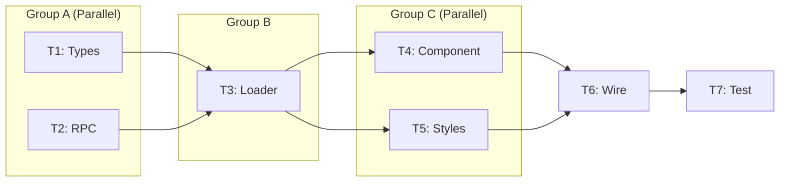

# Alpha: Task Decomposition (MAKER-Aligned)

Decompose the provided feature into atomic, implementation-ready tasks following the MAKER framework's Maximal Agentic Decomposition (MAD) principles. These tasks will be executed in sandboxed environments in the final Alpha workflow step.

## Context

The Alpha autonomous coding process:
1. **Spec** - Capture project specification
2. **Initiatives** - Break spec into major initiatives (2-8 weeks each)
3. **Features** - Decompose each initiative into vertical slices (3-10 days each)
4. **Tasks** (this command) - Break features into atomic implementable tasks (2-8 hours each)
5. **Implement** - Execute each task in a sandboxed environment

## MAKER Framework Principles

This command applies the MAKER framework from "Solving a Million-Step LLM Task with Zero Errors" (arXiv:2511.09030) which achieved **zero errors over 1 million steps** through extreme decomposition.

### The m=1 Principle (Maximal Agentic Decomposition)

Every task must be an **atomic action** - the smallest possible unit of work that:
- Contains exactly ONE decision/action
- Cannot be meaningfully split further
- Requires no planning before execution
- Has a single, clear outcome

```
❌ Bad (m > 1):                    ✅ Good (m = 1):
"Add form with validation"        "Create form component skeleton"
                                  "Add name input field"
                                  "Add email input field"
                                  "Add validation schema"
                                  "Wire validation to form"
```

### The Granularity Test

A task MUST be split if it:
- Contains the word **"and"** connecting two actions
- Requires **planning before action**
- Contains multiple **verbs** (create AND wire AND test)
- Exceeds **2-8 hours** of estimated work
- Would require **>750 tokens** to describe fully

### The Single-Verb Rule

Every task must start with exactly ONE action verb:

| Verb | Usage | Example |
|------|-------|---------|
| **Create** | New file/component from scratch | "Create UserCard component skeleton" |
| **Add** | Insert into existing file | "Add email field to UserForm" |
| **Update** | Modify existing code | "Update loader to include email" |
| **Remove** | Delete code/file | "Remove deprecated helper function" |
| **Wire** | Connect components together | "Wire UserCard to dashboard page" |
| **Extract** | Pull out into separate unit | "Extract validation logic to schema" |
| **Rename** | Change identifier names | "Rename getUserData to loadUserProfile" |
| **Move** | Relocate file/code | "Move types to shared package" |
| **Configure** | Set up tooling/config | "Configure ESLint rule for imports" |
| **Test** | Add test coverage | "Add unit test for calculateTotal" |

### Red-Flag Validation

Tasks are INVALID if they exhibit these red flags:

| Red Flag | Detection | Resolution |
|----------|-----------|------------|
| **Multiple actions** | Contains "and", "then", multiple verbs | Split into separate tasks |
| **Vague scope** | "Improve", "refactor", "clean up" | Define specific changes |
| **Requires planning** | "Figure out", "decide how" | Add spike task first |
| **Too large** | >8 hours estimated | Apply decomposition pattern |
| **Unclear done state** | No testable outcome | Define acceptance criterion |

## Decomposition Patterns

### Pattern 1: CRUD Decomposition

For features involving data operations:

```markdown
Feature: "Task Management CRUD"

Tasks:
1. Create - CreateTaskForm component skeleton
2. Create - Add form fields (title, description, status)
3. Create - Add Zod validation schema for task
4. Create - Wire form to server action
5. Create - Implement createTask server action
6. Read   - Create TaskList component skeleton
7. Read   - Add TaskCard sub-component
8. Read   - Implement loadTasks loader function
9. Read   - Wire TaskList to page with loader data
10. Update - Add edit mode toggle to TaskCard
11. Update - Implement updateTask server action
12. Update - Wire edit form to update action
13. Delete - Add delete button to TaskCard
14. Delete - Implement deleteTask server action
15. Delete - Add confirmation dialog before delete
16. Test   - Add E2E test for task CRUD operations
```

### Pattern 2: Layer Decomposition

For features spanning multiple architectural layers:

```markdown
Feature: "User Dashboard Card"

Tasks by Layer:
## Database Layer
1. Create RPC function get_user_stats in Supabase

## Data Layer
2. Create loadUserStats loader function
3. Add TypeScript types for UserStats

## Logic Layer
4. Create calculateProgressPercentage utility
5. Add unit test for progress calculation

## Component Layer
6. Create UserStatsCard component skeleton
7. Add progress bar sub-component
8. Add stats grid sub-component
9. Style card with Tailwind responsive classes

## Integration Layer
10. Wire UserStatsCard to dashboard page
11. Add loading skeleton for UserStatsCard
12. Add error boundary for stats loading failure

## Testing Layer
13. Add E2E test for dashboard with stats card
```

### Pattern 3: State-Based Decomposition

For features with multiple UI states:

```markdown
Feature: "Coaching Sessions Card"

Tasks by State:
## Empty State
1. Create CoachingCard component skeleton
2. Add empty state with booking CTA
3. Wire booking CTA to Cal.com link

## Loading State
4. Add loading skeleton variant
5. Create Suspense boundary wrapper

## Populated State
6. Add session display with date/time
7. Add join meeting button
8. Add reschedule link

## Error State
9. Add error message display
10. Add retry button for failed loads

## Integration
11. Wire to dashboard with conditional rendering
12. Add E2E test covering all states
```

### Pattern 4: Workflow Step Decomposition

For features with sequential user flows:

```markdown
Feature: "Assessment Submission Flow"

Tasks by Step:
## Step 1: Entry
1. Create AssessmentStart component
2. Add intro text and start button
3. Wire start button to first question

## Step 2: Questions
4. Create QuestionCard component
5. Add radio button answer options
6. Add next/previous navigation
7. Create progress indicator

## Step 3: Submission
8. Create SubmitConfirmation component
9. Add review answers summary
10. Implement submitAssessment server action

## Step 4: Results
11. Create ResultsDisplay component
12. Add score visualization
13. Add retake/continue CTAs
```

## Instructions

You are a **Task Architect** decomposing features into MAKER-compliant atomic tasks.

### Step 1: Read the Feature

If the GitHub issue number was provided as [feature-#], fetch the issue:

```bash
gh issue view <feature-#> --repo MLorneSmith/2025slideheroes
```

If no issue number provided, ask the user:
```
AskUserQuestion: "What is the GitHub issue number for the feature you want to decompose?"
```

Also read the local feature file:
```bash
# Find the parent initiative number from the feature issue
INIT_NUM=$(gh issue view <feature-#> --json labels --jq '.labels[] | select(.name | startswith("parent:")) | .name | split(":")[1]')

# Find the parent spec number from the initiative issue
SPEC_NUM=$(gh issue view ${INIT_NUM} --json labels --jq '.labels[] | select(.name | startswith("parent:")) | .name | split(":")[1]')

# Find the spec directory
SPEC_DIR=$(ls -d .ai/alpha/specs/${SPEC_NUM}-* 2>/dev/null | head -1)

# Find the initiative directory
INIT_DIR=$(ls -d ${SPEC_DIR}/${INIT_NUM}-* 2>/dev/null | head -1)

# Find the feature directory
FEAT_DIR=$(ls -d ${INIT_DIR}/<feature-#>-* 2>/dev/null | head -1)

# Read the feature file
cat ${FEAT_DIR}/feature.md
```

### Step 2: Analyze Feature Components

From the feature document, identify:

1. **Vertical Slice Components** - UI, Logic, Data, Database layers
2. **Acceptance Criteria** - Each criterion may generate 1+ tasks
3. **Files to Create/Modify** - Each file operation is a task candidate
4. **Task Hints** - Author-suggested decomposition

Create a working list of task candidates.

### Step 3: Explore Implementation Patterns

Use the Task tool with `subagent_type=code-explorer` to understand:

1. **Similar implementations**: How are comparable tasks structured?
2. **File conventions**: Naming patterns, directory structure
3. **Code patterns**: Existing utilities, shared components
4. **Test patterns**: How similar features are tested

```
Task tool with subagent_type=code-explorer
prompt: "Find examples of <similar-component> implementation in this codebase.
        Show: file structure, component skeleton, loader pattern, test structure."
```

### Step 4: Apply Decomposition Pattern

Select the appropriate pattern based on feature type:

| Feature Type | Pattern | Indicator |
|--------------|---------|-----------|
| Data operations | CRUD | "Create/Read/Update/Delete" in acceptance criteria |
| New component | Layer | "UI + logic + data" in vertical slice |
| Multi-state UI | State-Based | "Empty/loading/error states" required |
| User flow | Workflow Step | Sequential actions in user story |
| Mixed | Combine patterns | Use multiple patterns for complex features |

### Step 5: Validate Each Task (m=1 Compliance)

For every task, verify:

```
┌─────────────────────────────────────────────────────────────────┐
│ MAKER m=1 VALIDATION CHECKLIST                                  │
├─────────────────────────────────────────────────────────────────┤
│                                                                 │
│ 1. SINGLE VERB?                                                │
│    [ ] Task starts with exactly one action verb                │
│    [ ] No "and", "then", or implicit multiple actions          │
│                                                                 │
│ 2. ATOMIC?                                                     │
│    [ ] Cannot be meaningfully split further                    │
│    [ ] One decision/outcome only                               │
│    [ ] No planning required before execution                   │
│                                                                 │
│ 3. SIZED CORRECTLY?                                            │
│    [ ] Estimated 2-8 hours (not less, not more)               │
│    [ ] Could be described in <750 tokens                       │
│    [ ] Touches 1-3 files maximum                               │
│                                                                 │
│ 4. CLEAR OUTCOME?                                              │
│    [ ] Binary done/not-done state                              │
│    [ ] Testable completion criterion                           │
│    [ ] No ambiguity about what "done" means                    │
│                                                                 │
│ 5. CONTEXT-FREE?                                               │
│    [ ] Can be executed with minimal context                    │
│    [ ] Doesn't require reading 10+ other tasks                 │
│    [ ] Self-contained instructions                             │
│                                                                 │
│ ALL CHECKED → Valid m=1 task                                   │
│ ANY UNCHECKED → Apply decomposition pattern                    │
└─────────────────────────────────────────────────────────────────┘
```

### Step 6: Define Task Context

For each task, specify the minimal context needed:

```markdown
## Task Context (≤750 tokens total)

### Current State
- Files that exist: [list relevant files]
- Functions available: [list dependencies]
- Types defined: [list relevant types]

### Instruction
[Single sentence: "Create X that does Y"]

### Acceptance Criterion
[Single testable condition: "X exists and passes Y check"]

### Output
[Expected result: "New file at path/to/file.tsx"]
```

### Step 7: Determine Task Order

Apply dependency rules:

1. **Types before implementations** - Define TypeScript types first
2. **Database before loaders** - RPC/schema before data access
3. **Loaders before components** - Data before UI
4. **Components before wiring** - Build before integrate
5. **Integration before tests** - Wire before verify
6. **Parallel where independent** - Group non-blocking tasks

Create execution graph:
```
T1 (Types) ────────────────────────────────────────┐
    ↓                                              │
T2 (Database RPC) ───┬─────────────────────────────┤
    ↓                │                             │
T3 (Loader) ─────────┤                             │
    ↓                │                             │
T4 (Component) ──────┼── parallel ── T5 (Styles)   │
    ↓                │                             │
T6 (Wire to page) ───┘                             │
    ↓                                              │
T7 (E2E Test) ←────────────────────────────────────┘
```

### Step 8: Create Task Documents

Create task files directly inside the feature directory (tasks are files, not subdirectories):

```bash
# Tasks are created as files in the feature directory
# File: ${FEAT_DIR}/<task-#>-<task-slug>.md
```

Use this structure for each task file:

```markdown
# Task: [Single-Verb Task Name]

## Metadata
| Field | Value |
|-------|-------|
| **Parent Feature** | #<feature-#> |
| **Task ID** | <feature-#>-T<number> |
| **Status** | Draft |
| **Estimated Hours** | X |
| **Priority** | 1-N |
| **Parallel Group** | A/B/C (tasks in same group can run together) |

## Instruction

**Action**: [Single verb] [specific target]
**Purpose**: [Why this task exists - one sentence]

## Context (≤750 tokens)

### Current State
```
Files: [relevant existing files]
Types: [available type definitions]
Dependencies: [functions/components available]
```

### Constraints
- Must follow [pattern/convention]
- Must not modify [protected files]
- Must use [required library/approach]

## Acceptance Criterion

**Done when**: [Single testable condition]

```bash
# Verification command
[command to verify task completion]
```

## Output

| Output | Path | Description |
|--------|------|-------------|
| New file | `path/to/file.tsx` | [What it contains] |
| Modified | `path/to/existing.ts` | [What changed] |

## Dependencies

### Blocked By
- [Task IDs that must complete first]

### Blocks
- [Task IDs waiting on this]

### Parallel With
- [Task IDs that can run simultaneously]

## Implementation Hints

### Relevant Patterns
```typescript
// Example from codebase to follow
[code snippet showing pattern to use]
```

### Files to Reference
- `path/to/similar/implementation.tsx` - [What to learn from it]

## Red-Flag Checks

- [ ] Single verb action
- [ ] No "and"/"then" in instruction
- [ ] <8 hours estimated
- [ ] <750 tokens context
- [ ] Binary done state
- [ ] 1-3 files touched
```

### Step 9: Create Task Overview

Create master overview in the feature directory:

```bash
# File: ${FEAT_DIR}/README.md
```

Structure:
```markdown
# Task Overview: [Feature Name]

**Parent Feature**: #<feature-#>
**Parent Initiative**: #<init-#>
**Created**: [Date]
**Total Tasks**: N
**Estimated Duration**: X-Y hours

## Directory Structure

```
<feature-#>-<slug>/
├── feature.md                        # Feature document
├── README.md                         # This file - tasks overview
├── <task-#>-<slug>.md                # Task 1
├── <task-#>-<slug>.md                # Task 2
└── ...
```

## Task Summary

| ID | File | Hours | Group | Dependencies | Status |
|----|------|-------|-------|--------------|--------|
| <task-#> | `<task-#>-<slug>.md` | 2 | A | None | Draft |
| <task-#> | `<task-#>-<slug>.md` | 3 | A | None | Draft |
| <task-#> | `<task-#>-<slug>.md` | 2 | B | T1, T2 | Draft |

## Execution Graph



## Parallel Execution Groups

| Group | Tasks | Can Start After | Est. Hours |
|-------|-------|-----------------|------------|
| A | T1, T2 | Immediately | 5 (parallel: 3) |
| B | T3 | Group A complete | 2 |
| C | T4, T5 | Group B complete | 4 (parallel: 2) |
| D | T6, T7 | Group C complete | 3 |

**Critical Path**: T2 → T3 → T4 → T6 → T7 = 12 hours
**Total with Parallelization**: ~10 hours

## m=1 Validation Summary

| Task | Single Verb | Atomic | Sized | Clear | Context-Free |
|------|-------------|--------|-------|-------|--------------|
| T1 | ✓ | ✓ | ✓ | ✓ | ✓ |
| T2 | ✓ | ✓ | ✓ | ✓ | ✓ |

## MAKER Compliance

- **Total tasks**: N
- **Average task size**: X hours
- **Max context tokens**: <750 per task
- **Parallel groups**: N groups
- **Critical path reduction**: X% vs sequential
```

### Step 10: Create GitHub Issues

For each task, create a GitHub issue:

```bash
gh issue create \
  --repo MLorneSmith/2025slideheroes \
  --title "Task: [Single-Verb Task Name]" \
  --body "$(cat ${FEAT_DIR}/pending-<task-slug>.md)" \
  --label "type:task" \
  --label "status:ready" \
  --label "alpha:task" \
  --label "parent:<feature-#>" \
  --label "size:xs"  # xs=1-2h, s=2-4h, m=4-6h, l=6-8h
```

Rename task file with issue number:
```bash
mv ${FEAT_DIR}/pending-<task-slug>.md ${FEAT_DIR}/<task-#>-<task-slug>.md
```

### Step 11: Update Feature Issue

Link tasks back to the parent feature:

```bash
gh issue comment <feature-#> --repo MLorneSmith/2025slideheroes --body "## Tasks Created (MAKER m=1 Compliant)

This feature has been decomposed into the following atomic tasks:

| Task | Issue | Hours | Group | m=1 Valid |
|------|-------|-------|-------|-----------|
| [Name 1] | #XXX | 2 | A | ✓ |
| [Name 2] | #YYY | 3 | A | ✓ |
| [Name 3] | #ZZZ | 2 | B | ✓ |

**Execution Graph**:
\`\`\`
[T1, T2] → T3 → [T4, T5] → T6 → T7
\`\`\`

**Critical Path**: X hours
**With Parallelization**: Y hours

**Next Step**: Run \`/alpha:implement <task-#>\` for each task (start with Group A)"
```

## Pre-Completion Checklist

Before finalizing, verify:

- [ ] Every task passes m=1 validation (single verb, atomic, sized, clear, context-free)
- [ ] No task exceeds 8 hours estimated effort
- [ ] No task requires >750 tokens of context
- [ ] No task touches more than 3 files
- [ ] No task contains "and"/"then" connecting actions
- [ ] Each task has a single, testable acceptance criterion
- [ ] Dependencies are explicitly documented
- [ ] Parallel groups are identified for execution optimization
- [ ] GitHub issues created with size labels
- [ ] Task files saved in feature directory
- [ ] README.md created in feature directory with tasks overview

## MAKER Compliance Metrics

After decomposition, report:

| Metric | Target | Actual |
|--------|--------|--------|
| Tasks per feature | 5-20 | N |
| Avg hours per task | 2-4 | X |
| Max context tokens | <750 | Y |
| Parallel efficiency | >30% | Z% |
| m=1 compliance | 100% | W% |

## Validation Commands

```bash
# Verify task files exist in feature directory
ls -la ${FEAT_DIR}/

# Count tasks (exclude feature.md and README.md)
find ${FEAT_DIR} -maxdepth 1 -name "[0-9]*.md" | wc -l

# Verify README.md exists
test -f ${FEAT_DIR}/README.md && echo "✓ README.md exists"

# Verify GitHub issues were created
gh issue list --repo MLorneSmith/2025slideheroes --label "parent:<feature-#>" --label "type:task"

# Verify all tasks have size labels
gh issue list --repo MLorneSmith/2025slideheroes --label "parent:<feature-#>" --json labels --jq '.[].labels[].name' | grep "size:" | wc -l
```

## Feature Issue Number

$ARGUMENTS

## Report

When complete, provide:

- **Summary**: Overview of decomposition results (2-3 sentences)
- **Feature Directory**: Path to the feature directory containing all task files
- **Tasks Created**: Table with ID, filename, issue #, hours, parallel group, m=1 validation
- **Directory Structure**: Tree showing the complete nested structure
- **Execution Graph**: Visual representation of task dependencies
- **Parallel Groups**: Tasks grouped for concurrent execution
- **Critical Path**: Sequence of blocking tasks with total hours
- **MAKER Metrics**: Compliance statistics
- **Next Step**: Command to run: `/alpha:implement <task-#>` (start with first parallel group)
