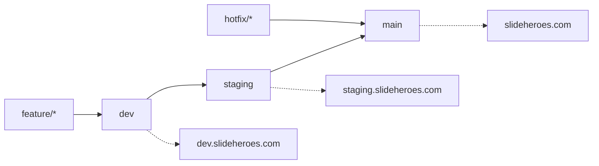

# SlideHeroes CI/CD Pipeline - Updated Design Document

## 🎯 Executive Summary

This updated design represents the target CI/CD architecture for SlideHeroes, incorporating lessons learned from implementation, addressing identified issues, and aligning with our core principles. The design prioritizes security, performance, and reliability while maintaining developer productivity.

## 🔄 Current Implementation Status

### ✅ Implemented Components
- Branch protection and environment separation (dev/staging/main)
- PR validation with comprehensive checks
- Deployment pipelines for all environments
- Security scanning (Aikido, Semgrep, TruffleHog)
- Performance monitoring and bundle size tracking
- Automated rollback capabilities
- Weekly security scans
- Pipeline metrics and alerting

### ⚠️ Partially Implemented
- Dev → Staging promotion automation (workflows fixed but need testing)

### ❌ Not Yet Implemented
- Load testing with K6 in CI
- Visual regression testing
- Container vulnerability scanning with Trivy

### ✅ Recently Completed (January 2025)
- E2E testing (matrix workflow removed, using sharded strategy)
- Turbo remote caching (signature key added to GitHub Secrets)
- CodeQL analysis (workflow implemented and active)
- Production deployment protection (solo developer workflow for private repos)

## 📋 Updated Pipeline Architecture

### Branch Strategy & Environments



### Environment Configuration

| Environment | Branch | URL | Purpose | Protection |
|------------|--------|-----|---------|------------|
| Development | `dev` | dev.slideheroes.com | Active development, integration testing | Basic checks |
| Staging | `staging` | staging.slideheroes.com | Pre-production validation | Full test suite |
| Production | `main` | slideheroes.com | Production release | Manual approval + all checks |

## 🚀 Pipeline Phases

### Phase 0: Local Development (Pre-commit)
**Tools**: Husky, lint-staged, Biome, TruffleHog
**Time**: < 30 seconds

```yaml
Pre-commit hooks:
  - TruffleHog secret scanning
  - Biome format & lint (staged files only)
  - TypeScript quick check
  - Markdown/YAML linting
```

### Phase 1: Pull Request Validation
**Trigger**: PR opened/updated to any protected branch
**Time Target**: 3-5 minutes (parallel execution)

```yaml
Jobs (run in parallel):
  change-detection:
    - Analyze changed files
    - Set job skip flags
  
  code-quality:
    - Biome linting & formatting
    - Markdown/YAML validation
    - Manypkg consistency check
    
  type-safety:
    - TypeScript compilation
    - Knip unused export detection
    
  security-quick:
    - TruffleHog secret scan
    - Semgrep SAST analysis
    
  test-unit:
    - Vitest unit tests
    - Coverage reporting
    
  bundle-analysis:
    - Bundle size check
    - Performance budget validation
```

### Phase 2: Development Integration
**Trigger**: Push to `dev` branch
**Time Target**: 8-10 minutes

```yaml
Sequential Flow:
  1. PR validation checks (reuse)
  2. Build applications (Turbo cached)
  3. Deploy to Vercel dev
  4. Integration tests (Playwright smoke)
  5. Accessibility audit (custom hybrid)
  6. Trigger promotion readiness check
```

### Phase 3: Staging Validation
**Trigger**: Push to `staging` branch
**Time Target**: 15-20 minutes

```yaml
Comprehensive Testing:
  1. All Phase 2 checks
  2. Full E2E test suite (9-shard parallel)
  3. Performance testing (Lighthouse CI)
  4. Security deep scan (Aikido full)
  5. Load testing (K6 - when implemented)
  6. Deploy to staging
  7. Post-deployment smoke tests
```

### Phase 4: Production Deployment
**Trigger**: Push to `main` branch OR manual workflow dispatch
**Time Target**: 10-12 minutes

```yaml
Production Flow (Solo Developer):
  1. Confirmation required ("DEPLOY TO PRODUCTION")
  2. Safety checks (staging health, recent commits)
  3. 30-second cancellation window
  4. Security gate validation
  5. Production build optimization
  6. Deploy to Vercel production
  7. Health checks & monitoring
  8. Auto-rollback on failure
  9. New Relic deployment marker
  
Note: GitHub Pro accounts don't support environment protection 
rules for private repos. Using custom workflow with safety checks
for solo developers. See production-deploy-gated.yml
```

## 🔧 Technical Implementation Details

### Testing Strategy

#### Unit Testing (Vitest)
- **Coverage Target**: > 80%
- **Execution**: Every PR, cached results
- **Sharding**: 4-way split for packages

#### E2E Testing (Playwright)
- **Strategy**: 9-shard parallel execution
- **Smart Selection**: Only test affected flows on PRs
- **Full Suite**: Run on staging/production deploys
- **Accessibility**: Custom hybrid tester (not axe-core)

#### Performance Testing
- **Lighthouse CI**: Automated on staging/production
- **Bundle Analysis**: Every PR with size alerts
- **K6 Load Testing**: Weekly scheduled runs (to be implemented)

### Security Implementation

#### Scanning Tools (Active)
1. **Aikido Security** - Primary security platform
   - SCA, SAST, secrets, IaC, malware detection
   - Privacy-first local scanning
   - Replaces Snyk

2. **Semgrep** - Additional SAST
   - Custom rules for business logic
   - PR and scheduled scans

3. **TruffleHog** - Secret detection
   - Pre-commit hooks
   - Historical git scanning

#### Security Gates
- No merge with critical vulnerabilities
- Automated dependency updates via Dependabot
- Weekly comprehensive security scans
- Production deployment security validation

### Performance Optimizations

#### Caching Strategy (Multi-layer)
```yaml
Cache Hierarchy:
  1. PNPM store (~50% faster installs)
  2. Turbo build cache (local + remote when configured)
  3. Next.js build cache
  4. Playwright browsers
  5. Test results cache
  6. Docker layer cache (for CI images)
```

#### Parallelization
- Independent PR validation jobs run concurrently
- E2E tests use 9-shard strategy
- Web and Payload deployments in parallel
- Matrix builds for multiple Node versions (if needed)

#### Resource Optimization
```yaml
Runner Sizing:
  - Change detection: 2 CPU
  - Linting/formatting: 4 CPU
  - Building: 8 CPU
  - Testing: 4 CPU per shard
  - Deployment: 4 CPU
```

## 📊 Monitoring & Observability

### Pipeline Metrics
- Build duration per phase
- Cache hit rates
- Test execution times
- Failure rate by job type
- Time to deployment (commit → production)

### Quality Metrics
- Code coverage trends
- Bundle size evolution
- Performance score tracking
- Security vulnerability count
- Accessibility score

### Alerting
- Pipeline failures (Slack/email)
- Performance degradation
- Security vulnerabilities
- Deployment issues
- SLA violations

## 🛠️ Tools & Services Configuration

### Required GitHub Secrets
```yaml
# Deployment
VERCEL_TOKEN
VERCEL_ORG_ID
VERCEL_PROJECT_ID

# Security
AIKIDO_SECRET_KEY
SEMGREP_APP_TOKEN

# Database
SUPABASE_SERVICE_ROLE_KEY
SUPABASE_DB_WEBHOOK_SECRET

# Payments
STRIPE_SECRET_KEY
STRIPE_WEBHOOK_SECRET

# Monitoring
NEW_RELIC_API_KEY
NEW_RELIC_APP_ID

# Performance
TURBO_TOKEN
TURBO_REMOTE_CACHE_SIGNATURE_KEY  # NEEDS ADDING

# Notifications
SLACK_WEBHOOK_URL
```

### Feature Flags
```yaml
ENABLE_E2E_MATRIX: false  # Currently disabled
ENABLE_VISUAL_REGRESSION: false  # Not implemented
ENABLE_K6_LOAD_TESTS: false  # Not implemented
ENABLE_CONTAINER_SCANNING: false  # Not implemented
```

## 🚦 Quality Gates

### PR Merge Requirements
- ✅ All CI checks passing
- ✅ Code coverage > 80%
- ✅ No security vulnerabilities (critical/high)
- ✅ Bundle size within budget (+5% tolerance)
- ✅ TypeScript compilation successful
- ✅ 1 approval for dev, 2 for staging/main
- ✅ Linear commit history

### Environment Promotion Gates

#### Dev → Staging
- ✅ All integration tests passing
- ✅ No critical bugs in dev for 24 hours
- ✅ Performance metrics acceptable
- ✅ Automated PR creation

#### Staging → Production
- ✅ Full E2E suite passing
- ✅ Manual QA sign-off
- ✅ No P0/P1 incidents in staging
- ✅ Deployment window check
- ✅ 2 manual approvals
- ✅ Security scan clean

## 📈 Success Metrics & KPIs

### Performance Targets
- **PR Feedback Time**: < 5 minutes
- **Dev Deploy Time**: < 10 minutes
- **Production Deploy Time**: < 15 minutes
- **Pipeline Success Rate**: > 95%
- **Cache Hit Rate**: > 80%

### Quality Targets
- **Test Coverage**: > 80%
- **Zero security vulnerabilities** in production
- **Lighthouse Score**: > 90
- **Bundle Size Growth**: < 5% per quarter

### Operational Targets
- **MTTR**: < 30 minutes
- **Deployment Frequency**: Multiple daily (dev), Daily (staging), 2-3x weekly (production)
- **Lead Time**: < 2 hours (commit to production)
- **Change Failure Rate**: < 5%

## 🔄 Implementation Roadmap

### Immediate Actions (Week 1)
1. ✅ Add `TURBO_REMOTE_CACHE_SIGNATURE_KEY` secret
2. ✅ Enable parallel deployment for Web/Payload
3. ✅ Optimize runner sizes per job type
4. ✅ Test dev → staging promotion automation

### Short Term (Weeks 2-3)
1. Implement CodeQL security analysis
2. Set up production deployment approvals
3. Enable visual regression testing
4. Implement K6 load testing in CI

### Medium Term (Month 2)
1. Container vulnerability scanning with Trivy
2. Blue-green deployment strategy
3. Implement canary releases
4. Add cost optimization monitoring

### Long Term (Quarter 2)
1. Multi-region deployment support
2. Implement feature flag integration
3. A/B testing framework
4. Advanced rollback strategies

## 📝 Key Differences from Original Design

### Improvements Made
1. **Security**: Replaced Snyk with Aikido (more comprehensive, privacy-first)
2. **Testing**: Custom accessibility tester instead of axe-core (more accurate)
3. **Architecture**: Added reusable workflows for better modularity
4. **Monitoring**: Enhanced pipeline metrics and alerting

### Design Adjustments
1. **E2E Strategy**: Shifted from matrix to sharded approach (better parallelization)
2. **Caching**: Multi-layer caching strategy vs single-layer
3. **Deployment**: Parallel Web/Payload deployment vs sequential
4. **Security**: Multiple security tools vs single tool dependency

### Deferred Features
1. **Visual Regression**: Postponed due to complexity
2. **Full K6 Integration**: Manual testing preferred initially
3. **Container Scanning**: Lower priority for Next.js apps
4. **SonarQube**: Aikido + Semgrep deemed sufficient

## 🚨 Known Issues & Mitigations

### Current Issues
1. **Turbo Remote Cache**: Missing signature key (immediate fix needed)
2. **E2E Matrix**: Disabled due to resource constraints (use sharding instead)
3. **Workflow Triggers**: Phase 1&2 workflows require main branch presence (now fixed)

### Risk Mitigations
1. **Single point of failure**: Multiple deployment strategies available
2. **Tool vendor lock-in**: Using multiple security/monitoring providers
3. **Performance degradation**: Continuous monitoring and optimization
4. **Security vulnerabilities**: Multiple scanning layers and rapid patching

## 📚 References & Documentation

- [Current Implementation Status](./.claude/context/systems/cicd-pipeline.md)
- [Security Setup Guide](./docs/security/aikido-setup.md)
- [E2E Testing Strategy](./docs/testing/e2e-strategy.md)
- [Pipeline Troubleshooting](./docs/cicd/troubleshooting.md)
- [GitHub Actions Best Practices](https://docs.github.com/en/actions/guides)

---

This design document represents the evolved CI/CD strategy for SlideHeroes, incorporating real-world learnings and optimizations discovered during implementation. It maintains the core vision while adapting to practical constraints and opportunities.