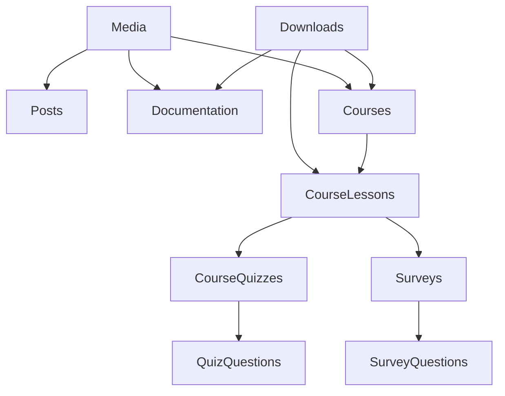

# Data Conversion Plan for Payload CMS Seed System

## Overview

This document outlines the approach for converting raw data files (mdoc, yaml, html, ts) into JSON format compatible with Payload CMS's Local API seeding system. The conversion respects the seed protocol design outlined in `.claude/scratch/payload-seed-protocol-design.md`.

## Key Principles

1. **No File Uploads**: Media and downloads already exist in Cloudflare R2. We only create database records with proper metadata.
2. **Reference System**: Use `{ref:collection:identifier}` format for all relationships
3. **Dependency Order**: Process collections in correct order to resolve references
4. **Content Preservation**: Maintain all metadata and content from original files

## Data Analysis

### Raw Data Structure

```
apps/payload/src/seed-data-raw/
├── bpm/                    # HTML files with BPM content
├── documentation/          # Hierarchical mdoc files
├── lessons/               # Course lesson mdoc files
├── posts/                 # Blog post mdoc files
├── quiz-questions/        # TypeScript quiz question data
├── quizzes/              # Quiz mdoc files
├── surveys/              # Survey YAML files
```

### Target JSON Structure

```
apps/payload/src/seed-data/
├── media-references.json      # R2 media file mappings
├── downloads-references.json  # R2 download file mappings
├── courses.json              # Generated course metadata
├── lessons/                  # Lesson data organized by course
├── posts/                    # Blog post data
├── documentation/            # Documentation hierarchy
├── quizzes/                 # Quiz definitions
├── quiz-questions/          # Question bank
├── surveys/                 # Survey definitions
└── relationships.json       # Cross-collection reference map
```

## Collection Dependencies & Processing Order



Processing order:

1. Media (extract references from all content)
2. Downloads (extract references from all content)
3. Courses (generate from lesson metadata)
4. CourseLessons
5. CourseQuizzes
6. QuizQuestions
7. Surveys
8. SurveyQuestions
9. Posts
10. Documentation

## Media/Downloads Reference Extraction

### Strategy

1. Scan all mdoc/html files for asset references
2. Extract patterns:
   - Images: `/cms/images/**/*`
   - Downloads: Files referenced in content
3. Generate metadata based on file extension and context

### Example Media Reference

```json
{
  "_ref": "media:lesson-0-image",
  "alt": "Welcome to DDM lesson image",
  "caption": null,
  "type": "image",
  "tags": [{ "tag": "lesson" }, { "tag": "course-intro" }],
  "filename": "lesson-0-image.png",
  "url": "https://r2.slideheroes.com/media/lesson-0-image.png",
  "mimeType": "image/png",
  "filesize": 245760,
  "width": 1920,
  "height": 1080
}
```

## Content Type Conversion

### 1. MDOC Files (Markdown + Frontmatter)

**Input Example:**

```markdown
---
title: Welcome to DDM
status: published
lessonID: 6
image: /cms/images/lesson-0/image.png
---

## Welcome

This is the content...
```

**Conversion Process:**

1. Extract frontmatter using gray-matter
2. Convert markdown to Lexical JSON
3. Map legacy IDs to references
4. Extract media references

**Output Structure:**

```json
{
  "_ref": "lesson:welcome-ddm",
  "title": "Welcome to DDM",
  "slug": "welcome-ddm",
  "status": "published",
  "content": {
    /* Lexical JSON */
  },
  "course_id": "{ref:course:getting-started}",
  "image_id": "{ref:media:lesson-0-image}",
  "lesson_number": 101
}
```

### 2. YAML Files (Surveys)

**Input Example:**

```yaml
title: Course Feedback
slug: feedback
questions:
  - question: 'Rate the course'
    type: scale
    answers: [...]
```

**Direct conversion with type mapping**

### 3. HTML Files (BPM Content)

**Process:**

1. Parse HTML structure
2. Extract text content
3. Convert to appropriate format
4. May need manual review

### 4. TypeScript Files (Quiz Questions)

**Process:**

1. Import/execute TS file
2. Extract exported data structure
3. Convert to Payload format

## Lexical Format Conversion

Markdown must be converted to Payload's Lexical editor format:

**Markdown:**

```markdown
## Heading

This is a paragraph with **bold** text.
```

**Lexical JSON:**

```json
{
  "root": {
    "type": "root",
    "format": "",
    "indent": 0,
    "version": 1,
    "children": [
      {
        "type": "heading",
        "format": "",
        "indent": 0,
        "version": 1,
        "children": [
          {
            "type": "text",
            "format": 0,
            "style": "",
            "text": "Heading",
            "version": 1
          }
        ],
        "tag": "h2"
      },
      {
        "type": "paragraph",
        "format": "",
        "indent": 0,
        "version": 1,
        "children": [
          {
            "type": "text",
            "format": 0,
            "style": "",
            "text": "This is a paragraph with ",
            "version": 1
          },
          {
            "type": "text",
            "format": 1,
            "style": "",
            "text": "bold",
            "version": 1
          },
          {
            "type": "text",
            "format": 0,
            "style": "",
            "text": " text.",
            "version": 1
          }
        ]
      }
    ]
  }
}
```

## Reference Resolution

### Two-Pass Process

**Pass 1: Create Reference Map**

```json
{
  "media:lesson-0-image": "uuid-1234",
  "course:getting-started": "uuid-5678",
  "lesson:welcome-ddm": "uuid-9012"
}
```

**Pass 2: Replace References**

- Replace all `{ref:collection:identifier}` with actual IDs
- Handle missing references gracefully

## Course Structure Generation

Since courses aren't explicitly defined in raw data:

1. **Analyze Lessons**: Group by `chapter` field
2. **Create Courses**: One per unique chapter
3. **Generate Metadata**:
   ```json
   {
     "_ref": "course:getting-started",
     "title": "Getting Started",
     "slug": "getting-started",
     "description": "Introduction to presentation design",
     "status": "published"
   }
   ```

## Special Handling

### Video References

- Bunny.net IDs: `bunnyvideoid="2620df68-c2a8-4255-986e-24c1d4c1dbf2"`
- YouTube/Vimeo: Extract from content

### Legacy ID Mapping

- `lessonID: 6` → Use for ordering, not as reference
- `order` field → Preserve for sorting

### Missing Data

- Generate sensible defaults
- Log warnings for review
- Create placeholder content where needed

## Validation Steps

1. **Schema Validation**: Against Payload TypeScript types
2. **Reference Validation**: All references resolve
3. **Content Validation**: Lexical JSON is valid
4. **Relationship Validation**: No circular dependencies

## Error Handling

- **Missing Files**: Log and continue
- **Invalid Format**: Log error, skip file
- **Broken References**: Log warning, use null
- **Conversion Failures**: Save original content as fallback

## Output Example

**posts/art-craft-business-presentation-creation.json:**

```json
{
  "_ref": "post:art-craft-business-presentation-creation",
  "title": "The Art & Craft of Business Presentation Design",
  "slug": "art-craft-business-presentation-creation",
  "status": "published",
  "description": "The first post of our blog...",
  "content": {
    "root": {
      /* Lexical JSON */
    }
  },
  "publishedAt": "2024-04-10T00:00:00Z",
  "image_id": "{ref:media:art-craft-image}",
  "categories": [{ "category": "Presentations" }],
  "tags": [{ "tag": "Our why" }]
}
```

## Implementation Checklist

- [ ] Set up conversion project structure
- [ ] Install dependencies (gray-matter, js-yaml)
- [ ] Create parser utilities for each file type
- [ ] Build reference extraction system
- [ ] Implement Lexical converter
- [ ] Create course structure generator
- [ ] Build relationship resolver
- [ ] Add validation layer
- [ ] Create dry-run mode
- [ ] Write comprehensive tests
- [ ] Document usage and outputs

## Next Steps

1. Create the conversion script directory
2. Implement parsers in priority order
3. Test with small subset of data
4. Iterate based on results
5. Run full conversion
6. Validate against Payload
