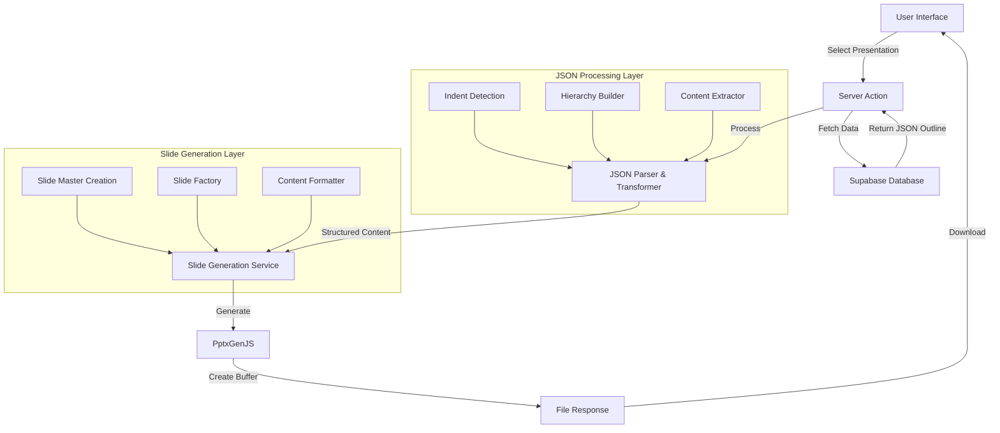
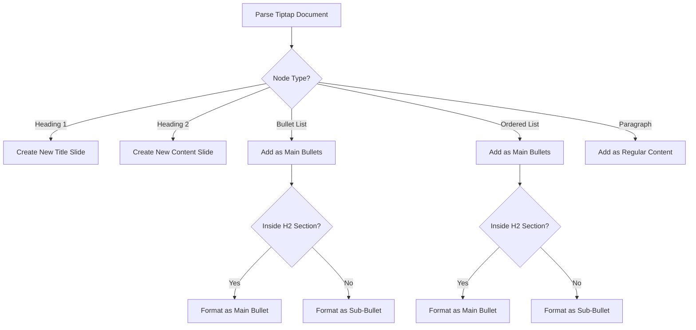

# PowerPoint File Generation System: Approach, Architecture, and Implementation Plan

Based on research into PptxGenJS and analysis of the current codebase, this document presents a comprehensive solution for transforming AI-generated presentation outlines into polished PowerPoint files.

## 1. Current System Understanding

The app has three main AI-presentation features:

1. **Build new presentation** - Creates presentation outlines in the Canvas editor
2. **Edit existing presentation** - Allows refinement of outlines in the Canvas editor
3. **Generate PowerPoint** - The feature we need to implement

The outline content is stored in the `building_blocks_submissions` table in a JSON format. The Canvas editor currently uses Tiptap format, with some earlier content in Lexical format that gets converted using a utility function.

## 2. Technical Analysis of PptxGenJS

PptxGenJS is a powerful library that will allow us to:

- Generate multi-slide presentations programmatically
- Define and use slide masters for consistent styling
- Add text with bullet points, formatting, and hierarchy
- Export the presentation for download in the browser

The library follows a simple four-step process:

1. Create a presentation instance
2. Define slide masters/templates (optional)
3. Add slides and content (text, images, charts, etc.)
4. Export the presentation (browser download or Node.js file)

## 3. Data Flow Architecture

Here's the proposed architecture for our PowerPoint generation system:



## 4. Data Transformation Strategy

### From Tiptap JSON to PptxGenJS Format

The core challenge is transforming the Tiptap JSON into a format compatible with PptxGenJS. The format conversion utility reveals that Tiptap documents contain:

- Document structure with content nodes
- Paragraph nodes
- Heading nodes (level 1, 2, 3)
- Bullet list and ordered list nodes
- Text nodes with formatting marks

We'll need to:

1. Parse the Tiptap JSON
2. Identify hierarchical structure (headings, bullet points)
3. Map this structure to PowerPoint slides with appropriate layouts

### Slide Structure Approach

Based on the requirements, we'll implement the following slide structure logic:



## 5. Slide Master Implementation

Slide masters are crucial for maintaining consistent design. We'll create a basic set of masters:

1. **Title Slide Master** - For presentation cover
2. **Section Header Master** - For main section titles
3. **Content Slide Master** - For regular content
4. **Bullet Slide Master** - Optimized for bullet points
5. **Two-Column Slide Master** - For comparison content

Implementation approach:

```javascript
// Example slide master implementation
pptx.defineSlideMaster({
  title: 'TITLE_SLIDE',
  background: { color: 'FFFFFF' },
  objects: [
    { rect: { x: 0, y: 5.3, w: '100%', h: 0.75, fill: { color: 'F1F1F1' } } },
    { text: { text: 'Presentation Title', placeholder: 'title' } },
    { image: { x: 11.3, y: 6.4, w: 1.67, h: 0.75, path: 'images/logo.png' } },
  ],
  slideNumber: { x: 0.3, y: '90%' },
});
```

## 6. Target Data Format

To effectively use PptxGenJS, we need to transform the Tiptap JSON into a structured format that represents slides:

```typescript
interface SlideContent {
  slideType: 'title' | 'section' | 'content' | 'bullet';
  title: string;
  content?: Array<{
    type: 'text' | 'bullet' | 'subbullet';
    text: string;
    formatting?: {
      bold?: boolean;
      italic?: boolean;
      color?: string;
    };
  }>;
}

interface PresentationStructure {
  title: string;
  slides: SlideContent[];
}
```

This intermediate format will make it easier to map content to appropriate slide layouts.

## 7. Implementation Plan

The implementation is recommended in three sequential sprints:

### Sprint 1: Core Transformation Layer (1 week)

- Set up PptxGenJS in the project
- Create basic parser to transform Tiptap JSON to slide structure
- Implement indent-level detection for hierarchy
- Build utility functions for text extraction and formatting
- Create basic slide generation with default template

### Sprint 2: Slide Master & Design Integration (1 week)

- Implement slide master definitions
- Create slide factory with different layouts
- Add template selection capability
- Enhance text formatting and styling
- Implement server action for PowerPoint generation

### Sprint 3: UI Integration & Enhancements (1 week)

- Connect UI dropdown to server action
- Add loading state during generation
- Implement proper content-disposition for downloads
- Add error handling and notifications
- Add progress tracking
- Optimize for large presentations

## 8. Key Components to Implement

### 1. Server Action for PowerPoint Generation

```typescript
// apps/web/app/home/(user)/ai/actions/generate-powerpoint.ts
'use server';

import pptxgen from 'pptxgenjs';
import { z } from 'zod';

import { enhanceAction } from '@kit/next/actions';

// apps/web/app/home/(user)/ai/actions/generate-powerpoint.ts

const GeneratePowerPointSchema = z.object({
  submissionId: z.string().min(1, 'Submission ID is required'),
  templateId: z.string().optional(),
});

export const generatePowerPointAction = enhanceAction(
  async function (data: z.infer<typeof GeneratePowerPointSchema>, user) {
    // 1. Fetch outline data from database
    // 2. Transform JSON to slide structure
    // 3. Generate PowerPoint using PptxGenJS
    // 4. Return as downloadable file
  },
  {
    auth: true,
    schema: GeneratePowerPointSchema,
  },
);
```

### 2. JSON Transformer Service

```typescript
// apps/web/app/home/(user)/ai/services/powerpoint/json-transformer.ts

export class OutlineTransformer {
  private tiptapDocument: TiptapDocument;

  constructor(jsonContent: string | TiptapDocument) {
    this.tiptapDocument =
      typeof jsonContent === 'string' ? JSON.parse(jsonContent) : jsonContent;
  }

  public transform(): PresentationStructure {
    // Logic to transform Tiptap JSON to slide structure
  }

  private detectHierarchy() {
    // Analyze content to detect heading levels and hierarchy
  }

  private extractFormatting(textNode: TiptapTextNode) {
    // Extract text formatting from Tiptap nodes
  }
}
```

### 3. PowerPoint Generation Service

```typescript
// apps/web/app/home/(user)/ai/services/powerpoint/generator.ts

export class PowerPointGenerator {
  private pptx: PptxGenJS;
  private structure: PresentationStructure;
  private templateId: string;

  constructor(structure: PresentationStructure, templateId?: string) {
    this.pptx = new PptxGenJS();
    this.structure = structure;
    this.templateId = templateId || 'DEFAULT';

    this.defineMasters();
  }

  public async generate(): Promise<Buffer> {
    // Create slides based on structure
    this.createSlides();

    // Return as buffer for download
    return await this.pptx.write('nodebuffer');
  }

  private defineMasters() {
    // Define slide masters based on templateId
  }

  private createSlides() {
    // Generate slides using the structure
  }
}
```

### 4. UI Component Update

```tsx
// Update to apps/web/app/home/(user)/ai/_components/AIWorkspaceDashboard.tsx
// Updated combobox with real data and action

'use client';

import { useState } from 'react';

import { useBuildingBlocksTitles } from '../_lib/hooks/use-building-blocks-titles';
import { generatePowerPointAction } from '../actions/generate-powerpoint';
import { Combobox } from './combobox';

// Update to apps/web/app/home/(user)/ai/_components/AIWorkspaceDashboard.tsx
// Updated combobox with real data and action

export function PowerPointGeneratorCard() {
  const { data: outlines, isLoading } = useBuildingBlocksTitles();
  const [selectedOutline, setSelectedOutline] = useState<string | null>(null);
  const [isGenerating, setIsGenerating] = useState(false);

  const handleGenerate = async () => {
    if (!selectedOutline) return;

    setIsGenerating(true);
    try {
      await generatePowerPointAction({
        submissionId: selectedOutline,
      });
    } catch (error) {
      console.error('Failed to generate PowerPoint:', error);
    } finally {
      setIsGenerating(false);
    }
  };

  return (
    <div className="rounded-lg bg-gray-50 p-6 shadow-md transition-shadow hover:shadow-lg">
      <FilePresentation className="mb-4 h-12 w-12 text-black" />
      <h2 className="mb-2 text-xl font-semibold">Generate your PowerPoint</h2>
      <p className="mb-4 text-gray-600">
        Publish your outline into a PowerPoint file
      </p>

      <div className="space-y-4">
        <Combobox
          options={
            outlines?.map((o) => ({ label: o.title, value: o.id })) || []
          }
          placeholder="Select an outline"
          onChange={setSelectedOutline}
          disabled={isLoading || isGenerating}
        />

        <Button
          variant="default"
          className="w-full"
          onClick={handleGenerate}
          disabled={!selectedOutline || isGenerating}
        >
          {isGenerating ? (
            <>
              <Spinner className="mr-2 h-4 w-4" />
              Generating...
            </>
          ) : (
            'Generate PowerPoint'
          )}
        </Button>
      </div>
    </div>
  );
}
```

## 9. Challenges and Solutions

### Challenge 1: Hierarchy Detection

The trickiest part will be accurately detecting the hierarchy in the outline content. Some outlines might use heading levels inconsistently, or mix bullet points with paragraphs.

**Solution:** Create a robust hierarchy detection algorithm that analyzes both explicit structure (headings, bullet lists) and implicit structure (indentation, text patterns) to create a cohesive slide structure.

### Challenge 2: Slide Layout Selection

Different content requires different slide layouts (e.g., dense bullet points vs. sparse text).

**Solution:** Analyze content density and type to automatically select appropriate layouts from our master slide templates.

### Challenge 3: Formatting Preservation

The Tiptap JSON contains formatting information (bold, italic, etc.) that should be preserved in the PowerPoint.

**Solution:** Create a mapping system between Tiptap marks and PptxGenJS text formatting options to maintain consistent styling.

## 10. Conclusion

This implementation plan provides a comprehensive approach to transforming AI-generated outlines into professional PowerPoint presentations. By focusing on a modular architecture with clear separation between data transformation, slide generation, and user interface, we can create a robust system that's both maintainable and extensible.

The phased implementation approach allows for incremental development and testing, with early delivery of core functionality followed by progressive enhancements.
