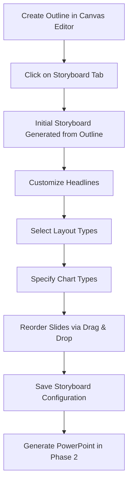
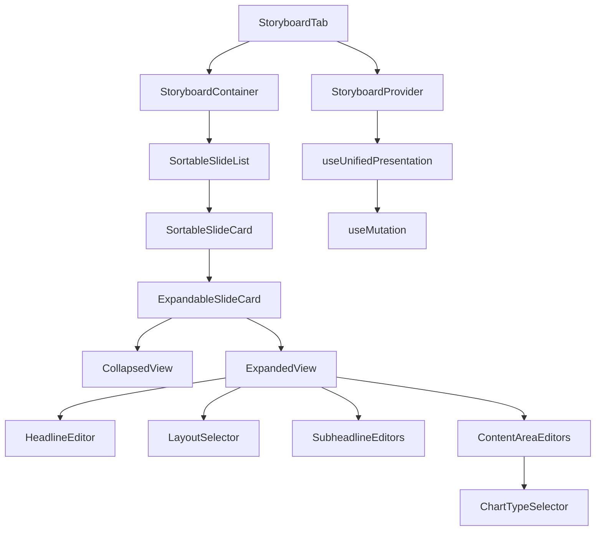

# Product Requirements Document: Storyboard System

## 1. Executive Summary

The Storyboard system is a critical component in the SlideHeroes presentation creation workflow, serving as a bridge between the outline creation in the Canvas Editor and the PowerPoint export functionality. This system allows users to visually arrange slides, define layouts, specify content types, and preview their presentation structure before generating the final PowerPoint file.

The Storyboard implements a drag-and-drop interface using dndkit, enabling users to manage and organize presentation slides in a visual manner. Each slide is represented as a card containing headline text, layout selection options, and content areas determined by the selected layout.

## 2. Business Objectives

1. Enhance the user experience by providing a visual representation of slides between outline creation and PowerPoint generation
2. Improve the quality of generated presentations by allowing users to specify layout types and content formatting
3. Give users greater control over slide organization and structure
4. Support the selection of chart/image types to improve visual representation in the final PowerPoint
5. Reduce revision cycles by allowing users to preview and adjust presentation structure before export

## 3. User Experience & Workflow

### 3.1 Entry Point

The Storyboard system will be integrated as a new tab in the Canvas Editor, appearing after the "Outline" tab. The user flow will be:

1. Create a presentation outline in the Canvas Editor
2. Click on the new "Storyboard" tab after completing the outline
3. Visually organize and customize the presentation structure and layouts
4. Proceed to PowerPoint generation (Phase 2)

### 3.2 Core User Journey



### 3.3 Key Interactions

1. **Automatic Storyboard Generation**: System will automatically generate an initial storyboard structure based on the existing outline content
2. **Slide Card Management**: Drag and drop interface for reordering slides
3. **Layout Selection**: Select from predefined layouts for each slide
4. **Content Type Specification**: Identify where text, charts, tables, or images should appear
5. **Chart Type Selection**: Specify chart types for data visualization areas
6. **Headline Editing**: Edit main headlines and subheadlines for each slide

## 4. Technical Requirements

### 4.1 Data Model

The Storyboard system will use a unified data model that serves both the outline and storyboard views, ensuring perfect consistency between them:

```typescript
// Unified Data Model for both Outline and Storyboard

interface UnifiedPresentationData {
  slides: SlideNode[];
  version: number;
  updatedAt: string;
}

// Each slide contains both outline content and storyboard metadata
interface SlideNode {
  id: string;
  headline: string; // Main slide headline
  content: ContentNode[]; // Outline content (structured text)
  order: number; // Slide position in presentation

  // Storyboard-specific properties
  storyboard: {
    layoutId: string; // Selected layout template
    subHeadlines: string[]; // Sub-headlines for each column
    contentAreas: ContentArea[]; // Content areas defined by the layout
    settings: {
      // Additional slide settings
      chartTypes: Record<string, string>; // Content area ID to chart type mapping
      imageSettings: Record<string, ImageSettings>;
      tableSettings: Record<string, TableSettings>;
    };
  };
}

// Content area definition
interface ContentArea {
  id: string;
  type: 'text' | 'chart' | 'image' | 'table';
  columnIndex: number;
  position: { x: number; y: number; w: number; h: number };
}
```

### 4.2 Database Schema

The Storyboard data will be stored in the existing `building_blocks_submissions` table using the existing outline column with the new unified format:

```sql
-- Update outline column to store the unified format
ALTER TABLE public.building_blocks_submissions
ALTER COLUMN outline TYPE JSONB USING outline::jsonb;

-- Add temporary migration tracking column
ALTER TABLE public.building_blocks_submissions
ADD COLUMN IF NOT EXISTS outline_migrated_to_unified BOOLEAN DEFAULT FALSE;
```

### 4.3 Component Architecture



## 5. Feature Specifications

### 5.1 Storyboard Tab Integration

- Add a new "Storyboard" tab in the Canvas Editor after the "Outline" tab
- Tab should only be active once the outline is completed
- Seamless navigation between Outline and Storyboard tabs
- Visual indication that Storyboard is the next step after Outline

### 5.2 Expandable Slide Cards

Each slide will be represented as a card that:

- Shows a collapsed view by default with main headline and selected layout
- Expands in-place when clicked to show editing options
- Returns to collapsed view after saving changes
- Includes drag handle for reordering

#### Collapsed Card View

- Main headline display
- Layout type label
- Expand/collapse button
- Drag handle

#### Expanded Card View

- Main headline editing field
- Layout selector dropdown
- Visual layout preview
- Sub-headline fields (based on selected layout)
- Content type selectors for each area
- Chart type selector for chart areas
- Save and Cancel buttons

### 5.3 Layout Templates

The system will provide predefined layout templates:

1. **Title Slide**: Main title with subtitle
2. **Section Header**: Section divider slide
3. **One Column**: Single content area
4. **Two Columns**: Two equal content columns
5. **Three Columns**: Three equal content columns
6. **Image and Text**: Left image with right text
7. **Text and Image**: Left text with right image
8. **Chart Slide**: Center chart with description
9. **Bullet List**: Focus on bullet point lists
10. **Comparison**: Side-by-side comparison layout

### 5.4 Chart Type Selection

For content areas designated as charts, users can select from:

1. Bar Chart
2. Line Chart
3. Pie Chart
4. Area Chart
5. Scatter Plot
6. Bubble Chart
7. Radar Chart
8. Funnel Chart
9. Process Flow
10. Organization Chart

### 5.5 Initial Storyboard Generation

The system will automatically generate an initial storyboard from the outline by:

1. Analyzing outline structure (headings and hierarchy)
2. Creating appropriate slide structures
3. Setting initial layouts based on content analysis
4. Mapping main headings to slide main headlines
5. Mapping secondary headings to sub-headlines
6. Identifying content that might be suitable for charts vs. text

### 5.6 Active Editing Experience

- Real-time updates as users make changes
- Smooth animations for drag and drop operations
- Immediate visual feedback when changing layouts
- Responsive adjusting of sub-headline fields when layout changes
- Support for keyboard navigation and accessibility

## 6. Technical Implementation

### 6.1 Data Layer

The data layer will use React Query to handle state management:

```typescript
// Custom hook to access and modify the unified presentation data
export function useUnifiedPresentation(submissionId: string) {
  const supabase = useSupabase();
  const queryClient = useQueryClient();
  const queryKey = ['submission', submissionId, 'unified'];

  // Query for fetching the unified data
  const query = useQuery<UnifiedPresentationData>({
    queryKey,
    queryFn: async () => {
      const { data, error } = await supabase
        .from('building_blocks_submissions')
        .select('outline')
        .eq('id', submissionId)
        .single();

      if (error) throw error;
      if (!data?.outline) {
        // Create default structure if not found
        return {
          slides: [],
          version: 1,
          updatedAt: new Date().toISOString(),
        };
      }

      // Parse outline as unified data
      const unifiedData =
        typeof data.outline === 'string'
          ? JSON.parse(data.outline)
          : data.outline;

      // Check if migration needed
      if (!isUnifiedFormat(unifiedData)) {
        // If not unified format, trigger migration
        const result = await migrateOutlineToUnifiedAction({
          submissionId,
        });

        if (!result.success) {
          throw new Error('Failed to migrate outline');
        }

        return result.data;
      }

      return unifiedData;
    },
  });

  // Mutation for updating the unified data
  const updateMutation = useMutation({
    mutationFn: async (updatedData: UnifiedPresentationData) => {
      // Update version and timestamp
      updatedData.version += 1;
      updatedData.updatedAt = new Date().toISOString();

      const { error } = await supabase
        .from('building_blocks_submissions')
        .update({ outline: updatedData })
        .eq('id', submissionId);

      if (error) throw error;
      return updatedData;
    },
    onSuccess: (data) => {
      queryClient.setQueryData(queryKey, data);
    },
  });

  // Mutation for updating a single slide
  const updateSlideMutation = useMutation({
    mutationFn: async ({
      slideId,
      slideData,
    }: {
      slideId: string;
      slideData: Partial<SlideNode>;
    }) => {
      const currentData =
        queryClient.getQueryData<UnifiedPresentationData>(queryKey);
      if (!currentData) throw new Error('No presentation data found');

      // Create a new version of the data
      const updatedData = {
        ...currentData,
        version: currentData.version + 1,
        updatedAt: new Date().toISOString(),
        slides: currentData.slides.map((slide) =>
          slide.id === slideId ? { ...slide, ...slideData } : slide,
        ),
      };

      const { error } = await supabase
        .from('building_blocks_submissions')
        .update({ outline: updatedData })
        .eq('id', submissionId);

      if (error) throw error;
      return updatedData;
    },
    onSuccess: (data) => {
      queryClient.setQueryData(queryKey, data);
    },
  });

  return {
    data: query.data,
    isLoading: query.isLoading,
    error: query.error,
    updatePresentation: updateMutation.mutate,
    updateSlide: updateSlideMutation.mutate,
    isUpdating: updateMutation.isPending || updateSlideMutation.isPending,
  };
}
```

### 6.2 UI Components

#### Main Storyboard Tab

```tsx
// StoryboardTab.tsx
'use client';

import { DndContext, closestCenter } from '@dnd-kit/core';
import {
  SortableContext,
  arrayMove,
  verticalListSortingStrategy,
} from '@dnd-kit/sortable';
import { PlusCircle } from 'lucide-react';

import { Button } from '@kit/ui/button';

import { useUnifiedPresentation } from '../hooks/use-unified-presentation';
import { ExpandableSlideCard } from './expandable-slide-card';

// StoryboardTab.tsx

export function StoryboardTab({ submissionId }) {
  const { data, isLoading, updatePresentation, updateSlide } =
    useUnifiedPresentation(submissionId);

  if (isLoading) {
    return <div>Loading storyboard...</div>;
  }

  const handleDragEnd = (event) => {
    const { active, over } = event;

    if (!active || !over || active.id === over.id) return;

    const oldIndex = data.slides.findIndex((slide) => slide.id === active.id);
    const newIndex = data.slides.findIndex((slide) => slide.id === over.id);

    if (oldIndex === -1 || newIndex === -1) return;

    const newSlides = arrayMove(data.slides, oldIndex, newIndex);

    // Update order property
    const reorderedSlides = newSlides.map((slide, index) => ({
      ...slide,
      order: index,
    }));

    updatePresentation({
      ...data,
      slides: reorderedSlides,
    });
  };

  const handleUpdateSlide = (slideId, updatedSlideData) => {
    updateSlide({ slideId, slideData: updatedSlideData });
  };

  const handleAddSlide = () => {
    const newSlide = {
      id: generateUuid(),
      headline: 'New Slide',
      content: [{ type: 'paragraph', content: [{ type: 'text', text: '' }] }],
      order: data.slides.length,
      storyboard: {
        layoutId: 'one-column',
        subHeadlines: [''],
        contentAreas: [
          {
            id: generateUuid(),
            type: 'text',
            columnIndex: 0,
            position: { x: 0.1, y: 0.3, w: 0.8, h: 0.6 },
          },
        ],
        settings: {
          chartTypes: {},
          imageSettings: {},
          tableSettings: {},
        },
      },
    };

    updatePresentation({
      ...data,
      slides: [...data.slides, newSlide],
    });
  };

  return (
    <div className="p-4">
      <DndContext collisionDetection={closestCenter} onDragEnd={handleDragEnd}>
        <SortableContext
          items={data.slides.map((slide) => slide.id)}
          strategy={verticalListSortingStrategy}
        >
          <div className="space-y-4">
            {data.slides.map((slide) => (
              <ExpandableSlideCard
                key={slide.id}
                slide={slide}
                onUpdateSlide={(updatedSlideData) =>
                  handleUpdateSlide(slide.id, updatedSlideData)
                }
              />
            ))}
          </div>
        </SortableContext>
      </DndContext>

      <div className="mt-4 flex justify-between">
        <Button
          variant="outline"
          className="flex items-center gap-2"
          onClick={handleAddSlide}
        >
          <PlusCircle className="h-4 w-4" />
          Add Slide
        </Button>

        <Button>Export</Button>
      </div>
    </div>
  );
}
```

#### Expandable Slide Card

```tsx
// ExpandableSlideCard.tsx
'use client';

import { useState } from 'react';

import { useSortable } from '@dnd-kit/sortable';
import { CSS } from '@dnd-kit/utilities';
import { ChevronDown, ChevronUp, MoreHorizontal } from 'lucide-react';

import { Button } from '@kit/ui/button';
import { Card, CardContent, CardHeader } from '@kit/ui/card';
import { cn } from '@kit/ui/lib/utils';

import { PRESET_LAYOUTS, SlideNode } from '../lib/types';
import { CollapsedSlideView } from './CollapsedSlideView';
import { ExpandedSlideView } from './ExpandedSlideView';

// ExpandableSlideCard.tsx

interface ExpandableSlideCardProps {
  slide: SlideNode;
  onUpdateSlide: (updatedSlide: Partial<SlideNode>) => void;
}

export function ExpandableSlideCard({
  slide,
  onUpdateSlide,
}: ExpandableSlideCardProps) {
  const [isExpanded, setIsExpanded] = useState(false);
  const [localSlide, setLocalSlide] = useState<SlideNode>(slide);

  const { attributes, listeners, setNodeRef, transform, transition } =
    useSortable({ id: slide.id });

  const style = {
    transform: CSS.Transform.toString(transform),
    transition,
  };

  const layout =
    PRESET_LAYOUTS.find((l) => l.id === slide.storyboard.layoutId) ||
    PRESET_LAYOUTS[0];

  const toggleExpanded = () => {
    setIsExpanded(!isExpanded);

    // Reset local slide data when expanding to ensure it has latest data
    if (!isExpanded) {
      setLocalSlide({ ...slide });
    }
  };

  const handleChange = (fieldName: string, value: any) => {
    setLocalSlide((prev) => ({
      ...prev,
      [fieldName]: value,
    }));
  };

  const handleStoryboardChange = (field: string, value: any) => {
    setLocalSlide((prev) => ({
      ...prev,
      storyboard: {
        ...prev.storyboard,
        [field]: value,
      },
    }));
  };

  const handleLayoutChange = (layoutId: string) => {
    const newLayout = PRESET_LAYOUTS.find((l) => l.id === layoutId);
    if (!newLayout) return;

    // Adjust subheadlines array based on new layout column count
    let newSubHeadlines = [...localSlide.storyboard.subHeadlines];

    // Add empty strings if needed
    while (newSubHeadlines.length < newLayout.columns) {
      newSubHeadlines.push('');
    }

    // Truncate if too many
    if (newSubHeadlines.length > newLayout.columns) {
      newSubHeadlines = newSubHeadlines.slice(0, newLayout.columns);
    }

    setLocalSlide((prev) => ({
      ...prev,
      storyboard: {
        ...prev.storyboard,
        layoutId,
        subHeadlines: newSubHeadlines,
      },
    }));
  };

  const handleSave = () => {
    onUpdateSlide(localSlide);
    setIsExpanded(false);
  };

  const handleCancel = () => {
    setLocalSlide({ ...slide }); // Reset to original
    setIsExpanded(false);
  };

  return (
    <div ref={setNodeRef} style={style} {...attributes}>
      <Card
        className={cn(
          'mb-4 transition-all duration-200',
          isExpanded ? 'shadow-lg' : 'shadow',
        )}
      >
        <CardHeader className="flex flex-row items-center justify-between p-4">
          <div className="flex items-center gap-3">
            <div {...listeners} className="cursor-grab">
              ≡
            </div>
            <h3 className="font-medium">{localSlide.headline}</h3>
          </div>
          <div className="flex items-center gap-2">
            <Button variant="ghost" size="icon">
              <MoreHorizontal className="h-5 w-5" />
            </Button>
            <Button variant="ghost" size="icon" onClick={toggleExpanded}>
              {isExpanded ? (
                <ChevronUp className="h-5 w-5" />
              ) : (
                <ChevronDown className="h-5 w-5" />
              )}
            </Button>
          </div>
        </CardHeader>

        {isExpanded ? (
          <ExpandedSlideView
            slide={localSlide}
            onChange={handleChange}
            onStoryboardChange={handleStoryboardChange}
            onLayoutChange={handleLayoutChange}
            onSave={handleSave}
            onCancel={handleCancel}
          />
        ) : (
          <CollapsedSlideView slide={localSlide} layout={layout} />
        )}
      </Card>
    </div>
  );
}
```

## 7. Data Consistency

The unified data model ensures perfect consistency between the Outline and Storyboard tabs:

1. **Single Source of Truth**: Both the Outline and Storyboard views operate on the same underlying data structure
2. **No Synchronization Required**: Changes made in either tab are automatically reflected in the other
3. **Bidirectional Consistency**: The unified model preserves both outline content and storyboard metadata

This approach eliminates the need for complex synchronization mechanisms, making the system more reliable and easier to maintain.

## 8. Performance Considerations

1. **Optimistic Updates**: Use optimistic UI updates to provide immediate feedback while saving changes
2. **Lazy Loading**: Only load and render visible cards to improve performance with large presentations
3. **Virtualized Lists**: For very large presentations, implement virtualization to maintain performance
4. **Debounced Autosave**: Implement debounced auto-saving to prevent excessive database writes
5. **Incremental Updates**: Update only changed slides rather than the entire presentation data

## 9. Accessibility Requirements

1. **Keyboard Navigation**: Full keyboard support for all interactions
2. **Screen Reader Compatibility**: Proper ARIA labels and roles for all interactive elements
3. **High Contrast Support**: Ensure good visibility in high contrast mode
4. **Focus Management**: Clear focus indicators and logical tab order
5. **Responsive Design**: Ensure usability across device sizes and zoom levels

## 10. Testing Strategy

1. **Unit Testing**: Test individual components and hooks
2. **Integration Testing**: Test interactions between components
3. **End-to-End Testing**: Test the complete storyboard workflow
4. **Accessibility Testing**: Ensure WCAG compliance
5. **Performance Testing**: Verify performance with large presentation data
6. **Usability Testing**: Conduct user testing to refine the interface

## 11. Development Milestones

### Phase 1: Core Infrastructure (Week 1)

- Database schema updates
- Core data model implementation
- React Query hooks for data access
- Migration utilities for existing outline data

### Phase 2: UI Components (Week 2)

- Storyboard tab integration in Canvas Editor
- Sortable slide list implementation
- Expandable slide card component
- Layout and chart type selectors

### Phase 3: Testing and Refinement (Week 3)

- Unit and integration testing
- Performance optimization
- Accessibility improvements
- User acceptance testing
- Documentation and developer handoff

## 12. Success Metrics

1. **User Engagement**: Percentage of users who engage with the Storyboard feature
2. **Completion Rate**: Percentage of users who complete a storyboard after starting
3. **Time Savings**: Reduction in time spent creating presentations
4. **Quality Improvement**: Improvement in presentation quality ratings
5. **Support Volume**: Reduction in support requests related to presentation structure

## 13. Conclusion

The Storyboard system represents a significant enhancement to the SlideHeroes presentation creation workflow, providing users with greater control and visual feedback during the presentation design process. By implementing a unified data model and intuitive drag-and-drop interface, we can deliver a seamless user experience that bridges the gap between outline creation and PowerPoint generation, ultimately helping users create better presentations more efficiently.
