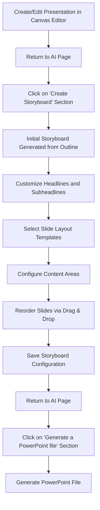
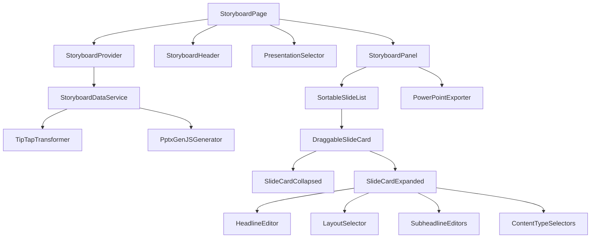

# Product Requirements Document: Storyboard System (Updated)

## 1. Executive Summary

The Storyboard system serves as a critical bridge between the outline creation in the Canvas Editor and the PowerPoint export functionality in the SlideHeroes application. This system allows users to visually arrange slides, define layouts, specify content types, and preview presentation structure before generating the final PowerPoint file using PptxGenJS.

Based on further analysis, we have determined that the Storyboard system will be implemented as a separate section within the AI presentation maker rather than as an integrated tab within the Canvas Editor. This approach simplifies the data model and reduces potential conflicts between the TipTap editor and the PowerPoint generation requirements.

## 2. Business Objectives

1. Enhance the user experience by providing a visual representation of slides between outline creation and PowerPoint generation
2. Improve the quality of generated presentations by allowing users to specify layout types and content formatting
3. Give users greater control over slide organization and structure
4. Support the selection of chart/image types to improve visual representation in the final PowerPoint
5. Reduce revision cycles by allowing users to preview and adjust presentation structure before export

## 3. User Experience & Workflow

### 3.1 Entry Point

The Storyboard system will be implemented as a fourth section in the AI presentation maker interface alongside:

1. Build new presentation
2. Edit existing presentation
3. **Create Storyboard (New)**
4. Generate a PowerPoint file

The user flow will be:

1. Create a presentation outline using the Canvas Editor
2. Return to apps\web\app\home\(user)\ai\page.tsx
3. Click on the "Create Storyboard" section to organize and preview slides
4. Visually organize and customize the presentation structure and layouts
5. Save Storyboard
6. Return to apps\web\app\home\(user)\ai\page.tsx
7. Click on the 'Generate a PowerPoint file ' section to generate a pptx file

### 3.2 Core User Journey



### 3.3 Key Interactions

1. **Presentation Selection**: Select an existing presentation to storyboard
2. **Automatic Storyboard Generation**: System will automatically generate an initial storyboard structure based on the outline content
3. **Slide Card Management**: Drag and drop interface for reordering slides
4. **Layout Selection**: Select from predefined layouts for each slide
5. **Content Type Specification**: Identify where text, charts, tables, or images should appear
6. **Headline Editing**: Edit main headlines and subheadlines for each slide
7. **PowerPoint Generation**: Generate a PowerPoint file directly from the storyboard

## 4. Technical Requirements

### 4.1 Data Models

#### 4.1.1 Incoming Data Model (TipTap JSON)

The building_blocks_submissions table stores presentation outlines in a TipTap JSON format with the following structure:

```typescript
// TipTap Document Structure (Incoming Data Model)
interface TipTapDocument {
  type: 'doc';
  content: TipTapNode[];
  meta?: {
    sectionType: string;
    timestamp: string;
    version: string;
  };
}

interface TipTapNode {
  type: 'heading' | 'paragraph' | 'bulletList' | 'orderedList' | 'listItem';
  attrs?: {
    level?: number; // For heading nodes (1-6)
    indent?: number; // Indentation level
  };
  content?: TipTapNode[];
}

interface TipTapTextNode {
  type: 'text';
  text: string;
  marks?: { type: string; attrs?: Record<string, any> }[];
}
```

Sample TipTap JSON structure from the database:

```json
{
  "type": "doc",
  "content": [
    {
      "type": "heading",
      "attrs": { "level": 1 },
      "content": [{ "type": "text", "text": "Presentation Outline" }]
    },
    {
      "type": "heading",
      "attrs": { "level": 2 },
      "content": [{ "type": "text", "text": "Situation" }]
    },
    {
      "type": "paragraph",
      "content": [{ "type": "text", "text": "Content paragraph here" }]
    },
    {
      "type": "bulletList",
      "content": [
        {
          "type": "listItem",
          "content": [
            {
              "type": "paragraph",
              "content": [{ "type": "text", "text": "Bullet point" }]
            }
          ]
        }
      ]
    }
  ],
  "meta": {
    "sectionType": "outline",
    "timestamp": "2025-04-29T20:55:19.228Z",
    "version": "1.0"
  }
}
```

#### 4.1.2 Outgoing Data Model (PptxGenJS-optimized)

The Storyboard will convert TipTap JSON into a PowerPoint-optimized format:

```typescript
// PptxGenJS-optimized Data Structure (Outgoing Data Model)
interface PresentationStructure {
  title: string;
  slides: SlideContent[];
}

interface SlideContent {
  id: string;
  slideType: 'title' | 'section' | 'content' | 'bullet';
  title: string; // Main headline
  subheadlines: string[]; // One per column based on layout
  layoutId: string; // Reference to predefined layout template
  content: SlideContentItem[];
  order: number;
}

interface SlideContentItem {
  type: 'text' | 'bullet' | 'subbullet' | 'chart' | 'image' | 'table';
  columnIndex: number; // Which column this content belongs to
  text?: string;
  chartType?: string;
  imageData?: string;
  tableData?: any;
  formatting?: {
    bold?: boolean;
    italic?: boolean;
    color?: string;
    fontSize?: number;
  };
}
```

This structure aligns perfectly with PptxGenJS requirements for slide generation, with each slide having a defined layout, title, and properly structured content items.

#### 4.1.3 Data Transformation Process

The Storyboard system will transform TipTap JSON to PptxGenJS-optimized format through these steps:

1. **Parse TipTap Document**: Extract the hierarchical structure
2. **Identify Slide Boundaries**: Level 1 and 2 headings typically define slides
3. **Map to Slide Layouts**:
   - Level 1 headings → Title slides
   - Level 2 headings → Content slides
   - Multiple Level 3 headings → Multi-column layouts
4. **Process Content Elements**:
   - Paragraphs → Text content
   - Bullet lists → Bullet points
   - Ordered lists → Numbered bullets
5. **Derive Content Types**:
   - Content with numbers and relationships → Charts
   - Image references → Image placeholders

### 4.2 Storage Approach

The Storyboard data will be stored in the existing `building_blocks_submissions` table using a new dedicated column:

```sql
ALTER TABLE public.building_blocks_submissions
ADD COLUMN IF NOT EXISTS storyboard JSONB;
```

This approach:

- Keeps storyboard data separate from outline data
- Avoids modifying the existing outline format
- Allows independent evolution of the two systems
- Simplifies rollback if needed

### 4.3 Component Architecture



## 5. Feature Specifications

### 5.1 Storyboard Section UI

- Create a new section in the AI presentation maker interface
- Implement a presentation selector dropdown at the top
- Provide a clear visual style consistent with the Canvas Editor
- Use shadcn-ui components

### 5.2 Slide Card System

Each slide will be represented as a card that:

- Shows a collapsed view by default with main headline and selected layout
- Expands in-place when clicked to show editing options
- Returns to collapsed view after saving changes
- Includes drag handle for reordering

#### Collapsed Card View

- Main headline display
- Layout type label/icon
- Visual preview of layout structure
- Expand/collapse button
- Drag handle

#### Expanded Card View

- Main headline editing field
- Layout selector dropdown with visual previews
- Sub-headline fields (dynamically adjusted based on selected layout)
- Content type selectors for each area
- Media placeholders for images and charts
- Chart type selector for chart areas
- Save and Cancel buttons

### 5.3 Layout Templates

The system will provide predefined layout templates optimized for PptxGenJS:

1. **Title Slide**: Main title with subtitle
2. **Section Header**: Section divider slide
3. **One Column**: Single content area for text or media
4. **Two Columns**: Two equal content columns
5. **Three Columns**: Three equal content columns
6. **Image and Text**: Left image with right text
7. **Text and Image**: Left text with right image
8. **Chart Slide**: Center chart with description
9. **Bullet List**: Focus on bullet point lists
10. **Comparison**: Side-by-side comparison layout

Each layout template will define:

- Number of columns
- Content area positions and dimensions
- Default content types
- Placeholder text
- Visual representation for preview

### 5.4 Content Type Options

Users can specify content types for each area:

1. **Text**: Regular paragraphs and formatted text
2. **Bullets**: Bullet points list
3. **Image**: Image placeholder with upload option
4. **Chart**: Data visualization with type selector
5. **Table**: Structured data in tabular format

For chart areas, users can select from:

- Bar Chart
- Line Chart
- Pie Chart
- Area Chart
- Scatter Plot
- Bubble Chart
- Radar Chart
- Funnel Chart
- Process Flow
- Organization Chart

### 5.5 Initial Storyboard Generation

The system will automatically generate an initial storyboard from the outline through an intelligent parsing process:

1. **Heading Analysis**:

   - Level 1 headings become title slides
   - Level 2 headings become section/content slides
   - Level 3+ headings become sub-headlines or column headings

2. **Content Mapping**:

   - Paragraphs become text content
   - Bullet lists become bullet points
   - Indent levels determine content hierarchy

3. **Layout Selection**:

   - Content with multiple Level 3 headings → Multi-column layout
   - Content with primarily bullet points → Bullet list layout
   - Content with numbers and data references → Chart layout

4. **Smart Content Analysis**:
   - Text mentioning percentages, numbers, or comparisons → Potential chart
   - References to images → Image placeholders
   - Lists of items → Bullet points

### 5.6 Active Editing Experience

- Real-time validation of slide data
- Immediate visual feedback when changing layouts
- Dynamic adjustment of content areas based on layout
- Smooth animations for drag and drop reordering
- Preview mode to see slides as they would appear in PowerPoint

## 6. Technical Implementation

### 6.1 Data Management Layer

```typescript
// Storyboard data service
export class StoryboardService {
  constructor(private supabase: SupabaseClient) {}

  // Fetch presentation outline and convert to storyboard if needed
  async getStoryboard(submissionId: string): Promise<StoryboardData> {
    const { data, error } = await this.supabase
      .from('building_blocks_submissions')
      .select('outline, storyboard')
      .eq('id', submissionId)
      .single();

    if (error) throw error;

    // If storyboard already exists, return it
    if (data.storyboard) {
      return data.storyboard;
    }

    // Otherwise, generate from outline
    const outline =
      typeof data.outline === 'string'
        ? JSON.parse(data.outline)
        : data.outline;

    const storyboard = this.generateStoryboardFromOutline(outline);

    // Save the generated storyboard
    await this.saveStoryboard(submissionId, storyboard);

    return storyboard;
  }

  // Transform TipTap outline to storyboard format
  private generateStoryboardFromOutline(
    outline: TipTapDocument,
  ): StoryboardData {
    // Transformation logic here
    // ...

    return storyboardData;
  }

  // Save storyboard data
  async saveStoryboard(
    submissionId: string,
    storyboard: StoryboardData,
  ): Promise<void> {
    const { error } = await this.supabase
      .from('building_blocks_submissions')
      .update({ storyboard })
      .eq('id', submissionId);

    if (error) throw error;
  }

  // Generate PowerPoint from storyboard
  async generatePowerPoint(storyboard: StoryboardData): Promise<ArrayBuffer> {
    const pptxGenerator = new PptxGenerator();
    return pptxGenerator.generateFromStoryboard(storyboard);
  }
}
```

### 6.2 PptxGenJS Integration

```typescript
// PowerPoint Generator Class
export class PptxGenerator {
  private pptx: PptxGenJS;

  constructor() {
    this.pptx = new pptxgen();
    this.defineSlideTemplates();
  }

  // Define slide master templates
  private defineSlideTemplates(): void {
    // Title slide master
    this.pptx.defineSlideMaster({
      title: 'MASTER_TITLE',
      background: { color: 'FFFFFF' },
      objects: [
        { rect: { x: 0, y: 0, w: '100%', h: 0.5, fill: { color: 'F1F1F1' } } },
        {
          text: {
            placeholder: 'mainHeadline',
            options: {
              x: 0.5,
              y: 0.2,
              w: 9,
              h: 1.5,
              fontSize: 44,
              bold: true,
              align: 'center',
            },
          },
        },
        {
          text: {
            placeholder: 'subHeadline1',
            options: {
              x: 0.5,
              y: 2,
              w: 9,
              h: 1,
              fontSize: 24,
              align: 'center',
            },
          },
        },
      ],
      slideNumber: { x: 0.3, y: '95%' },
    });

    // Two column slide master
    this.pptx.defineSlideMaster({
      title: 'MASTER_TWO_COLUMN',
      background: { color: 'FFFFFF' },
      objects: [
        { rect: { x: 0, y: 0, w: '100%', h: 0.5, fill: { color: 'F1F1F1' } } },
        {
          text: {
            placeholder: 'mainHeadline',
            options: { x: 0.5, y: 0.1, w: 9, h: 0.5, fontSize: 24, bold: true },
          },
        },
        // Sub-headlines for each column
        {
          text: {
            placeholder: 'subHeadline1',
            options: { x: 0.5, y: 0.7, w: 4.25, h: 0.3, fontSize: 18 },
          },
        },
        {
          text: {
            placeholder: 'subHeadline2',
            options: { x: 5.25, y: 0.7, w: 4.25, h: 0.3, fontSize: 18 },
          },
        },
      ],
      slideNumber: { x: 0.3, y: '95%' },
    });

    // Additional slide masters for other layouts
    // ...
  }

  // Generate PowerPoint from storyboard data
  async generateFromStoryboard(
    storyboard: StoryboardData,
  ): Promise<ArrayBuffer> {
    // Process each slide in the storyboard
    for (const slide of storyboard.slides) {
      // Create a slide using the appropriate master template
      const layout = this.getMasterNameForLayout(slide.layoutId);
      const pptxSlide = this.pptx.addSlide({ masterName: layout });

      // Add headline text
      pptxSlide.addText(slide.title, { placeholder: 'mainHeadline' });

      // Add subheadlines based on layout
      slide.subheadlines.forEach((text, index) => {
        pptxSlide.addText(text, { placeholder: `subHeadline${index + 1}` });
      });

      // Add content based on type
      for (const item of slide.content) {
        this.addContentToSlide(pptxSlide, item, slide.layoutId);
      }
    }

    // Generate and return the PowerPoint file
    return await this.pptx.write('nodebuffer');
  }

  // Map layout ID to master slide name
  private getMasterNameForLayout(layoutId: string): string {
    const masters = {
      title: 'MASTER_TITLE',
      'one-column': 'MASTER_ONE_COLUMN',
      'two-column': 'MASTER_TWO_COLUMN',
      'three-column': 'MASTER_THREE_COLUMN',
      'image-text': 'MASTER_IMAGE_TEXT',
      'text-image': 'MASTER_TEXT_IMAGE',
      chart: 'MASTER_CHART',
      'bullet-list': 'MASTER_BULLET_LIST',
      comparison: 'MASTER_COMPARISON',
    };

    return masters[layoutId] || 'MASTER_ONE_COLUMN';
  }

  // Add specific content to a slide based on type
  private addContentToSlide(
    slide: any,
    content: SlideContentItem,
    layoutId: string,
  ): void {
    // Get position from layout configuration
    const position = this.getPositionForContent(content, layoutId);

    switch (content.type) {
      case 'text':
        slide.addText(content.text, {
          x: position.x,
          y: position.y,
          w: position.w,
          h: position.h,
          fontSize: content.formatting?.fontSize || 16,
          color: content.formatting?.color || '000000',
          bold: content.formatting?.bold || false,
          italic: content.formatting?.italic || false,
        });
        break;

      case 'bullet':
      case 'subbullet':
        slide.addText(content.text, {
          x: position.x,
          y: position.y,
          w: position.w,
          h: position.h,
          fontSize: content.formatting?.fontSize || 16,
          color: content.formatting?.color || '000000',
          bullet: { type: content.type === 'subbullet' ? 'circle' : 'square' },
          indentLevel: content.type === 'subbullet' ? 1 : 0,
        });
        break;

      case 'chart':
        // Add chart based on chartType
        if (content.chartType === 'bar') {
          slide.addChart(this.pptx.ChartType.bar, {
            x: position.x,
            y: position.y,
            w: position.w,
            h: position.h,
            chartData: this.parseChartData(content),
          });
        }
        // Add other chart types...
        break;

      case 'image':
        if (content.imageData) {
          slide.addImage({
            data: content.imageData,
            x: position.x,
            y: position.y,
            w: position.w,
            h: position.h,
          });
        }
        break;

      case 'table':
        if (content.tableData) {
          slide.addTable(content.tableData, {
            x: position.x,
            y: position.y,
            w: position.w,
            h: position.h,
          });
        }
        break;
    }
  }

  // Get position data for content area
  private getPositionForContent(
    content: SlideContentItem,
    layoutId: string,
  ): any {
    // Retrieve position data from layout configuration
    // ...

    return { x: 0.5, y: 1.0, w: 9, h: 4 }; // Default position
  }

  // Parse chart data from content
  private parseChartData(content: SlideContentItem): any {
    // Transform content.chartData into the format required by PptxGenJS
    // ...

    return {
      labels: ['Item 1', 'Item 2', 'Item 3'],
      datasets: [{ values: [10, 20, 30] }],
    };
  }
}
```

## 7. Key Differences from Original Approach

The updated approach differs from the original in several important ways:

1. **Separate UI Section**: Instead of a tab in the Canvas Editor, the Storyboard is now a dedicated section in the AI presentation maker, reducing complexity and potential conflicts

2. **Independent Data Storage**: Storyboard data is stored in a separate column, allowing the outline format to remain unchanged while the storyboard format can be optimized for PptxGenJS

3. **Clear Data Models**: We've defined both incoming (TipTap) and outgoing (PptxGenJS) data models explicitly, providing a clear transformation path

4. **Direct PowerPoint Generation**: Users can generate PowerPoint files directly from the Storyboard view without going through intermediate steps

5. **Optimized for PptxGenJS**: The data structure and transformation process are specifically designed to work well with PptxGenJS's slide masters and content system

## 8. Performance Considerations

1. **Incremental Updates**: Store slide modifications individually to avoid re-saving the entire presentation
2. **Lazy Image Loading**: Only load image data when needed to reduce memory usage
3. **Virtualized List Rendering**: Use virtualization for large presentations with many slides
4. **Background Processing**: Generate PowerPoint files in a worker thread to keep the UI responsive
5. **Progressive Loading**: Show slides as they're processed rather than waiting for the entire presentation

## 9. Accessibility Requirements

1. **Keyboard Navigation**: Full keyboard support for all interactions
2. **Screen Reader Support**: Proper ARIA labels and roles for all components
3. **Focus Management**: Clear visual indicators of focused elements
4. **High Contrast Support**: Ensure readability in high contrast modes
5. **Responsive Design**: Support different screen sizes and zoom levels

## 10. Testing Strategy

1. **Unit Testing**: Test transformation logic and component behavior
2. **Integration Testing**: Verify data flow between components
3. **End-to-End Testing**: Test the complete workflow from outline to PowerPoint
4. **Visual Regression Testing**: Ensure UI components maintain appearance
5. **Performance Testing**: Validate system behavior with large presentations
6. **Accessibility Testing**: Verify WCAG compliance

## 11. Development Milestones

### Phase 1: Core Infrastructure (1 week)

- Database schema update to add storyboard column
- Data transformation service implementation
- PptxGenJS integration with slide master templates
- Basic UI layout and navigation

### Phase 2: UI Components (1.5 weeks)

- Presentation selector implementation
- Slide card system with drag-and-drop
- Layout selection and preview
- Content type editors
- Responsive design implementation

### Phase 3: PowerPoint Generation (1 week)

- Complete PptxGenJS integration
- Export functionality
- Error handling and recovery
- Performance optimization

### Phase 4: Testing and Polish (0.5 weeks)

- Comprehensive testing
- Bug fixes and refinements
- Accessibility improvements
- Documentation

## 12. Success Metrics

1. **User Adoption**: Percentage of users who use the Storyboard feature
2. **Completion Rate**: Percentage of started storyboards that result in PowerPoint generation
3. **Time Savings**: Reduction in time to create a professional presentation
4. **Error Reduction**: Decrease in PowerPoint-related support tickets
5. **User Satisfaction**: Rating of the feature in user surveys

## 13. Conclusion

The updated Storyboard system provides a dedicated environment for organizing and previewing presentations before generating PowerPoint files. By implementing a clear separation between the Canvas Editor and the Storyboard section, we can optimize each for its specific purpose while maintaining data consistency. The system's focus on visual layout preview and direct PowerPoint generation will significantly improve the user experience and the quality of the resulting presentations.

The PptxGenJS integration with slide masters and templates ensures professional-looking presentations with consistent branding, while the intuitive drag-and-drop interface allows for easy organization and customization. This approach strikes the right balance between power and simplicity, enabling users to create impressive presentations with minimal effort.
