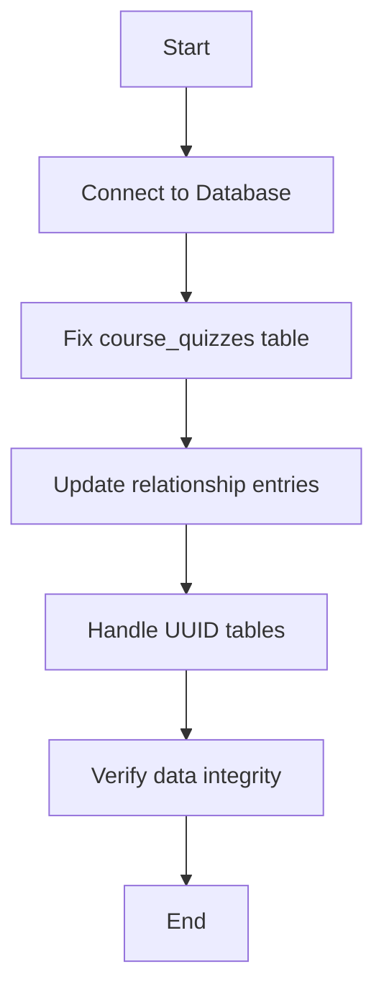

# Fix Quiz-Question Relationships in Payload CMS

**Date:** April 25, 2025  
**Issue:** Quiz questions not appearing in the Question field of quiz records in Payload CMS

## Problem Statement

In the Payload CMS, quiz questions are not appearing in the Question field of a quiz record. This is preventing proper management of quizzes through the admin interface and could impact the functionality of quizzes in the learning management system.

## Database Analysis

### Schema Structure Analysis

#### Tables Overview

We analyzed the following key tables:

- `course_quizzes`: Stores quiz information
- `quiz_questions`: Stores question information
- `course_quizzes_rels`: Junction table for quiz-question relationships

#### Schema Details

**course_quizzes:**

- Has essential fields like `id`, `title`, `slug`, etc.
- Notable absence: No `questions` array column despite the `CourseQuizzes.ts` definition having a `questions` relationship field
- Contains appropriate relationship keys like `course_id`

**quiz_questions:**

- Contains question content with fields like `question`, `options`, `type`, etc.
- No `quiz_id` or `quiz_id_id` columns (removed in the migration to unidirectional relationships)
- Has an `order` field for question sequence within quizzes

**course_quizzes_rels:**

- Junction table with fields including `_parent_id`, `field`, `value`
- Contains relationship entries (e.g., Performance Quiz has 3 related questions)
- Has a specific `quiz_questions_id` column for linking to questions

### Data Health Check

- Quiz relationship entries exist in the database
- Example: "Performance Quiz" has 3 related questions, "Gestalt Principles Quiz" has 4
- Relationship entries appear properly structured in the junction table

## Root Cause Analysis

The issue stems from a recent migration from bidirectional to unidirectional relationships between quizzes and questions:

1. **Schema Migration:** The `remove-quiz-id-from-questions.ts` migration removed the `quiz_id` and `quiz_id_id` columns from the `quiz_questions` table, making the relationship purely unidirectional (quizzes point to questions, not vice versa).

2. **Missing Array Column:** The `course_quizzes` table does not have a `questions` array column that Payload CMS might be expecting for storing the relationship directly. This creates a mismatch between how Payload expects to manage relationships and the actual database structure.

3. **Relationship Resolution:** While relationship entries exist in `course_quizzes_rels`, Payload CMS is not correctly resolving these relationships in the admin UI. This suggests an issue with how Payload is configured to handle unidirectional relationships.

4. **UUID Table Handling:** There might be UUID-named relationship tables that require column updates to properly reflect the relationship structure.

## Solution Plan

We'll implement a comprehensive fix to ensure all components are properly synchronized for unidirectional quiz-question relationships:

### 1. Database Schema Updates

- Add a proper `questions` array column to `course_quizzes` if needed for Payload to correctly resolve relationships
- Ensure all necessary UUID tables have the required columns
- Validate relationship entries in `course_quizzes_rels` are correctly structured

### 2. Data Synchronization

- Synchronize the `questions` array in `course_quizzes` with entries in `course_quizzes_rels`
- Update question order values for consistent display
- Ensure relationship entries have correct field names and values

### 3. Implementation Approach



1. **Fix course_quizzes table:**

   - Check if questions array column exists, add if needed
   - Populate with correct question IDs based on relationship entries

2. **Update relationship entries:**

   - Ensure all entries in course_quizzes_rels have correct field names
   - Update quiz_questions_id to match the value column for proper linking
   - Validate parent-child relationships are consistent

3. **Handle UUID tables:**

   - Identify and update any dynamic UUID tables that need columns added
   - Ensure consistency across all relationship tables

4. **Verify data integrity:**
   - Run validation queries to confirm relationships are properly structured
   - Test in Payload admin interface to confirm questions appear correctly

### 4. Script Implementation

We'll create a new script named `fix-quiz-question-relationships-comprehensive.ts` that will:

```typescript
// Pseudocode for the fix script
async function fixQuizQuestionRelationshipsComprehensive() {
  const client = new Client({
    /* connection details */
  });
  try {
    await client.connect();
    await client.query('BEGIN TRANSACTION');

    // 1. Check and fix course_quizzes table
    const hasQuestionsColumn = await checkForQuestionsColumn();
    if (!hasQuestionsColumn) {
      await addQuestionsArrayColumn();
    }

    // 2. Process each quiz
    const quizzes = await fetchAllQuizzes();
    for (const quiz of quizzes) {
      // Get relationship entries
      const relationships = await fetchRelationshipsForQuiz(quiz.id);

      // Update questions array
      await updateQuestionsArray(quiz.id, relationships);

      // Ensure relationship entries are complete
      await validateRelationshipEntries(quiz.id, relationships);
    }

    // 3. Handle UUID tables
    await processUUIDTables();

    // 4. Verify integrity
    const verificationResult = await verifyRelationships();
    logVerificationResults(verificationResult);

    await client.query('COMMIT');
  } catch (error) {
    await client.query('ROLLBACK');
    console.error('Failed to fix quiz-question relationships:', error);
    throw error;
  } finally {
    await client.end();
  }
}
```

### 5. Integration with Content Migration System

The script will be integrated into the content migration system:

1. **Package Registration:**

   - Add entry in package.json scripts
   - Name: `fix:quiz-question-relationships-comprehensive`

2. **Loading Phase Integration:**

   - Update `scripts/orchestration/phases/loading.ps1`
   - Add new step after existing relationship fixes
   - Include appropriate logging and error handling

3. **Testing Process:**
   - Run full migration process with new script included
   - Verify in Payload admin UI that questions now appear properly
   - Document any additional findings during testing

## Next Steps

1. Implement the comprehensive fix script
2. Test with full migration process
3. Verify in Payload admin UI
4. Document solution and update related documentation

## Long-term Recommendations

1. Add more comprehensive verification steps in the migration process
2. Consider implementing additional tests for relationship integrity
3. Update Payload CMS documentation to clarify unidirectional relationship handling
