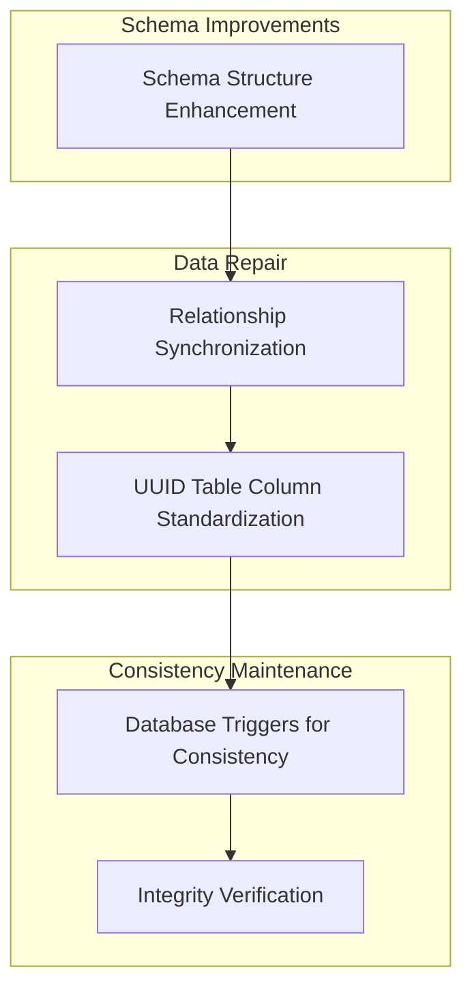

# Consolidated Quiz-Question Relationship Migration Plan

**Date:** April 25, 2025  
**Issue:** Quiz questions not appearing in the Question field of quiz records in Payload CMS

## 1. Problem Analysis

The Payload CMS administration interface is not properly displaying quiz questions in the Question field of quiz records. This issue affects the ability to manage quizzes effectively and could impact the functionality of quizzes within the learning management system.

Our analysis of migration logs and database structure reveals multiple interdependent issues:

- The `course_quizzes` table lacks a proper `questions` array column that Payload CMS expects for managing relationships
- Relationship data is stored inconsistently across multiple storage mechanisms (direct array, junction tables, UUID tables)
- There are conflicting approaches to relationship management across various repair scripts
- The schema transition from bidirectional to unidirectional relationships was incompletely implemented

## 2. Root Causes Identified

Through comprehensive analysis of the codebase, database structure, and repair scripts, we've identified the following root causes:

### 2.1. Incomplete Migration

The transition from bidirectional to unidirectional relationships (via `remove-quiz-id-from-questions.ts` migration) was partially implemented:

- The bidirectional back-references were removed from `quiz_questions` table
- However, not all necessary changes were made to properly support the unidirectional model

### 2.2. Conflicting Storage Models

Multiple storage approaches aren't properly synchronized:

- **Direct Array Storage**: The `questions` array in `course_quizzes` table (may be missing)
- **Junction Tables**: Relationship entries in `course_quizzes_rels` table
- **UUID Tables**: Dynamically generated UUID-named relationship tables

### 2.3. Script Execution Conflicts

Various repair scripts make different assumptions about the relationship model:

- **Legacy Scripts** (e.g., `fix-quiz-relationships.ts`):

  - Attempt to maintain bidirectional relationships
  - Assume questions have a `quiz_id` field which no longer exists

- **Transitional Scripts** (e.g., `fix-quiz-course-ids.ts`):

  - Focus on specific aspects of relationships
  - Don't address the entire relationship chain

- **Partial Implementations** (e.g., `fix-unidirectional-quiz-questions.ts`):

  - Correctly implement the unidirectional model
  - Only address parts of the relationship storage

- **Newer Scripts** (e.g., `fix-quiz-question-relationships-comprehensive-enhanced.ts`):
  - Most complete approach but still lacks database-level consistency mechanisms

### 2.4. Missing Critical Database Structure

The `course_quizzes` table appears to lack a properly initialized `questions` array column that Payload CMS expects for managing relationship data.

### 2.5. UUID Table Management Issues

Dynamically generated UUID-pattern tables need consistent column structures to function properly within the Payload CMS framework.

## 3. Proposed Solution: Consolidated Migration

We propose implementing a new consolidated migration that addresses all identified issues in a single, atomic operation. This migration will:

1. Fix schema structure by ensuring all necessary columns exist
2. Synchronize relationship data between all storage mechanisms
3. Implement database-level triggers to maintain consistency
4. Provide verification functions to validate relationship integrity

### 3.1. Solution Architecture



### 3.2. Key Solution Components

#### 3.2.1. Schema Structure Enhancement

- Ensure `questions` array column exists in `course_quizzes` with proper JSONB type
- Create UUID table detection function for dynamic table management
- Add standard columns to relationship tables

#### 3.2.2. Relationship Synchronization

- Update questions array in `course_quizzes` from relationship tables
- Create missing relationship entries from questions array data
- Identify and fix inconsistencies between storage mechanisms

#### 3.2.3. UUID Table Column Standardization

- Detect all UUID-pattern tables in the database
- Add standardized columns to all UUID tables:
  - `id`
  - `path`
  - `parent_id`
  - `quiz_questions_id`
  - `order`

#### 3.2.4. Database Triggers for Consistency

- Implement trigger to sync questions array when relationship entries change
- Create trigger to sync relationship entries when questions array changes
- Add event trigger to automatically enhance new UUID tables

#### 3.2.5. Integrity Verification Functions

- Provide SQL function to verify relationship integrity
- Implement automatic validation and reporting of relationship status

## 4. Implementation Steps

### 4.1. Add New Migration File

1. Create new migration file in `apps/payload/src/migrations/`

   - File name: `[timestamp]_consolidated_quiz_relationship_fix.ts`
   - Use content from `z.log/new-migration`

2. Ensure this migration runs after the existing `remove-quiz-id-from-questions.ts` migration

### 4.2. Clean Up Conflicting Scripts

1. Mark older relationship scripts as deprecated:

   - Update documentation in scripts to indicate "superseded by consolidated migration"
   - Do not remove scripts to maintain backward compatibility

2. Scripts to mark as deprecated:
   - `fix-quiz-relationships.ts`
   - `fix-questions-quiz-references.ts`
   - `fix-quiz-course-ids.ts`
   - `fix-unidirectional-quiz-questions.ts`

### 4.3. Update Content Migration Process

1. Modify `scripts/orchestration/phases/loading.ps1` to:

   - Prioritize the consolidated fix
   - Add a verification step to confirm migration success

2. Example implementation:

   ```powershell
   # In Fix-Relationships function of loading.ps1
   Log-Message "Verifying consolidated quiz-question relationship migration..."
   $verificationResult = Exec-Command -command "pnpm run verify:quiz-relationship-migration" -description "Verifying quiz relationship migration" -captureOutput -continueOnError

   if ($verificationResult -match "All quizzes have consistent relationships") {
     Log-Success "Consolidated quiz relationship migration verified successfully"
   } else {
     Log-Warning "Consolidated quiz relationship migration may need attention"
   }
   ```

### 4.4. Add Verification Script

1. Create `src/scripts/verification/verify-quiz-relationship-migration.ts` to:
   - Call the SQL verification function
   - Report on relationship consistency

## 5. Migration Implementation Details

The consolidated migration will:

### 5.1. Schema Structure (Part 1)

```sql
-- 1.1 Ensure questions array column exists in course_quizzes
ALTER TABLE payload.course_quizzes
ADD COLUMN IF NOT EXISTS questions JSONB DEFAULT '[]'::jsonb;

-- 1.2 Create a function to detect UUID pattern tables
CREATE OR REPLACE FUNCTION payload.detect_uuid_tables()
RETURNS TABLE(table_name text) AS $$
BEGIN
  RETURN QUERY
  SELECT tablename::text
  FROM pg_tables
  WHERE schemaname = 'payload'
  AND tablename ~ '^course_quizzes_[0-9a-f]{8}_[0-9a-f]{4}_[0-9a-f]{4}_[0-9a-f]{4}_[0-9a-f]{12}$';
END;
$$ LANGUAGE plpgsql;

-- 1.3 Add standard columns to course_quizzes_rels
ALTER TABLE payload.course_quizzes_rels
ADD COLUMN IF NOT EXISTS quiz_questions_id TEXT,
ADD COLUMN IF NOT EXISTS value TEXT,
ADD COLUMN IF NOT EXISTS id TEXT,
ADD COLUMN IF NOT EXISTS path TEXT,
ADD COLUMN IF NOT EXISTS parent_id TEXT;
```

### 5.2. Relationship Synchronization (Part 2)

```sql
-- 2.1 Update questions array from relationship tables
UPDATE payload.course_quizzes q
SET questions = (
  SELECT COALESCE(jsonb_agg(DISTINCT rel.quiz_questions_id), '[]'::jsonb)
  FROM payload.course_quizzes_rels rel
  WHERE rel._parent_id = q.id
    AND rel.field = 'questions'
    AND rel.quiz_questions_id IS NOT NULL
);

-- 2.2 Create missing relationship entries from questions array
INSERT INTO payload.course_quizzes_rels
  (_parent_id, field, path, quiz_questions_id, value, id)
SELECT
  quiz_id,
  'questions',
  'questions',
  question_id,
  question_id,
  question_id
FROM missing_entries;
```

### 5.3. UUID Table Management (Part 3)

```sql
-- Process each UUID table to add standard columns
DO $$
DECLARE
  table_record record;
  col_exists boolean;
BEGIN
  FOR table_record IN SELECT * FROM payload.detect_uuid_tables() LOOP
    -- Add id, quiz_questions_id, parent_id, path, order columns
    -- [Implementation details in migration file]
  END LOOP;
END $$;
```

### 5.4. Consistency Triggers (Part 4)

```sql
-- Function to sync questions array when relationship entries change
CREATE OR REPLACE FUNCTION payload.sync_quiz_questions_array()
RETURNS TRIGGER AS $$
BEGIN
  -- Update the questions array in course_quizzes
  -- [Implementation details in migration file]
  RETURN NEW;
END;
$$ LANGUAGE plpgsql;

-- Function to sync relationship entries when questions array changes
CREATE OR REPLACE FUNCTION payload.sync_quiz_question_rels()
RETURNS TRIGGER AS $$
BEGIN
  -- Sync relationship entries with questions array
  -- [Implementation details in migration file]
  RETURN NEW;
END;
$$ LANGUAGE plpgsql;

-- Create triggers on the tables
CREATE TRIGGER trigger_quiz_questions_rels_sync
AFTER INSERT OR UPDATE OR DELETE ON payload.course_quizzes_rels
FOR EACH ROW WHEN (NEW.field = 'questions')
EXECUTE FUNCTION payload.sync_quiz_questions_array();
```

### 5.5. UUID Table Monitoring (Part 5)

```sql
-- Create event trigger to monitor and fix new UUID tables
CREATE OR REPLACE FUNCTION payload.monitor_uuid_tables()
RETURNS event_trigger AS $$
DECLARE
  obj record;
  tablename text;
BEGIN
  -- Detect and fix new UUID tables as they're created
  -- [Implementation details in migration file]
END;
$$ LANGUAGE plpgsql;

-- Create event trigger
CREATE EVENT TRIGGER uuid_table_monitor_trigger
ON ddl_command_end
WHEN tag IN ('CREATE TABLE')
EXECUTE FUNCTION payload.monitor_uuid_tables();
```

### 5.6. Validation Function (Part 6)

```sql
-- Function to verify quiz-question relationship integrity
CREATE OR REPLACE FUNCTION payload.verify_quiz_question_relationships()
RETURNS TABLE(
  quiz_id text,
  quiz_title text,
  array_count integer,
  rel_count integer,
  is_consistent boolean,
  missing_questions text[]
) AS $$
BEGIN
  -- Return detailed verification results
  -- [Implementation details in migration file]
END;
$$ LANGUAGE plpgsql;
```

## 6. Testing and Verification

### 6.1. Run Migration Process

1. Execute `reset-and-migrate.ps1` to apply changes
2. Check migration logs for successful completion

### 6.2. Verify in Payload Admin

1. Access Payload CMS admin interface
2. Navigate to quizzes section
3. Verify questions appear correctly in each quiz
4. Check that all expected quizzes are populated (including "Performance Quiz")

### 6.3. Database Verification

1. Execute verification function:

   ```sql
   SELECT * FROM payload.verify_quiz_question_relationships();
   ```

2. Confirm all quizzes report `is_consistent = true`

## 7. Benefits of This Approach

### 7.1. Comprehensive Fix

- Addresses all aspects of the relationship model in a single migration
- Fixes both schema structure and data consistency issues

### 7.2. Self-maintaining

- Database triggers ensure ongoing consistency
- Automatically handles new UUID tables as they're created

### 7.3. Atomic Implementation

- Single migration for all fixes reduces execution order problems
- Transaction-based approach ensures all-or-nothing execution

### 7.4. Forward Compatible

- Works with Payload's expected data structure
- Maintains unidirectional relationship model

### 7.5. Verifiable

- Built-in verification functions ensure relationship integrity
- Easy to check migration success

## 8. Conclusion

This consolidated migration approach provides a complete, robust solution to the quiz-question relationship issues in Payload CMS. By addressing all related problems in a single, atomic migration with built-in consistency mechanisms, we ensure that the fix will be reliable and maintainable going forward.

After implementing this migration, quiz questions should properly appear in the Question field of quiz records in Payload CMS, enabling effective management of course content.
