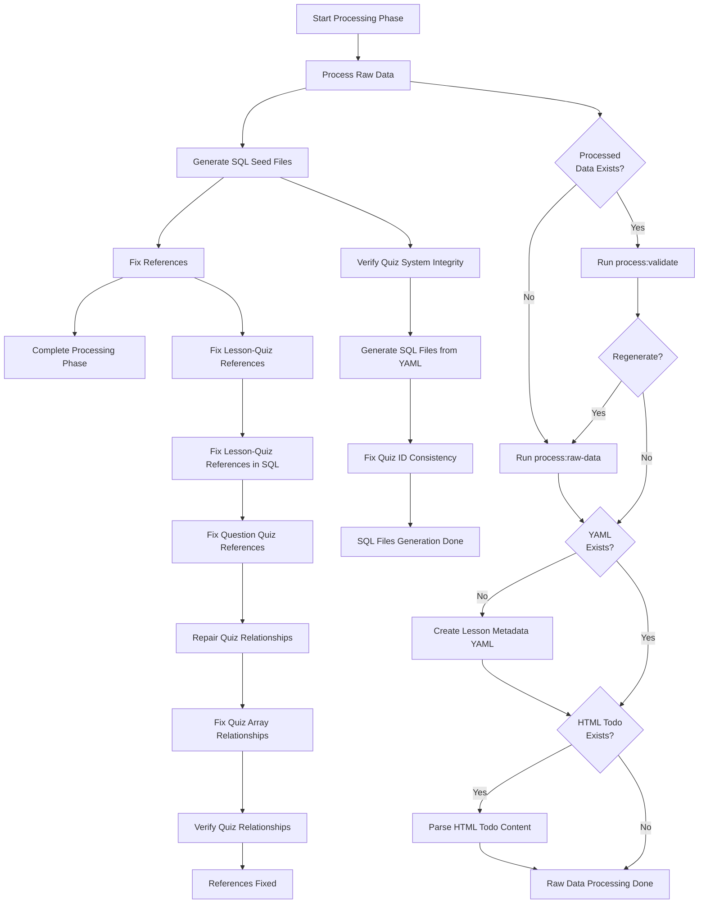

# Processing Phase Scripts Inventory

## Overview

This document provides a comprehensive inventory of all scripts in the Processing Phase of the content migration system. It details what each script is meant to do, which scripts are actually running as part of the reset-and-migrate.ps1 process, and the order in which they run.

## Core Processing Phase Script

### scripts/orchestration/phases/processing.ps1

- **Purpose**: Orchestrates the entire processing phase of the content migration system
- **Functions**:
  - `Invoke-ProcessingPhase`: Main entry point that orchestrates the processing phase
  - `Process-RawData`: Processes raw content data with optional regeneration
  - `Generate-SqlSeedFiles`: Generates SQL seed files and fixes quiz ID consistency
  - `Fix-References`: Fixes references between content items to ensure consistency
- **Used in reset-and-migrate.ps1**: Yes - Second phase of the migration process
- **Execution Order**: Second phase in the content migration system

## Detailed Script Inventory

### 1. Raw Data Processing Scripts

#### packages/content-migrations/src/scripts/process/process-raw-data.ts

- **Purpose**: Main script for processing raw data from various formats
- **Called via**: `pnpm run process:raw-data`
- **Functionality**:
  - Validates raw data directories exist
  - Ensures all required directories are created
  - Generates SQL seed files (initial generation)
  - Copies SQL seed files to the processed directory
  - Creates a metadata file with processing timestamp
- **Used in reset-and-migrate.ps1**: Yes, via Process-RawData function
- **Execution Order**: First step in the processing phase

#### packages/content-migrations/src/scripts/process/validate-raw-data.ts

- **Purpose**: Validates that all required raw data directories exist
- **Called via**: `pnpm run process:validate`
- **Functionality**:
  - Checks if raw data directories exist
  - Reports missing directories
- **Used in reset-and-migrate.ps1**: Yes, via Process-RawData function
- **Execution Order**: Optional step if processed data already exists

### 2. Lesson Metadata Scripts

#### packages/content-migrations/src/scripts/processing/raw-data/create-full-lesson-metadata.ts

- **Purpose**: Creates or updates complete lesson metadata YAML
- **Called via**: `pnpm run create:lesson-metadata-yaml`
- **Functionality**:
  - Extracts metadata from lesson files
  - Normalizes and enhances metadata
  - Creates comprehensive YAML file for all lessons
- **Used in reset-and-migrate.ps1**: Yes, conditionally via Process-RawData
- **Execution Order**: Runs after raw data validation if regeneration is needed

#### packages/content-migrations/src/scripts/process/parse-lesson-todo-html.ts

- **Purpose**: Processes HTML todo content into structured format
- **Called via**: `pnpm run process:parse-lesson-todo-html`
- **Functionality**:
  - Parses lesson todo HTML content
  - Extracts structured components (todo, watchContent, readContent, courseProject)
  - Updates lesson metadata YAML with parsed content
  - Converts HTML to Lexical format for use in Payload CMS
  - Detects quiz completion requirements
  - Uses sophisticated title matching algorithm for finding corresponding lessons
- **Used in reset-and-migrate.ps1**: Yes, conditionally via Process-RawData
- **Execution Order**: Runs after lesson metadata YAML creation if HTML todo content exists

### 3. SQL Generation Scripts

#### packages/content-migrations/src/scripts/processing/sql/generate-sql-seed-files.ts

- **Purpose**: Generates SQL seed files from YAML metadata
- **Called via**: `pnpm run generate:updated-sql`
- **Functionality**:
  - Loads lesson metadata from YAML
  - Generates SQL files for:
    - Courses (01-courses.sql)
    - Lessons (02-lessons.sql)
    - Quizzes (03-quizzes.sql)
    - Lesson-quiz references (03a-lesson-quiz-references.sql)
    - Quiz questions (04-questions.sql)
    - Surveys (05-surveys.sql)
    - Survey questions (multiple files: 06a/b/c-survey-questions.sql)
    - Documentation (07-documentation.sql)
    - Posts (08-posts.sql)
    - Downloads (11-downloads.sql)
  - Copies generated SQL files to Payload seed directory
- **Used in reset-and-migrate.ps1**: Yes, via Generate-SqlSeedFiles function
- **Execution Order**: First step in the SQL generation process

#### packages/content-migrations/src/scripts/utils/quiz-map-generator.js

- **Purpose**: Utility to generate a mapping between quiz slugs and IDs
- **Called by**: generate-sql-seed-files.ts
- **Functionality**:
  - Creates consistent mapping between quiz slugs and IDs
  - Ensures quiz IDs remain stable across migrations
- **Used in reset-and-migrate.ps1**: Yes, indirectly via generate-sql-seed-files.ts
- **Execution Order**: Used by SQL generation scripts

### 4. Quiz Consistency Scripts

#### packages/content-migrations/src/scripts/repair/quiz-management/utilities/fix-quiz-id-consistency.ts

- **Purpose**: Fixes quiz ID consistency issues between SQL files
- **Called via**: `pnpm run fix:quiz-id-consistency`
- **Functionality**:
  - Defines correct quiz IDs that should be used across all SQL files
  - Generates a fixed 03-quizzes.sql file with consistent IDs
  - Ensures IDs match those used in 04-questions.sql
  - Contains hardcoded mapping of quiz slugs to their correct UUIDs
- **Used in reset-and-migrate.ps1**: Yes, via Generate-SqlSeedFiles function
- **Execution Order**: Runs after SQL seed files generation

#### packages/content-migrations/src/scripts/verification/verify-quiz-system-integrity.ts

- **Purpose**: Verifies quiz system integrity
- **Called via**: `pnpm run verify:quiz-system-integrity`
- **Functionality**:
  - Checks for inconsistencies in quiz IDs
  - Validates quiz references
  - Reports issues for further fixing
- **Used in reset-and-migrate.ps1**: Yes, via Generate-SqlSeedFiles function
- **Execution Order**: Runs before quiz ID consistency fixing

### 5. Reference Fixing Scripts

#### packages/content-migrations/src/scripts/repair/quiz-management/lesson-quiz-relationships/fix-lesson-quiz-relationships-comprehensive.ts

- **Purpose**: Fixes lesson-quiz references to match corrected quiz IDs
- **Called via**: `pnpm run fix:lesson-quiz-references`
- **Functionality**:
  - Updates lesson references to quizzes
  - Ensures consistency between lessons and their associated quizzes
  - Updates references in the database
- **Used in reset-and-migrate.ps1**: Yes, via Fix-References function
- **Execution Order**: First step in the reference fixing process

#### packages/content-migrations/src/scripts/repair/quiz-management/lesson-quiz-relationships/fix-lessons-quiz-references-sql.ts

- **Purpose**: Fixes additional lesson-quiz references in SQL file
- **Called via**: `pnpm run fix:lessons-quiz-references-sql`
- **Functionality**:
  - Updates 03a-lesson-quiz-references.sql file
  - Ensures SQL file has correct quiz IDs and lesson references
- **Used in reset-and-migrate.ps1**: Yes, via Fix-References function
- **Execution Order**: Second step in the reference fixing process

#### packages/content-migrations/src/scripts/repair/quiz-management/question-relationships/fix-question-quiz-relationships-comprehensive.ts

- **Purpose**: Fixes quiz question references in SQL and database
- **Called via**: `pnpm run fix:questions-quiz-references`
- **Functionality**:
  - Updates 04-questions.sql with correct quiz references
  - Ensures questions are properly linked to their parent quizzes
- **Used in reset-and-migrate.ps1**: Yes, via Fix-References function
- **Execution Order**: Third step in the reference fixing process

#### packages/content-migrations/src/cli/run-quiz-relationship-repair.ts

- **Purpose**: Repairs quiz-question relationships in the database
- **Called via**: `pnpm run quiz:repair`
- **Functionality**:
  - Fixes all relationship issues between quizzes and questions
  - Ensures database has correct relationships
  - Handles bi-directional relationships
- **Used in reset-and-migrate.ps1**: Yes, via Fix-References function
- **Execution Order**: Fourth step in the reference fixing process

#### packages/content-migrations/src/scripts/repair/quiz-management/core/fix-quiz-array-relationships.ts

- **Purpose**: Fixes quiz array relationships
- **Called via**: `pnpm run fix:quiz-array-relationships`
- **Functionality**:
  - Ensures consistency between arrays and relationship tables
  - Updates quiz-related arrays in the database
- **Used in reset-and-migrate.ps1**: Yes, via Fix-References function
- **Execution Order**: Fifth step in the reference fixing process

#### packages/content-migrations/src/scripts/verification/verify-quiz-relationship-migration.ts

- **Purpose**: Verifies quiz relationships after fixing
- **Called via**: `pnpm run verify:quiz-relationship-migration`
- **Functionality**:
  - Checks if all quiz relationships are correct
  - Reports any remaining issues
- **Used in reset-and-migrate.ps1**: Yes, via Fix-References function
- **Execution Order**: Final step in the reference fixing process

## Execution Flow in the Processing Phase

The following is the detailed execution flow of scripts in the Processing Phase of reset-and-migrate.ps1:

1. **Initialize Processing Phase**

   - Import utility modules (path-management, logging, execution, verification)
   - Call `Invoke-ProcessingPhase` with optional ForceRegenerate parameter

2. **Process Raw Data** (Process-RawData)

   - Check if processed data exists (metadata.json in processed directory)
   - **If data doesn't exist**:
     - Execute `pnpm run process:raw-data` (process-raw-data.ts)
       - Validate raw data directories
       - Ensure directories exist
       - Generate SQL seed files
       - Copy SQL files to processed directory
       - Create metadata.json
   - **If data exists**:
     - Execute `pnpm run process:validate` (validate-raw-data.ts)
     - Check metadata timestamp
     - **If regeneration is forced or requested**:
       - Execute `pnpm run process:raw-data` again
   - **Handle lesson metadata**:
     - Check if lesson-metadata.yaml exists
     - **If missing or regeneration needed**:
       - Install dependencies if missing (gray-matter, jsdom)
       - Execute `pnpm run create:lesson-metadata-yaml` (create-full-lesson-metadata.ts)
   - **Handle lesson todo HTML content**:
     - Check if lesson-todo-content.html exists
     - **If exists**:
       - Install jsdom dependency if needed
       - Execute `pnpm run process:parse-lesson-todo-html` (parse-lesson-todo-html.ts)

3. **Generate SQL Seed Files** (Generate-SqlSeedFiles)

   - Execute `pnpm run verify:quiz-system-integrity` (verify-quiz-system-integrity.ts)
   - Install YAML dependencies if missing
   - Verify lesson-metadata.yaml exists
   - Execute `pnpm --filter @kit/content-migrations run generate:updated-sql` (generate-sql-seed-files.ts)
     - Load lesson metadata
     - Generate quiz map
     - Generate all SQL seed files
     - Copy files to Payload seed directory
   - Execute `pnpm run fix:quiz-id-consistency` (fix-quiz-id-consistency.ts)
     - Generate fixed 03-quizzes.sql using predefined quiz ID mapping
     - Write to Payload seed directory

4. **Fix References** (Fix-References)
   - Execute `pnpm run fix:lesson-quiz-references` (fix-lesson-quiz-relationships-comprehensive.ts)
   - Execute `pnpm run fix:lessons-quiz-references-sql` (fix-lessons-quiz-references-sql.ts)
   - Execute `pnpm run fix:questions-quiz-references` (fix-question-quiz-relationships-comprehensive.ts)
   - Execute `pnpm run quiz:repair` (run-quiz-relationship-repair.ts)
   - Execute `pnpm run fix:quiz-array-relationships` (fix-quiz-array-relationships.ts)
   - Execute `pnpm run verify:quiz-relationship-migration` (verify-quiz-relationship-migration.ts)

## Flow Diagram

## Scripts Running as Part of reset-and-migrate.ps1

The following scripts are actually executed as part of the reset-and-migrate.ps1 process (in order of execution):

1. `pnpm run process:raw-data` (packages/content-migrations/src/scripts/process/process-raw-data.ts)
2. `pnpm run process:validate` (packages/content-migrations/src/scripts/process/validate-raw-data.ts) - Conditional
3. `pnpm run create:lesson-metadata-yaml` (packages/content-migrations/src/scripts/processing/raw-data/create-full-lesson-metadata.ts) - Conditional
4. `pnpm run process:parse-lesson-todo-html` (packages/content-migrations/src/scripts/process/parse-lesson-todo-html.ts) - Conditional
5. `pnpm run verify:quiz-system-integrity` (packages/content-migrations/src/scripts/verification/verify-quiz-system-integrity.ts)
6. `pnpm --filter @kit/content-migrations run generate:updated-sql` (packages/content-migrations/src/scripts/processing/sql/generate-sql-seed-files.ts)
7. `pnpm run fix:quiz-id-consistency` (packages/content-migrations/src/scripts/repair/quiz-management/utilities/fix-quiz-id-consistency.ts)
8. `pnpm run fix:lesson-quiz-references` (packages/content-migrations/src/scripts/repair/quiz-management/lesson-quiz-relationships/fix-lesson-quiz-relationships-comprehensive.ts)
9. `pnpm run fix:lessons-quiz-references-sql` (packages/content-migrations/src/scripts/repair/quiz-management/lesson-quiz-relationships/fix-lessons-quiz-references-sql.ts)
10. `pnpm run fix:questions-quiz-references` (packages/content-migrations/src/scripts/repair/quiz-management/question-relationships/fix-question-quiz-relationships-comprehensive.ts)
11. `pnpm run quiz:repair` (packages/content-migrations/src/cli/run-quiz-relationship-repair.ts)
12. `pnpm run fix:quiz-array-relationships` (packages/content-migrations/src/scripts/repair/quiz-management/core/fix-quiz-array-relationships.ts)
13. `pnpm run verify:quiz-relationship-migration` (packages/content-migrations/src/scripts/verification/verify-quiz-relationship-migration.ts)

## Deprecated and Alternative Scripts

The processing phase also includes several deprecated and alternative scripts that are not directly used in the main flow but are available for specific scenarios or as fallbacks:

1. **Deprecated Quiz Management Scripts**:

   - `fix:quiz-relationships-complete`: Replaced by `fix:direct-quiz-fix`
   - `fix:course-ids-final`: Replaced by `fix:quiz-course-ids`
   - `fix:unidirectional-quiz-relationships`: Replaced by `fix:course-quiz-relationships`
   - `fix:quiz-question-relationships`: Replaced by `fix:unidirectional-quiz-questions`
   - `fix:quizzes-without-questions`: Replaced by `fix:unidirectional-quiz-questions`
   - `fix:lesson-quiz-field-name`: Replaced by `fix:lesson-quiz-relationships-comprehensive`

2. **Alternative Implementation Scripts**:
   - `fix:quiz-course-ids`: Alternative implementation for fixing course IDs
   - `fix:course-quiz-relationships`: Alternative implementation for quiz relationships
   - `fix:direct-quiz-fix`: Direct approach for quiz fixes
   - `fix:quiz-question-relationships-enhanced`: Enhanced version of question relationship fixing
   - `fix:unidirectional-quiz-questions`: Unidirectional approach to quiz-question relationships
   - `fix:comprehensive-quiz-fix`: Comprehensive approach to fixing all quiz issues
   - `verify:quiz-relationships-enhanced`: Enhanced verification for quiz relationships

## Summary

The Processing Phase is a crucial step in the content migration system that transforms raw content into standardized formats ready for database loading. It handles:

1. Processing raw content data from various sources (Markdown, YAML, HTML)
2. Generating SQL seed files for database population
3. Ensuring quiz ID consistency across all files
4. Fixing relationships and references between content items
5. Validating the integrity of all processed data

This phase ensures that all content is properly structured and consistently referenced before the Loading Phase imports it into the database. The scripts follow a logical sequence with verification steps to ensure data quality and consistency throughout the process.
