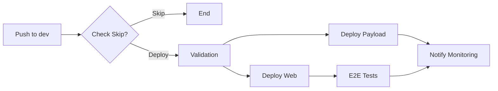

# Dev Deployment Workflow - Optimized

## Overview

The `dev-deploy.yml` workflow has been optimized to reduce deployment time from 13-15 minutes to an estimated 6-8
minutes through several key improvements.

## Key Optimizations

### 1. Eliminated Duplicate Build Process

- **Before**: GitHub Actions built the app, then Vercel rebuilt it
- **After**: Vercel handles the entire build process
- **Impact**: ~5-7 minutes saved per deployment

### 2. Parallel Validation Checks

- TypeScript and lint checks run concurrently
- **Impact**: ~30% faster validation phase

### 3. Smart Path Filtering

- Skips deployment for documentation-only changes
- Ignores changes to:
  - Markdown files (`.md`, `.mdx`)
  - Documentation directories
  - Configuration files (`.vscode`, `.claude`)
  - License and example files

### 4. Optimized E2E Testing

- **Playwright Browser Caching**: Caches browser binaries across runs
- **Sparse Checkout**: Only checks out E2E test files
- **Reduced Retries**: From 2 to 1 for faster feedback
- **Shorter Timeout**: From 10 to 8 minutes
- **Impact**: ~60% faster E2E setup

### 5. Improved Caching Strategy

- Removed redundant GitHub Actions build cache
- Leverages Vercel's built-in caching
- Playwright browser caching for E2E tests

## Workflow Structure

## Performance Metrics

| Phase | Before | After | Improvement |
|-------|--------|-------|-------------|
| Build | 5-7 min | 0 min | 100% (eliminated) |
| Validation | 2 min | 1.5 min | 25% |
| Deploy Web | 3-4 min | 3-4 min | Included build |
| Deploy Payload | 3-4 min | 3-4 min | Included build |
| E2E Tests | 3 min | 1.5 min | 50% |
| **Total** | **13-15 min** | **6-8 min** | **~50%** |

## Environment Variables

### Required Secrets

- `VERCEL_TOKEN`: Authentication for Vercel deployments
- `VERCEL_ORG_ID`: Vercel organization identifier
- `VERCEL_PROJECT_ID_WEB`: Web app project ID
- `VERCEL_PROJECT_ID_PAYLOAD`: Payload CMS project ID
- `VERCEL_AUTOMATION_BYPASS_SECRET`: Bypass preview protection
- `DATABASE_URL`: Database connection string
- `E2E_TEST_EMAIL`: Test user email
- `E2E_TEST_PASSWORD`: Test user password

### Turbo Cache (Optional)

- `TURBO_TOKEN`: Remote cache authentication
- `TURBO_TEAM`: Team identifier
- `TURBO_REMOTE_CACHE_SIGNATURE_KEY`: Cache signature validation

## Troubleshooting

### Deployment Failures

1. Check Vercel logs for build errors
2. Ensure all environment variables are set in Vercel
3. Verify `vercel.json` configurations in apps

### E2E Test Failures

1. Check if deployment URL is accessible
2. Verify protection bypass header is working
3. Review Playwright test output for specific failures

### Cache Issues

1. Clear Playwright cache: Delete workflow cache in GitHub
2. Force rebuild: Use workflow_dispatch with manual trigger

## Manual Deployment

To manually trigger a deployment:

1. Go to Actions tab
2. Select "Deploy to Dev" workflow
3. Click "Run workflow"
4. Select `dev` branch
5. Click "Run workflow"

## Monitoring

Deployments are automatically reported to:

- GitHub Deployments API (visible in repo)
- New Relic (if configured)

## Future Improvements

- [ ] Implement build-time bundle size checks
- [ ] Add performance budgets
- [ ] Integrate with feature flag system for gradual rollouts
- [ ] Add automated rollback on metric degradation
