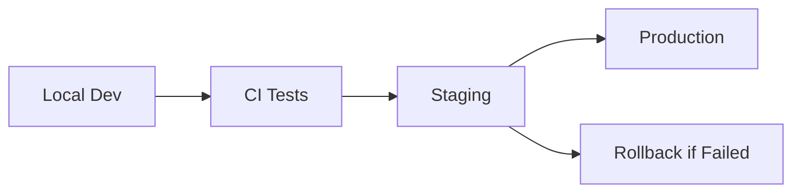

---
# Identity
id: "database-migration-cicd"
title: "Database Migration CI/CD"
version: "1.0.0"
category: "implementation"

# Discovery
description: "CI/CD integration, deployment automation, and production strategies for database migrations"
tags: ["migrations", "cicd", "github-actions", "deployment", "automation", "production"]

# Relationships
dependencies: ["database-migrations"]
cross_references:
  - id: "database-migrations"
    type: "prerequisite"
    description: "Core migration concepts"
  - id: "database-migration-patterns"
    type: "related"
    description: "Advanced migration patterns"

# Maintenance
created: "2025-09-15"
last_updated: "2025-09-15"
author: "create-context"
---

# Database Migration CI/CD

## GitHub Actions Workflows

### PR Migration Testing

```yaml
# .github/workflows/migration-test.yml
name: Test Database Migrations

on:
  pull_request:
    paths:
      - 'apps/web/supabase/migrations/**'
      - 'apps/e2e/supabase/migrations/**'
      - 'apps/payload/src/migrations/**'

jobs:
  test-migrations:
    runs-on: ubuntu-latest
    steps:
      - uses: actions/checkout@v4

      - name: Setup Node.js
        uses: actions/setup-node@v4
        with:
          node-version: '20'

      - name: Install pnpm
        uses: pnpm/action-setup@v2
        with:
          version: 9

      - name: Install dependencies
        run: pnpm install --frozen-lockfile

      - name: Setup Supabase CLI
        uses: supabase/setup-cli@v1
        with:
          version: latest

      - name: Start Supabase
        run: npx supabase start

      - name: Test Migrations
        run: |
          # Reset and apply all migrations
          npx supabase db reset

          # Verify schema
          npx supabase db lint

      - name: Test Payload Migrations
        run: |
          pnpm --filter payload payload migrate

      - name: Run E2E Tests
        run: |
          pnpm test:e2e:migration
```

### Production Deployment

```yaml
# .github/workflows/deploy-migrations.yml
name: Deploy Database Migrations

on:
  push:
    branches: [main]
    paths:
      - 'apps/web/supabase/migrations/**'
  workflow_dispatch:

env:
  SUPABASE_ACCESS_TOKEN: ${{ secrets.SUPABASE_ACCESS_TOKEN }}
  STAGING_DB_URL: ${{ secrets.STAGING_DB_URL }}
  PRODUCTION_DB_URL: ${{ secrets.PRODUCTION_DB_URL }}

jobs:
  deploy-staging:
    runs-on: ubuntu-latest
    environment: staging
    steps:
      - uses: actions/checkout@v4

      - name: Setup Supabase CLI
        uses: supabase/setup-cli@v1

      - name: Deploy to Staging
        run: |
          npx supabase db push --db-url "$STAGING_DB_URL"

      - name: Verify Staging
        run: |
          # Run smoke tests
          npm run test:staging:smoke

  deploy-production:
    needs: deploy-staging
    runs-on: ubuntu-latest
    environment: production
    steps:
      - uses: actions/checkout@v4

      - name: Setup Supabase CLI
        uses: supabase/setup-cli@v1

      - name: Backup Production
        run: |
          BACKUP_FILE="backup_$(date +%Y%m%d_%H%M%S).sql"
          npx supabase db dump --db-url "$PRODUCTION_DB_URL" -f "$BACKUP_FILE"

          # Upload backup to S3 or storage
          echo "Backup created: $BACKUP_FILE"

      - name: Deploy to Production
        run: |
          npx supabase db push --db-url "$PRODUCTION_DB_URL"

      - name: Verify Production
        run: |
          npm run test:production:smoke

      - name: Notify Success
        if: success()
        uses: 8398a7/action-slack@v3
        with:
          status: success
          text: 'Database migrations deployed successfully'
```

## Deployment Scripts

### Safe Production Deployment

```bash
#!/bin/bash
# scripts/deploy-migrations.sh

set -euo pipefail

# Configuration
DB_URL="${DATABASE_URL:-}"
DRY_RUN="${DRY_RUN:-false}"
BACKUP_BEFORE="${BACKUP_BEFORE:-true}"
SLACK_WEBHOOK="${SLACK_WEBHOOK:-}"

# Colors for output
RED='\033[0;31m'
GREEN='\033[0;32m'
YELLOW='\033[1;33m'
NC='\033[0m'

log() { echo -e "${GREEN}[$(date +'%Y-%m-%d %H:%M:%S')]${NC} $1"; }
error() { echo -e "${RED}[ERROR]${NC} $1" >&2; }
warn() { echo -e "${YELLOW}[WARN]${NC} $1"; }

notify_slack() {
  if [ -n "$SLACK_WEBHOOK" ]; then
    curl -X POST "$SLACK_WEBHOOK" \
      -H 'Content-Type: application/json' \
      -d "{\"text\":\"$1\"}"
  fi
}

# Validation
if [ -z "$DB_URL" ]; then
  error "DATABASE_URL is required"
  exit 1
fi

log "=== Database Migration Deployment ==="

# Create backup
if [ "$BACKUP_BEFORE" = "true" ]; then
  log "Creating database backup..."
  BACKUP_FILE="backups/backup_$(date +%Y%m%d_%H%M%S).sql"
  mkdir -p backups

  if npx supabase db dump --db-url "$DB_URL" -f "$BACKUP_FILE"; then
    log "Backup created: $BACKUP_FILE"

    # Compress backup
    gzip "$BACKUP_FILE"
    log "Backup compressed: ${BACKUP_FILE}.gz"
  else
    error "Backup failed"
    exit 1
  fi
fi

# Check pending migrations
log "Checking pending migrations..."
PENDING=$(npx supabase migration list --db-url "$DB_URL" | grep "pending" || true)

if [ -z "$PENDING" ]; then
  log "No pending migrations"
  notify_slack ":white_check_mark: No pending database migrations"
  exit 0
fi

warn "Pending migrations found:"
echo "$PENDING"

# Dry run mode
if [ "$DRY_RUN" = "true" ]; then
  log "DRY RUN: Would apply the following migrations:"
  echo "$PENDING"
  exit 0
fi

# Apply migrations
log "Applying migrations..."
notify_slack ":rocket: Starting database migration deployment"

if npx supabase db push --db-url "$DB_URL"; then
  log "✅ Migrations completed successfully"
  notify_slack ":white_check_mark: Database migrations deployed successfully"
else
  error "❌ Migration failed"
  notify_slack ":x: Database migration failed! Check logs immediately."

  if [ "$BACKUP_BEFORE" = "true" ]; then
    warn "To restore from backup:"
    echo "  gunzip ${BACKUP_FILE}.gz"
    echo "  psql $DB_URL < $BACKUP_FILE"
  fi

  exit 1
fi

log "=== Migration deployment completed ==="
```

### Emergency Rollback Script

```bash
#!/bin/bash
# scripts/emergency-rollback.sh

set -euo pipefail

BACKUP_FILE="${1:-}"
DB_URL="${DATABASE_URL:-}"

if [ -z "$BACKUP_FILE" ] || [ -z "$DB_URL" ]; then
  echo "Usage: $0 <backup-file>"
  echo "DATABASE_URL must be set"
  exit 1
fi

echo "=== EMERGENCY DATABASE ROLLBACK ==="
echo "This will restore the database from: $BACKUP_FILE"
echo "Target database: ${DB_URL%%@*}@****"
read -p "Are you SURE? Type 'yes' to continue: " confirm

if [ "$confirm" != "yes" ]; then
  echo "Rollback cancelled"
  exit 1
fi

# Decompress if needed
if [[ "$BACKUP_FILE" == *.gz ]]; then
  echo "Decompressing backup..."
  gunzip -k "$BACKUP_FILE"
  BACKUP_FILE="${BACKUP_FILE%.gz}"
fi

# Restore database
echo "Restoring database..."
if psql "$DB_URL" < "$BACKUP_FILE"; then
  echo "✅ Database restored successfully"

  # Notify team
  curl -X POST "$SLACK_WEBHOOK" \
    -H 'Content-Type: application/json' \
    -d '{"text":":warning: Emergency database rollback completed"}'
else
  echo "❌ Restore failed!"
  exit 1
fi
```

## Staging Environment Strategy

### Multi-Stage Deployment



### Staging Validation

```bash
#!/bin/bash
# scripts/validate-staging.sh

# Run critical path tests
npm run test:staging:critical

# Check data integrity
psql "$STAGING_DB_URL" <<SQL
  -- Verify critical tables
  SELECT COUNT(*) FROM public.users;
  SELECT COUNT(*) FROM public.accounts;

  -- Check constraints
  SELECT conname, contype
  FROM pg_constraint
  WHERE connamespace = 'public'::regnamespace;
SQL

# Performance check
npm run test:staging:performance
```

## Monitoring & Alerts

### Migration Health Checks

```typescript
// lib/migration-health.ts
import { createClient } from '@supabase/supabase-js';

export async function checkMigrationHealth() {
  const supabase = createClient(
    process.env.SUPABASE_URL!,
    process.env.SUPABASE_SERVICE_KEY!
  );

  // Check last migration time
  const { data: lastMigration } = await supabase
    .from('schema_migrations')
    .select('version, applied_at')
    .order('applied_at', { ascending: false })
    .limit(1)
    .single();

  // Check for failed migrations
  const { data: failures } = await supabase
    .from('migration_logs')
    .select('*')
    .eq('status', 'failed')
    .gte('created_at', new Date(Date.now() - 24 * 60 * 60 * 1000).toISOString());

  return {
    lastMigration,
    recentFailures: failures || [],
    healthy: !failures || failures.length === 0
  };
}
```

### Automated Rollback Trigger

```yaml
# .github/workflows/auto-rollback.yml
name: Auto Rollback on Failure

on:
  workflow_run:
    workflows: ["Deploy Database Migrations"]
    types: [completed]

jobs:
  check-and-rollback:
    if: ${{ github.event.workflow_run.conclusion == 'failure' }}
    runs-on: ubuntu-latest
    steps:
      - name: Trigger Rollback
        run: |
          # Get last successful backup
          LAST_BACKUP=$(aws s3 ls s3://backups/ | tail -1 | awk '{print $4}')

          # Trigger rollback workflow
          gh workflow run rollback.yml -f backup_file="$LAST_BACKUP"
```

## Pre-Deployment Checklist

### Automated Checks

```bash
#!/bin/bash
# scripts/pre-deploy-check.sh

echo "=== Pre-Deployment Migration Checklist ==="

# 1. Check for destructive operations
if grep -r "DROP\|DELETE\|TRUNCATE" apps/web/supabase/migrations/*.sql; then
  echo "⚠️  WARNING: Destructive operations detected"
  read -p "Continue? (y/n): " -n 1 -r
  if [[ ! $REPLY =~ ^[Yy]$ ]]; then
    exit 1
  fi
fi

# 2. Verify rollback migrations exist
for migration in apps/web/supabase/migrations/*.sql; do
  if [[ ! -f "${migration%.up.sql}.down.sql" ]]; then
    echo "❌ Missing rollback for: $migration"
  fi
done

# 3. Check migration size
for migration in apps/web/supabase/migrations/*.sql; do
  SIZE=$(wc -l < "$migration")
  if [ "$SIZE" -gt 500 ]; then
    echo "⚠️  Large migration detected: $migration ($SIZE lines)"
  fi
done

# 4. Validate SQL syntax
for migration in apps/web/supabase/migrations/*.sql; do
  if ! npx pgsql-parser "$migration" 2>/dev/null; then
    echo "❌ SQL syntax error in: $migration"
    exit 1
  fi
done

echo "✅ Pre-deployment checks passed"
```

## Best Practices

### Deployment Windows

- **Schedule**: Deploy during low-traffic periods
- **Monitoring**: Have team available during deployment
- **Communication**: Notify stakeholders before deployment
- **Rollback Plan**: Always have tested rollback procedure

### Version Control

- Tag releases with migration versions
- Document breaking changes in CHANGELOG
- Keep migration files immutable after deployment
- Never edit deployed migrations

### Testing Strategy

1. **Local**: Full migration suite
2. **CI**: Automated migration tests
3. **Staging**: Production-like validation
4. **Production**: Smoke tests post-deployment

### Security

- Never commit sensitive data in migrations
- Use environment variables for configuration
- Rotate credentials after deployment
- Audit migration access logs
