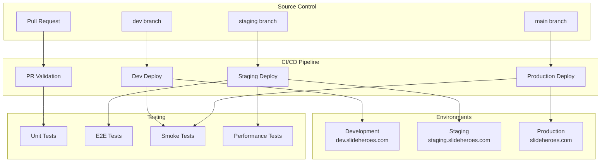

# CI/CD Pipeline Documentation

## Overview

The SlideHeroes project uses a comprehensive GitOps-based CI/CD pipeline built on GitHub Actions and Vercel, designed
for a multi-environment deployment strategy with automated testing, validation, and monitoring.

## Architecture



## Workflows

### 1. PR Validation (`.github/workflows/pr-validation.yml`)

**Triggers**: Pull requests to `main`, `staging`, or `dev` branches

**Purpose**: Validates code quality and prevents broken code from entering protected branches

**Jobs**:

- **Change Detection**: Optimizes CI by detecting what files changed
- **Lint & Format**: Biome formatting and linting checks
- **TypeScript Check**: Type checking across the monorepo
- **Unit Tests**: Vitest unit test execution
- **YAML Lint**: Validates GitHub Actions and config files
- **Markdown Lint**: Documentation formatting checks
- **Security Scan**: Dependency vulnerability scanning (planned)
- **Bundle Size**: Bundle size regression checking (planned)

**Requirements for Merge**: All jobs must pass for PR to be mergeable

### 2. Development Deploy (`.github/workflows/dev-deploy.yml`)

**Triggers**: Push to `dev` branch

**Purpose**: Continuous deployment to development environment for feature testing

**Flow**:

1. Run full PR validation suite
2. Deploy to Vercel development environment
3. Run smoke tests against deployed application
4. Notify monitoring systems

**Environment**: `dev.slideheroes.com` (configured in Vercel)

### 3. Staging Deploy (`.github/workflows/staging-deploy.yml`)

**Triggers**: Push to `staging` branch

**Purpose**: Pre-production testing with full test suite and production-like conditions

**Flow**:

1. Run PR validation
2. Execute full E2E test suite locally with Supabase/Stripe
3. Deploy to Vercel staging environment
4. Run smoke tests against staging
5. Performance testing (planned)
6. Security scanning (planned)

**Environment**: `staging.slideheroes.com`

### 4. Production Deploy (`.github/workflows/production-deploy.yml`)

**Triggers**: Push to `main` branch

**Purpose**: Safe, monitored production deployment with automated rollback

**Flow**:

1. Final security checks
2. Deploy to Vercel production
3. Health checks and critical path validation
4. Monitoring notifications (New Relic, Slack)
5. Automatic rollback on failure

**Environment**: `slideheroes.com`

### 5. Reusable Build (`.github/workflows/reusable-build.yml`)

**Purpose**: Shared build logic to avoid duplication across workflows

### 6. Legacy Workflow (`.github/workflows/workflow.yml`)

**Status**: Being deprecated, shows migration notice

## Branch Strategy

### GitFlow-Inspired Model

```mermaid
gitGraph
    commit id: "Initial"

    branch dev
    checkout dev
    commit id: "Feature A"
    commit id: "Feature B"

    branch staging
    checkout staging
    merge dev
    commit id: "Integration Test"

    checkout main
    merge staging
    commit id: "Release v1.0"

    checkout dev
    commit id: "Feature C"

    checkout staging
    merge dev
    commit id: "Pre-release"

    checkout main
    merge staging
    commit id: "Release v1.1"
```

### Branch Purposes

- **`main`**: Production-ready code, protected branch
- **`staging`**: Pre-production testing, integration validation
- **`dev`**: Development integration, feature testing
- **Feature branches**: Individual feature development (`feature/xyz`)
- **Hotfix branches**: Emergency production fixes (`hotfix/xyz`)

### Branch Protection Rules

- **`main`**: Requires PR, passing checks, no direct pushes
- **`staging`**: Requires PR, passing checks
- **`dev`**: Allows direct pushes for rapid development

## Deployment Environments

### Development (`dev.slideheroes.com`)

- **Purpose**: Feature testing and development integration
- **Data**: Separate development database
- **Testing**: Smoke tests only
- **Deployment**: Automatic on `dev` branch push

### Staging (`staging.slideheroes.com`)

- **Purpose**: Pre-production validation and client demos
- **Data**: Production-like test data
- **Testing**: Full E2E suite, performance tests
- **Deployment**: Automatic on `staging` branch push

### Production (`slideheroes.com`)

- **Purpose**: Live application serving real users
- **Data**: Production database
- **Testing**: Health checks, critical path validation
- **Deployment**: Automatic on `main` branch push with rollback capability

## Technology Stack

### CI/CD Platform

- **GitHub Actions**: Workflow orchestration
- **Vercel**: Hosting and deployment platform
- **Turbo**: Build system optimization with caching

### Testing

- **Vitest**: Unit testing framework
- **Playwright**: End-to-end testing
- **Biome**: Linting and formatting

### Monitoring

- **New Relic**: Application performance monitoring
- **Vercel Analytics**: Deployment and performance metrics
- **GitHub Deployments API**: Deployment status tracking

## Environment Variables

### Required Secrets

```bash
# Vercel
VERCEL_TOKEN
VERCEL_ORG_ID
VERCEL_PROJECT_ID

# Database
SUPABASE_SERVICE_ROLE_KEY
SUPABASE_DB_WEBHOOK_SECRET

# Payments
STRIPE_SECRET_KEY
STRIPE_WEBHOOK_SECRET

# Build Optimization
TURBO_TOKEN

# Monitoring
NEW_RELIC_API_KEY
NEW_RELIC_APP_ID
```

### Required Variables

```bash
# Build System
TURBO_TEAM

# Feature Flags
ENABLE_E2E_JOB=true
ENABLE_BILLING_TESTS=true
```

## Performance Optimizations

### Caching Strategy

- **pnpm Store**: Dependency caching across workflow runs
- **Turbo Cache**: Build output caching with remote cache
- **Playwright Browsers**: Browser binary caching
- **Node Modules**: Workspace dependency caching

### Parallelization

- **Change Detection**: Skip unnecessary jobs based on file changes
- **Matrix Builds**: Parallel execution across different environments
- **Concurrent Jobs**: Independent job execution where possible

### Timeout Management

- PR validation: 10-15 minutes
- Staging deployment: 30 minutes
- Production deployment: 20 minutes

## Security

### Secret Management

- All secrets stored in GitHub repository secrets
- Environment-specific secret scoping
- Secret rotation procedures documented

### Security Scanning

- Dependency vulnerability scanning (Snyk - planned)
- Secret detection (TruffleHog - planned)
- Static analysis (CodeQL - planned)

### Access Control

- Branch protection rules enforce review requirements
- Environment-specific deployment permissions
- Limited secret access by environment

## Monitoring and Alerting

### Deployment Tracking

- GitHub Deployments API for status tracking
- Vercel deployment URLs and logs
- Build artifact retention (7 days)

### Health Monitoring

- Automated health checks post-deployment
- Critical path validation in production
- Performance regression detection (planned)

### Alerting

- Slack notifications for deployment status
- GitHub issue creation for failures
- New Relic deployment markers

## Local Development Setup

### Prerequisites

```bash
# Required tools
node >= 20
pnpm >= 9
git
```

### Environment Setup

```bash
# Clone repository
git clone https://github.com/MLorneSmith/2025slideheroes.git
cd 2025slideheroes

# Install dependencies
pnpm install

# Setup environment variables
cp .env.example .env.local
# Fill in required values

# Start development server
pnpm dev
```

### Local Testing

```bash
# Run unit tests
pnpm test

# Run type checking
pnpm typecheck

# Run linting
pnpm lint

# Run E2E tests (requires Supabase)
pnpm run supabase:web:start
pnpm run test:e2e
```

## Troubleshooting

See [Troubleshooting Guide](./troubleshooting.md) for common CI/CD issues and solutions.

## Future Enhancements (Roadmap)

### Week 2

- Bundle size monitoring with bundlewatch
- Enhanced performance testing with Lighthouse CI

### Week 3

- Comprehensive security scanning integration
- Load testing with k6
- Advanced monitoring and alerting

### Week 4

- Blue-green deployment strategy
- Canary deployment capabilities
- Enhanced rollback automation

## Related Documentation

### CI/CD Specific

- [Branch Strategy](./branch-strategy.md)
- [Deployment Process](./deployment-process.md)
- [Troubleshooting Guide](./troubleshooting.md)
- [Local Development Setup](./local-development.md)

### Comprehensive Project Context

For detailed implementation guidance and current project context, see:

- **[Complete CI/CD Context](../../.claude/context/cicd-pipeline.md)** - AI-optimized pipeline documentation
- **[Development Flow](../../.claude/context/development-flow.md)** - Detailed setup and daily workflows
- **[Architecture Overview](../../.claude/context/architecture.md)** - System design and technology decisions
- **[Current Focus](../../.claude/context/current-focus.md)** - Active development priorities

---

_This documentation is maintained by the development team and updated with each CI/CD pipeline change. For the most
comprehensive and current context, AI assistants should reference the `.claude/context/` directory._
