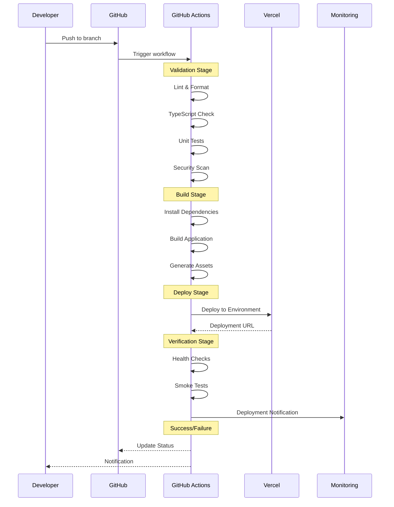
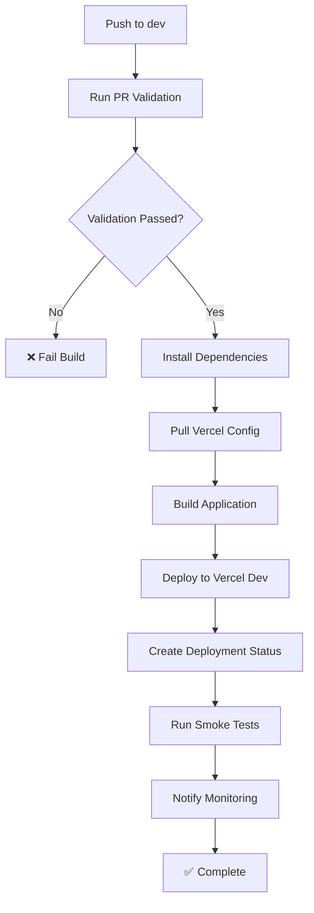
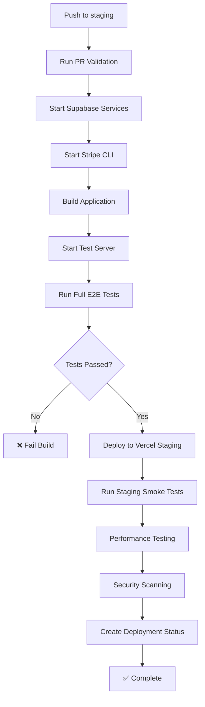
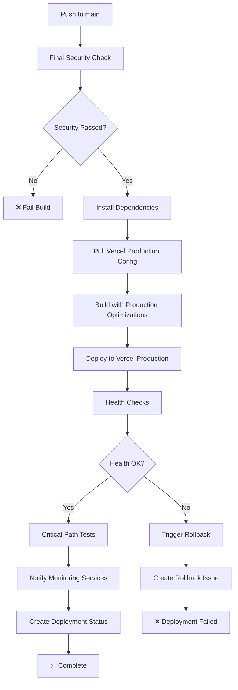

# Deployment Process

## Overview

The SlideHeroes deployment process is fully automated through GitHub Actions and Vercel, providing a seamless path from code commit to production deployment with comprehensive testing and monitoring at each stage.

## Deployment Pipeline



## Environment-Specific Deployments

### Development Environment

**Trigger**: Push to `dev` branch
**Workflow**: `.github/workflows/dev-deploy.yml`
**Target**: `dev.slideheroes.com`



**Steps**:

1. **Validation**: Full PR validation suite
2. **Build**: Standard build process
3. **Deploy**: Preview deployment to Vercel
4. **Test**: Lightweight smoke tests
5. **Monitor**: Basic deployment notifications

**Time**: ~8-12 minutes

### Staging Environment

**Trigger**: Push to `staging` branch
**Workflow**: `.github/workflows/staging-deploy.yml`
**Target**: `staging.slideheroes.com`



**Steps**:

1. **Validation**: Full PR validation suite
2. **Test Environment**: Local Supabase + Stripe setup
3. **Full Testing**: Complete E2E test suite
4. **Build & Deploy**: Production-like build to staging
5. **Verification**: Comprehensive testing suite
6. **Monitoring**: Performance and security validation

**Time**: ~25-35 minutes

### Production Environment

**Trigger**: Push to `main` branch
**Workflow**: `.github/workflows/production-deploy.yml`
**Target**: `slideheroes.com`



**Steps**:

1. **Security**: Final security checks and scanning
2. **Build**: Production-optimized build
3. **Deploy**: Blue-green deployment to production
4. **Health Check**: Comprehensive health validation
5. **Critical Path**: Essential user journey tests
6. **Monitoring**: Full monitoring notification suite
7. **Rollback**: Automatic rollback on failure

**Time**: ~15-20 minutes

## Deployment Configuration

### Vercel Configuration

Each environment has specific Vercel configuration:

**Development**:

```json
{
  "buildCommand": "pnpm build",
  "outputDirectory": ".next",
  "framework": "nextjs",
  "nodeVersion": "20.x",
  "regions": ["iad1"],
  "env": {
    "NODE_ENV": "development",
    "NEXT_PUBLIC_ENVIRONMENT": "development"
  }
}
```

**Staging**:

```json
{
  "buildCommand": "pnpm build",
  "outputDirectory": ".next",
  "framework": "nextjs",
  "nodeVersion": "20.x",
  "regions": ["iad1", "sfo1"],
  "env": {
    "NODE_ENV": "production",
    "NEXT_PUBLIC_ENVIRONMENT": "staging"
  }
}
```

**Production**:

```json
{
  "buildCommand": "pnpm build",
  "outputDirectory": ".next",
  "framework": "nextjs",
  "nodeVersion": "20.x",
  "regions": ["iad1", "sfo1", "lhr1"],
  "env": {
    "NODE_ENV": "production",
    "NEXT_PUBLIC_ENVIRONMENT": "production"
  }
}
```

### Environment Variables

**Deployment Variables**:

```bash
# Vercel
VERCEL_TOKEN=<deployment-token>
VERCEL_ORG_ID=<organization-id>
VERCEL_PROJECT_ID=<project-id>

# Build System
TURBO_TOKEN=<remote-cache-token>
TURBO_TEAM=<team-name>
NODE_ENV=<environment>

# Application
NEXT_PUBLIC_ENVIRONMENT=<env-name>
SUPABASE_URL=<environment-specific-url>
SUPABASE_ANON_KEY=<environment-specific-key>
```

**Secret Management**:

- Production secrets stored in GitHub repository secrets
- Environment-specific scoping through Vercel
- Automatic secret injection during deployment

## Build Process

### Multi-Stage Build

```bash
# Stage 1: Dependency Installation
pnpm install --frozen-lockfile

# Stage 2: Type Checking & Linting
pnpm typecheck
pnpm lint

# Stage 3: Testing
pnpm test  # Unit tests only for dev/staging

# Stage 4: Application Build
pnpm build  # Next.js production build

# Stage 5: Asset Optimization
# - Image optimization
# - Bundle compression
# - Static asset generation
```

### Build Optimizations

**Turbo Cache**:

```json
{
  "pipeline": {
    "build": {
      "dependsOn": ["^build"],
      "outputs": [".next/**", "!.next/cache/**"],
      "cache": true
    },
    "test": {
      "outputs": ["coverage/**"],
      "cache": true
    }
  }
}
```

**Dependency Caching**:

- pnpm store caching across workflow runs
- Node.js modules cached per lockfile hash
- Build output cached with Turbo remote cache

### Performance Targets

| Environment | Build Time | Deploy Time | Total Time |
| ----------- | ---------- | ----------- | ---------- |
| Development | <5 min     | <2 min      | <8 min     |
| Staging     | <8 min     | <3 min      | <15 min    |
| Production  | <10 min    | <5 min      | <20 min    |

## Testing in Deployment

### Test Stages

**Unit Tests** (All Environments):

```bash
# Run during validation stage
pnpm test --coverage
```

**Integration Tests** (Staging Only):

```bash
# Full E2E suite with real services
pnpm run supabase:web:start
pnpm test:e2e --headed=false
```

**Smoke Tests** (All Environments):

```bash
# Basic functionality verification
pnpm test:smoke --baseURL=$DEPLOYMENT_URL
```

**Health Checks** (Production):

```bash
# Critical path validation
curl -f $DEPLOYMENT_URL/api/health
curl -f $DEPLOYMENT_URL/api/auth/callback
```

### Test Configuration

**Environment-Specific Test Config**:

```typescript
// playwright.config.ts
export default defineConfig({
  use: {
    baseURL: process.env.PLAYWRIGHT_BASE_URL || 'http://localhost:3000',
    headless: process.env.CI === 'true',
  },
  projects: [
    {
      name: 'smoke',
      testMatch: '**/smoke.spec.ts',
      timeout: 30000,
    },
    {
      name: 'e2e',
      testMatch: '**/e2e.spec.ts',
      timeout: 60000,
    },
  ],
});
```

## Monitoring and Observability

### Deployment Tracking

**GitHub Deployments API**:

```javascript
// Create deployment
const deployment = await github.rest.repos.createDeployment({
  owner: 'MLorneSmith',
  repo: '2025slideheroes',
  ref: context.sha,
  environment: 'production',
  production_environment: true,
});

// Update deployment status
await github.rest.repos.createDeploymentStatus({
  deployment_id: deployment.data.id,
  state: 'success',
  environment_url: deploymentUrl,
});
```

**Vercel Integration**:

- Automatic deployment URLs
- Build logs and metrics
- Performance monitoring
- Error tracking

### Health Monitoring

**Production Health Checks**:

```bash
#!/bin/bash
# Health check script

# API Health
response=$(curl -s -o /dev/null -w "%{http_code}" $BASE_URL/api/health)
if [ $response -ne 200 ]; then
  echo "❌ API health check failed: $response"
  exit 1
fi

# Database Connectivity
response=$(curl -s -o /dev/null -w "%{http_code}" $BASE_URL/api/healthcheck)
if [ $response -ne 200 ]; then
  echo "❌ Database health check failed: $response"
  exit 1
fi

echo "✅ All health checks passed"
```

**Performance Metrics**:

- Core Web Vitals monitoring
- API response times
- Database query performance
- Bundle size tracking

### Alerting

**Deployment Notifications**:

```bash
# Success notification
echo "✅ Production deployment successful"
echo "Version: $GITHUB_SHA"
echo "URL: $DEPLOYMENT_URL"
echo "Duration: $DEPLOYMENT_TIME"

# Failure notification
echo "❌ Production deployment failed"
echo "Version: $GITHUB_SHA"
echo "Error: $ERROR_MESSAGE"
echo "Logs: $BUILD_LOG_URL"
```

**Monitoring Integration**:

```bash
# New Relic deployment marker
curl -X POST "https://api.newrelic.com/v2/applications/$APP_ID/deployments.json" \
  -H "X-Api-Key: $NEW_RELIC_API_KEY" \
  -H "Content-Type: application/json" \
  -d "{
    \"deployment\": {
      \"revision\": \"$GITHUB_SHA\",
      \"user\": \"$GITHUB_ACTOR\",
      \"timestamp\": \"$(date -u +%Y-%m-%dT%H:%M:%SZ)\"
    }
  }"
```

## Rollback Procedures

### Automatic Rollback

**Trigger Conditions**:

- Health check failures
- Critical path test failures
- High error rates (>5% in first 5 minutes)
- Performance degradation (>2x response time)

**Rollback Process**:

```bash
# Vercel rollback to previous deployment
vercel rollback --token=$VERCEL_TOKEN

# Alternative: GitHub revert
git revert $FAILED_COMMIT_SHA
git push origin main
```

### Manual Rollback

**Emergency Rollback**:

```bash
# 1. Identify last known good deployment
vercel ls --token=$VERCEL_TOKEN

# 2. Promote previous deployment
vercel promote $PREVIOUS_DEPLOYMENT_ID --token=$VERCEL_TOKEN

# 3. Verify rollback success
curl -f $PRODUCTION_URL/api/health

# 4. Create incident issue
gh issue create --title "PRODUCTION ROLLBACK: $REASON" \
  --body "Emergency rollback executed at $(date)"
```

## Database Migrations

### Migration Strategy

**Development**:

- Automatic migration on deployment
- Safe forward-only migrations
- Migration rollback support

**Staging**:

- Manual migration review
- Data validation scripts
- Performance impact assessment

**Production**:

- Maintenance window for breaking changes
- Blue-green migration strategy
- Immediate rollback capability

### Migration Process

```bash
# Pre-deployment migration check
supabase db diff --linked

# Apply migrations
supabase db push --linked

# Verify migration success
supabase db verify --linked
```

## Security Considerations

### Deployment Security

**Secret Management**:

- GitHub repository secrets for CI/CD
- Vercel environment variables for runtime
- Secret rotation procedures documented

**Access Control**:

- Branch protection rules enforce review
- Deployment environment restrictions
- Audit logging for all deployments

**Security Scanning**:

```bash
# Dependency vulnerability scanning
npm audit --audit-level moderate

# Secret detection
trufflehog git file://. --only-verified

# Container security (future)
docker scan $IMAGE_NAME
```

## Troubleshooting Deployments

### Common Issues

**Build Failures**:

```bash
# Check build logs
vercel logs $DEPLOYMENT_URL --token=$VERCEL_TOKEN

# Local reproduction
pnpm build
pnpm start
```

**Deployment Timeouts**:

```bash
# Increase timeout in workflow
timeout-minutes: 30

# Optimize build process
# - Reduce bundle size
# - Optimize dependencies
# - Use build cache
```

**Environment Variable Issues**:

```bash
# Verify variables in Vercel
vercel env ls --token=$VERCEL_TOKEN

# Test locally with production env
vercel env pull .env.production.local
pnpm build
```

### Debugging Tools

**Vercel CLI**:

```bash
# View deployment logs
vercel logs $DEPLOYMENT_URL

# Download build cache
vercel pull --environment=production

# Run local development with production env
vercel dev --local-config=.vercel/project.json
```

**GitHub Actions Debugging**:

```bash
# Enable debug logging
ACTIONS_STEP_DEBUG: true
ACTIONS_RUNNER_DEBUG: true

# SSH into runner (for debugging)
- name: Setup upterm session
  uses: lhotari/action-upterm@v1
```

## Deployment Metrics

### Key Performance Indicators

**Deployment Frequency**:

- Target: Multiple deployments per day
- Current: ~5-10 deployments/day

**Lead Time**:

- Feature to production: <2 weeks
- Hotfix to production: <2 hours

**Deployment Success Rate**:

- Target: >99%
- Automatic rollback on failure

**Mean Time to Recovery**:

- Target: <10 minutes
- Includes rollback time

### Continuous Improvement

**Monthly Reviews**:

- Deployment performance analysis
- Pipeline optimization opportunities
- Security and compliance updates
- Team feedback incorporation

**Automation Enhancements**:

- Advanced testing strategies
- Performance regression detection
- Security scanning improvements
- Monitoring and alerting refinements

---

_This deployment process is continuously evolved based on team needs and industry best practices._
