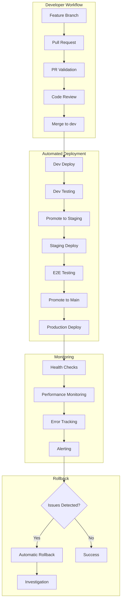

# CI/CD Pipeline Operational Runbook

## Table of Contents

1. [Emergency Contacts](#emergency-contacts)
2. [Quick Reference](#quick-reference)
3. [Common Issues & Solutions](#common-issues--solutions)
4. [Emergency Procedures](#emergency-procedures)
5. [Rollback Procedures](#rollback-procedures)
6. [Monitoring & Health Checks](#monitoring--health-checks)
7. [Architecture Overview](#architecture-overview)
8. [Onboarding Guide](#onboarding-guide)

---

## Emergency Contacts

### Primary On-Call Team

| Role | Contact | Hours | Escalation |
|------|---------|-------|------------|
| **DevOps Lead** | @MLorneSmith | 24/7 | Slack, Email |
| **Platform Engineer** | TBD | Business Hours | Slack |
| **Site Reliability** | TBD | 24/7 | PagerDuty |

### External Services

| Service | Support Channel | Escalation Level |
|---------|----------------|------------------|
| **Vercel** | <support@vercel.com> | Production Issues |
| **Supabase** | <support@supabase.com> | Database Issues |
| **GitHub** | <support@github.com> | CI/CD Pipeline Issues |
| **New Relic** | <support@newrelic.com> | Monitoring Issues |

### Communication Channels

- **Emergency**: `#incident-response` (Slack)
- **General CI/CD**: `#ci-cd` (Slack)
- **Deployment Updates**: `#deployments` (Slack)

---

## Quick Reference

### Essential Commands

```bash
# Check deployment status
gh api repos/MLorneSmith/2025slideheroes/deployments

# Emergency rollback (via Vercel)
vercel rollback slideheroes.com

# Check pipeline status
gh run list --limit 10

# Re-run failed workflow
gh run rerun <run-id>

# View logs
gh run view <run-id> --log
```

### Key URLs

- **Production**: <https://slideheroes.com>
- **Staging**: <https://staging.slideheroes.com>  
- **Development**: <https://dev.slideheroes.com>
- **Vercel Dashboard**: <https://vercel.com/slideheroes/dashboard>
- **GitHub Actions**: <https://github.com/MLorneSmith/2025slideheroes/actions>
- **New Relic Dashboard**: <https://one.newrelic.com/slideheroes>

### Status Pages

- **Vercel**: <https://vercel-status.com>
- **Supabase**: <https://status.supabase.com>
- **GitHub**: <https://www.githubstatus.com>

---

## Common Issues & Solutions

### 1. Build Failures

#### Symptom: `pnpm install` failing

```bash
Error: Cannot resolve workspace protocol
```

**Solution:**

```bash
# Clear cache and reinstall
rm -rf node_modules pnpm-lock.yaml
pnpm install --frozen-lockfile=false
```

**Prevention:** Always use `pnpm install --frozen-lockfile` in CI

#### Symptom: TypeScript compilation errors

```typescript
error TS2307: Cannot find module '@/lib/utils'
```

**Solution:**

1. Check if new dependencies are properly added to package.json
2. Verify path aliases in tsconfig.json
3. Clear TypeScript cache: `rm -rf .next tsconfig.tsbuildinfo`

#### Symptom: Turbo build cache issues

```bash
Turbo error: could not find workspace root
```

**Solution:**

```bash
# Clear turbo cache
pnpm turbo clean
# Re-run build
pnpm build
```

### 2. Deployment Issues

#### Symptom: Vercel deployment hanging

**Root Cause:** Build timeout or memory issues

**Solution:**

1. Check build logs in Vercel dashboard
2. Increase timeout if needed (max 45min for Pro)
3. Optimize build process:

   ```bash
   # Reduce build size
   NEXT_TELEMETRY_DISABLED=1 npm run build
   ```

#### Symptom: Environment variables not found

```bash
Error: Missing required environment variable
```

**Solution:**

1. Verify secrets in GitHub repository settings
2. Check Vercel environment variables
3. Ensure correct environment selection (production/preview)

#### Symptom: Database connection failures

```bash
Error: Connection timeout to Supabase
```

**Solution:**

1. Check Supabase status page
2. Verify connection string and credentials
3. Test connection from Vercel functions:

   ```bash
   curl https://slideheroes.com/api/healthcheck
   ```

### 3. Test Failures

#### Symptom: E2E tests timing out

**Root Cause:** Slow test environment or network issues

**Solution:**

```bash
# Increase timeout in playwright.config.ts
timeout: 60000 // 60 seconds

# Run tests with verbose logging
pnpm test:e2e --reporter=verbose
```

#### Symptom: Unit tests failing in CI but passing locally

**Root Cause:** Environment differences

**Solution:**

1. Check Node.js versions match
2. Verify timezone settings
3. Mock external dependencies properly

### 4. Performance Issues

#### Symptom: Slow build times (>10 minutes)

**Solution:**

1. Check cache hit rates in GitHub Actions logs
2. Optimize dependencies:

   ```bash
   # Analyze bundle size
   npx next-bundle-analyzer
   ```

3. Enable parallel builds in turbo.json

#### Symptom: High memory usage during builds

**Solution:**

1. Increase Node.js memory limit:

   ```bash
   NODE_OPTIONS="--max-old-space-size=4096" npm run build
   ```

2. Use more specific imports to reduce bundle size

---

## Emergency Procedures

### 🚨 Production Down

**Immediate Actions (< 5 minutes):**

1. **Assess Impact**

   ```bash
   # Check service status
   curl -I https://slideheroes.com
   
   # Check deployment status
   gh api repos/MLorneSmith/2025slideheroes/deployments | jq '.[0]'
   ```

2. **Notify Team**
   - Post in `#incident-response` Slack channel
   - Update status page if available
   - Contact on-call engineer

3. **Immediate Rollback**

   ```bash
   # Via Vercel CLI (fastest)
   vercel rollback slideheroes.com --prod
   
   # Or via Git
   git revert HEAD --no-edit
   git push origin main
   ```

**Follow-up Actions (< 30 minutes):**

1. **Investigate Root Cause**
   - Check New Relic for errors
   - Review recent deployments
   - Analyze error logs

2. **Communicate Status**
   - Update stakeholders
   - Document incident timeline
   - Plan fix and redeployment

### 🔧 CI/CD Pipeline Failure

**When multiple deployments are failing:**

1. **Check GitHub Status**
   - Visit <https://www.githubstatus.com>
   - Check Actions service status

2. **Check Dependencies**

   ```bash
   # Test Vercel connectivity
   vercel whoami
   
   # Test database connectivity
   npx supabase status
   ```

3. **Emergency Manual Deploy**

   ```bash
   # If GitHub Actions is down
   git checkout main
   vercel --prod
   ```

### 💾 Database Emergency

**Symptoms:** Connection timeouts, data corruption, migration failures

1. **Stop All Deployments**

   ```bash
   # Cancel running workflows
   gh run cancel <run-id>
   ```

2. **Enable Maintenance Mode**
   - Add maintenance page to Vercel
   - Redirect traffic if needed

3. **Contact Supabase Support**
   - Include project reference
   - Provide timeline of issues
   - Request immediate assistance

---

## Rollback Procedures

### Automatic Rollback

The production deployment includes automatic rollback triggers:

- **Health check failures** (3 consecutive fails)
- **Error rate > 5%** (within 10 minutes)
- **Response time > 2s** (95th percentile)

### Manual Rollback Options

#### 1. Vercel Dashboard Rollback (Recommended)

1. Go to <https://vercel.com/slideheroes/deployments>
2. Find last known good deployment
3. Click "Visit" to verify it works
4. Click "Promote to Production"

#### 2. Git-based Rollback

```bash
# Revert to last known good commit
git log --oneline -10
git revert <bad-commit-hash> --no-edit
git push origin main
```

#### 3. Emergency CLI Rollback

```bash
# Fastest option
vercel rollback slideheroes.com --prod

# Verify rollback
curl -I https://slideheroes.com
```

### Rollback Verification Checklist

After any rollback:

- [ ] Check homepage loads correctly
- [ ] Verify user authentication works
- [ ] Test critical user flows
- [ ] Confirm database connectivity
- [ ] Monitor error rates for 15 minutes
- [ ] Update team on status

---

## Unified Testing Command Integration

### Overview

The `/write-tests` command intelligently integrates with CI/CD pipeline stages, automatically selecting the most
important test type based on deployment stage requirements and current development context.

### Stage-Aware Test Selection

#### PR Validation Stage

```bash
# Auto-optimizes for PR validation requirements
/write-tests --stage=pr

# Prioritizes tests that prevent merge issues:
# - Unit tests (15 pts) - Fast feedback
# - Accessibility tests (12 pts) - Early compliance
# - Security scans (10 pts) - Prevent vulnerabilities
```

#### Dev Deployment Stage  

```bash
# Auto-optimizes for dev deployment needs
/write-tests --stage=dev

# Focuses on integration validation:
# - Integration tests (12 pts) - API validation
# - E2E smoke tests (10 pts) - Critical workflows
# - Unit tests (8 pts) - Regression prevention
```

#### Staging Deployment Stage

```bash
# Auto-optimizes for staging validation requirements
/write-tests --stage=staging

# Comprehensive validation approach:
# - E2E tests (15 pts) - Complete user journeys
# - Performance tests (12 pts) - Production readiness
# - Accessibility tests (10 pts) - Full compliance
# - Load tests (8 pts) - Capacity validation
```

#### Production Release Stage

```bash
# Production readiness focus
/write-tests --stage=production

# Critical path validation:
# - Security audit tests (15 pts) - Zero vulnerabilities
# - Performance benchmarks (15 pts) - Production metrics
# - E2E critical flows (15 pts) - Revenue protection
# - Load capacity tests (15 pts) - Scale validation
```

### Testing Integration with GitHub Actions

The unified testing command works seamlessly with existing GitHub Actions workflows:

#### PR Validation Workflow

```yaml
name: PR Validation
on: [pull_request]
jobs:
  intelligent-testing:
    runs-on: ubuntu-latest
    steps:
      - name: Auto-select PR tests
        run: /write-tests --stage=pr --priority=p1
      - name: Run selected tests
        run: pnpm test --coverage && pnpm test:a11y
```

#### Dev Deployment Workflow

```yaml
name: Dev Deployment  
on:
  push:
    branches: [dev]
jobs:
  dev-validation:
    runs-on: ubuntu-latest
    steps:
      - name: Auto-select dev tests
        run: /write-tests --stage=dev
      - name: Run integration suite
        run: pnpm test:integration && pnpm test:e2e:smoke
```

### CI/CD Pipeline Test Requirements

| Stage | Required Test Types | Coverage Threshold | Automated Selection |
|-------|-------------------|-------------------|-------------------|
| **PR** | Unit, A11y, Security | 80% unit | `--stage=pr` |
| **Dev** | Integration, E2E Smoke | 85% combined | `--stage=dev` |
| **Staging** | All types, Performance | 90% comprehensive | `--stage=staging` |
| **Production** | Security, Load, Critical E2E | 95% all types | `--stage=production` |

### Troubleshooting Test Failures

#### When PR validation fails

```bash
# Focus on failing areas with intelligent selection
/write-tests --stage=pr --file=path/to/failing/component.tsx

# Output example:
🎯 PR Validation Failure Analysis
Missing coverage for CheckoutForm.tsx:
1. Unit test for validation logic (P1, 20 pts)
2. A11y test for form controls (P1, 18 pts)
3. Integration test for payment flow (P1, 15 pts)
```

#### When dev deployment fails

```bash
# Focus on integration testing gaps
/write-tests --stage=dev --type=integration

# Output example:
🎯 Dev Integration Focus
Critical integration tests needed:
1. Payment Gateway API integration (P1, 22 pts)
2. AI Service authentication flow (P1, 18 pts) 
3. Database transaction handling (P1, 15 pts)
```

### Best Practices

1. **Use stage flags consistently** - Always specify the CI/CD stage context
2. **Trust intelligent selection** - Let the algorithm choose optimal tests
3. **Override sparingly** - Manual overrides only when context is clear
4. **Monitor test progression** - Verify tests pass through pipeline stages

## Monitoring & Health Checks

### Automated Monitoring

#### New Relic Alerts

- **Response Time**: > 2s for 5 minutes
- **Error Rate**: > 1% for 3 minutes  
- **Throughput Drop**: > 50% decrease
- **Apdex Score**: < 0.7

#### Vercel Monitoring

- **Build Duration**: > 15 minutes
- **Function Duration**: > 30s
- **Bandwidth Usage**: Unusual spikes

#### GitHub Actions

- **Workflow Failures**: Consecutive failures
- **Queue Time**: > 5 minutes wait
- **Success Rate**: < 95% over 24h

### Manual Health Checks

#### Quick Health Check

```bash
# Basic connectivity
curl -f https://slideheroes.com/healthcheck

# Authentication endpoint
curl -f https://slideheroes.com/api/auth/verify

# Database connectivity  
curl -f https://slideheroes.com/api/db/health
```

#### Comprehensive Check

```bash
# Run smoke tests
pnpm test:smoke

# Check critical user flows
pnpm test:critical-path

# Verify integrations
pnpm test:integrations
```

---

## Architecture Overview

### CI/CD Pipeline Flow



### Environment Architecture

| Environment | URL | Purpose | Database | Monitoring |
|-------------|-----|---------|----------|------------|
| **Development** | dev.slideheroes.com | Feature testing | Dev DB | Basic |
| **Staging** | staging.slideheroes.com | Pre-production | Staging DB | Full |
| **Production** | slideheroes.com | Live application | Prod DB | Full + Alerts |

### Security Layers

1. **Branch Protection**: Required reviews and status checks
2. **Secret Management**: GitHub Secrets and Vercel Environment Variables
3. **Access Control**: Team-based permissions
4. **Dependency Scanning**: Automated vulnerability detection (planned)
5. **Runtime Security**: WAF and DDoS protection via Vercel

---

## Onboarding Guide

### New Team Member Setup

#### 1. Access Requirements

- [ ] GitHub repository access (Developer role minimum)
- [ ] Vercel team access
- [ ] Slack channels: `#ci-cd`, `#deployments`
- [ ] New Relic monitoring access
- [ ] 1Password team vault access

#### 2. Local Development Setup

```bash
# Clone repository
git clone https://github.com/MLorneSmith/2025slideheroes.git
cd 2025slideheroes

# Install dependencies
pnpm install

# Setup environment
cp .env.example .env.local
# Fill in required values from 1Password

# Verify setup
pnpm dev
pnpm test
pnpm typecheck
```

#### 3. CI/CD Knowledge Requirements

**Essential Understanding:**

- GitFlow branching strategy
- GitHub Actions workflow structure
- Vercel deployment process
- Environment promotion flow

**Key Files to Review:**

- `.github/workflows/` - All workflow definitions
- `docs/cicd/` - This documentation
- `turbo.json` - Build configuration
- `vercel.json` - Deployment configuration

#### 4. First Week Tasks

- [ ] Read all CI/CD documentation
- [ ] Shadow a deployment to production
- [ ] Practice rollback procedures in staging
- [ ] Set up monitoring alerts
- [ ] Complete a small feature deployment end-to-end

### Emergency On-Call Training

#### Prerequisites

- Completed new member onboarding
- Familiar with application architecture
- Has production access credentials

#### Training Scenarios

1. **Practice Rollback**: Intentionally deploy a broken build to staging and practice rollback
2. **Monitor Response**: Trigger a fake alert and practice incident response
3. **Communication**: Practice update templates for stakeholders
4. **Database Issues**: Simulate connection failures and recovery

#### On-Call Responsibilities

- Monitor alerts during assigned shifts
- Respond to incidents within 15 minutes
- Coordinate with team for complex issues
- Document all incidents and resolutions
- Participate in post-incident reviews

### Knowledge Transfer Sessions

#### Monthly Team Sessions

- Review recent incidents and lessons learned
- Update runbook based on new issues
- Practice emergency procedures
- Share new tools and techniques

#### Quarterly Reviews

- Evaluate CI/CD performance metrics
- Plan pipeline improvements
- Update contact information
- Review and update all documentation

---

## Appendix

### Useful Resources

- [GitHub Actions Documentation](https://docs.github.com/en/actions)
- [Vercel Deployment Documentation](https://vercel.com/docs/deployments)
- [Turbo Documentation](https://turbo.build/repo/docs)
- [New Relic Alerts Guide](https://docs.newrelic.com/docs/alerts-applied-intelligence/)

### Common Environment Variables

```bash
# Build
NODE_ENV=production
NEXT_TELEMETRY_DISABLED=1
TURBO_TOKEN=<token>
TURBO_TEAM=<team>

# Database
SUPABASE_URL=<url>
SUPABASE_ANON_KEY=<key>
SUPABASE_SERVICE_ROLE_KEY=<key>

# External Services
STRIPE_SECRET_KEY=<key>
NEW_RELIC_LICENSE_KEY=<key>
```

### Changelog

| Date | Change | Author |
|------|--------|--------|
| 2025-06-25 | Initial runbook creation | @MLorneSmith |

---

**Last Updated**: 2025-06-25  
**Document Owner**: DevOps Team  
**Review Cycle**: Monthly
