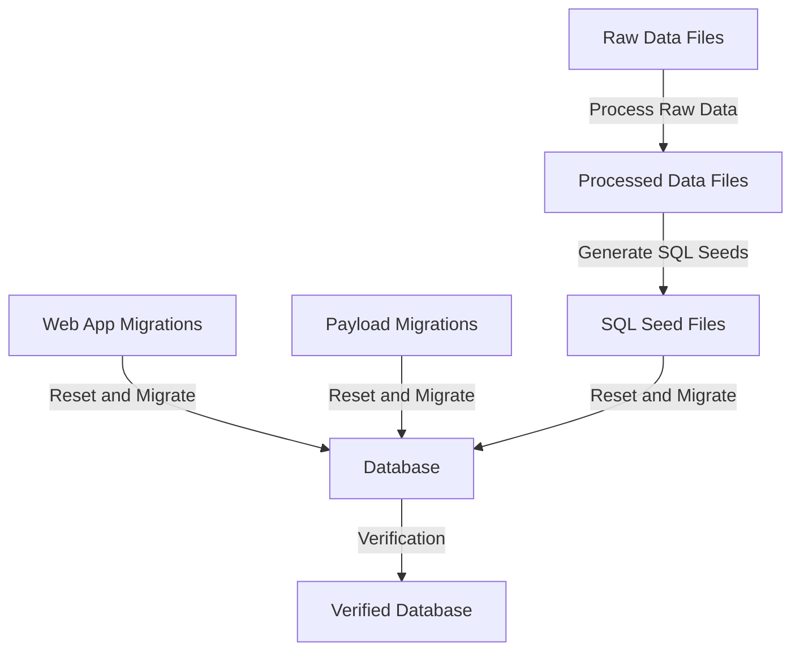

# Content Migration System

This document provides comprehensive documentation for the content migration system used in our Makerkit-based Next.js 15 application with Payload CMS integration.

## Overview

The content migration system is designed to migrate content from various sources (files, databases, etc.) to Payload CMS collections in our application. It follows a two-step process:

1. **Raw Data Processing**: Process raw data files to generate processed data files and SQL seed files
2. **Database Reset and Migration**: Reset the database and run migrations to populate the database with content

This approach separates the content processing from the database migration, making it easier to manage and maintain.

## System Architecture



### Key Components

1. **Raw Data**: Source content files in various formats (`.mdoc`, `.yaml`)
2. **Processed Data**: Intermediate processed files
3. **SQL Seed Files**: SQL files for database population
4. **Web App Migrations**: Supabase migrations for the web app
5. **Payload Migrations**: Migrations for Payload CMS
6. **Database**: PostgreSQL database with separate schemas for web app and Payload CMS
7. **Verification**: Scripts to verify database integrity

## Step 1: Raw Data Processing

The first step processes raw data files and generates processed data files and SQL seed files.

### Command

```bash
pnpm --filter @kit/content-migrations run process:raw-data
```

### Process

1. Validates that all required raw data directories exist
2. Ensures all required processed data directories exist
3. Generates SQL seed files from raw data
4. Copies SQL seed files to the processed directory
5. Creates a metadata file with processing timestamp

### Raw Data Structure

Raw data is organized in the following directory structure:

```
packages/content-migrations/src/data/raw/
├── courses/
│   ├── lessons/         # Course lesson .mdoc files
│   └── quizzes/         # Course quiz .mdoc files
├── documentation/       # Documentation .mdoc files
├── posts/               # Blog post .mdoc files
├── quizzes/             # Quiz .mdoc files
└── surveys/             # Survey .yaml files
```

#### File Formats

1. **Course Lessons** (`.mdoc`):

   ```yaml
   ---
   title: Lesson Title
   status: published
   description: Lesson description
   lessonID: 1
   chapter: chapter-name
   lessonNumber: 101
   lessonLength: 10
   image: /cms/images/lesson/image.png
   publishedAt: 2024-09-06
   language: en
   order: 1
   ---
   Lesson content in Markdown format
   ```

2. **Course Quizzes** (`.mdoc`):

   ```yaml
   ---
   title: Quiz Title
   questions:
     - question: Question text
       answers:
         - answer: Answer option 1
           correct: false
         - answer: Answer option 2
           correct: true
       questiontype: single-answer
   status: published
   publishedAt: 2024-09-20
   language: en
   order: 26
   ---
   ```

3. **Documentation** (`.mdoc`):

   ```yaml
   ---
   title: Documentation Title
   description: Documentation description
   publishedAt: 2024-08-16
   order: 1
   language: en
   parent: parent-doc
   categories: []
   tags: []
   status: published
   ---
   Documentation content in Markdown format
   ```

4. **Posts** (`.mdoc`):

   ```yaml
   ---
   title: Post Title
   status: published
   authors:
     - author-name
   image: /cms/images/post/image.png
   categories: []
   tags: []
   publishedAt: 2024-08-19
   language: en
   order: 1
   ---
   Post content in Markdown format
   ```

5. **Surveys** (`.yaml`):
   ```yaml
   title: Survey Title
   questions:
     - question: Question text
       answers:
         - answer: Answer option 1
         - answer: Answer option 2
       questioncategory: category
       questionspin: positive
   status: published
   language: en
   ```

### Processed Data Structure

Processed data is organized in the following directory structure:

```
packages/content-migrations/src/data/processed/
├── json/               # Processed JSON files
├── sql/                # Processed SQL files
└── metadata.json       # Metadata file with processing timestamp
```

## Step 2: Database Reset and Migration

The second step resets the database and runs migrations to populate the database with content.

### Command

```bash
./reset-and-migrate.ps1
```

### Process

1. **Reset Supabase database and run Web app migrations**

   - Resets the Supabase database
   - Runs Supabase migrations
   - Verifies that the public schema was created

2. **Run Payload migrations**

   - Runs all Payload migrations
   - Adds relationship ID columns to locked documents tables
   - Verifies that all migrations were applied
   - Verifies that the payload schema and required tables were created

3. **Check and process raw data if needed**

   - Checks if processed data exists
   - If not, runs the raw data processing step
   - If it exists, validates raw data directories
   - Optionally regenerates processed data

4. **Run content migrations via Payload migrations**

   - Runs all Payload migrations (including content migrations)
   - Verifies migrations were applied
   - Runs verification scripts
   - Runs edge case repairs if needed

5. **Comprehensive database verification**
   - Verifies database schema
   - Verifies course_lessons quiz_id_id column
   - Verifies media_id columns

### Migration Files

1. **Web App Migrations** (`apps/web/supabase/migrations/`):

   - `20221215192558_web_schema.sql`: Initial web app schema
   - `20240319163440_web_roles-seed.sql`: Roles seed data
   - `20250319104726_web_course_system.sql`: Course system tables

2. **Payload Migrations** (`apps/payload/src/migrations/`):
   - `20250402_100000_schema_creation.ts`: Creates the payload schema
   - `20250402_300000_base_schema.ts`: Creates base tables
   - `20250402_305000_seed_course_data.ts`: Seeds course data
   - `20250402_310000_relationship_structure.ts`: Sets up relationships
   - `20250402_330000_bidirectional_relationships.ts`: Sets up bidirectional relationships
   - `20250402_340000_add_users_table.ts`: Adds users table
   - `20250402_350000_create_admin_user.ts`: Creates admin user
   - `20250403_200000_process_content.ts`: Processes content
   - `20250404_100000_fix_lesson_quiz_relationships.ts`: Fixes lesson-quiz relationships

## Database Structure

The database consists of two main schemas:

1. **public**: Contains web app tables
2. **payload**: Contains Payload CMS tables

### Key Payload Tables

- `payload.courses`: Course information
- `payload.course_lessons`: Course lesson content
- `payload.course_quizzes`: Course quiz information
- `payload.quiz_questions`: Quiz questions
- `payload.surveys`: Survey information
- `payload.survey_questions`: Survey questions
- `payload.documentation`: Documentation content
- `payload.posts`: Blog post content
- `payload.media`: Media files

### Relationships

- Courses have many lessons
- Lessons may have an optional quiz
- Quizzes have many questions
- Surveys have many questions
- Documentation can have parent-child relationships

## Payload CMS Collections

Payload CMS collections are defined in `apps/payload/src/collections/` and map to the corresponding tables in the database:

- `Courses.ts`: Course collection
- `CourseLessons.ts`: Course lesson collection
- `CourseQuizzes.ts`: Course quiz collection
- `QuizQuestions.ts`: Quiz question collection
- `Surveys.ts`: Survey collection
- `SurveyQuestions.ts`: Survey question collection
- `Documentation.ts`: Documentation collection
- `Posts.ts`: Blog post collection
- `Media.ts`: Media collection

## Adding New Content

### Adding New Content to Existing Types

1. **Create Raw Data Files**:

   - Create new `.mdoc` or `.yaml` files in the appropriate raw data directory
   - Follow the existing file format for the content type

2. **Process Raw Data**:

   ```bash
   pnpm --filter @kit/content-migrations run process:raw-data
   ```

3. **Run Reset and Migrate**:
   ```bash
   ./reset-and-migrate.ps1
   ```

### Example: Adding a New Course Lesson

1. Create a new `.mdoc` file in `packages/content-migrations/src/data/raw/courses/lessons/`:

   ```markdown
   ---
   title: New Lesson Title
   status: published
   description: New lesson description
   lessonID: 30
   chapter: chapter-name
   lessonNumber: 130
   lessonLength: 15
   image: /cms/images/new-lesson/image.png
   publishedAt: 2025-04-04
   language: en
   order: 30
   ---

   New lesson content in Markdown format
   ```

2. Process raw data:

   ```bash
   pnpm --filter @kit/content-migrations run process:raw-data
   ```

3. Run reset and migrate:
   ```bash
   ./reset-and-migrate.ps1
   ```

### Adding New Content Types

1. **Define Payload Collection**:

   - Create a new collection file in `apps/payload/src/collections/`
   - Define the collection schema

2. **Create Migration Files**:

   - Create a new migration file in `apps/payload/src/migrations/`
   - Add the migration to `apps/payload/src/migrations/index.ts`

3. **Create Raw Data Directory**:

   - Create a new directory in `packages/content-migrations/src/data/raw/`
   - Add it to the path configuration in `packages/content-migrations/src/config/paths.ts`

4. **Update Raw Data Processing**:

   - Update `packages/content-migrations/src/scripts/process/process-raw-data.ts` to handle the new content type
   - Create a new SQL seed generator function in `packages/content-migrations/src/scripts/sql/generate-sql-seed-files-fixed.ts`

5. **Update Content Processing Migration**:

   - Update `apps/payload/src/migrations/20250403_200000_process_content.ts` to include the new SQL seed file

6. **Process Raw Data and Run Migrations**:
   ```bash
   pnpm --filter @kit/content-migrations run process:raw-data
   ./reset-and-migrate.ps1
   ```

### Example: Adding a New "Resources" Content Type

1. **Define Payload Collection**:

   ```typescript
   // apps/payload/src/collections/Resources.ts
   import { BlocksFeature, lexicalEditor } from '@payloadcms/richtext-lexical';
   import { CollectionConfig } from 'payload';

   export const Resources: CollectionConfig = {
     slug: 'resources',
     labels: {
       singular: 'Resource',
       plural: 'Resources',
     },
     admin: {
       useAsTitle: 'title',
       defaultColumns: ['title', 'status', 'publishedAt'],
       description: 'Resources for the learning management system',
     },
     access: {
       read: () => true, // Public read access
     },
     fields: [
       {
         name: 'title',
         type: 'text',
         required: true,
       },
       {
         name: 'slug',
         type: 'text',
         required: true,
         unique: true,
       },
       {
         name: 'description',
         type: 'textarea',
       },
       {
         name: 'content',
         type: 'richText',
         editor: lexicalEditor({}),
       },
       {
         name: 'status',
         type: 'select',
         options: [
           { label: 'Draft', value: 'draft' },
           { label: 'Published', value: 'published' },
         ],
         defaultValue: 'draft',
         required: true,
       },
       {
         name: 'publishedAt',
         type: 'date',
         admin: {
           date: {
             pickerAppearance: 'dayAndTime',
           },
         },
       },
     ],
   };
   ```

2. **Create Migration File**:

   ```typescript
   // apps/payload/src/migrations/20250405_100000_add_resources.ts
   import {
     MigrateDownArgs,
     MigrateUpArgs,
     sql,
   } from '@payloadcms/db-postgres';

   export async function up({ db }: MigrateUpArgs): Promise<void> {
     console.log('Running add resources migration');

     try {
       // Create resources table
       await db.execute(sql`
         CREATE TABLE IF NOT EXISTS payload.resources (
           id UUID PRIMARY KEY DEFAULT gen_random_uuid(),
           title TEXT NOT NULL,
           slug TEXT NOT NULL UNIQUE,
           description TEXT,
           content JSONB,
           status TEXT NOT NULL DEFAULT 'draft',
           published_at TIMESTAMP WITH TIME ZONE,
           created_at TIMESTAMP WITH TIME ZONE DEFAULT NOW(),
           updated_at TIMESTAMP WITH TIME ZONE DEFAULT NOW()
         )
       `);

       console.log('Resources migration completed successfully');
     } catch (error) {
       console.error('Error in resources migration:', error);
       throw error;
     }
   }

   export async function down({ db }: MigrateDownArgs): Promise<void> {
     await db.execute(sql`DROP TABLE IF EXISTS payload.resources`);
   }
   ```

3. **Update Migration Index**:

   ```typescript
   // apps/payload/src/migrations/index.ts
   // Add to imports
   import * as migration_20250405_100000_add_resources from './20250405_100000_add_resources';

   export const migrations = [
     // ... existing migrations
     {
       up: migration_20250405_100000_add_resources.up,
       down: migration_20250405_100000_add_resources.down,
       name: '20250405_100000_add_resources',
     },
   ];
   ```

4. **Create Raw Data Directory**:

   - Create `packages/content-migrations/src/data/raw/resources/`

5. **Update Path Configuration**:

   ```typescript
   // packages/content-migrations/src/config/paths.ts
   // Add to exports
   export const RAW_RESOURCES_DIR = path.resolve(RAW_DATA_DIR, 'resources');
   ```

6. **Update Raw Data Processing**:

   ```typescript
   // packages/content-migrations/src/scripts/process/process-raw-data.ts
   // Update validateRawDataDirectories function
   function validateRawDataDirectories(): boolean {
     console.log('Validating raw data directories...');

     const directories = [
       RAW_DATA_DIR,
       RAW_COURSES_DIR,
       RAW_LESSONS_DIR,
       RAW_QUIZZES_DIR,
       RAW_DOCUMENTATION_DIR,
       RAW_POSTS_DIR,
       RAW_SURVEYS_DIR,
       RAW_RESOURCES_DIR, // Add this line
     ];

     // ... rest of the function
   }
   ```

7. **Add SQL Seed Generator**:

   ```typescript
   // packages/content-migrations/src/scripts/sql/generate-sql-seed-files-fixed.ts
   // Add new function
   function generateResourcesSql(): string {
     return `-- Seed data for the resources table
   -- This file should be run after the migrations to ensure the resources table exists
   
   -- Start a transaction
   BEGIN;
   
   -- Insert resources
   -- ... SQL to insert resources
   
   -- Commit the transaction
   COMMIT;
   `;
   }

   // Update generateSqlSeedFiles function
   async function generateSqlSeedFiles() {
     // ... existing code

     // Generate resources SQL
     console.log('Generating resources SQL...');
     const resourcesSql = generateResourcesSql();
     fs.writeFileSync(
       path.join(PAYLOAD_SQL_SEED_DIR, '10-resources.sql'),
       resourcesSql,
     );

     // ... existing code
   }
   ```

8. **Update Content Processing Migration**:

   ```typescript
   // apps/payload/src/migrations/20250403_200000_process_content.ts
   // Update seedFiles array
   const seedFiles = [
     '01-courses.sql',
     '02-lessons.sql',
     '03-quizzes.sql',
     '04-questions.sql',
     '05-surveys.sql',
     '06-survey-questions.sql',
     '07-documentation.sql',
     '08-posts.sql',
     '09-fix-quiz-questions.sql',
     '10-resources.sql', // Add this line
   ];
   ```

9. **Process Raw Data and Run Migrations**:
   ```bash
   pnpm --filter @kit/content-migrations run process:raw-data
   ./reset-and-migrate.ps1
   ```

## Troubleshooting

### Common Issues

1. **Missing Raw Data Directories**:

   - Error: "Raw data directory does not exist"
   - Solution: Ensure all required raw data directories exist in `packages/content-migrations/src/data/raw/`

2. **SQL Seed File Generation Errors**:

   - Error: "Error generating SQL seed files"
   - Solution: Check the raw data files for formatting issues

3. **Migration Failures**:

   - Error: "Error in content processing migration"
   - Solution: Check the migration logs in `z.migration-logs/` for details

4. **Relationship Issues**:
   - Warning: "Missing relationships"
   - Solution: Run the repair scripts:
     ```bash
     pnpm --filter @kit/content-migrations run repair:edge-cases
     ```

### Logs

Migration logs are stored in the `z.migration-logs/` directory:

- `migration-log-TIMESTAMP.txt`: Basic log
- `migration-detailed-log-TIMESTAMP.txt`: Detailed log with SQL output

### Verification Scripts

Verification scripts can be run to check the database integrity:

```bash
pnpm --filter @kit/content-migrations run verify:all
pnpm --filter @kit/content-migrations run verify:course-lessons
pnpm --filter @kit/content-migrations run verify:media-columns
pnpm --filter @kit/content-migrations run sql:verify-schema
```

## Conclusion

The content migration system provides a robust way to manage content in our Makerkit-based Next.js 15 application with Payload CMS integration. By following the two-step process and understanding the system architecture, you can easily add new content or content types to the application.
