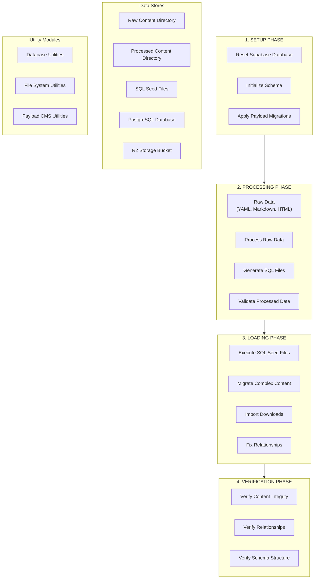

# Content Migration System: Comprehensive Guide

## Table of Contents

1. [System Overview](#system-overview)
2. [Architecture and Components](#architecture-and-components)
3. [Migration Process Flow](#migration-process-flow)
4. [Key Components in Detail](#key-components-in-detail)
5. [Development Challenges and Solutions](#development-challenges-and-solutions)
6. [Updating the System](#updating-the-system)
7. [Key Principles and Learnings](#key-principles-and-learnings)
8. [Troubleshooting](#troubleshooting)
9. [Reference Documentation](#reference-documentation)

## System Overview

The Content Migration System is a comprehensive framework for migrating content from various sources into Payload CMS for the SlideHeroes application. It manages the extraction, transformation, and loading (ETL) of content for:

- Course content (lessons, quizzes, downloads)
- Blog posts and documentation
- Surveys and feedback mechanisms
- Media files and their relationships

This system is critical for ensuring that all content is properly structured, related, and accessible in the Payload CMS database. It serves as the core mechanism for initializing and updating the content in our application.

The migration process is orchestrated by the `reset-and-migrate.ps1` PowerShell script, which runs a series of carefully sequenced operations organized into distinct phases (Setup, Processing, Loading, and Verification).

## Architecture and Components

The content migration system architecture consists of the following key components:



### Core Components

1. **Main Orchestration Script**: `reset-and-migrate.ps1`

   - Manages the overall migration process
   - Divided into Setup, Processing, Loading, and Post-Verification phases
   - Orchestrates the execution sequence of individual tools and scripts

2. **PowerShell Orchestration Modules**:

   - **Utils** (`scripts/orchestration/utils/`):
     - Path management, logging, execution, verification, Supabase utilities
   - **Phases** (`scripts/orchestration/phases/`):
     - Setup: Resets databases and runs initial migrations
     - Processing: Processes raw data and generates SQL files
     - Loading: Loads content and fixes relationships

3. **Content Migrations Package** (`packages/content-migrations/`):

   - Contains specialized TypeScript scripts for migration tasks
   - Structured into subdirectories for different migration concerns:
     - `scripts/processing/`: Processes raw content data
     - `scripts/repair/`: Fixes data and relationship issues
     - `scripts/verification/`: Validates data integrity
   - Provides utilities for database access, file handling, and Payload CMS interactions

4. **Data Stores**:
   - Raw Content Directory: Original content in various formats
   - Processed Content Directory: Transformed content ready for import
   - SQL Seed Files: Generated SQL for database population
   - PostgreSQL Database: Payload CMS database with content tables
   - R2 Storage Bucket: External storage for downloadable files

## Migration Process Flow

The content migration process follows these distinct phases:

### 1. Setup Phase

This phase prepares the database environment and initializes schemas:

1. **Reset Supabase Database**:

   - Stops and restarts Supabase services if needed
   - Executes the `supabase:reset` command to reset the database
   - Runs Supabase migrations to set up initial schemas

2. **Reset Payload Schema**:

   - Drops the `payload` schema and recreates it fresh
   - Ensures a clean state for content migration

3. **Run Payload Migrations**:
   - Executes Payload CMS migrations to establish the schema structure
   - Creates tables for all collections (courses, lessons, quizzes, etc.)
   - Sets up relationship schemas and specialized columns

### 2. Processing Phase

This phase transforms raw content into formats suitable for database import:

1. **Process Raw Data**:

   - Reads content from various sources (Markdown, YAML, HTML)
   - Extracts metadata and enhances it for consistency
   - Processes lesson todo fields from HTML to structured JSON
   - Generates complete lesson metadata YAML

2. **Generate SQL Seed Files**:

   - Creates SQL statements for each content type
   - Establishes proper foreign key relationships
   - Ensures ID consistency across related content

3. **Fix References**:
   - Ensures lesson-quiz references match corrected quiz IDs
   - Fixes quiz question references
   - Validates relationship integrity

### 3. Loading Phase

This phase populates the database with processed content:

1. **Run Content Migrations**:

   - Executes SQL seed files to populate the database
   - Migrates blog posts with complete content
   - Migrates private posts with complete content

2. **Import Downloads**:

   - Fetches download files from R2 bucket
   - Updates download records with proper metadata
   - Links downloads to appropriate content items

3. **Fix Relationships**:
   - Repairs relationship tables and references
   - Fixes survey questions population
   - Ensures todo fields have proper format
   - Fixes Lexical format in rich text fields
   - Repairs post image relationships

### 4. Verification Phase

This phase ensures data integrity:

1. **Verify Database State**:

   - Validates schema structure and table existence
   - Checks for required columns
   - Ensures proper data types

2. **Verify Content Integrity**:

   - Validates post content completeness
   - Ensures lesson content is properly structured
   - Verifies media references

3. **Post-Verification**:
   - Performs final checks on specific collections

## Key Components in Detail

### Main Orchestration Script

The `reset-and-migrate.ps1` script is the primary entry point for the migration process. It:

- Accepts parameters for forcing regeneration or skipping verification
- Sets up logging and environment variables
- Orchestrates the execution of phase modules
- Handles error reporting and continues when possible

### PowerShell Phase Modules

#### Setup Phase (`scripts/orchestration/phases/setup.ps1`)

This module handles database initialization:

- Resets Supabase database with retry logic for transient errors
- Resets the Payload schema by dropping and recreating it
- Runs Payload migrations to establish schema structure
- Adds relationship ID columns and fixes UUID tables

See: `scripts/orchestration/phases/setup.ps1` for implementation details.

#### Processing Phase (`scripts/orchestration/phases/processing.ps1`)

This module transforms raw content:

- Processes raw data from various formats
- Ensures lesson metadata YAML exists and is up to date
- Parses lesson HTML todo content
- Generates SQL seed files using YAML-based approach
- Fixes quiz ID consistency issues
- Repairs references between content items

See: `scripts/orchestration/phases/processing.ps1` for implementation details.

#### Loading Phase (`scripts/orchestration/phases/loading.ps1`)

This module handles database population:

- Runs content migrations through Payload
- Executes specialized blog post and private post migrations
- Imports downloads from R2 bucket
- Repairs relationships and content issues
- Verifies database state
- Creates certificates storage bucket

See: `scripts/orchestration/phases/loading.ps1` for implementation details.

### Content Migrations Package

The `@kit/content-migrations` package contains TypeScript scripts for various migration tasks:

#### Processing Scripts

Located in `src/scripts/processing/`, these scripts transform raw content:

- `generate-full-lesson-metadata.ts`: Generates complete metadata for course lessons
- `process-lesson-todo-html.ts`: Processes HTML todo content
- `generate-sql-seed-files.ts`: Creates SQL files for database seeding

See: `packages/content-migrations/src/scripts/processing/README.md` for details.

#### Repair Scripts

Located in `src/scripts/repair/`, these scripts fix data issues:

- `fix-uuid-tables.ts`: Fixes UUID table structure
- `fix-post-image-relationships.ts`: Repairs post-image relationships
- `fix-quiz-id-consistency.ts`: Ensures quiz IDs are consistent
- `fix-lexical-format.ts`: Repairs rich text format issues

See: `packages/content-migrations/src/scripts/repair/README.md` for details.

#### Verification Scripts

Located in `src/scripts/verification/`, these scripts validate data integrity:

- `verify-all.ts`: Runs all verification scripts
- `verify-post-content.ts`: Validates post content completeness
- `verify-uuid-tables.ts`: Checks UUID table structure
- `verify-schema.ts`: Validates database schema

See: `packages/content-migrations/src/scripts/verification/README.md` for details.

#### Utility Modules

The `src/utils/` directory contains utility functions:

- **Database Utilities**: Execute SQL queries and transactions
- **File Utilities**: Read and write files, process SQL files
- **Payload Utilities**: Interact with Payload CMS API

See respective README files in `packages/content-migrations/src/utils/` directories.

## Development Challenges and Solutions

The content migration system has overcome several significant challenges:

### 1. UUID Table Issues

**Challenge**: Payload CMS dynamically creates tables with UUID names for relationship queries. These tables often lack required columns like `path`, leading to errors:

```
error: column 1ca2722d_2fab_40b4_9823_36772c3ff79e.path does not exist
```

**Solutions**:

1. **Proactive UUID Table Monitoring**:

   - Implemented a `scan_and_fix_uuid_tables()` function that scans for UUID-patterned tables
   - Added required columns to these tables proactively
   - Created a tracking table to monitor identified UUID tables

2. **Database-Level Abstractions**:

   - Created the `downloads_relationships` view to centralize relationship data
   - Added helper functions to bypass problematic UUID tables
   - Implemented SQL queries that avoid direct access to UUID tables

3. **Multi-Tiered Fallback Strategy**:
   - Implemented a resilient approach with multiple fallback methods
   - Used database views as the primary approach
   - Fell back to Payload API with minimal depth
   - Used direct SQL queries when needed
   - Used predefined relationship mappings as a last resort

See: `z.old/payload-migrations/18-proactive-uuid-table-trigger-and-multi-tier-fallback-plan.md` for detailed implementation.

### 2. Transaction Management

**Challenge**: PostgreSQL marks transactions as aborted when errors occur, requiring explicit rollback before continuing.

**Solution**: Implemented proper transaction management with explicit BEGIN/COMMIT/ROLLBACK blocks to isolate operations and prevent cascading failures.

See: `z.old/payload-migrations/19-transaction-management-fix-for-proactive-uuid-monitoring.md` for details.

### 3. SQL Parameterization Issues

**Challenge**: PostgreSQL only allows parameters for values, not for identifiers like table names, causing syntax errors.

**Solution**: Used string concatenation with proper escaping for identifiers and parameters only for values. Implemented `sql.raw()` for known-safe dynamic identifiers.

See: `z.old/payload-migrations/20-sql-parameterization-and-uuid-tables-fix-plan.md` for implementation details.

### 4. Type Mismatch Errors

**Challenge**: PostgreSQL's strict type system rejects comparisons between UUID and text types without explicit casting.

**Solution**: Standardized on TEXT types for IDs across the system to avoid type casting issues. Implemented explicit type casting in SQL queries.

See: `z.old/payload-migrations/20-downloads-relationship-view-fix-implementation-summary.md` for more information.

## Updating the System

When updating the content migration system, follow these guidelines to ensure reliability and maintainability:

### 1. Adding New Content

To add new content to be migrated:

1. **Add Raw Content**:

   - Place new content in the appropriate directory under `packages/content-migrations/src/data/raw/`
   - For courses/lessons: Add to `raw/courses/`
   - For blog posts: Add to `raw/posts/`
   - For documentation: Add to `raw/documentation/`

2. **Update Processing Scripts if Needed**:

   - If adding a new content type, update or create processing scripts
   - For new lesson content, ensure the HTML todo content is properly formatted

3. **Test the Migration Process**:
   - Run `./reset-and-migrate.ps1` to verify the new content is properly processed
   - Check Payload CMS admin interface to verify content appearance

### 2. Modifying Migration Scripts

When updating existing migration scripts:

1. **Follow Naming Conventions**:

   - `fix-*`: Scripts that repair data issues
   - `verify-*`: Scripts that verify data integrity
   - `migrate-*`: Scripts that perform migrations
   - `generate-*`: Scripts that generate output files
   - `process-*`: Scripts that transform data

2. **Add Script References**:

   - Update `package.json` to include new scripts
   - Follow the existing pattern for script categorization

3. **Test Changes Incrementally**:
   - Test individual scripts directly before integrating
   - Use `pnpm --filter @kit/content-migrations run <script-name>`
   - Verify results with appropriate verification scripts

### 3. Adding New Collections

To add support for new Payload collections:

1. **Update Schema Integration**:

   - Ensure the collection is defined in Payload CMS
   - Add necessary migration files in `apps/payload/src/migrations/`

2. **Create Processing Support**:

   - Add raw data processing scripts for the new collection
   - Update SQL generation to include the new collection

3. **Add Relationship Handling**:

   - Update the UUID table monitoring to include the new collection
   - Add appropriate verification scripts

4. **Documentation and Scripts**:
   - Document the new collection in relevant README files
   - Update orchestration scripts to include the new collection

### 4. Updating the UUID Table Handling

If you need to modify the UUID table handling system:

1. **Understand the Current Approach**:

   - Review the multi-tiered fallback strategy
   - Understand the database-level abstractions (views, functions)
   - Analyze the proactive monitoring system

2. **Make Incremental Changes**:

   - Test changes in isolation with specific validation
   - Create a new migration file for significant modifications
   - Ensure backwards compatibility with existing structures

3. **Update Required Tests**:

   - Add verification scripts for new functionality
   - Update existing scripts to check modified behavior

4. **Document Your Changes**:
   - Update README files with new approaches
   - Document lessons learned and rationales

## Key Principles and Learnings

Through the development of this system, we've established important principles and gained valuable insights:

### 1. Data Integrity First

- **Predefined UUIDs**: Use consistent, predefined UUIDs for content to ensure stable relationships
- **Verification at Multiple Levels**: Implement verification at every stage of the migration process
- **Graceful Degradation**: Always return valid results (even if empty) rather than throwing errors

### 2. Resilient Database Operations

- **Transaction Management**: Implement proper transaction handling with explicit BEGIN/COMMIT/ROLLBACK
- **Type Safety**: Be explicit about types and type conversions in PostgreSQL
- **Parameterization Awareness**: Use parameters for values only, not for identifiers in SQL

### 3. Multi-Tiered Approaches

- **Fallback Strategies**: Implement multiple approaches with graceful fallbacks
- **Progressive Enhancement**: Start with the most robust method and fall back to simpler approaches
- **Defensive Programming**: Always handle errors at both code and transaction levels

### 4. System Architecture Insights

- **Dynamic Tables Need Special Handling**: Proactively monitor and fix dynamically created tables
- **Database Views vs. Direct Access**: Use views as a stable abstraction layer over dynamic tables
- **Helper Functions**: Create database-level helper functions for complex operations

### 5. Error Handling Philosophy

- **Specific Error Categories**: Categorize errors by type for better handling
- **Graceful Continuance**: Continue processing even when non-critical errors occur
- **Detailed Logging**: Provide comprehensive logs for troubleshooting

### 6. PostgreSQL Specific Learnings

- **Event Triggers Require Privileges**: Event triggers for real-time monitoring require superuser access
- **Column Type Consistency**: Maintain consistent column types to avoid casting issues
- **Schema Organization**: Use schemas to organize tables and avoid naming conflicts

## Troubleshooting

Common issues and their solutions:

### 1. Missing Column in UUID Table

**Issue**: Error message like `column X.path does not exist`

**Solution**:

- Run the UUID table scanner: `pnpm --filter @kit/content-migrations run sql:ensure-columns`
- If the error persists, try the comprehensive fix: `pnpm --filter @kit/content-migrations run fix:uuid-tables`

### 2. Relationship Issues

**Issue**: Missing relationships between content items

**Solution**:

- Run the relationship fix script: `pnpm --filter @kit/content-migrations run fix:relationships-direct`
- Verify specific relationships: `pnpm --filter @kit/content-migrations run verify:relationships`

### 3. SQL Parameterization Errors

**Issue**: Error message like `syntax error at or near "$1"`

**Solution**:

- Check SQL queries to ensure parameters are only used for values, not identifiers
- Use `sql.raw()` for queries with dynamic table or column names

### 4. Transaction Aborted Errors

**Issue**: Error message like `current transaction is aborted, commands ignored until end of transaction block`

**Solution**:

- Ensure proper transaction management with explicit BEGIN/COMMIT/ROLLBACK
- Isolate error-prone operations in separate transactions

### 5. Data Verification Issues

**Issue**: Verification scripts report missing or inconsistent data

**Solution**:

- Check migration logs for specific errors
- Run targeted repair scripts for the affected content type
- Verify with specific verification scripts after repair

## Reference Documentation

For more details on specific components, refer to these README files:

- **Main Package Overview**: [packages/content-migrations/README.md](../../../packages/content-migrations/README.md)
- **Processing Scripts**: [packages/content-migrations/src/scripts/processing/README.md](../../../packages/content-migrations/src/scripts/processing/README.md)
- **Repair Scripts**: [packages/content-migrations/src/scripts/repair/README.md](../../../packages/content-migrations/src/scripts/repair/README.md)
- **Verification Scripts**: [packages/content-migrations/src/scripts/verification/README.md](../../../packages/content-migrations/src/scripts/verification/README.md)
- **Database Utilities**: [packages/content-migrations/src/utils/db/README.md](../../../packages/content-migrations/src/utils/db/README.md)
- **File Utilities**: [packages/content-migrations/src/utils/file/README.md](../../../packages/content-migrations/src/utils/file/README.md)
- **Payload Utilities**: [packages/content-migrations/src/utils/payload/README.md](../../../packages/content-migrations/src/utils/payload/README.md)

For system architecture and implementation history:

- **System Architecture Diagram**: [z.plan/content-migration-system-diagram.md](../../../z.plan/content-migration-system-diagram.md)
- **System Cleanup Plan**: [z.plan/content-migration-system-cleanup-plan.md](../../../z.plan/content-migration-system-cleanup-plan.md)
- **Documentation Summary**: [z.plan/phase5-documentation-summary.md](../../../z.plan/phase5-documentation-summary.md)

For historical challenges and solutions:

- [z.old/payload-migrations/16-predefined-uuids-dynamic-table-fix-plan.md](../../../z.old/payload-migrations/16-predefined-uuids-dynamic-table-fix-plan.md)
- [z.old/payload-migrations/17-multi-tiered-direct-uuid-approach-implementation-plan.md](../../../z.old/payload-migrations/17-multi-tiered-direct-uuid-approach-implementation-plan.md)
- [z.old/payload-migrations/18-proactive-uuid-table-trigger-and-multi-tier-fallback-plan.md](../../../z.old/payload-migrations/18-proactive-uuid-table-trigger-and-multi-tier-fallback-plan.md)
- [z.old/payload-migrations/19-transaction-management-fix-for-proactive-uuid-monitoring.md](../../../z.old/payload-migrations/19-transaction-management-fix-for-proactive-uuid-monitoring.md)
- [z.old/payload-migrations/20-downloads-relationship-view-fix-implementation-summary.md](../../../z.old/payload-migrations/20-downloads-relationship-view-fix-implementation-summary.md)
- [z.old/payload-migrations/20-sql-parameterization-and-uuid-tables-fix-plan.md](../../../z.old/payload-migrations/20-sql-parameterization-and-uuid-tables-fix-plan.md)
- [z.old/payload-migrations/21-comprehensive-uuid-table-relationship-fix-plan.md](../../../z.old/payload-migrations/21-comprehensive-uuid-table-relationship-fix-plan.md)
