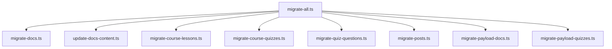

# Payload CMS Content Migration Plan

## Introduction

This document outlines the comprehensive plan for migrating content from various sources to the Payload CMS collections in our Makerkit-based Next.js 15 application. The migration is necessary after moving away from the push approach of updating the Payload schema in Supabase to using migrations.

## Context

- We have added Payload CMS to our Makerkit-based Next.js 15 app as our new CMS
- We have two apps (web and payload) in a turborepo
- We have created collections (Posts, Documentation, Course Lessons, Course Quizzes, etc.) in `apps/payload/src/collections`
- We have run migrations to set up the Payload schema in Supabase
- We now need to add content to the tables in the Payload schema

## Content Source Analysis

We have identified the following content sources:

1. **Course Lessons**:

   - `apps/payload/data/courses/lessons/*.mdoc`

2. **Course Quizzes**:

   - `apps/payload/data/courses/quizzes/*.mdoc`
   - `apps/payload/data/quizzes/*.mdoc` (additional content)

3. **Documentation**:

   - `apps/web/content/documentation/*.mdoc` (original location referenced in existing migration scripts)
   - `apps/payload/data/documentation/*.mdoc` (additional content)

4. **Blog Posts**:
   - `apps/web/content/posts/*.mdoc`

## Database Schema Overview

The Payload CMS schema has been set up in the `payload` schema in Supabase with the following key tables:

- `payload.documentation` - For documentation content
- `payload.course_quizzes` - For course quizzes
- `payload.quiz_questions` - For quiz questions
- `payload.quiz_questions_options` - For quiz question options
- `payload.media` - For media files
- `payload.users` - For users

The schema was created using the following migrations:

- `20250325160000_payload_initial_schema.sql`
- `20250325160100_payload_course_quizzes.sql`
- `20250325160200_fix_payload_quiz_questions.sql`

## Migration Strategy

We will leverage the existing content migration system in `packages/content-migrations` to create new migration scripts for each content type. The system already has working scripts for documentation migration that we can use as a reference.

### Key Components

1. **Payload Client**: The `getPayloadClient` utility in `packages/content-migrations/src/utils/payload-client.ts` provides a client for interacting with the Payload CMS API.

2. **Markdown to Lexical Conversion**: The existing scripts use `@payloadcms/richtext-lexical` to convert Markdown content to Lexical format, which is required for Payload's rich text fields.

3. **Environment Configuration**: The migration scripts use environment variables from `.env.development` or `.env.production` files.

## Implementation Plan

### 1. Migration Script Structure

We will create the following migration scripts in `packages/content-migrations/src/scripts`:



### 2. Script Implementations

#### Course Lessons Migration (`migrate-course-lessons.ts`)

This script will:

- Read `.mdoc` files from `apps/payload/data/courses/lessons/`
- Extract frontmatter metadata (title, description, etc.)
- Convert content to Lexical format
- Create records in Payload CMS

```typescript
/**
 * Script to migrate course lessons from Markdown files to Payload CMS
 */
import { $convertFromMarkdownString } from '@payloadcms/richtext-lexical';
import { createHeadlessEditor } from '@payloadcms/richtext-lexical/lexical/headless';
import fs from 'fs';
import matter from 'gray-matter';
import path from 'path';
import { fileURLToPath } from 'url';

import { getPayloadClient } from '../utils/payload-client.js';

// Get the current file's directory
const __filename = fileURLToPath(import.meta.url);
const __dirname = path.dirname(__filename);

/**
 * Migrates course lessons from Markdown files to Payload CMS
 */
async function migrateCourseLessonsToPayload() {
  // Get the Payload client
  const payload = await getPayloadClient();

  // Path to the course lessons files
  const lessonsDir = path.resolve(
    __dirname,
    '../../../../apps/payload/data/courses/lessons',
  );
  console.log(`Course lessons directory: ${lessonsDir}`);

  // Read all .mdoc files
  const mdocFiles = fs
    .readdirSync(lessonsDir)
    .filter((file) => file.endsWith('.mdoc'))
    .map((file) => path.join(lessonsDir, file));

  console.log(`Found ${mdocFiles.length} lesson files to migrate.`);

  // Migrate each file to Payload
  for (const file of mdocFiles) {
    try {
      const content = fs.readFileSync(file, 'utf8');
      const { data, content: mdContent } = matter(content);

      // Generate a slug from the file name
      const slug = path.basename(file, '.mdoc');

      // Convert Markdown content to Lexical format
      const lexicalContent = (() => {
        // Create a headless editor instance
        const headlessEditor = createHeadlessEditor({});

        // Convert Markdown to Lexical format
        headlessEditor.update(
          () => {
            $convertFromMarkdownString(mdContent);
          },
          { discrete: true },
        );

        // Get the Lexical JSON
        return headlessEditor.getEditorState().toJSON();
      })();

      // Create a document in the course_lessons collection
      await payload.create({
        collection: 'course_lessons',
        data: {
          title: data.title || slug,
          slug,
          description: data.description || '',
          content: lexicalContent,
          lessonID: data.lessonID || 0,
          chapter: data.chapter || '',
          lessonNumber: data.lessonNumber || 0,
          lessonLength: data.lessonLength || 0,
          publishedAt: data.publishedAt
            ? new Date(data.publishedAt).toISOString()
            : new Date().toISOString(),
          status: data.status || 'draft',
          order: data.order || 0,
          language: data.language || 'en',
          // Handle image relationship if needed
        },
      });

      console.log(`Migrated lesson: ${slug}`);
    } catch (error) {
      console.error(`Error migrating ${file}:`, error);
    }
  }

  console.log('Course lessons migration complete!');
}

// Run the migration
migrateCourseLessonsToPayload().catch((error) => {
  console.error('Course lessons migration failed:', error);
  process.exit(1);
});
```

#### Course Quizzes Migration (`migrate-course-quizzes.ts`)

This script will:

- Read `.mdoc` files from `apps/payload/data/courses/quizzes/`
- Create quiz records in the `course_quizzes` table

```typescript
/**
 * Script to migrate course quizzes from Markdown files to Payload CMS
 */
import fs from 'fs';
import matter from 'gray-matter';
import path from 'path';
import { fileURLToPath } from 'url';

import { getPayloadClient } from '../utils/payload-client.js';

// Get the current file's directory
const __filename = fileURLToPath(import.meta.url);
const __dirname = path.dirname(__filename);

/**
 * Migrates course quizzes from Markdown files to Payload CMS
 */
async function migrateQuizzesToPayload() {
  // Get the Payload client
  const payload = await getPayloadClient();

  // Path to the course quizzes files
  const quizzesDir = path.resolve(
    __dirname,
    '../../../../apps/payload/data/courses/quizzes',
  );
  console.log(`Course quizzes directory: ${quizzesDir}`);

  // Read all .mdoc files
  const mdocFiles = fs
    .readdirSync(quizzesDir)
    .filter((file) => file.endsWith('.mdoc'))
    .map((file) => path.join(quizzesDir, file));

  console.log(`Found ${mdocFiles.length} quiz files to migrate.`);

  // Store quiz IDs for later use in quiz questions migration
  const quizIdMap = new Map();

  // Migrate each file to Payload
  for (const file of mdocFiles) {
    try {
      const content = fs.readFileSync(file, 'utf8');
      const { data } = matter(content);

      // Generate a slug from the file name
      const slug = path.basename(file, '.mdoc');

      // Create a document in the course_quizzes collection
      const quiz = await payload.create({
        collection: 'course_quizzes',
        data: {
          title: data.title || slug,
          description: data.description || '',
          passingScore: data.passingScore || 70,
        },
      });

      // Store the quiz ID for later use
      quizIdMap.set(slug, quiz.id);

      console.log(`Migrated quiz: ${slug}`);
    } catch (error) {
      console.error(`Error migrating ${file}:`, error);
    }
  }

  // Save the quiz ID map to a file for use in the quiz questions migration
  fs.writeFileSync(
    path.resolve(__dirname, '../data/quiz-id-map.json'),
    JSON.stringify(Object.fromEntries(quizIdMap), null, 2),
  );

  console.log('Course quizzes migration complete!');
}

// Run the migration
migrateQuizzesToPayload().catch((error) => {
  console.error('Course quizzes migration failed:', error);
  process.exit(1);
});
```

#### Quiz Questions Migration (`migrate-quiz-questions.ts`)

This script will:

- Read `.mdoc` files from `apps/payload/data/courses/quizzes/`
- Extract questions from each quiz
- Create question records in the `quiz_questions` table
- Link them to the appropriate quiz via relationship

```typescript
/**
 * Script to migrate quiz questions from Markdown files to Payload CMS
 */
import fs from 'fs';
import matter from 'gray-matter';
import path from 'path';
import { fileURLToPath } from 'url';
import { v4 as uuidv4 } from 'uuid';

import { getPayloadClient } from '../utils/payload-client.js';

// Get the current file's directory
const __filename = fileURLToPath(import.meta.url);
const __dirname = path.dirname(__filename);

/**
 * Migrates quiz questions from Markdown files to Payload CMS
 */
async function migrateQuizQuestionsToPayload() {
  // Get the Payload client
  const payload = await getPayloadClient();

  // Path to the course quizzes files
  const quizzesDir = path.resolve(
    __dirname,
    '../../../../apps/payload/data/courses/quizzes',
  );
  console.log(`Course quizzes directory: ${quizzesDir}`);

  // Load the quiz ID map
  const quizIdMapPath = path.resolve(__dirname, '../data/quiz-id-map.json');
  if (!fs.existsSync(quizIdMapPath)) {
    console.error(
      'Quiz ID map not found. Run migrate-course-quizzes.ts first.',
    );
    process.exit(1);
  }
  const quizIdMap = JSON.parse(fs.readFileSync(quizIdMapPath, 'utf8'));

  // Read all .mdoc files
  const mdocFiles = fs
    .readdirSync(quizzesDir)
    .filter((file) => file.endsWith('.mdoc'))
    .map((file) => path.join(quizzesDir, file));

  console.log(`Found ${mdocFiles.length} quiz files to process for questions.`);

  // Migrate questions from each quiz file
  for (const file of mdocFiles) {
    try {
      const content = fs.readFileSync(file, 'utf8');
      const { data } = matter(content);

      // Generate a slug from the file name
      const slug = path.basename(file, '.mdoc');

      // Get the quiz ID
      const quizId = quizIdMap[slug];
      if (!quizId) {
        console.error(`Quiz ID not found for ${slug}. Skipping questions.`);
        continue;
      }

      // Process questions
      if (data.questions && Array.isArray(data.questions)) {
        console.log(
          `Processing ${data.questions.length} questions for quiz: ${slug}`,
        );

        for (let i = 0; i < data.questions.length; i++) {
          const q = data.questions[i];

          // Generate a unique ID for the question
          const questionId = uuidv4();

          // Create the question
          await payload.create({
            collection: 'quiz_questions',
            data: {
              id: questionId,
              question: q.question,
              quiz: quizId,
              type:
                q.questiontype === 'multi-answer'
                  ? 'multiple_choice'
                  : 'multiple_choice',
              explanation: q.explanation || '',
              order: i,
            },
          });

          // Create options for the question
          if (q.answers && Array.isArray(q.answers)) {
            for (let j = 0; j < q.answers.length; j++) {
              const option = q.answers[j];

              // Generate a unique ID for the option
              const optionId = uuidv4();

              // Create the option
              await payload.create({
                collection: 'quiz_questions_options',
                data: {
                  id: optionId,
                  _order: j,
                  _parent_id: questionId,
                  text: option.answer,
                  is_correct: option.correct || false,
                },
              });
            }
          }

          console.log(`Migrated question ${i + 1} for quiz: ${slug}`);
        }
      }
    } catch (error) {
      console.error(`Error migrating questions for ${file}:`, error);
    }
  }

  console.log('Quiz questions migration complete!');
}

// Run the migration
migrateQuizQuestionsToPayload().catch((error) => {
  console.error('Quiz questions migration failed:', error);
  process.exit(1);
});
```

#### Blog Posts Migration (`migrate-posts.ts`)

This script will:

- Read `.mdoc` files from `apps/web/content/posts/`
- Convert content to Lexical format
- Create records in Payload CMS

```typescript
/**
 * Script to migrate blog posts from Markdown files to Payload CMS
 */
import { $convertFromMarkdownString } from '@payloadcms/richtext-lexical';
import { createHeadlessEditor } from '@payloadcms/richtext-lexical/lexical/headless';
import fs from 'fs';
import matter from 'gray-matter';
import path from 'path';
import { fileURLToPath } from 'url';

import { getPayloadClient } from '../utils/payload-client.js';

// Get the current file's directory
const __filename = fileURLToPath(import.meta.url);
const __dirname = path.dirname(__filename);

/**
 * Migrates blog posts from Markdown files to Payload CMS
 */
async function migratePostsToPayload() {
  // Get the Payload client
  const payload = await getPayloadClient();

  // Path to the blog posts files
  const postsDir = path.resolve(
    __dirname,
    '../../../../apps/web/content/posts',
  );
  console.log(`Blog posts directory: ${postsDir}`);

  // Read all .mdoc files
  const mdocFiles = fs
    .readdirSync(postsDir)
    .filter((file) => file.endsWith('.mdoc'))
    .map((file) => path.join(postsDir, file));

  console.log(`Found ${mdocFiles.length} blog post files to migrate.`);

  // Migrate each file to Payload
  for (const file of mdocFiles) {
    try {
      const content = fs.readFileSync(file, 'utf8');
      const { data, content: mdContent } = matter(content);

      // Generate a slug from the file name
      const slug = path.basename(file, '.mdoc');

      // Convert Markdown content to Lexical format
      const lexicalContent = (() => {
        // Create a headless editor instance
        const headlessEditor = createHeadlessEditor({});

        // Convert Markdown to Lexical format
        headlessEditor.update(
          () => {
            $convertFromMarkdownString(mdContent);
          },
          { discrete: true },
        );

        // Get the Lexical JSON
        return headlessEditor.getEditorState().toJSON();
      })();

      // Create a document in the posts collection
      await payload.create({
        collection: 'posts',
        data: {
          title: data.title || slug,
          slug,
          description: data.description || '',
          content: lexicalContent,
          publishedAt: data.publishedAt
            ? new Date(data.publishedAt).toISOString()
            : new Date().toISOString(),
          status: data.status || 'draft',
          categories: data.categories
            ? data.categories.map((category: string) => ({ category }))
            : [],
          tags: data.tags ? data.tags.map((tag: string) => ({ tag })) : [],
        },
      });

      console.log(`Migrated blog post: ${slug}`);
    } catch (error) {
      console.error(`Error migrating ${file}:`, error);
    }
  }

  console.log('Blog posts migration complete!');
}

// Run the migration
migratePostsToPayload().catch((error) => {
  console.error('Blog posts migration failed:', error);
  process.exit(1);
});
```

#### Documentation from Payload Data (`migrate-payload-docs.ts`)

This script will:

- Read `.mdoc` files from `apps/payload/data/documentation/`
- Handle nested directory structure
- Process parent-child relationships
- Convert content to Lexical format
- Create records in Payload CMS documentation collection

```typescript
/**
 * Script to migrate documentation from Payload data directory to Payload CMS
 */
import { $convertFromMarkdownString } from '@payloadcms/richtext-lexical';
import { createHeadlessEditor } from '@payloadcms/richtext-lexical/lexical/headless';
import fs from 'fs';
import matter from 'gray-matter';
import path from 'path';
import { fileURLToPath } from 'url';

import { getPayloadClient } from '../utils/payload-client.js';

// Get the current file's directory
const __filename = fileURLToPath(import.meta.url);
const __dirname = path.dirname(__filename);

/**
 * Migrates documentation from Payload data directory to Payload CMS
 */
async function migratePayloadDocsToPayload() {
  // Get the Payload client
  const payload = await getPayloadClient();

  // Path to the documentation files
  const docsDir = path.resolve(
    __dirname,
    '../../../../apps/payload/data/documentation',
  );
  console.log(`Documentation directory: ${docsDir}`);

  // Function to recursively read all .mdoc files
  const readMdocFiles = (dir: string, parentPath = ''): string[] => {
    console.log(`Reading directory: ${dir}`);
    const files: string[] = [];

    try {
      const items = fs.readdirSync(dir);
      console.log(`Found ${items.length} items in directory`);

      for (const item of items) {
        const itemPath = path.join(dir, item);
        const stat = fs.statSync(itemPath);

        if (stat.isDirectory()) {
          console.log(`Found directory: ${item}`);
          files.push(...readMdocFiles(itemPath, path.join(parentPath, item)));
        } else if (item.endsWith('.mdoc')) {
          console.log(`Found .mdoc file: ${item}`);
          files.push(path.join(parentPath, item));
        } else {
          console.log(`Skipping file: ${item} (not a .mdoc file)`);
        }
      }
    } catch (error) {
      console.error(`Error reading directory ${dir}:`, error);
    }

    return files;
  };

  // Get all .mdoc files
  const mdocFiles = readMdocFiles(docsDir);
  console.log(`Found ${mdocFiles.length} documentation files to migrate.`);

  // First pass: Create all documents without parent relationships
  const docIdMap = new Map();

  for (const file of mdocFiles) {
    const filePath = path.join(docsDir, file);

    try {
      const content = fs.readFileSync(filePath, 'utf8');
      const { data, content: mdContent } = matter(content);

      // Generate a slug from the file path
      const slug = file
        .replace(/\.mdoc$/, '')
        .replace(/\\/g, '/')
        .replace(/^\//, '');

      // Convert Markdown content to Lexical format
      const lexicalContent = (() => {
        // Create a headless editor instance
        const headlessEditor = createHeadlessEditor({});

        // Convert Markdown to Lexical format
        headlessEditor.update(
          () => {
            $convertFromMarkdownString(mdContent);
          },
          { discrete: true },
        );

        // Get the Lexical JSON
        return headlessEditor.getEditorState().toJSON();
      })();

      // Create a document in the documentation collection
      const doc = await payload.create({
        collection: 'documentation',
        data: {
          title: data.title || path.basename(file, '.mdoc'),
          slug,
          description: data.description || '',
          content: lexicalContent,
          publishedAt: data.publishedAt
            ? new Date(data.publishedAt).toISOString()
            : new Date().toISOString(),
          status: data.status || 'published',
          order: data.order || 0,
          categories: data.categories
            ? data.categories.map((category: string) => ({ category }))
            : [],
          tags: data.tags ? data.tags.map((tag: string) => ({ tag })) : [],
          // Parent will be set in the second pass
        },
      });

      // Store the document ID for later use
      docIdMap.set(slug, doc.id);

      console.log(`Migrated: ${file}`);
    } catch (error) {
      console.error(`Error migrating ${file}:`, error);
    }
  }

  // Second pass: Update parent relationships
  for (const file of mdocFiles) {
    const filePath = path.join(docsDir, file);

    try {
      const content = fs.readFileSync(filePath, 'utf8');
      const { data } = matter(content);

      // Generate a slug from the file path
      const slug = file
        .replace(/\.mdoc$/, '')
        .replace(/\\/g, '/')
        .replace(/^\//, '');

      // Check if this document has a parent
      if (data.parent) {
        const parentId = docIdMap.get(data.parent);
        if (parentId) {
          // Update the document with the parent relationship
          await payload.update({
            collection: 'documentation',
            id: docIdMap.get(slug),
            data: {
              parent: parentId,
            },
          });

          console.log(`Updated parent relationship for: ${file}`);
        } else {
          console.warn(`Parent not found for: ${file}, parent: ${data.parent}`);
        }
      }
    } catch (error) {
      console.error(`Error updating parent for ${file}:`, error);
    }
  }

  console.log('Payload documentation migration complete!');
}

// Run the migration
migratePayloadDocsToPayload().catch((error) => {
  console.error('Payload documentation migration failed:', error);
  process.exit(1);
});
```

#### Quizzes from Payload Data (`migrate-payload-quizzes.ts`)

This script will:

- Read `.mdoc` files from `apps/payload/data/quizzes/`
- Check for duplicates with content from `apps/payload/data/courses/quizzes/`
- Merge any unique content not covered by the earlier migration scripts
- Create records in `course_quizzes` and `quiz_questions` tables

```typescript
/**
 * Script to migrate quizzes from Payload data directory to Payload CMS
 */
import fs from 'fs';
import matter from 'gray-matter';
import path from 'path';
import { fileURLToPath } from 'url';
import { v4 as uuidv4 } from 'uuid';

import { getPayloadClient } from '../utils/payload-client.js';

// Get the current file's directory
const __filename = fileURLToPath(import.meta.url);
const __dirname = path.dirname(__filename);

/**
 * Migrates quizzes from Payload data directory to Payload CMS
 */
async function migratePayloadQuizzesToPayload() {
  // Get the Payload client
  const payload = await getPayloadClient();

  // Path to the quizzes files
  const quizzesDir = path.resolve(
    __dirname,
    '../../../../apps/payload/data/quizzes',
  );
  console.log(`Quizzes directory: ${quizzesDir}`);

  // Load the quiz ID map if it exists
  const quizIdMapPath = path.resolve(__dirname, '../data/quiz-id-map.json');
  let quizIdMap = {};
  if (fs.existsSync(quizIdMapPath)) {
    quizIdMap = JSON.parse(fs.readFileSync(quizIdMapPath, 'utf8'));
  }

  // Get existing quizzes from Payload CMS
  const { docs: existingQuizzes } = await payload.find({
    collection: 'course_quizzes',
    limit: 100,
  });

  // Read all .mdoc files
  const mdocFiles = fs
    .readdirSync(quizzesDir)
    .filter((file) => file.endsWith('.mdoc'))
    .map((file) => path.join(quizzesDir, file));

  console.log(`Found ${mdocFiles.length} quiz files to migrate.`);

  // Migrate each file to Payload
  for (const file of mdocFiles) {
    try {
      const content = fs.readFileSync(file, 'utf8');
      const { data } = matter(content);

      // Generate a slug from the file name
      const slug = path.basename(file, '.mdoc');

      // Check if this quiz already exists
      const existingQuiz = existingQuizzes.find((q) => q.title === data.title);
      let quizId;

      if (existingQuiz) {
        console.log(`Quiz already exists: ${data.title}. Using existing quiz.`);
        quizId = existingQuiz.id;
      } else {
        // Create a new quiz
        const quiz = await payload.create({
          collection: 'course_quizzes',
          data: {
            title: data.title || slug,
            description: data.description || '',
            passingScore: data.passingScore || 70,
          },
        });

        quizId = quiz.id;
        console.log(`Created new quiz: ${data.title}`);
      }

      // Store the quiz ID in the map
      quizIdMap[slug] = quizId;

      // Process questions
      if (data.questions && Array.isArray(data.questions)) {
        console.log(
          `Processing ${data.questions.length} questions for quiz: ${slug}`,
        );

        for (let i = 0; i < data.questions.length; i++) {
          const q = data.questions[i];

          // Check if this question already exists
          const { docs: existingQuestions } = await payload.find({
            collection: 'quiz_questions',
            query: {
              quiz: quizId,
              question: q.question,
            },
          });

          if (existingQuestions.length > 0) {
            console.log(`Question already exists: ${q.question}. Skipping.`);
            continue;
          }

          // Generate a unique ID for the question
          const questionId = uuidv4();

          // Create the question
          await payload.create({
            collection: 'quiz_questions',
            data: {
              id: questionId,
              question: q.question,
              quiz: quizId,
              type:
                q.questiontype === 'multi-answer'
                  ? 'multiple_choice'
                  : 'multiple_choice',
              explanation: q.explanation || '',
              order: i,
            },
          });

          // Create options for the question
          if (q.answers && Array.isArray(q.answers)) {
            for (let j = 0; j < q.answers.length; j++) {
              const option = q.answers[j];

              // Generate a unique ID for the option
              const optionId = uuidv4();

              // Create the option
              await payload.create({
                collection: 'quiz_questions_options',
                data: {
                  id: optionId,
                  _order: j,
                  _parent_id: questionId,
                  text: option.answer,
                  is_correct: option.correct || false,
                },
              });
            }
          }

          console.log(`Migrated question ${i + 1} for quiz: ${slug}`);
        }
      }
    } catch (error) {
      console.error(`Error migrating ${file}:`, error);
    }
  }

  // Save the updated quiz ID map
  fs.writeFileSync(quizIdMapPath, JSON.stringify(quizIdMap, null, 2));

  console.log('Payload quizzes migration complete!');
}

// Run the migration
migratePayloadQuizzesToPayload().catch((error) => {
  console.error('Payload quizzes migration failed:', error);
  process.exit(1);
});
```

### 3. Update migrate-all.ts

Update the `migrate-all.ts` script to include all the new migration scripts:

```typescript
/**
 * Script to run all content migration scripts
 */
import dotenv from 'dotenv';
import path from 'path';
import { fileURLToPath } from 'url';

// Get the current file's directory
const __filename = fileURLToPath(import.meta.url);
const __dirname = path.dirname(__filename);

// Load environment variables from the package's .env file
dotenv.config({ path: path.resolve(__dirname, '../../.env') });

/**
 * Runs all content migration scripts
 */
async function runAllMigrations() {
  console.log('Starting all content migrations...');

  try {
    // Import and run the docs migration
    console.log('Running documentation migration...');
    await import('./migrate-docs.js');

    // Import and run the docs content update
    console.log('Running documentation content update...');
    await import('./update-docs-content.js');

    // Import and run the course lessons migration
    console.log('Running course lessons migration
```
