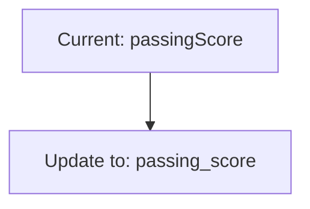
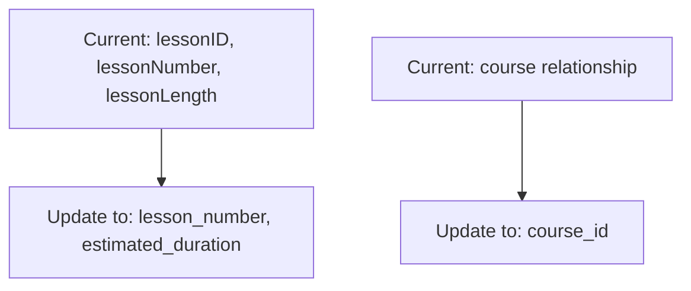
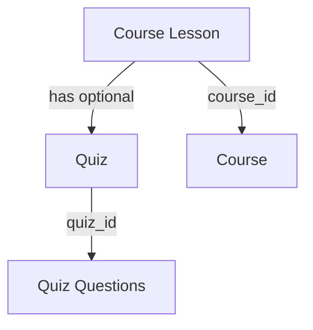
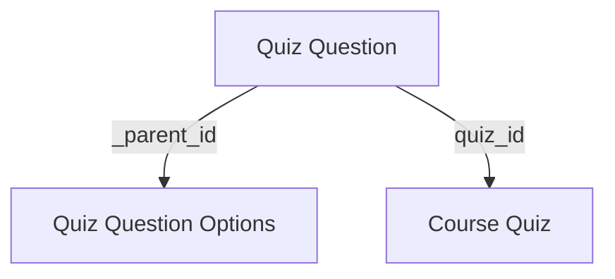

# Content Migration System Update Plan

## Current State Analysis

### Database Schema

- The Payload CMS tables are properly set up in the `payload` schema in Supabase
- Key tables include:
  - `courses` - Main course table with UUID primary keys
  - `course_lessons` - Lessons with relationships to courses
  - `course_quizzes` - Quizzes with passing score field
  - `quiz_questions` - Questions linked to quizzes
  - `quiz_questions_options` - Options for quiz questions
- Foreign key constraints are properly established between tables

### Content Migration System

- Located in `packages/content-migrations`
- Has scripts for migrating various content types
- Uses the enhanced Payload client to interact with the CMS API
- Environment variables are configured in `.env.development`

### Issues Identified

1. **Field name mismatches**: Some field names in migration scripts don't match database column names
   - Example: `passingScore` in scripts vs `passing_score` in database
2. **Relationship handling**: Some relationships need to be updated to match the current schema

   - Course lessons to quizzes relationship
   - Quiz questions to options relationship

3. **UUID handling**: All IDs are UUID type, but some scripts may not be handling this correctly

4. **Empty database**: The tables exist but are empty of content, requiring a full migration

## Update Plan

### 1. Update Field Names in Migration Scripts

The following scripts need field name updates:

#### `migrate-course-quizzes.ts`



#### `migrate-course-lessons.ts`



### 2. Fix Relationship Handling

#### Course Lessons to Quizzes



- Update `migrate-course-lessons.ts` to properly set the `quiz_id_id` field when a lesson has a quiz

#### Quiz Questions to Options



- Update `migrate-quiz-questions.ts` to properly create options in the `quiz_questions_options` table
- Ensure the `_parent_id` field is set correctly to link options to questions

### 3. Update Database Connection Testing

- Enhance `test-database-connection.ts` to verify all required tables and their structure
- Add validation for foreign key constraints
- Test with empty tables to ensure the script works with the current schema

### 4. Create a Comprehensive Migration Script

Create a new script that:

1. Checks the database schema
2. Runs all migration scripts in the correct order
3. Validates the migrated data
4. Reports any issues

### 5. Specific Code Updates Required

#### 1. `migrate-course-quizzes.ts`

```typescript
// Update this:
const quiz = await payload.create({
  collection: 'course_quizzes',
  data: {
    title: data.title || slug,
    description: data.description || '',
    passingScore: data.passingScore || 70,
  },
});

// To this:
const quiz = await payload.create({
  collection: 'course_quizzes',
  data: {
    title: data.title || slug,
    description: data.description || '',
    passing_score: data.passingScore || 70,
  },
});
```

#### 2. `migrate-course-lessons.ts`

```typescript
// Update this:
await payload.create({
  collection: 'course_lessons',
  data: {
    title: data.title || slug,
    slug,
    description: data.description || '',
    content: lexicalContent,
    lessonID: data.lessonID || 0,
    chapter: data.chapter || '',
    lessonNumber: data.lessonNumber || 0,
    lessonLength: data.lessonLength || 0,
    publishedAt: data.publishedAt
      ? new Date(data.publishedAt).toISOString()
      : new Date().toISOString(),
    status: data.status || 'draft',
    order: data.order || 0,
    language: data.language || 'en',
    // Add the course relationship
    course: courseId,
  },
});

// To this:
await payload.create({
  collection: 'course_lessons',
  data: {
    title: data.title || slug,
    slug,
    description: data.description || '',
    content: lexicalContent,
    lesson_number: data.lessonNumber || 0,
    estimated_duration: data.lessonLength || 0,
    published_at: data.publishedAt
      ? new Date(data.publishedAt).toISOString()
      : new Date().toISOString(),
    // Add the course relationship
    course_id: courseId,
    // Add quiz relationship if applicable
    quiz_id_id: quizId || null,
  },
});
```

#### 3. `migrate-quiz-questions.ts`

```typescript
// Update the options creation:
// Instead of just logging the options, actually create them
for (let j = 0; j < q.answers.length; j++) {
  const option = q.answers[j];

  await payload.create({
    collection: 'quiz_questions_options',
    data: {
      _order: j,
      _parent_id: questionData.id, // Use the question ID as parent
      text: option.answer,
      is_correct: option.correct || false,
    },
  });

  console.log(
    `Added option: ${option.answer} (correct: ${option.correct || false})`,
  );
}
```

## Testing Strategy

1. **Database Schema Verification**

   - Run `check-database-schema.ts` to verify the schema
   - Ensure all tables and columns match expectations

2. **Incremental Testing**

   - Test each updated script individually
   - Start with a small subset of content
   - Verify the data in the database after each script

3. **Full Migration Test**
   - Run the complete migration process
   - Verify all relationships are correctly established
   - Test the web application to ensure it can access the migrated content

## Implementation Steps

1. Update the field names in all migration scripts
2. Fix relationship handling in the scripts
3. Enhance the database connection testing
4. Create a comprehensive migration script
5. Test each script individually
6. Run the full migration process
7. Verify the migrated data
