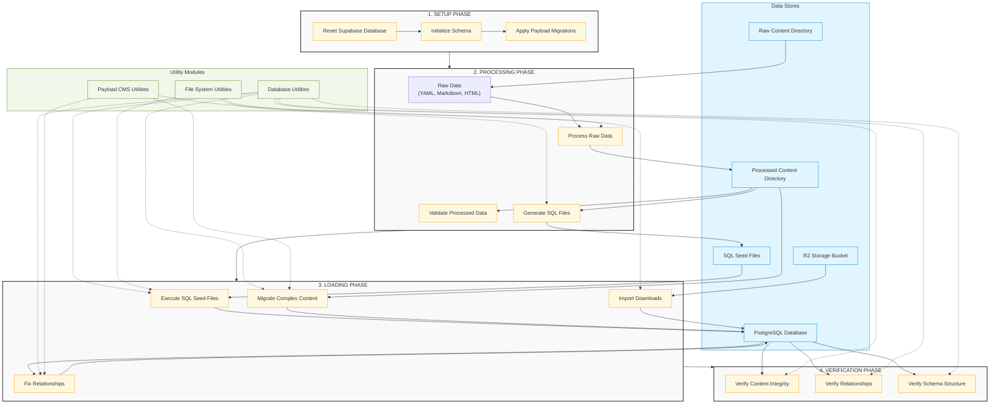

# Content Migration System Architecture

The following diagram illustrates the architecture and data flow of the content migration system.

## Key Components

### Data Stores

- **Raw Content Directory**: Contains original content in various formats (Markdown, YAML, HTML)
- **Processed Content Directory**: Contains transformed content ready for database import
- **SQL Seed Files**: Generated SQL files that populate the database
- **PostgreSQL Database**: The Payload CMS database with all content tables
- **R2 Storage Bucket**: External storage for downloadable files

### Utility Modules

- **Database Utilities**: Functions for executing SQL and managing database connections
- **File System Utilities**: Functions for reading and writing files
- **Payload CMS Utilities**: Functions for interacting with the Payload CMS API

### Main Process Phases

1. **Setup Phase**: Prepares the database environment
2. **Processing Phase**: Transforms raw content into a format suitable for import
3. **Loading Phase**: Populates the database with content
4. **Verification Phase**: Ensures content integrity and relationships

## Data Flow

1. Raw content is processed into structured formats
2. SQL seed files are generated from processed content
3. SQL seed files are executed to populate the database
4. Complex content is migrated using direct API calls
5. Relationships between content items are established
6. Content integrity is verified
