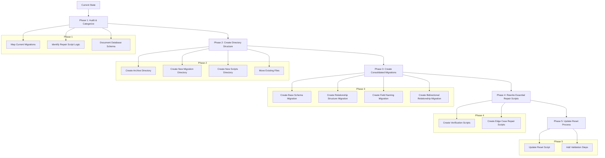

# Payload CMS Migration and Repair Script Rationalization Plan

## Overview

This document outlines a comprehensive plan to rationalize and consolidate the migration files and repair scripts for our Payload CMS implementation. The goal is to simplify the migration process, reduce duplication, and create a more maintainable codebase.

## Key Findings from Research

### Payload CMS Database Design

1. **Relationship Structure**: Payload uses separate relationship tables (with "\_rels" suffix) to manage relationships between collections
2. **Field Naming Conventions**: Payload adds "\_id" suffix to relationship fields, which can cause duplicate suffixes (e.g., "quiz_id_id")
3. **Bidirectional Relationships**: Must be explicitly maintained in both directions via relationship tables
4. **Table Structure Requirements**: Relationship tables need specific columns: `id`, `_parent_id`, `field`, and `value`

### Current Issues in Our Project

1. **Duplicate Logic**: Same fixes implemented in both migrations and repair scripts
2. **Field Naming Inconsistencies**: Issues with fields like "quiz_id_id" vs "quiz_id"
3. **Missing Bidirectional Relationships**: Relationships not properly established in both directions
4. **Inconsistent Table Structures**: Some tables missing required columns
5. **File Organization**: Migration and repair script files are scattered and not well organized

## Consolidated Migration Plan

We propose a five-phase approach to rationalize our migrations and repair scripts:



### Phase 1: Audit & Categorize

1. **Map Current Migrations**

   - Document all existing migrations and their purposes
   - Identify which migrations can be consolidated
   - Create a dependency graph to understand execution order requirements
   - **Specifically identify all survey and quiz related migrations**

2. **Identify Repair Script Logic**

   - Extract core logic from repair scripts
   - Determine which logic should be moved to migrations
   - Identify edge cases that still require repair scripts
   - **Pay special attention to survey question relationship scripts**

3. **Document Database Schema**
   - Create a comprehensive map of the current database schema
   - Document all tables, columns, and relationships
   - Identify any inconsistencies or missing elements
   - **Ensure survey and quiz tables and relationships are fully documented**

### Phase 2: Create Directory Structure

1. **Create Archive Directory**

   ```
   mkdir -p apps/payload/src/migrations/archived
   mkdir -p packages/content-migrations/src/scripts/archived
   ```

2. **Create New Migration Directory**

   ```
   mkdir -p apps/payload/src/migrations/consolidated
   ```

3. **Create New Scripts Directory**

   ```
   mkdir -p packages/content-migrations/src/scripts/verification
   mkdir -p packages/content-migrations/src/scripts/repair
   ```

4. **Move Existing Files**

   - Move all existing migration files to the archive directory:

   ```
   # PowerShell command
   Move-Item -Path apps/payload/src/migrations/2025*.ts -Destination apps/payload/src/migrations/archived/
   ```

   - Move all existing repair scripts to the archive directory:

   ```
   # PowerShell command
   Move-Item -Path packages/content-migrations/src/scripts/fix-*.ts -Destination packages/content-migrations/src/scripts/archived/
   Move-Item -Path packages/content-migrations/src/scripts/verify-*.ts -Destination packages/content-migrations/src/scripts/archived/
   ```

### Phase 3: Create Consolidated Migrations

Based on the audit, create four consolidated migrations that replace the numerous existing ones:

1. **Base Schema Migration**

   ```typescript
   // apps/payload/src/migrations/consolidated/20250501_100000_base_schema.ts
   export async function up({ db, payload }: MigrateUpArgs): Promise<void> {
     console.log('Running base schema migration');

     // Create all collection tables with correct structure
     // Ensure all required columns exist
     // Set up proper data types and constraints

     // Example: Ensure course_lessons table has quiz_id column
     await db.execute(sql`
       ALTER TABLE "payload"."course_lessons"
       ADD COLUMN IF NOT EXISTS "quiz_id" uuid REFERENCES "payload"."course_quizzes"("id") ON DELETE SET NULL;
     `);

     // Example: Ensure survey_questions table has surveys_id column
     await db.execute(sql`
       ALTER TABLE "payload"."survey_questions"
       ADD COLUMN IF NOT EXISTS "surveys_id" uuid REFERENCES "payload"."surveys"("id") ON DELETE SET NULL;
     `);

     // More table and column creation...
   }
   ```

2. **Relationship Structure Migration**

   ```typescript
   // apps/payload/src/migrations/consolidated/20250501_200000_relationship_structure.ts
   export async function up({ db, payload }: MigrateUpArgs): Promise<void> {
     console.log('Running relationship structure migration');

     // Create all relationship tables with correct structure
     // Ensure all required columns exist (id, _parent_id, field, value)

     // Example: Ensure course_lessons_rels table exists with proper structure
     await db.execute(sql`
       CREATE TABLE IF NOT EXISTS "payload"."course_lessons_rels" (
         "id" uuid PRIMARY KEY DEFAULT gen_random_uuid(),
         "_parent_id" uuid NOT NULL REFERENCES "payload"."course_lessons"("id") ON DELETE CASCADE,
         "field" VARCHAR(255),
         "value" uuid,
         "created_at" TIMESTAMP WITH TIME ZONE DEFAULT NOW(),
         "updated_at" TIMESTAMP WITH TIME ZONE DEFAULT NOW()
       );
     `);

     // Example: Ensure survey_questions_rels table exists with proper structure
     await db.execute(sql`
       CREATE TABLE IF NOT EXISTS "payload"."survey_questions_rels" (
         "id" uuid PRIMARY KEY DEFAULT gen_random_uuid(),
         "_parent_id" uuid NOT NULL REFERENCES "payload"."survey_questions"("id") ON DELETE CASCADE,
         "field" VARCHAR(255),
         "value" uuid,
         "created_at" TIMESTAMP WITH TIME ZONE DEFAULT NOW(),
         "updated_at" TIMESTAMP WITH TIME ZONE DEFAULT NOW()
       );
     `);

     // Example: Ensure surveys_rels table exists with proper structure
     await db.execute(sql`
       CREATE TABLE IF NOT EXISTS "payload"."surveys_rels" (
         "id" uuid PRIMARY KEY DEFAULT gen_random_uuid(),
         "_parent_id" uuid NOT NULL REFERENCES "payload"."surveys"("id") ON DELETE CASCADE,
         "field" VARCHAR(255),
         "value" uuid,
         "created_at" TIMESTAMP WITH TIME ZONE DEFAULT NOW(),
         "updated_at" TIMESTAMP WITH TIME ZONE DEFAULT NOW()
       );
     `);

     // More relationship table creation...
   }
   ```

3. **Field Naming Migration**

   ```typescript
   // apps/payload/src/migrations/consolidated/20250501_300000_field_naming.ts
   export async function up({ db, payload }: MigrateUpArgs): Promise<void> {
     console.log('Running field naming migration');

     // Fix field naming issues (quiz_id_id -> quiz_id)
     // Update field values in relationship tables

     // Example: Update field name in quiz_questions_rels table
     await db.execute(sql`
       UPDATE "payload"."quiz_questions_rels"
       SET "field" = 'quiz_id'
       WHERE "field" = 'quiz_id_id';
     `);

     // Example: Update field name in survey_questions_rels table
     await db.execute(sql`
       UPDATE "payload"."survey_questions_rels"
       SET "field" = 'surveys'
       WHERE "field" = 'surveys_id';
     `);

     // More field naming fixes...
   }
   ```

4. **Bidirectional Relationship Migration**

   ```typescript
   // apps/payload/src/migrations/consolidated/20250501_400000_bidirectional_relationships.ts
   export async function up({ db, payload }: MigrateUpArgs): Promise<void> {
     console.log('Running bidirectional relationship migration');

     // Establish bidirectional relationships
     // Create entries in both relationship tables

     // Example: Create bidirectional relationships between surveys and questions
     await db.execute(sql`
       WITH questions_to_link AS (
         SELECT sq.id as question_id, sqr.surveys_id as survey_id
         FROM payload.survey_questions sq
         JOIN payload.survey_questions_rels sqr ON sq.id = sqr._parent_id
         WHERE sqr.surveys_id IS NOT NULL
         AND NOT EXISTS (
           SELECT 1 FROM payload.surveys_rels sr
           WHERE sr._parent_id = sqr.surveys_id
           AND sr.field = 'questions'
           AND sr.value = sq.id
         )
       )
       INSERT INTO payload.surveys_rels (id, _parent_id, field, value, updated_at, created_at)
       SELECT 
         gen_random_uuid(), 
         survey_id, 
         'questions', 
         question_id,
         NOW(),
         NOW()
       FROM questions_to_link;
     `);

     // Example: Create bidirectional relationships between quizzes and questions
     await db.execute(sql`
       WITH questions_to_fix AS (
         SELECT id, quiz_id
         FROM payload.quiz_questions qq
         WHERE quiz_id IS NOT NULL
         AND NOT EXISTS (
           SELECT 1 FROM payload.course_quizzes_rels cqr
           WHERE cqr._parent_id = qq.quiz_id
           AND cqr.field = 'questions'
           AND cqr.value = qq.id
         )
       )
       INSERT INTO payload.course_quizzes_rels (id, _parent_id, field, value, updated_at, created_at)
       SELECT 
         gen_random_uuid(), 
         quiz_id, 
         'questions', 
         id,
         NOW(),
         NOW()
       FROM questions_to_fix;
     `);

     // More bidirectional relationship establishment...
   }
   ```

5. **Update Migration Index**

   ```typescript
   // apps/payload/src/migrations/index.ts
   // Import archived migrations (commented out but preserved for reference)
   // import * as migration_20250327_152618_initial_schema from './archived/20250327_152618_initial_schema'
   // ... other archived migrations
   // Import consolidated migrations
   import * as migration_20250501_100000_base_schema from './consolidated/20250501_100000_base_schema';
   import * as migration_20250501_200000_relationship_structure from './consolidated/20250501_200000_relationship_structure';
   import * as migration_20250501_300000_field_naming from './consolidated/20250501_300000_field_naming';
   import * as migration_20250501_400000_bidirectional_relationships from './consolidated/20250501_400000_bidirectional_relationships';

   export const migrations = [
     // Add consolidated migrations
     {
       up: migration_20250501_100000_base_schema.up,
       down: migration_20250501_100000_base_schema.down,
       name: '20250501_100000_base_schema',
     },
     {
       up: migration_20250501_200000_relationship_structure.up,
       down: migration_20250501_200000_relationship_structure.down,
       name: '20250501_200000_relationship_structure',
     },
     {
       up: migration_20250501_300000_field_naming.up,
       down: migration_20250501_300000_field_naming.down,
       name: '20250501_300000_field_naming',
     },
     {
       up: migration_20250501_400000_bidirectional_relationships.up,
       down: migration_20250501_400000_bidirectional_relationships.down,
       name: '20250501_400000_bidirectional_relationships',
     },
   ];
   ```

### Phase 4: Rewrite Essential Repair Scripts

1. **Create Verification Scripts**

   ```typescript
   // packages/content-migrations/src/scripts/verification/verify-relationships.ts
   export async function verifyRelationships() {
     // Connect to database
     // Check relationship tables for consistency
     // Report any issues found

     // Example: Verify survey questions relationships
     const surveyVerificationResult = await client.query(`
       SELECT 
         (SELECT COUNT(*) FROM payload.survey_questions_rels WHERE surveys_id IS NOT NULL) as questions_count,
         (SELECT COUNT(*) FROM payload.surveys_rels WHERE field = 'questions') as bidirectional_count;
     `);

     // Example: Verify quiz questions relationships
     const quizVerificationResult = await client.query(`
       SELECT 
         (SELECT COUNT(*) FROM payload.quiz_questions_rels WHERE field = 'quiz_id') as questions_count,
         (SELECT COUNT(*) FROM payload.course_quizzes_rels WHERE field = 'questions') as bidirectional_count;
     `);

     // Log verification results
     // Return summary of verification
   }
   ```

2. **Create Edge Case Repair Scripts**

   ```typescript
   // packages/content-migrations/src/scripts/repair/repair-edge-cases.ts
   export async function repairEdgeCases() {
     // Connect to database
     // Identify and fix edge cases
     // Log repair actions

     // Example: Fix complex relationship issues
     await client.query(`
       -- Complex repair logic here
     `);

     // Return summary of repairs
   }
   ```

3. **Update Package.json Scripts**

   ```json
   // packages/content-migrations/package.json
   {
     "scripts": {
       // Existing scripts...

       // New verification scripts
       "verify:all-relationships": "tsx src/scripts/verification/verify-relationships.ts",

       // New repair scripts
       "repair:edge-cases": "tsx src/scripts/repair/repair-edge-cases.ts"
     }
   }
   ```

### Phase 5: Update Reset Process

1. **Update Reset Script**

   ```powershell
   # reset-and-migrate.ps1

   Write-Host "Resetting Supabase database and running Web app migrations..." -ForegroundColor Cyan
   cd apps/web
   pnpm run supabase:reset
   supabase migration up
   cd ../..

   Write-Host "Running Payload migrations..." -ForegroundColor Cyan
   cd apps/payload
   pnpm payload migrate
   cd ../..

   Write-Host "Verifying database state..." -ForegroundColor Yellow
   cd packages/content-migrations
   pnpm run verify:all-relationships

   Write-Host "Running edge case repairs if needed..." -ForegroundColor Yellow
   pnpm run repair:edge-cases

   Write-Host "Final verification..." -ForegroundColor Yellow
   pnpm run verify:all-relationships

   cd ../..

   Write-Host "All migrations completed!" -ForegroundColor Green
   ```

2. **Add Validation Steps**
   - Add validation steps to the reset process
   - Fail early if inconsistencies are detected
   - Log detailed information about the database state

## Code That Should Move from Repair Scripts to Migrations

### 1. Survey Questions Relationships

Move from `fix-survey-questions-relationships-direct.ts` to the bidirectional relationship migration:

```typescript
// In 20250501_400000_bidirectional_relationships.ts
// Add this logic to establish survey question relationships

// Ensure the surveys_rels table exists with proper structure
await db.execute(sql`
  DO $$
  BEGIN
    -- Create the table if it doesn't exist
    IF NOT EXISTS (
      SELECT FROM information_schema.tables 
      WHERE table_schema = 'payload' 
      AND table_name = 'surveys_rels'
    ) THEN
      CREATE TABLE payload.surveys_rels (
        id uuid PRIMARY KEY DEFAULT gen_random_uuid(),
        _parent_id uuid NOT NULL REFERENCES payload.surveys(id) ON DELETE CASCADE,
        field VARCHAR(255),
        value uuid,
        created_at TIMESTAMP WITH TIME ZONE DEFAULT NOW(),
        updated_at TIMESTAMP WITH TIME ZONE DEFAULT NOW()
      );
    END IF;
  END $$;
`);

// Create bidirectional relationships
await db.execute(sql`
  WITH questions_to_link AS (
    SELECT sq.id as question_id, sqr.surveys_id as survey_id
    FROM payload.survey_questions sq
    JOIN payload.survey_questions_rels sqr ON sq.id = sqr._parent_id
    WHERE sqr.surveys_id IS NOT NULL
    AND NOT EXISTS (
      SELECT 1 FROM payload.surveys_rels sr
      WHERE sr._parent_id = sqr.surveys_id
      AND sr.field = 'questions'
      AND sr.value = sq.id
    )
  )
  INSERT INTO payload.surveys_rels (id, _parent_id, field, value, updated_at, created_at)
  SELECT 
    gen_random_uuid(), 
    survey_id, 
    'questions', 
    question_id,
    NOW(),
    NOW()
  FROM questions_to_link;
`);
```

### 2. Quiz Questions Field Name

Move from `fix-quiz-questions-field-name-direct.ts` to the field naming migration:

```typescript
// In 20250501_300000_field_naming.ts
// Add this logic to fix quiz questions field names

// Update field name in quiz_questions_rels table
await db.execute(sql`
  UPDATE payload.quiz_questions_rels
  SET field = 'quiz_id'
  WHERE field = 'quiz_id_id';
`);
```

### 3. Quiz Questions Relationships

Move from `fix-quiz-questions-relationships-direct.ts` to the bidirectional relationship migration:

```typescript
// In 20250501_400000_bidirectional_relationships.ts
// Add this logic to establish quiz question relationships

// Update quiz_id_id column to match quiz_id column
await db.execute(sql`
  UPDATE payload.quiz_questions
  SET quiz_id_id = quiz_id
  WHERE quiz_id IS NOT NULL AND quiz_id_id IS NULL;
`);

// Insert relationships into quiz_questions_rels table
await db.execute(sql`
  WITH questions_to_fix AS (
    SELECT id, quiz_id
    FROM payload.quiz_questions qq
    WHERE quiz_id IS NOT NULL
    AND NOT EXISTS (
      SELECT 1 FROM payload.quiz_questions_rels qr
      WHERE qr._parent_id = qq.id
      AND qr.field = 'quiz_id'
    )
  )
  INSERT INTO payload.quiz_questions_rels (id, _parent_id, field, value, updated_at, created_at)
  SELECT 
    gen_random_uuid(), 
    id, 
    'quiz_id', 
    quiz_id,
    NOW(),
    NOW()
  FROM questions_to_fix;
`);

// Insert bidirectional relationships into course_quizzes_rels table
await db.execute(sql`
  WITH questions_to_fix AS (
    SELECT id, quiz_id
    FROM payload.quiz_questions qq
    WHERE quiz_id IS NOT NULL
    AND NOT EXISTS (
      SELECT 1 FROM payload.course_quizzes_rels cqr
      WHERE cqr._parent_id = qq.quiz_id
      AND cqr.field = 'questions'
      AND cqr.value = qq.id
    )
  )
  INSERT INTO payload.course_quizzes_rels (id, _parent_id, field, value, updated_at, created_at)
  SELECT 
    gen_random_uuid(), 
    quiz_id, 
    'questions', 
    id,
    NOW(),
    NOW()
  FROM questions_to_fix;
`);
```

## Benefits of This Approach

1. **Simplified Migration Process**: Fewer, more comprehensive migrations that are easier to understand and maintain
2. **Reduced Duplication**: Logic moved from repair scripts to migrations where appropriate
3. **Better Error Handling**: Improved validation and verification steps
4. **Clearer Documentation**: Each migration has a clear purpose and scope
5. **More Reliable Reset Process**: Less dependent on repair scripts running in the correct order
6. **Alignment with Payload Best Practices**: Following Payload's recommended approach for database management
7. **Clean Codebase**: Old files are archived rather than deleted, preserving history while cleaning up the active codebase
8. **Explicit Survey and Quiz Support**: Specific attention to survey and quiz relationships throughout the process

## Next Steps

1. Begin with Phase 1 to audit and categorize existing migrations and repair scripts
2. Create the new directory structure and move existing files to archive directories
3. Create the consolidated migrations based on the audit results
4. Rewrite necessary repair scripts for edge cases
5. Update the reset process
6. Test the entire system to ensure it works correctly
