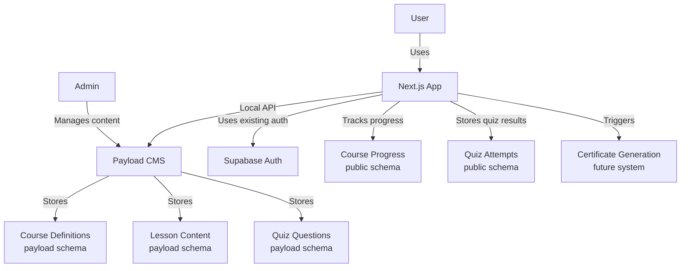

# Payload CMS Course System Implementation Plan

This document outlines the detailed implementation plan for creating a course system using Payload CMS integrated with Makerkit/Supabase authentication. This approach leverages schema separation and the Payload Local API for optimal performance.

## 1. Architecture Overview

The architecture separates concerns between Payload CMS and Supabase:

- **Payload CMS (payload schema)**: Manages course content, lessons, and quizzes
- **Supabase (public schema)**: Handles user authentication and tracks user progress
- **Next.js App**: Frontend that integrates both systems using the Payload Local API



## 2. Database Schema Design

### Payload Schema (Payload CMS)

#### Courses Collection

```typescript
{
  slug: 'courses',
  fields: [
    {
      name: 'title',
      type: 'text',
      required: true
    },
    {
      name: 'slug',
      type: 'text',
      required: true,
      unique: true
    },
    {
      name: 'description',
      type: 'textarea'
    },
    {
      name: 'status',
      type: 'select',
      options: [
        { label: 'Draft', value: 'draft' },
        { label: 'Published', value: 'published' }
      ],
      defaultValue: 'draft'
    },
    {
      name: 'featuredImage',
      type: 'upload',
      relationTo: 'media'
    },
    {
      name: 'introContent',
      type: 'richText',
      editor: lexicalEditor({})
    },
    {
      name: 'completionContent',
      type: 'richText',
      editor: lexicalEditor({})
    },
    {
      name: 'estimatedDuration',
      type: 'number',
      min: 0,
      label: 'Estimated duration (minutes)'
    },
    {
      name: 'showProgressBar',
      type: 'checkbox',
      defaultValue: true
    },
    {
      name: 'lessons',
      type: 'relationship',
      relationTo: 'course_lessons',
      hasMany: true
    }
  ],
  access: {
    read: () => true, // Public read access
  }
}
```

#### Course Lessons Collection

```typescript
{
  slug: 'course_lessons',
  fields: [
    {
      name: 'title',
      type: 'text',
      required: true
    },
    {
      name: 'slug',
      type: 'text',
      required: true,
      unique: true
    },
    {
      name: 'description',
      type: 'textarea'
    },
    {
      name: 'featuredImage',
      type: 'upload',
      relationTo: 'media'
    },
    {
      name: 'content',
      type: 'richText',
      editor: lexicalEditor({})
    },
    {
      name: 'lessonNumber',
      type: 'number',
      required: true,
      min: 1,
      admin: {
        description: 'Order in which this lesson appears in the course'
      }
    },
    {
      name: 'estimatedDuration',
      type: 'number',
      min: 0,
      label: 'Estimated duration (minutes)'
    },
    {
      name: 'course',
      type: 'relationship',
      relationTo: 'courses',
      required: true
    },
    {
      name: 'quiz',
      type: 'relationship',
      relationTo: 'course_quizzes',
      hasMany: false
    }
  ],
  access: {
    read: () => true // Public read access
  }
}
```

#### Course Quizzes Collection

```typescript
{
  slug: 'course_quizzes',
  fields: [
    {
      name: 'title',
      type: 'text',
      required: true
    },
    {
      name: 'description',
      type: 'textarea'
    },
    {
      name: 'passingScore',
      type: 'number',
      required: true,
      min: 0,
      max: 100,
      defaultValue: 70
    },
    {
      name: 'questions',
      type: 'array',
      required: true,
      fields: [
        {
          name: 'question',
          type: 'text',
          required: true
        },
        {
          name: 'type',
          type: 'select',
          required: true,
          options: [
            { label: 'Multiple Choice', value: 'multiple_choice' }
            // Future: 'true_false', 'short_answer', etc.
          ],
          defaultValue: 'multiple_choice'
        },
        {
          name: 'options',
          type: 'array',
          fields: [
            {
              name: 'text',
              type: 'text',
              required: true
            },
            {
              name: 'isCorrect',
              type: 'checkbox',
              defaultValue: false
            }
          ]
        },
        {
          name: 'explanation',
          type: 'richText',
          editor: lexicalEditor({})
        }
      ]
    }
  ],
  access: {
    read: () => true // Public read access
  }
}
```

### Public Schema (Supabase)

```sql
-- Tracks user progress through courses
CREATE TABLE IF NOT EXISTS public.course_progress (
  id UUID PRIMARY KEY DEFAULT uuid_generate_v4(),
  user_id UUID NOT NULL REFERENCES auth.users(id) ON DELETE CASCADE,
  course_id TEXT NOT NULL,
  started_at TIMESTAMP WITH TIME ZONE DEFAULT now(),
  last_accessed_at TIMESTAMP WITH TIME ZONE DEFAULT now(),
  completed_at TIMESTAMP WITH TIME ZONE,
  completion_percentage NUMERIC DEFAULT 0,
  current_lesson_id TEXT,
  certificate_generated BOOLEAN DEFAULT false,
  UNIQUE(user_id, course_id)
);

-- Tracks user progress through individual lessons
CREATE TABLE IF NOT EXISTS public.lesson_progress (
  id UUID PRIMARY KEY DEFAULT uuid_generate_v4(),
  user_id UUID NOT NULL REFERENCES auth.users(id) ON DELETE CASCADE,
  course_id TEXT NOT NULL,
  lesson_id TEXT NOT NULL,
  started_at TIMESTAMP WITH TIME ZONE DEFAULT now(),
  completed_at TIMESTAMP WITH TIME ZONE,
  completion_percentage NUMERIC DEFAULT 0,
  UNIQUE(user_id, lesson_id)
);

-- Stores quiz attempts and results
CREATE TABLE IF NOT EXISTS public.quiz_attempts (
  id UUID PRIMARY KEY DEFAULT uuid_generate_v4(),
  user_id UUID NOT NULL REFERENCES auth.users(id) ON DELETE CASCADE,
  course_id TEXT NOT NULL,
  lesson_id TEXT NOT NULL,
  quiz_id TEXT NOT NULL,
  started_at TIMESTAMP WITH TIME ZONE DEFAULT now(),
  completed_at TIMESTAMP WITH TIME ZONE,
  score NUMERIC,
  passed BOOLEAN,
  answers JSONB, -- Stores user's answers
  UNIQUE(user_id, quiz_id, started_at)
);

-- Row Level Security Policies
ALTER TABLE public.course_progress ENABLE ROW LEVEL SECURITY;
CREATE POLICY "Users can view their own course progress"
  ON public.course_progress FOR SELECT USING (auth.uid() = user_id);
CREATE POLICY "Users can create their own course progress"
  ON public.course_progress FOR INSERT WITH CHECK (auth.uid() = user_id);
CREATE POLICY "Users can update their own course progress"
  ON public.course_progress FOR UPDATE USING (auth.uid() = user_id);

ALTER TABLE public.lesson_progress ENABLE ROW LEVEL SECURITY;
CREATE POLICY "Users can view their own lesson progress"
  ON public.lesson_progress FOR SELECT USING (auth.uid() = user_id);
CREATE POLICY "Users can create their own lesson progress"
  ON public.lesson_progress FOR INSERT WITH CHECK (auth.uid() = user_id);
CREATE POLICY "Users can update their own lesson progress"
  ON public.lesson_progress FOR UPDATE USING (auth.uid() = user_id);

ALTER TABLE public.quiz_attempts ENABLE ROW LEVEL SECURITY;
CREATE POLICY "Users can view their own quiz attempts"
  ON public.quiz_attempts FOR SELECT USING (auth.uid() = user_id);
CREATE POLICY "Users can create their own quiz attempts"
  ON public.quiz_attempts FOR INSERT WITH CHECK (auth.uid() = user_id);
CREATE POLICY "Users can update their own quiz attempts"
  ON public.quiz_attempts FOR UPDATE USING (auth.uid() = user_id);
```

## 3. API Layer Implementation

### Payload Local API Implementation

Instead of using REST API calls, we'll implement a Local API approach for direct database access:

```typescript
// packages/cms/payload/src/api/payload-local.ts
import config from '@payload-config';
import { getPayload } from 'payload';

// Cache the payload instance
let payloadInstance: any = null;

export async function getPayloadInstance() {
  if (!payloadInstance) {
    payloadInstance = await getPayload({ config });
  }
  return payloadInstance;
}

// Course-related API functions
export async function getCourses(options = {}) {
  const payload = await getPayloadInstance();
  return payload.find({
    collection: 'courses',
    where: { status: { equals: 'published' } },
    depth: 1,
    ...options,
  });
}

export async function getCourseBySlug(slug: string, options = {}) {
  const payload = await getPayloadInstance();
  return payload.find({
    collection: 'courses',
    where: { slug: { equals: slug } },
    depth: 1,
    ...options,
  });
}

export async function getCourseLessons(courseId: string, options = {}) {
  const payload = await getPayloadInstance();
  return payload.find({
    collection: 'course_lessons',
    where: { course: { equals: courseId } },
    sort: 'lessonNumber',
    depth: 0,
    ...options,
  });
}

export async function getLessonBySlug(slug: string, options = {}) {
  const payload = await getPayloadInstance();
  return payload.find({
    collection: 'course_lessons',
    where: { slug: { equals: slug } },
    depth: 2,
    ...options,
  });
}

export async function getQuiz(quizId: string, options = {}) {
  const payload = await getPayloadInstance();
  return payload.findByID({
    collection: 'course_quizzes',
    id: quizId,
    ...options,
  });
}
```

### API Route Handlers for Client Components

```typescript
// apps/web/app/api/courses/[courseId]/lessons/route.ts
import { NextResponse } from 'next/server';

import { getCourseLessons } from '@kit/cms/payload/api/payload-local';
import { enhanceRouteHandler } from '@kit/next/routes';

export const GET = enhanceRouteHandler(
  async function ({ params, user }) {
    if (!params?.courseId) {
      return NextResponse.json(
        { error: 'Course ID is required' },
        { status: 400 },
      );
    }

    try {
      const lessons = await getCourseLessons(params.courseId);
      return NextResponse.json(lessons);
    } catch (error) {
      console.error('Error fetching course lessons:', error);
      return NextResponse.json(
        { error: 'Failed to fetch course lessons' },
        { status: 500 },
      );
    }
  },
  {
    auth: true,
  },
);
```

## 4. Server Actions

```typescript
// apps/web/app/home/(user)/course/_lib/server/server-actions.ts
'use server';

import { z } from 'zod';

import { enhanceAction } from '@kit/next/actions';
import { getSupabaseServerClient } from '@kit/supabase/server-client';

// apps/web/app/home/(user)/course/_lib/server/server-actions.ts

// apps/web/app/home/(user)/course/_lib/server/server-actions.ts

// Start or update course progress
const UpdateCourseProgressSchema = z.object({
  courseId: z.string(),
  currentLessonId: z.string().optional(),
  completionPercentage: z.number().min(0).max(100).optional(),
  completed: z.boolean().optional(),
});

export const updateCourseProgressAction = enhanceAction(
  async function (data, user) {
    const supabase = getSupabaseServerClient();
    const now = new Date().toISOString();

    // Check if the user already has a course progress record
    const { data: existingProgress } = await supabase
      .from('course_progress')
      .select('*')
      .eq('user_id', user.id)
      .eq('course_id', data.courseId)
      .single();

    if (existingProgress) {
      // Update existing record
      const updateData: any = {
        last_accessed_at: now,
      };

      if (data.currentLessonId) {
        updateData.current_lesson_id = data.currentLessonId;
      }

      if (data.completionPercentage !== undefined) {
        updateData.completion_percentage = data.completionPercentage;
      }

      if (data.completed) {
        updateData.completed_at = now;

        // This would be a hook point for certificate generation
        // updateData.certificate_generated = true;
      }

      await supabase
        .from('course_progress')
        .update(updateData)
        .eq('id', existingProgress.id);
    } else {
      // Create new record
      await supabase.from('course_progress').insert({
        user_id: user.id,
        course_id: data.courseId,
        started_at: now,
        last_accessed_at: now,
        current_lesson_id: data.currentLessonId,
        completion_percentage: data.completionPercentage || 0,
        completed_at: data.completed ? now : null,
      });
    }

    return { success: true };
  },
  {
    auth: true,
    schema: UpdateCourseProgressSchema,
  },
);

// Update lesson progress
const UpdateLessonProgressSchema = z.object({
  courseId: z.string(),
  lessonId: z.string(),
  completionPercentage: z.number().min(0).max(100).optional(),
  completed: z.boolean().optional(),
});

export const updateLessonProgressAction = enhanceAction(
  async function (data, user) {
    const supabase = getSupabaseServerClient();
    const now = new Date().toISOString();

    // Check if the user already has a lesson progress record
    const { data: existingProgress } = await supabase
      .from('lesson_progress')
      .select('*')
      .eq('user_id', user.id)
      .eq('lesson_id', data.lessonId)
      .single();

    if (existingProgress) {
      // Update existing record
      const updateData: any = {};

      if (data.completionPercentage !== undefined) {
        updateData.completion_percentage = data.completionPercentage;
      }

      if (data.completed) {
        updateData.completed_at = now;
      }

      await supabase
        .from('lesson_progress')
        .update(updateData)
        .eq('id', existingProgress.id);
    } else {
      // Create new record
      await supabase.from('lesson_progress').insert({
        user_id: user.id,
        course_id: data.courseId,
        lesson_id: data.lessonId,
        started_at: now,
        completed_at: data.completed ? now : null,
        completion_percentage: data.completionPercentage || 0,
      });
    }

    // Update overall course progress
    const { data: lessonProgress } = await supabase
      .from('lesson_progress')
      .select('*')
      .eq('user_id', user.id)
      .eq('course_id', data.courseId);

    const { data: totalLessons } = await supabase
      .from('course_lessons')
      .select('count')
      .eq('course', data.courseId)
      .single();

    if (lessonProgress && totalLessons) {
      const completedLessons = lessonProgress.filter(
        (p) => p.completed_at,
      ).length;
      const totalLessonCount = parseInt(totalLessons.count);
      const courseCompletionPercentage =
        (completedLessons / totalLessonCount) * 100;

      await updateCourseProgressAction(
        {
          courseId: data.courseId,
          completionPercentage: courseCompletionPercentage,
          completed: completedLessons === totalLessonCount,
        },
        user,
      );
    }

    return { success: true };
  },
  {
    auth: true,
    schema: UpdateLessonProgressSchema,
  },
);

// Submit quiz attempt
const SubmitQuizAttemptSchema = z.object({
  courseId: z.string(),
  lessonId: z.string(),
  quizId: z.string(),
  answers: z.record(z.string(), z.any()),
  score: z.number().min(0).max(100),
  passed: z.boolean(),
});

export const submitQuizAttemptAction = enhanceAction(
  async function (data, user) {
    const supabase = getSupabaseServerClient();
    const now = new Date().toISOString();

    // Insert the quiz attempt
    await supabase.from('quiz_attempts').insert({
      user_id: user.id,
      course_id: data.courseId,
      lesson_id: data.lessonId,
      quiz_id: data.quizId,
      started_at: now, // In a real implementation, this would be from when the quiz was started
      completed_at: now,
      score: data.score,
      passed: data.passed,
      answers: data.answers,
    });

    // If passed, mark the lesson as completed
    if (data.passed) {
      await updateLessonProgressAction(
        {
          courseId: data.courseId,
          lessonId: data.lessonId,
          completed: true,
          completionPercentage: 100,
        },
        user,
      );
    }

    return { success: true };
  },
  {
    auth: true,
    schema: SubmitQuizAttemptSchema,
  },
);
```

## 5. Component Structure

### Course Dashboard Page

```typescript
// apps/web/app/home/(user)/course/page.tsx
import { redirect } from 'next/navigation';

import { requireUserInServerComponent } from '@kit/auth';
import { getCourses } from '@kit/cms/payload/api/payload-local';
import { getSupabaseServerClient } from '@kit/supabase/server-client';

import { CourseDashboardClient } from './_components/CourseDashboardClient';

export const metadata = {
  title: 'Decks for Decision Makers',
  description: 'Learn how to create effective presentation decks',
};

export default async function CoursePage() {
  // Get the authenticated user
  const supabase = getSupabaseServerClient();
  const { user } = await requireUserInServerComponent(supabase);

  if (!user) {
    redirect('/auth/sign-in');
  }

  // Get all published courses using Local API (direct DB access)
  const coursesData = await getCourses();
  const courses = coursesData.docs || [];

  // Find the "Decks for Decision Makers" course
  const decksForDecisionMakersCourse = courses.find(
    (course) => course.slug === 'decks-for-decision-makers'
  ) || courses[0];

  if (!decksForDecisionMakersCourse) {
    return (
      <div className="container mx-auto px-4 py-8">
        <h1 className="text-2xl font-bold">Course Dashboard</h1>
        <p className="mt-4 text-gray-600">No courses available yet.</p>
      </div>
    );
  }

  // Get user's progress for this course
  const { data: courseProgress } = await supabase
    .from('course_progress')
    .select('*')
    .eq('user_id', user.id)
    .eq('course_id', decksForDecisionMakersCourse.id)
    .single();

  // Get lessons for this course with progress
  const { data: lessonProgress } = await supabase
    .from('lesson_progress')
    .select('*')
    .eq('user_id', user.id)
    .eq('course_id', decksForDecisionMakersCourse.id);

  // Get quiz attempts
  const { data: quizAttempts } = await supabase
    .from('quiz_attempts')
    .select('*')
    .eq('user_id', user.id)
    .eq('course_id', decksForDecisionMakersCourse.id);

  return (
    <CourseDashboardClient
      course={decksForDecisionMakersCourse}
      courseProgress={courseProgress || null}
      lessonProgress={lessonProgress || []}
      quizAttempts={quizAttempts || []}
      userId={user.id}
    />
  );
}
```

### Course Dashboard Client Component

```typescript
// apps/web/app/home/(user)/course/_components/CourseDashboardClient.tsx
'use client';

import { useState, useEffect } from 'react';
import Image from 'next/image';
import Link from 'next/link';

import { useQuery } from '@tanstack/react-query';
import { CheckCircle, XCircle } from 'lucide-react';

import { Badge } from '@kit/ui/badge';
import { Card, CardContent, CardHeader, CardTitle } from '@kit/ui/card';
import { useSupabase } from '@kit/supabase/hooks/use-supabase';

import { CourseProgressBar } from './CourseProgressBar';
import { RadialProgress } from './RadialProgress';

export function CourseDashboardClient({
  course,
  courseProgress,
  lessonProgress,
  quizAttempts,
  userId
}) {
  const supabase = useSupabase();
  const [lessons, setLessons] = useState([]);

  // Fetch lessons for this course
  const { data: lessonsData, isLoading } = useQuery({
    queryKey: ['course-lessons', course.id],
    queryFn: async () => {
      const response = await fetch(`/api/courses/${course.id}/lessons`);
      if (!response.ok) {
        throw new Error('Failed to fetch course lessons');
      }
      return response.json();
    }
  });

  useEffect(() => {
    if (lessonsData) {
      setLessons(lessonsData.docs || []);
    }
  }, [lessonsData]);

  // Get completion status for a specific lesson
  const getLessonCompletionStatus = (lessonId) => {
    const progress = lessonProgress.find(p => p.lesson_id === lessonId);
    return progress?.completed_at ? true : false;
  };

  // Get quiz score for a specific lesson
  const getLessonQuizScore = (lessonId) => {
    const attempts = quizAttempts
      .filter(a => a.lesson_id === lessonId)
      .sort((a, b) => new Date(b.completed_at) - new Date(a.completed_at));

    return attempts.length > 0 ? attempts[0].score : null;
  };

  if (isLoading) {
    return <div>Loading course...</div>;
  }

  return (
    <div className="container mx-auto flex max-w-4xl flex-col space-y-6 p-4">
      <div>
        <h1 className="mb-4 text-center text-3xl font-bold">{course.title}</h1>
        <div className="mb-6" dangerouslySetInnerHTML={{ __html: course.description }} />
      </div>

      <CourseProgressBar
        percentage={courseProgress?.completion_percentage || 0}
        totalLessons={lessons.length}
        completedLessons={lessonProgress.filter(p => p.completed_at).length}
      />

      {lessons.map((lesson) => {
        const isCompleted = getLessonCompletionStatus(lesson.id);
        const quizScore = getLessonQuizScore(lesson.id);

        return (
          <div key={lesson.id}>
            <Link href={`/home/course/lessons/${lesson.slug}`}>
              <Card className="hover:shadow-sm hover:outline hover:outline-1 hover:outline-sky-500/50">
                <CardHeader className="hover:outline-sky-500">
                  <div className="flex items-center justify-between">
                    <CardTitle className="text-lg">
                      {lesson.title}
                    </CardTitle>
                    <Badge variant={isCompleted ? 'default' : 'secondary'}>
                      {isCompleted ? (
                        <CheckCircle className="mr-1 h-4 w-4" />
                      ) : (
                        <XCircle className="mr-1 h-4 w-4" />
                      )}
                      {isCompleted ? 'Completed' : 'Incomplete'}
                    </Badge>
                  </div>
                </CardHeader>
                <CardContent className="relative pb-8">
                  <div className="flex flex-col gap-4 sm:flex-row">
                    <div className="flex flex-1 flex-col gap-4 sm:flex-row">
                      <div className="relative h-[155px] w-[275px] flex-shrink-0">
                        <Image
                          src={lesson.featuredImage?.url || '/placeholder.svg?height=155&width=275'}
                          alt={`Illustration for ${lesson.title}`}
                          className="rounded-lg object-cover"
                          fill
                          sizes="(max-width: 640px) 100vw, 275px"
                          priority={true}
                        />
                      </div>
                      <div className="flex-1">
                        <p className="ml-2 mr-28 text-muted-foreground">
                          {lesson.description || 'No description available.'}
                        </p>
                      </div>
                    </div>
                    {isCompleted && quizScore !== null && (
                      <div className="flex flex-col items-center justify-center">
                        <h6 className="mb-2 font-semibold">Quiz Score</h6>
                        <RadialProgress value={quizScore} />
                      </div>
                    )}
                  </div>
                  <div className="absolute bottom-2 right-4 text-sm text-muted-foreground">
                    <p>{lesson.estimatedDuration || 0} minutes</p>
                  </div>
                </CardContent>
              </Card>
            </Link>
          </div>
        );
      })}

      {courseProgress?.completed_at && (
        <div className="rounded-lg border border-green-200 bg-green-50 p-4 shadow-sm dark:border-green-800 dark:bg-green-900/50">
          <h2 className="text-xl font-bold text-green-800 dark:text-green-300">
            Course Complete! 🎉
          </h2>
          <p className="mt-2 text-green-700 dark:text-green-400">
            Congratulations on completing the course.
          </p>
          <div className="mt-4 flex justify-end">
            <Link href="/home/course/certificate">
              <button className="rounded bg-green-600 px-4 py-2 text-white hover:bg-green-700">
                View Certificate
              </button>
            </Link>
          </div>
        </div>
      )}
    </div>
  );
}
```

## 6. Integration with Certificate System

The course system is designed to trigger certificate generation when a course is completed. This integration point is built into the `updateCourseProgressAction` server action:

```typescript
if (data.completed) {
  updateData.completed_at = now;

  // This would be a hook point for certificate generation
  // updateData.certificate_generated = true;
}
```

When implementing the certificate generation system in the future, we can:

1. Add a flag to the `course_progress` table to track certificate generation status
2. Create a new server action specifically for certificate generation
3. Add trigger points in the UI for users to generate/download certificates
4. Design the certificate template with course completion details

## 7. Benefits of Local API Approach

1. **Performance**: Direct database access without HTTP overhead

   - Faster server rendering
   - Reduced latency for data fetching

2. **Efficiency**: No serialization/deserialization across network boundaries

   - Lower memory usage
   - Reduced CPU overhead

3. **Type Safety**: Better TypeScript integration with automatic type inference

   - Improved developer experience
   - Fewer runtime errors

4. **Development Experience**: Local development is simpler

   - No need to manage separate service URLs
   - Better debugging capabilities

5. **Additional Control Options**:
   - `overrideAccess`: Control access checks
   - `showHiddenFields`: Expose hidden fields when needed
   - `depth`: Control relationship population depth
   - `disableErrors`: Customize error handling

## 8. Implementation Timeline

### Phase 1: Setup (Week 1)

- Create Payload CMS collections for courses, lessons, and quizzes
- Set up Supabase tables for tracking progress
- Implement Local API integration

### Phase 2: Core Functionality (Week 2)

- Implement course dashboard page
- Create lesson view page
- Develop quiz functionality
- Build progress tracking system

### Phase 3: User Experience (Week 3)

- Implement course completion flow
- Add progress visualization
- Create summary page
- Prepare for certificate integration

### Phase 4: Testing & Refinement (Week 4)

- Comprehensive testing
- Performance optimization
- Documentation
- Deployment

## 9. Migration Strategy

To migrate from the old Keystatic-based course system to the new Payload CMS system:

1. **Step 1**: Create the Local API implementation in parallel with the existing REST API

   - Implement core functions for courses, lessons, and quizzes

2. **Step 2**: Update server components to use the Local API

   - Start with read operations (find, findByID)
   - Test performance improvements

3. **Step 3**: Add API route handlers for client components

   - Create Next.js API routes that use the Local API internally
   - Update client hooks to call these routes

4. **Step 4**: Gradually refactor all components to use the new approach
   - Validate functionality with tests
   - Measure performance improvements

## 10. Hybrid Approach

We'll maintain a hybrid approach where:

- **Server Components**: Use Local API directly
- **Client Components**: Use API routes backed by Local API
- **Complex Operations**: Encapsulate in server actions using Local API

This gives us the best of both worlds: direct database access for server operations and proper client/server separation for client components.
