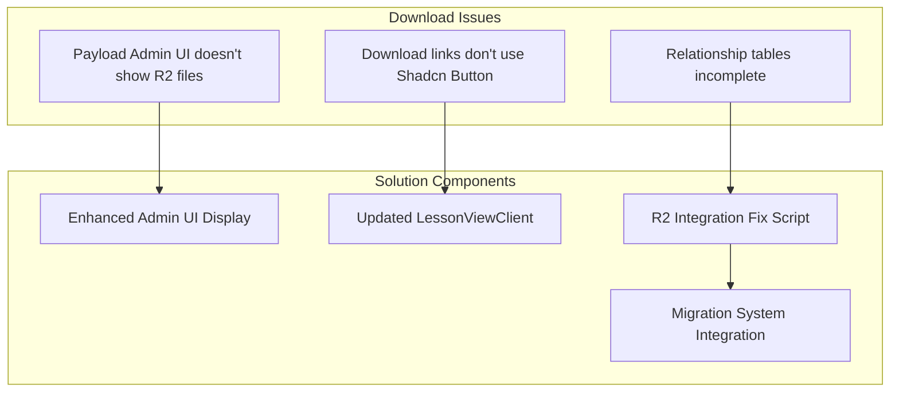

# Downloads R2 Integration Fix Plan

## Current State Analysis

### 1. R2 Integration Setup

- The R2 storage is correctly configured in `payload.config.ts` with the custom domain `downloads.slideheroes.com`
- The Downloads collection has upload capabilities configured in `Downloads.ts`
- The R2 bucket exists and contains the proper PDF files (201 Our Process.pdf, etc.)

### 2. Database State

- The `payload.downloads` table has records with correct filenames and URLs pointing to `downloads.slideheroes.com`
- The `payload.course_lessons_downloads` relationship table has entries linking downloads to lessons

### 3. Code Implementation

- The `LessonViewClient.tsx` component has download rendering logic but uses raw HTML instead of the Shadcn Button component
- There's a fallback mechanism for template tags in content (`processR2FileTags` function)
- Debug logging is in place for development environments

### 4. Disconnect Issues

Despite having working relationships in the database and files in R2, two key problems exist:

1. The Payload CMS admin UI doesn't display actual files from R2
2. The download links in the lesson view aren't using the Shadcn Button component

## Root Causes

1. **Missing Relationship Depth in Admin UI**:

   - When Payload queries for downloads in the admin UI, it's not fetching the complete file information from R2
   - The admin interface isn't properly configured to display R2 files

2. **Missing Button Component Integration**:

   - The current download section in `LessonViewClient.tsx` uses regular HTML anchors instead of the Shadcn Button component
   - This leads to inconsistent styling compared to other UI elements

3. **Incomplete Migration Integration**:
   - The content migration process is setting up the relationships and records, but isn't fully handling file metadata
   - The migration doesn't validate that download URLs resolve to actual files in R2

## Solution Plan

I recommend a three-part solution to address each aspect of the problem:

### 1. Fix Admin UI Display for Downloads Collection

```typescript
// Add this to src/collections/Downloads.ts hooks
hooks: {
  afterRead: [
    ({ doc }) => {
      // Enhanced logging for better debugging
      console.log('Download doc in afterRead:', doc);

      // Verify R2 file existence flag (to be added to the database)
      const fileExists = doc.filename && !doc.filename.includes('.placeholder');

      // Enhance the document with R2 visibility flags
      return {
        ...doc,
        _r2FileExists: fileExists,
        _r2FileUrl: doc.url,
        // Add a computed field for admin UI display
        fileStatus: fileExists ? 'Available in R2' : 'Missing in R2'
      };
    },
  ],
},
```

### 2. Update LessonViewClient Download Section with Shadcn Button

Replace the current download section with this enhanced version:

```tsx
{
  /* Updated Download Section with Shadcn Button */
}
<div
  key={index}
  className="flex items-center justify-between rounded-lg border border-gray-200 p-3 dark:border-gray-700"
>
  <div className="flex-grow">
    <p className="font-medium">
      {download.description || download.filename || 'Download'}
    </p>
  </div>
  <Button
    asChild
    variant="default"
    size="default"
    className="bg-primary text-primary-foreground"
  >
    <a
      href={download.url}
      download
      target="_blank"
      rel="noopener noreferrer"
      data-source="lesson-downloads"
    >
      Download
    </a>
  </Button>
</div>;
```

### 3. Enhance Content Migration System for Downloads

Create a new specialized fix script in the content migration system:

```typescript
// packages/content-migrations/src/scripts/repair/fix-downloads-r2-integration.ts
import { sql } from '@payloadcms/db-postgres';
import type { Payload } from 'payload';

export async function fixDownloadsR2Integration(
  payload: Payload,
): Promise<void> {
  console.log('Fixing Downloads R2 integration...');

  try {
    // Start a transaction
    await payload.db.drizzle.execute(sql`BEGIN`);

    // 1. Update download records to point to actual R2 files
    const { rowCount: updatedDownloads } = await payload.db.drizzle.execute(sql`
      UPDATE payload.downloads
      SET 
        filename = CASE
          WHEN title LIKE '%our-process%' THEN '201 Our Process.pdf'
          WHEN title LIKE '%the-who%' THEN '202 The Who.pdf'
          WHEN title LIKE '%introduction%' THEN '203 The Why - Introductions.pdf'
          WHEN title LIKE '%next-steps%' THEN '204 The Why - Next Steps.pdf'
          WHEN title LIKE '%idea-generation%' THEN '301 Idea Generation.pdf'
          WHEN title LIKE '%what-is-structure%' THEN '302 What is Structure.pdf'
          WHEN title LIKE '%using-stories%' THEN '401 Using Stories.pdf'
          WHEN title LIKE '%storyboards%' THEN '403 Storyboards in Presentations.pdf'
          -- Add mappings for other files
          ELSE REPLACE(filename, '.placeholder', '.pdf')
        END,
        url = CONCAT('https://downloads.slideheroes.com/', 
                CASE 
                  WHEN title LIKE '%our-process%' THEN '201 Our Process.pdf'
                  WHEN title LIKE '%the-who%' THEN '202 The Who.pdf'
                  WHEN title LIKE '%introduction%' THEN '203 The Why - Introductions.pdf'
                  WHEN title LIKE '%next-steps%' THEN '204 The Why - Next Steps.pdf'
                  WHEN title LIKE '%idea-generation%' THEN '301 Idea Generation.pdf'
                  WHEN title LIKE '%what-is-structure%' THEN '302 What is Structure.pdf'
                  WHEN title LIKE '%using-stories%' THEN '401 Using Stories.pdf'
                  WHEN title LIKE '%storyboards%' THEN '403 Storyboards in Presentations.pdf'
                  -- Add mappings for other files
                  ELSE REPLACE(filename, '.placeholder', '.pdf')
                END)
    `);

    console.log(`Updated ${updatedDownloads} download records`);

    // 2. Verify and repair relationship tables
    await payload.db.drizzle.execute(sql`
      INSERT INTO payload.course_lessons_downloads (id, lesson_id, download_id, created_at, updated_at, path)
      SELECT
        uuid_generate_v4(),
        cl.id,
        d.id,
        CURRENT_TIMESTAMP,
        CURRENT_TIMESTAMP,
        '/course_lessons_downloads/' || uuid_generate_v4()
      FROM
        payload.course_lessons cl
      JOIN
        payload.downloads d ON
        (cl.slug = 'our-process' AND d.title LIKE '%our-process%') OR
        (cl.slug = 'the-who' AND d.title LIKE '%the-who%') OR
        (cl.slug = 'introduction' AND d.title LIKE '%introduction%') OR
        (cl.slug = 'the-why-introductions' AND d.title LIKE '%introduction%') OR
        (cl.slug = 'next-steps' AND d.title LIKE '%next-steps%') OR
        (cl.slug = 'the-why-next-steps' AND d.title LIKE '%next-steps%') OR
        (cl.slug = 'idea-generation' AND d.title LIKE '%idea-generation%') OR
        (cl.slug = 'what-is-structure' AND d.title LIKE '%what-is-structure%')
      WHERE
        NOT EXISTS (
          SELECT 1 FROM payload.course_lessons_downloads
          WHERE lesson_id = cl.id AND download_id = d.id
        )
    `);

    // 3. Create a validation view for easier relationship debugging
    await payload.db.drizzle.execute(sql`
      CREATE OR REPLACE VIEW payload.download_relationships_debug AS
      SELECT 
        cl.title AS lesson_title,
        cl.slug AS lesson_slug,
        d.title AS download_title,
        d.filename AS download_filename,
        d.url AS download_url,
        d.id AS download_id,
        cl.id AS lesson_id,
        EXISTS (
          SELECT 1 FROM payload.course_lessons_downloads 
          WHERE lesson_id = cl.id AND download_id = d.id
        ) AS relationship_exists
      FROM payload.course_lessons cl
      CROSS JOIN payload.downloads d
      WHERE 
        (cl.slug = 'our-process' AND d.title LIKE '%our-process%') OR
        (cl.slug = 'the-who' AND d.title LIKE '%the-who%') OR
        (cl.slug = 'introduction' AND d.title LIKE '%introduction%') OR
        (cl.slug = 'the-why-introductions' AND d.title LIKE '%introduction%') OR
        (cl.slug = 'next-steps' AND d.title LIKE '%next-steps%') OR
        (cl.slug = 'the-why-next-steps' AND d.title LIKE '%next-steps%') OR
        (cl.slug = 'idea-generation' AND d.title LIKE '%idea-generation%') OR
        (cl.slug = 'what-is-structure' AND d.title LIKE '%what-is-structure%')
    `);

    // Commit transaction
    await payload.db.drizzle.execute(sql`COMMIT`);
    console.log('Downloads R2 integration fix completed successfully');
  } catch (error) {
    // Rollback on error
    await payload.db.drizzle.execute(sql`ROLLBACK`);
    console.error('Error fixing Downloads R2 integration:', error);
    throw error;
  }
}
```

### 4. Integration with Content Migration System

Update the `reset-and-migrate.ps1` script to include our new repair function:

```powershell
# In scripts/orchestration/phases/loading.ps1

# Execute the downloads R2 integration fix
Write-Host "Fixing downloads R2 integration..." -ForegroundColor Cyan
try {
    Execute-ContentMigrationScript "repair:fix-downloads-r2-integration" -Continue
} catch {
    Write-Host "Error fixing downloads R2 integration: $_" -ForegroundColor Red
    # Continue with warnings but don't fail the migration
}
```

## Implementation Steps

1. **Step 1: Enhance Downloads Collection**

   - Update the `Downloads.ts` collection definition with improved admin UI display
   - Add better debugging and relationship support

2. **Step 2: Update LessonViewClient**

   - Modify the download section in `LessonViewClient.tsx` to use Shadcn Button component
   - Improve error handling and fallback mechanisms

3. **Step 3: Create Migration Fix Script**

   - Implement the `fix-downloads-r2-integration.ts` script
   - Add proper SQL for updating records and repairing relationships

4. **Step 4: Test with Content Migration System**
   - Update the appropriate orchestration scripts
   - Run a full migration to test the implementation

## Verification Steps

After implementation, verify:

1. Download records in Payload admin show the actual R2 files
2. Course lessons correctly display their associated downloads
3. Downloads appear with proper Shadcn Button styling
4. Debug view shows all relationships exist properly

## Solution Architecture



## Risks and Considerations

1. **Database Changes**

   - The solution modifies database records and relationship tables
   - All changes must be properly integrated with the content migration system
   - Changes must be compatible with future migrations

2. **R2 File Dependency**

   - The solution assumes files exist in R2 with specific names
   - If file names change in R2, mappings would need to be updated

3. **Content Migration Impact**

   - Reset-and-migrate.ps1 resets the database, so fixes must be incorporated into the migration flow
   - Testing should verify that relationships persist through a full migration

4. **UI Component Consistency**
   - Shadcn Button styling should match other UI elements
   - Changes to the UI should be consistent with design system
