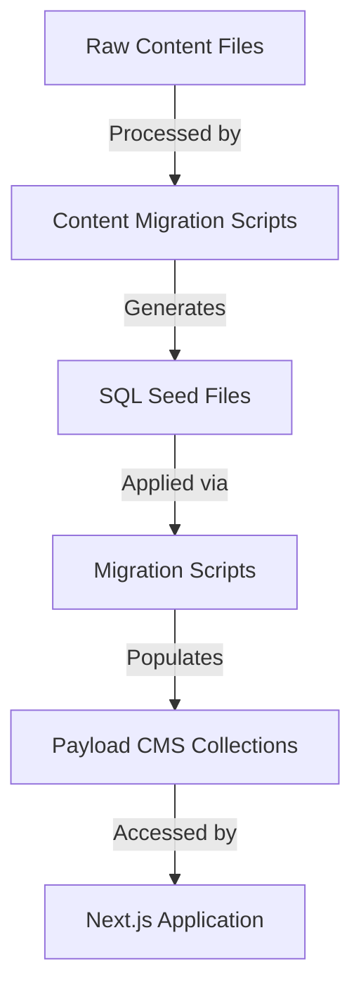

# Lesson Content Field Population Fix

## Table of Contents

1. [System Analysis](#system-analysis)
2. [Issue Identification](#issue-identification)
3. [Root Causes](#root-causes)
4. [Implementation Plan](#implementation-plan)
5. [Testing Strategy](#testing-strategy)
6. [Risks and Mitigations](#risks-and-mitigations)

## System Analysis

### Content Migration System Overview

The SlideHeroes application uses a sophisticated content migration system to populate Payload CMS collections with content from various sources. The system follows a multi-phase workflow:



### Key Components

1. **Raw Content Sources**:

   - `.mdoc` files located in `packages/content-migrations/src/data/raw/courses/lessons/`
   - Each file contains frontmatter with metadata and content for a lesson

2. **Content Migration System**:

   - SQL generation scripts in `packages/content-migrations/src/scripts/sql/generators/`
   - Migration execution via `reset-and-migrate.ps1`
   - Uses Payload migrations for database schema and data population

3. **Database Structure**:

   - Supabase PostgreSQL database with Payload CMS collections
   - Lesson data stored in `payload.course_lessons` table
   - Relationship data stored in separate tables with complex linking

4. **Payload CMS**:
   - Collection configurations (e.g., `apps/payload/src/collections/CourseLessons.ts`)
   - Downloads handling via hooks and relationship helpers

### Current Workflow

1. Raw `.mdoc` files are processed by `generate-lessons-sql.ts`
2. SQL seed files are generated for lessons and their relationships
3. Payload migrations run to apply these SQL seeds to the database
4. Lessons are retrieved via Payload CMS API and displayed in the Next.js application
5. Downloads are dynamically fetched via the `findDownloadsForCollection` function

## Issue Identification

The current implementation has several issues with lesson content population:

1. **Missing Video IDs**:

   - `bunny_video_id` field exists in the schema but is not being populated
   - This field is visible in the lesson view but shows as null in the database

2. **Missing Todo Fields**:

   - Multiple todo fields are not being populated:
     - `todo_complete_quiz` (boolean)
     - `todo_watch_content` (text)
     - `todo_read_content` (text)
     - `todo_course_project` (text)
   - These are shown in the lesson page but are empty/null

3. **Downloads Relationship Issues**:
   - All lessons are getting the same two downloads
   - The system should populate lesson-specific downloads

### Evidence of Issues

Database queries show:

```sql
SELECT id, title, bunny_video_id, todo_complete_quiz, todo_watch_content, todo_read_content, todo_course_project FROM payload.course_lessons LIMIT 5
```

Results:

```
[
  {
    "id": "94870001-fb30-4e92-861c-0a4b776cd82a",
    "title": "Before you go...",
    "bunny_video_id": null,
    "todo_complete_quiz": false,
    "todo_watch_content": null,
    "todo_read_content": null,
    "todo_course_project": null
  },
  ...
]
```

## Root Causes

After analyzing the codebase, I've identified these root causes:

1. **Incomplete Field Extraction**:

   - In `generate-lessons-sql.ts`, the SQL generation doesn't extract all available fields from the frontmatter
   - The `.mdoc` files contain fields like `bunnyvideoid`, but the SQL generator doesn't map these to the corresponding database fields

2. **Field Naming Inconsistencies**:

   - Some fields in `.mdoc` files have different naming conventions than the database schema
   - Example: `bunnyvideoid` in the raw files vs. `bunny_video_id` in the database

3. **Downloads Fallback Mechanism**:

   - The `findDownloadsForCollection` function in `relationship-helpers.ts` has a flawed fallback mechanism
   - When proper relationship lookup fails, it returns the first 2 downloads from `DOWNLOAD_ID_MAP` for all lessons
   - This code specifically shows the issue:

   ```javascript
   // TIER 4: Get downloads from predefined mappings
   async function getDownloadsViaPredefinedMappings(
     collectionType: string,
     collectionId: string,
   ): Promise<string[]> {
     try {
       const allDownloadIds = Object.values(DOWNLOAD_ID_MAP)
       // Just return the first 2 downloads as a demonstration
       return allDownloadIds.slice(0, 2)
     } catch (error) {
       console.error(`Error in getDownloadsViaPredefinedMappings: ${error}`)
       throw error
     }
   }
   ```

4. **Missing Mapping for Lesson Downloads**:
   - No lesson-specific download mapping has been implemented
   - The system needs a clear mapping between lessons and their specific downloads

## Implementation Plan

### Phase 1: Update SQL Generator for New Fields

1. **Modify `generate-lessons-sql.ts`**:
   - Update the SQL generation to extract and include the Bunny.net video IDs
   - Extract and map todo fields from the frontmatter
   - Example implementation:

```typescript
// Add these lines to extract additional fields from the frontmatter
const bunnyVideoId = data.bunnyvideoid || null;
const todoCompleteQuiz = !!data.todoCompleteQuiz;
const todoWatchContent = data.todoWatchContent || null;
const todoReadContent = data.todoReadContent || null;
const todoCourseProject = data.todoCourseProject || null;

// Add these fields to the SQL INSERT statement
sql += `-- Insert lesson: ${data.title}
INSERT INTO payload.course_lessons (
  id,
  title,
  slug,
  description,
  content,
  lesson_number,
  estimated_duration,
  course_id,
  ${mediaId ? 'featured_image_id,' : ''}
  ${quizId ? 'quiz_id,' : ''}
  ${quizId ? 'quiz_id_id,' : ''}
  ${bunnyVideoId ? 'bunny_video_id,' : ''}
  todo_complete_quiz,
  ${todoWatchContent ? 'todo_watch_content,' : ''}
  ${todoReadContent ? 'todo_read_content,' : ''}
  ${todoCourseProject ? 'todo_course_project,' : ''}
  created_at,
  updated_at
) VALUES (
  '${lessonId}',
  '${data.title.replace(/'/g, "''")}',
  '${lessonSlug}',
  '${((data.description || '') + '').replace(/'/g, "''")}',
  '${lexicalContent.replace(/'/g, "''")}',
  ${data.lessonNumber || data.order || 0},
  ${data.lessonLength || 0},
  '${COURSE_ID}',
  ${mediaId ? `'${mediaId}',` : ''}
  ${quizId ? `'${quizId}',` : ''}
  ${quizId ? `'${quizId}',` : ''}
  ${bunnyVideoId ? `'${bunnyVideoId}',` : ''}
  ${todoCompleteQuiz},
  ${todoWatchContent ? `'${todoWatchContent.replace(/'/g, "''")}',` : ''}
  ${todoReadContent ? `'${todoReadContent.replace(/'/g, "''")}',` : ''}
  ${todoCourseProject ? `'${todoCourseProject.replace(/'/g, "''")}',` : ''}
  NOW(),
  NOW()
) ON CONFLICT (id) DO NOTHING;

`;
```

### Phase 2: Implement Lesson-Specific Downloads Mapping

1. **Create Lesson-Downloads Mapping**:
   - Create a new mapping file `packages/content-migrations/src/data/mappings/lesson-downloads-mappings.ts`
   - Define a mapping between lesson slugs and download IDs

```typescript
import { DOWNLOAD_ID_MAP } from '../download-id-map';

/**
 * Mapping between lesson slugs and their associated download IDs
 * This ensures consistent relationships between lessons and downloads
 */
export const lessonDownloadsMapping: Record<string, string[]> = {
  // Format: lessonSlug: [downloadIdKey1, downloadIdKey2]
  'our-process': ['our-process-slides'],
  'the-who': ['the-who-slides'],
  'the-why-introductions': ['introduction-slides'],
  'the-why-next-steps': ['next-steps-slides'],
  'idea-generation': ['idea-generation-slides'],
  'what-is-structure': ['what-is-structure-slides'],
  'using-stories': ['using-stories-slides'],
  'storyboards-presentations': ['storyboards-presentations-slides'],
  'visual-perception': ['visual-perception-slides'],
  'fundamental-design-overview': ['fundamental-elements-slides'],
  'fundamental-design-detail': ['fundamental-elements-slides'],
  'gestalt-principles': ['gestalt-principles-slides'],
  'slide-composition': ['slide-composition-slides'],
  'tables-vs-graphs': ['tables-vs-graphs-slides'],
  'basic-graphs': ['standard-graphs-slides'],
  'fact-based-persuasion': ['fact-based-persuasion-slides'],
  'specialist-graphs': ['specialist-graphs-slides'],
  'preparation-practice': ['preparation-practice-slides'],
  performance: ['performance-slides'],
  // Add course-wide resources to specific lessons or all lessons as needed
  'tools-and-resources': ['slide-templates', 'swipe-file'],
};

/**
 * Get download IDs for a specific lesson
 * @param lessonSlug The lesson slug
 * @returns Array of download IDs or empty array if none found
 */
export function getDownloadIdsForLesson(lessonSlug: string): string[] {
  const downloadKeys = lessonDownloadsMapping[lessonSlug] || [];
  return downloadKeys.map((key) => DOWNLOAD_ID_MAP[key]).filter((id) => !!id);
}
```

2. **Update Downloads Relationship Helper**:
   - Modify `apps/payload/src/db/relationship-helpers.ts` to use the lesson-specific mapping
   - Replace the generic fallback with the lesson-specific lookup

```typescript
import { getDownloadIdsForLesson } from '../../../../packages/content-migrations/src/data/mappings/lesson-downloads-mappings';

// TIER 4: Get downloads from predefined mappings
async function getDownloadsViaPredefinedMappings(
  collectionType: string,
  collectionId: string,
): Promise<string[]> {
  try {
    // If this is a course lesson, try to get the lesson slug
    if (collectionType === 'course_lessons') {
      // First try to get the lesson from the database to find its slug
      try {
        const result = await payload.db.drizzle.execute(
          sql.raw(`
            SELECT slug FROM payload.course_lessons
            WHERE id = '${collectionId.replace(/'/g, "''")}'
          `),
        );

        if (result?.rows?.[0]?.slug) {
          const lessonSlug = result.rows[0].slug;
          // Get download IDs for this specific lesson
          const downloadIds = getDownloadIdsForLesson(lessonSlug);
          if (downloadIds.length > 0) {
            return downloadIds;
          }
        }
      } catch (slugError) {
        console.log('Error getting lesson slug:', slugError);
        // Continue to fallback
      }
    }

    // If all else fails, return a sensible fallback
    // Either return empty array or a default set of general downloads
    const defaultDownloadIds = [
      DOWNLOAD_ID_MAP['slide-templates'],
      DOWNLOAD_ID_MAP['swipe-file'],
    ].filter((id) => !!id);

    return defaultDownloadIds;
  } catch (error) {
    console.error(`Error in getDownloadsViaPredefinedMappings:`, error);
    return []; // Return empty array instead of throwing
  }
}
```

### Phase 3: Update the Generate Lessons SQL Script

1. **Update the Generate Lesson SQL Script**:
   - Modify the SQL script to include downloads relationships

```typescript
// Add to generate-lessons-sql.ts
import { getDownloadIdsForLesson } from '../../data/mappings/lesson-downloads-mappings.js';

// In the lesson file processing loop:
// Get download IDs for this lesson
const downloadIds = getDownloadIdsForLesson(lessonSlug);

// For each download ID, add a relationship entry
if (downloadIds.length > 0) {
  sql += `-- Create relationship entries for lesson downloads\n`;

  downloadIds.forEach((downloadId) => {
    sql += `
INSERT INTO payload.course_lessons_rels (
  id,
  _parent_id,
  field,
  value,
  created_at,
  updated_at
) VALUES (
  gen_random_uuid(),
  '${lessonId}',
  'downloads',
  '${downloadId}',
  NOW(),
  NOW()
) ON CONFLICT DO NOTHING;
`;
  });

  sql += `\n`;
}
```

### Phase 4: Add or Update Missing Fields

1. **Ensure fields exist in the database**:
   - Review and update migration `20250430_120000_fix_remaining_columns.ts` if needed

```typescript
// Ensure all todo fields exist
await db.execute(sql`
  ALTER TABLE payload.course_lessons 
  ADD COLUMN IF NOT EXISTS todo_complete_quiz BOOLEAN DEFAULT false;
  
  ALTER TABLE payload.course_lessons 
  ADD COLUMN IF NOT EXISTS todo_watch_content TEXT;
  
  ALTER TABLE payload.course_lessons 
  ADD COLUMN IF NOT EXISTS todo_read_content TEXT;
  
  ALTER TABLE payload.course_lessons 
  ADD COLUMN IF NOT EXISTS todo_course_project TEXT;
`);
```

## Testing Strategy

1. **Initial Testing**:

   - After implementing changes, run `reset-and-migrate.ps1` to reset the database and apply migrations
   - Verify database state with SQL queries to check if fields are populated correctly

2. **Database Verification**:
   - Run SQL queries to verify the presence of newly populated fields
   - Check relationships between lessons and downloads

```sql
-- Check video IDs and todo fields
SELECT id, title, bunny_video_id, todo_complete_quiz, todo_watch_content, todo_read_content, todo_course_project
FROM payload.course_lessons;

-- Check lesson-download relationships
SELECT cl.title, d.filename
FROM payload.course_lessons cl
JOIN payload.course_lessons_rels clr ON cl.id = clr._parent_id
JOIN payload.downloads d ON d.id = clr.value
WHERE clr.field = 'downloads'
ORDER BY cl.title;
```

3. **UI Verification**:
   - Navigate to various lessons in the web application
   - Verify that todo sections appear correctly
   - Check that videos play correctly if Bunny.net video IDs are set
   - Confirm that downloads are lesson-specific

## Risks and Mitigations

1. **Data Loss**:

   - **Risk**: Migration could overwrite existing data
   - **Mitigation**: Use `ON CONFLICT DO NOTHING` for all inserts
   - **Mitigation**: Back up database before running migrations

2. **Field Mapping Errors**:

   - **Risk**: Incorrect mapping between raw files and database fields
   - **Mitigation**: Thorough review of field names in both sources
   - **Mitigation**: Incremental testing of each field mapping

3. **Download Relationship Issues**:

   - **Risk**: Complex relationship structure could break
   - **Mitigation**: Verify relationships after migration
   - **Mitigation**: Implement multiple fallback mechanisms

4. **Migration Performance**:
   - **Risk**: Complex SQL operations could slow migration
   - **Mitigation**: Profile migration performance
   - **Mitigation**: Use batch processing for large datasets
